<!--
author:   Neenu Gupta; Rajeev Kumar Jha

email:    LiaScript@web.de

version:  0.0.1

language: en

narrator: US English Female

date:     15/04/2021

comment:  This maths text was created using CK-12 resources to be seed content for a complete Maths Class 12 course for CBSE students.

logo:     ../cover.png

tags:      cbse, Class 12, India, mathematics, Algebra, Geometry
-->

# CK-12 CBSE Maths Class 12

Difficulty Level: At Grade

Created by: CK-12

Last Modified: Apr 15, 2021

> This document was automatically translated into LiaScript from
>
> https://www.ck12.org/book/cbse-maths-book-class-12/

## 1.0 Relations and Functions

### 1.1 Introduction

<article>

In class XI, you have studied fundamental concepts of relations and functions in Mathematics. Let's revise them once before we can study them in detail.

Suppose you wanted to get cash for your Rs.250 stash of 25 paise, 50 paise and Re.1 coins that you had accumulated over many years. To see where you could get the best deal, you went online to check out what banks would give you for your coins, and you got the following redemption information:

Bank A: full cash value for customers with an account; otherwise 91.1% of your coins’ value.

Bank B: full cash value for customers with an account if the value is put on a merchant’s gift card that has usage fees; otherwise 92% of your coin’s value.

Bank C: full cash value for customers with an account if the value is Rs.100 or less; otherwise 99% of the coins’ value.

When you told your friends about the redemption information, one of them said: “Oh, really! The money you’ll get for your coins is not a function of their actual value.” Was your friend correct? Why or why not?

#### Watch This

Watch this YouTube video giving step-by-step instructions of the vertical line test.

!?[Watch the video at](https://www.youtube.com/watch?v=-xvD-n4FOJQ)

#### Guidance

Consider two situations shown in the boxes below:

| Situation 1                                                                                          | Situation 2                                                                                                                                                   |
| ---------------------------------------------------------------------------------------------------- | ------------------------------------------------------------------------------------------------------------------------------------------------------------- |
| You are selling raffle tickets for a school fundraiser. Each ticket costs Rs.3.00 | You collect data from several students in your class on their ages and their heights: (18, 65″), (17, 64″), (18, 67″), (18, 68″), (17,66″) |

---

In the first situation, let the variable $x$ represent the number of raffle tickets that you sell, and let $y$ represent the amount of money you make. If you sell $x$ raffle tickets, you will make $y=3x$ rupees; there is one and only one number representing your profit. Notice that you can use the number of raffle tickets you sell to predict how much money you will make. This is an example of a **_function_**.

Now consider the second situation. Can you similarly use the data to predict specific height, based on age? No, this is not the case in the second situation. For example, if a student is 18 years old, there are multiple heights that the student could be. This situation is _not_ a function.

A _function_ is a relationship between an independent variable, the input, and a dependent variable, the output, where each _input_ value of the _independent variable_, corresponds to one **and only one** _output_ value of the _dependent variable_.

It is important to note that both situations above are relations. A **relation** is simply a relationship between two sets of numbers or data. For example, in the second situation, we created a relationship between students’ ages and heights, just by writing each student’s information as an ordered pair.

Functions may be presented in many ways. Some of the most common ways to represent functions include: sets of ordered pairs (e.g., in a table), written or equation rules, and graphs.

The notation used to show that there is a functional relationship between the independent and dependent variables is called functional notation. The typical notation for a function is $f(x)$, which is another way of representing the dependent variable $y$ in an equation. The function $y=3x$ would be represented using function notation as follows:

$$
f(x) = 3x
$$

#### Example A

| **Representation**   |                                   **Example**                                   |
| -------------------- |:-------------------------------------------------------------------------------:|
| Set of ordered pairs | {(1,3), (2,6), (3,9), (4,12)} (a subset of the ordered pairs for this function) |
| Equation             |                        $y = 3x$   or< br> $f(x) = 3x$                        |
| Graph                |                                                    |

---

**Solution:**

In the first representation above, we are given a set of ordered pairs. To verify that this is a function, we must ensure that each $x$\-value is associated with a single $y$\-value. In this example, the first number in each pair (the $x$\-value) is different, so we can be certain that there are no cases where a particular $x$ is associated with more than one $y$.

In the second representation, the equation of a line, it is apparent that any number put in place of $x$ will result in a different $y$, since the $x$ number is simply being multiplied by 3.

The third representation above is a graph. A quick and effective visual to decide if a graph is a function is by doing a “**vertical line test**”. If all possible vertical lines only cross the relation in one place, then the relation is a function. If a vertical line can be drawn anywhere on the graph such that the line crosses the relation in two places, then the relation is not a function.

**Vertical Line Test**

A graphed relation is a function if there are no vertical lines that intersect the graphed relation in more than one point.

#### Concept Question Wrap-up

Remember the question at the beginning of the lesson about getting cash for the Rs.250 stash of coins? Does the data you received from the banks represent a function? Your friend thinks not.

**Solution:**

If we were to organize the information received from the banks into ordered pairs $(x, y)$, it might look something like:

Bank A: (Rs.250, Rs.250), (Rs.250, Rs.250\*0.911)

Bank B: (Rs.250, Rs.250-fees), (Rs.250, Rs.250\*0.92)

Bank C: (Rs.250, Rs.250\*0.99)

where each $x$ value, the independent variable, represents the real value of coins, in this case Rs.250, and each $y$ value, the dependent variable, represents the money the bank will give you for the coins.

Since there are many different $y$ values for the one $x$ value, the above relationships definitely are not a function. Your friend was right.

Let's study types of relations and functions in this chapter.

</article>

### 1.2 Types of Relations

<article>

We know that a relation $R$ from a non-empty set $A$ to a non-empty set $B$ is subset of $A \times B$ i.e, $R \subseteq A \times B$. Suppose if set $B$ is replaced by set $A$ then relation $R$ in $A$ is a subset of $A \times A$.

Here we define types of relation $R$ in set $A$, $\forall \ a, b, c \in A$

i) **Empty Relation** - $A$ relation $R$ in set $A$ is empty relation if it has no element, i.e, no element of $A$ is related to any element of $A$, i.e, $R=\phi$ which is the smallest subset of $A \times A$.

ii) **Universal Relation** - $A$ relation $R$ in a set $A$ is called universal relation, if each element of $A$ is related to every element of $A$, i.e, $R=A \times A$

Both the empty relation and universal relation are called “Trivial Relations”.

iii) **Reflexive Relation** - $A$ relation $R$ in a set $A$ is called “Reflexive Relation” if $(a, a)$ $\in R, \forall a \in A$.

iv) **Symmetric Relation** - $A$ relation $R$ in a set $A$ is called “Symmetric Relation” if $(a,b) \in R \Rightarrow (b, a) \in R, \forall \ a, b \in A$.

v) **Transitive Relation** - $A$ relation $R$ in a set $A$ is called “Transitive Relation” if $(a, b),(b, c) \in R \Rightarrow (a, c) \in R, \forall \ a, b, c \in A$.

vi) **Equivalence Relation** - A relation $R$ is called “Equivalence Relation” if it is reflexive, symmetric and transitive.

#### Example A

Check that the relation $R$ on the set $\mathbb{R}$ of real numbers, defined as $R=\{(a.b) : a > b \}$ is reflexive, symmetric and transitive.

**Solution:**

$a>a \ \text{is not possible}. \ \text{Therefore} \  (a,a) \notin R$

$\Rightarrow R$ is not reflexive

Let $(a,b) \in R$ then $a>b \not\Rightarrow b > a \Rightarrow (b, a) \notin R$

$\Rightarrow R$ is not symmetric

$$
\begin{align*}
\begin{array}{rcl}\text{Let}\  (a, b) \ \text{and} \ (b, c) \in R
& \Rightarrow & a>b \ \text{and} \ b>c \\
& \Rightarrow & a>c \\
& \Rightarrow & (a, c) \in R \\
& \Rightarrow & R \ \text{is transitive} \\
\end{array}
\end{align*}
$$

#### Example B

Let $A$ be the set of all possible outcomes when you throw a six-faced dice. Then write $A \times A$. Is $A \times A$ a relation? If yes, then check is it reflexive, symmetric and transitive. What can you say about $R=A \times A$ being an equivalence relation?

**Solution:**

When a die is rolled then 6 possible outcomes form a set (called sample space)

Let $A=\{1, 2, 3, 4, 5, 6 \}$

$$
\begin{align*}
\begin{array}{rcl}
A \times A &=& \{(1, 1), (1, 2), (1, 3), (1, 4), (1, 5), (1, 6), \\
&& (2, 1), (2, 2) \ldots \quad \ldots \quad \ldots \quad \ldots \ \ (2, 6), \\
&& (3, 1)  \ldots \quad \ldots \quad \ldots \quad \ldots \quad \ldots \quad (3, 6), \\
&& \ldots \quad \ldots \quad \ldots \quad \ldots \quad \ldots \quad \ldots \quad\\
&& (6, 1)  \ldots \quad \ldots \quad \ldots \quad \ldots \quad \ldots \quad (6, 6) \}
\end{array}
\end{align*}
$$

Yes $A \times A$ is a relation called Universal relation.

Since ordered pairs $(a, a) \in R \ \forall \ a \in A$

i.e, $(1, 1), (2, 2), (3, 3), (4, 4), (5, 5), (6, 6) \in R$

Therefore $R$ is Reflexive.

Let $(a, b) \in R$ then $(b, a) \in R, \forall \ a, b \in A\Rightarrow R$ is symmetric.

Let $(a, b), (b, c) \in R$ then $(a, c) \in R \ \forall \ a, b, c \in A \Rightarrow R$ is transitive.

Since $R$ is reflexive, symmetric and transitive Therefore $R$ is an equivalence relation.

We can also conclude that largest relation, i.e, universal relation $A \times A= R$ is always an equivalence relation.

#### Example C

Check whether the relation $R$ defined on set of real numbers $\mathbb{R}$ as $R=\{(a,b): a \le b^4 \}$ is reflexive, symmetric or transitive.

**Solution:**

Since $a \not\le a^4, \ \forall \ a \in R$

e.g $\frac{1}{2} \not < \left(\frac{1}{2} \right)^4 \Rightarrow \left(\frac{1}{2}, \frac{1}{2} \right) \notin R$

$\Rightarrow R$ is not reflexive.

Let $(1, 2) \in R$ as $1 < 2^4$ but $2 \not < 1^4 \Rightarrow (2, 1) \notin R \Rightarrow R$ is not symmetric.

Also,$(100, 5), (5, 2) \in R$ as $100<5^4 \text{ and}\  5<2^4$ but $100 \not< 2^4 \Rightarrow (100, 2) \notin R \Rightarrow R$ is not transitive

#### Equivalence Class

Let $R$ be an equivalence relation defined on a non-empty set $A$. Then R will always divide $A$ into mutually disjoint subsets $A_i$ which satisfy following conditions:

i) All elements of $A_i$ are related to each other, $\forall_i$

ii) No element of $A_i$ is related to any element of $A_j, i \neq j$

iii) $UA_i = A$ and $A_i \cap A_j = \phi$ for $i \neq j$

Then subsets $A_i$ are called equivalence classes and are denoted as $[A_i]$

#### Example D

Show that relation $R$ in $A = \left\{ x : x \in Z, 1  \le x \le 50 \right\}$ defined as $R= \left\{ (a, b) : |a-b| \ \text{is a multiple of} \ 5\right\}$ is equivalence relation. Also find equivalence class of 10.

---

**Solution:**

Since $| a-a| =0$, a multiple of 5

Therefore $(a, a) \in R \ \forall \ a \in \ A. \text{ Therefore } R$ is reflexive.

Let $(a,b ) \in R \Rightarrow |a-b|$ is multiple of 5

$\Rightarrow |b-a|$ is also multiple of 5

$\Rightarrow (b,a) \in R$

$\Rightarrow R$ is symmetric.

Let $(a, b)$ and $(b, c) \in R$

$$
\begin{align*}
\begin{array}{rcl}
& \Rightarrow & |a-b| = 5k \text{ and } |b-c| = 5 \ m\\ \\
& \Rightarrow & |a-b| + |b-c| \le |a-c| \text{ is a multiple of 5 [Since sum of two multiples of 5 is also a multiple of 5]} \\ \\
& \Rightarrow & (a, c) \text{ is a multiple of 5}\\ \\
& \Rightarrow & (a, c) \in R \Rightarrow R \text{ is transitive.}\\ \\
& \Rightarrow & R \text{ is an equivalence relation.}
\end{array}
\end{align*}
$$

Equivalence class of 10 consists of elements related to 10, i.e, 

$[10] = \left\{ 5, 10, 15, 20, 25, 30, 35, 40, 45, 50 \right\}$

Students can use following link for studying relations and its types: http://www.math.uah.edu/stat/foundations/Relations.html

</article>

### 1.3 Types of Functions

<article>

As we know,

A _function_ is a relationship between an independent variable, the input, and a dependent variable, the output, where each _input_ value of the _independent variable_, corresponds to one **and only one** _output_ value of the _dependent variable_.

#### Multimedia Links

!?[Watch the video at](https://www.youtube.com/watch?v=Uz0MtFlLD-k)

!?[Watch the video at](https://www.youtube.com/watch?v=kvGsIo1TmsM)

Functions are of following three types:

1. One-One or Injective Function

2. Onto or Surjective Function

3. Bijective Function

Look at the following arrow diagrams:

---

Here $f(x)=x^3$ is one-one function as each $x$ is paired up with unique $y$.

But $g(x) =x^2$ is not one-one function as each $x$ has no unique image $y$ under $g$.

Here $g(1) =1= g(-1)$

Therefore $g$ is called many-one function.

#### Surjective/Onto Functions

A function $f:X \rightarrow Y$ is said to be onto or surjective if every element of $Y$ is the image of some element  of $X$ under $f$, i.e for every $y \in Y$, there exists an element $x$ in $X$ such that $y=f(x)$. This also implies, Range of $f=\text{co-domain of} \ f$.

Look at the following arrow diagrams:

By looking at these arrow diagrams, we can interpret that $f$ is an onto function, $g$ is an onto function but $h$ is not an onto function. Why?

Because in the first two cases, all the elements of co-domain have been paired up under the given mapping but in the third case, one element of co-domain has no pre-image under mapping.

#### Example 1

Check surjectivity of function $f:R \rightarrow R$ defined by $f(x) = |x|$. If it is not surjective then how can you make it surjective?

---

**Solution:**

$f:R \rightarrow R$ defined as $f(x)=|x|$

Here range of $f = [0, \infty) \neq \text{co-domain}$ of $f \Rightarrow f$ is not surjective.

If co-domain $R$ is replaced by range $[0, \infty)$ Then $f$ will be surjective.

#### Bijective Function

A function $f:X \rightarrow Y$ is bijective if it is one-one and onto.

Look at the following arrow diagrams:

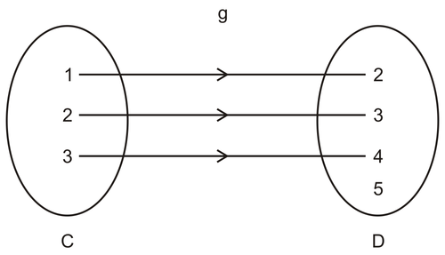

Which of the functions is bijective and why? Here $f$ is many-one function, so it is not bijective, as element 1 of $B$ has two pre-images. Also $g$ is not an onto function as element 5 of co-domain is not having a pre-image so it is not bijective.

Since $h$ is the only function which is one-one and onto, therefore, it is bijective.

---

#### Example 2

Let $f:R \rightarrow R$ be defined as $f(x)=x^3$ Check is $f$ bijective

**Solution:**

$$
\begin{align*}
\begin{array}{rcl}
&& \text{Let} \  f(x_1) = f(x_2) \\
&& \Rightarrow x_1^3 = x_2^3 \\
&& \Rightarrow x_1 = x_2 \\
&& \Rightarrow f \ \text{is injective}
\end{array}
\end{align*}
$$

Let $y \in R$ be such that $y=f(x) \forall x \in R$

Then $y=x^3 \Rightarrow x=y^{\frac{1}{3}}$

Consider $f(x)=f(y^{\frac{1}{3}}) = (y^{\frac{1}{3}})^3 = y$

Therefore each $y \in R$ has pre-image $x \in R$ under $f$

Therefore $f$ is surjective.

$\Rightarrow   f$ is bijective.

Let's learn about Injective and Surjective Functions by using following video:

!?[Watch the video at](https://www.youtube.com/watch?v=xKNX8BUWR0g)

**If a function is injective and surjective then we say it is bijective function and hence invertible.**

### Inverse Functions

#### Concept

The statement “Pizza restaurants sell pizza” could be thought of as a function. It could be plotted on a graph, with different restaurants across the $x$\-axis, and different foods the restaurant specializes in on the $y$\-axis. Any time a pizza restaurant was input into the function, it would output “pizza” as the specialized food.

Is this pizza restaurant function a 1-to-1 function? How can we tell?

---

#### Watch This

!?[Watch the video at](https://www.youtube.com/watch?v=qgezKpQYH2w)

!?[Watch the video at](https://www.youtube.com/watch?v=UKhwZbgaT5M)

#### Guidance

Consider the function $y=f(x)=x^3$. We know $f(x)$ is a function, because applying the “vertical line” test to its graph shows that every value in the domain corresponds to only one value in the range. Is the inverse of $f(x)$ also a function?

What do we mean by inverse of a function? The inverse of a function is obtained by taking its ordered pairs $(x,y)$ and switching the values of the independent and dependent variables to $(y,x)$ and plotting the results. This is the same as taking the equation of the function $y=x^3$, switching the variables $x$ and $y$ to get $x=y^3$, then solving for $y$. The result is $y=\sqrt[3]{x}$. The graphs of $f(x)=x^3$ and $y=\sqrt[3]{x}$ are shown below.

The vertical line test for the graph of $y=\sqrt[3]{x}$ shows that this inverse is also a function. The inverse function of $f(x)$ is written as $f^{-1}(x)=\sqrt[3]{x}$, where the $f^{-1}(x)$ is the notation for indicating the inverse function of $f(x)$ (not to be mistaken as meaning the function to the -1 power).

=x^3$ is an example of a one-to-one function. A function must be a one-to-one function in order to have an inverse that is a function. One-to-one is defined as follows:")

**One to one Property**

**A function is one-to-one if and only if every element of its range corresponds to exactly one element of its domain.**

The one-to-one property of a function can be visually tested by using the horizontal line test as described for the function $y=x^2$.

The function $y=x^2$ is not one-to-one. The graph of this function is shown below.

You can determine graphically if a function is invertible (has an inverse) by applying the **horizontal line test**: draw a horizontal line through the graph of the function, if it touches more than one point, the function is not invertible.

#### Example 3

Graph the function $f(x)=\frac{1}{3}x+2$. Use a horizontal line test to verify that the function is invertible.

**Solution:**

The graph below shows that this function is invertible. We can draw a horizontal line at any $y$ value, and the line will only cross $f(x)=\frac{1}{3}x+2$ once. The inverse function can be determined to be $y=f^{-1}(x)=3(x-2)$.

#### Example 4

State the domain and range of the function and its inverse:

Function: (1, 2), (2, 5), (3, 7)

**Solution:**

The inverse of this function is the set of points (2, 1), (5, 2), (7, 3)

The domain of the function is {1, 2, 3}. This is also the range of the inverse.

The range of the function is {2, 5, 7}. This is also the domain of the inverse.

The linear functions we examined previously, as well as $f(x)=x^3$, all had domain and range both equal to the set of all real numbers. Therefore the inverses also had domain and range equal to the set of all real numbers. Because the domain and range were the same for these functions, switching them maintained that relationship.

Also, as we found above, the function $y=x^2$ is not one-to-one, and hence it is not invertible. That is, if we invert it, the resulting relation is not a function. We can change this situation if we define the domain of the function in a more limited way. Let $f(x)$ be a function defined as follows: $f(x)=x^2$, with domain limited to real numbers ≥ 0. Then the inverse of the function is the square root function: $f^{-1}(x)=\sqrt{x}$

Define the domain for the function $f(x)=(x-2)^2$ so that $f$ is invertible.

**Solution:**

The graph of this function is a parabola. We need to limit the domain to one side of the parabola. Conventionally in cases like these we choose the positive side; therefore, the domain is limited to real numbers $\ge 2$.

#### Concept Question Wrap-up

Have you considered the question from the beginning of the lesson?

“Pizza restaurants sell pizza” is a function. However, it is NOT a 1 : 1 function.

In order to be 1 : 1, it must be invertible, giving something like: “pizza sellers are pizza restaurants”, and that statement must also be a function.

Since grocery stores sell pizza, and would therefore be among the outputs of the new function, but were not among the inputs of the original (which specified “pizza restaurants”), the functions are not invertible.

#### Guided Practice

1. Is $g(x)=3x-2$ a one to one function?

2. Use the horizontal line test to see if $f(x)=x^3$ is one to one.

3. Is $g(x)=|x-2|$ one to one?

**Answers:**

1. Algebraic Test for 1-1 functions: if $f(a)=f(b)$ implies that $a=b$, then $f$ is 1-1

   $\therefore$ if $g(x)=3x-2$ is 1-1, then $g(a)=g(b)\rightarrow a=b$

   Test: $g(a)=g(b)$

   $$
   \begin{align*}
   3a-2 &=3b-2\\
   3a &=3b\\
   a &=b
   \end{align*}
   $$

   $\therefore 3x-2$ is $1-1$

2. Graph the equation:

   

3. Graph the equation:

    and (0, 2). This function is not 1-1. Note that this function also fails the horizontal line test used in Q2.")

#### Example 6

Check is the function $f : R \rightarrow R$ defined as $f(x)=2x+3$ is invertible and hence find its inverse.

**Solution:**

Let $f(x_1)=f(x_2), \forall \ x_1, x_2 \in R$

$$
\begin{align*}
\begin{array}{rcl}
& \Rightarrow & 2 x_1 + 3 =2 x_2 + 3\\
& \Rightarrow & x_1 = x_2 \\
& \Rightarrow & f(x) \ \text{is injective}
\end{array}
\end{align*}
$$

Let $y \in R$ be such that $y=f(x)$

Then $y=2x+3 \Rightarrow x=\frac{y-3}{2}$

$$
\Rightarrow f(x)=f \left(\frac{y-3}{2} \right)=2 \left(\frac{y-3}{2} \right)+3=y \in R
$$

Thus, $f$ is surjective

Thus, $f$ is bijective and hence $f$ is invertible.

Also, $f^{-1}(x)=\frac{x-3}{2}$

#### Multimedia Links

!?[Watch the video at](https://www.youtube.com/watch?v=W84lObmOp8M)

!?[Watch the video at](https://www.youtube.com/watch?v=Wu6T4MVfZYI)

!?[Watch the video at](https://www.youtube.com/watch?v=wSiamij_i_k)

#### Practice

Which functions are one-to-one?

1. $(3,28),(4,29),(4,30),(6,31)$
2. $(4,5),(9,6),(7,8),(23,5)$
3. $(8,18),(33,4),(5,16),(7,19)$

For the following to be a one to one function, $X$ cannot be what values?

4. $(9,12),(35,6),(7,18),(12,X)$
5. $(20,21),(21,14),(110,112),(X,7)$

Are the following one-to-one, onto and bijective functions? In case of bijections, find inverse of the function.

6. $f(x)=x^2$
7. $f(x)=x^3$
8. $f(x)=\frac{1}{x}$
9. $f(x)=x^n-x, n>0$
10. $x=y^2+2$

Determine if the relations below are functions, one-to one functions or neither:

---

11. 
12. 
13. 

</article>

### 1.4 Composition of Functions and Invertible Functions

<article>

Your mom mixed some ingredients like flour, butter, sugar, choco powder etc. and bake all the ingredients in a cake bowl and after some time, cake is ready. We can convert this activity into mathematical terms as functions.

Consider $f$ to be a function of mixing of ingredients and $g$ to be a function of baking and as a result we get a new function $h$ as a cake. Here the new function $h$ is a combination of two functions $f$ and $g$ and hence called composite function and is denoted as $g \circ f=h$, i.e, baking of ingredients makes cake.

Let $f: A \rightarrow B$ and $g:B \rightarrow C$ be two functions. Then the composition of functions $g \circ f$ will be a function $g \circ f: A \rightarrow C$  given by

$$
g \circ f(x) = g(f(x)) \quad \forall \ x \in A
$$

#### Concept

If $f(x) = x + 2$, and $g(x) = 2x + 4$, what is $f(g(x))$ ?

A function can be conceptualized as a “black box”. The input, or $x$ value is placed into the box, and the box performs a specific set of operations on $x$. Once the operations are complete, the output (the “$f(x)$” or “$y$” value) is provided. Once the output is provided, the box is ready to work on the next input.

Using this idea, **_function composition_** can be seen as a box inside of a box. The input $x$ value goes into the inner box, and then the output of the inner box is used as the input of the outer box.

This lesson is all about boxes inside of boxes. See if you can use what you learn to answer the question above before the review at the end.

---

#### Watch This

!?[Watch the video at](https://www.youtube.com/watch?v=qxBmISCJSME)

#### Guidance

**_Composition of Functions_**

Functions are often described in terms of “input” and “output”. For example, consider the function $f(x) = 2x + 3$. When we input an $x$ value, we output a $y$ value, or a function value. We find the output by taking the input $x$, multiplying by 2, and adding 3. We can do this for any value of $x$. Now consider a second function $g(x) = 5x$. For this function too, we can take an $x$ value, input the $x$ into $g(x)$, and obtain an output. What happens if we take the output of $g$ and use it as the input of $f$?

#### Example 1

Given the function definition above, $g(x) = 5x$. Therefore if $x = 4$, then we have $g(4) = 5(4) = 20$. What happens if we then take the output of 20 and use it as the input of $f$?

**Solution:**

Substituting 20 in for $x$ in $f(x) = 2x + 3$ gives: $f(20) = 2(20) + 3 = 43$.

The table below shows several examples of this same process:

| **$x$** | **Output from $g$** | **Output from $f$** |
|:-------:|:-------------------:|:-------------------:|
|    2    |         10          |         23          |
|    3    |         15          |         33          |
|    4    |         20          |         43          |
|    5    |         25          |         53          |

Examining the values in the table, we can see a pattern: all of the final output values from $f$ are 3 more than 10 times the initial input. We have created a new function called $h(x)$ out of $f(x) = 2x + 3$ in which $g(x) = 5x$ is the input:

$$
h(x) = f(5x) = 2(5x) + 3 = 10x + 3
$$

When we input one function into another, we call this the composition of the two functions. Formally, we write the composed function as $f(g(x)) = 10x + 3$ or write it as $(f \circ g)x = 10x + 3$.

---

#### Example 2

Find $f(g(x))$ and $g(f(x))$:

a)  $f(x) = 3x + 1$ and $g(x) = x^2$

b) $f(x) = 2x + 4$ and $g(x) =\left(\frac{1}{2} \right)x - 2$

**Solution:**

a) $f (x) = 3x+1$ and $g(x) = x^2$

$$
\begin{align*}
\begin{array}{rcl}
f(g(x)) &= & f(x^2)=3(x^2)+1=3x^2+1 \\
g(f(x)) &= & g(3x+1)=(3x+1)^2=9x^2+6x+1
\end{array}
\end{align*}
$$

In both cases, the resulting function is quadratic.

b) $f(x) = 2x + 4$ and $g(x) =\left(\frac{1}{2} \right)x - 2$

$$
\begin{align*}
f(g(x)) &= 2 \left(\left(\frac{1}{2}\right)x - 2\right) + 4 =\left(\frac{2}{2} \right)x - 4 + 4 =\left(\frac{2}{2} \right)x = x \\
g(f(x)) &= g(2x + 4) = \left(\frac{1}{2}\right)(2x + 4) - 2 = x+ 2 - 2 = x.
\end{align*}
$$

In this case, the composites were equal to each other, and they both equal $x$, the original input into the function. This means that there is a special relationship between these two functions. We will examine this relationship in later concepts. It is important to note, however, that $f(g(x))$ is not necessarily equal to $g(f(x))$.

#### Example 3

Decompose the function $f(x) = (3x - 1)^2 - 5$ into a quadratic function $g(x)$ and a linear function $h(x)$.

**Solution:**

When we compose functions, we are combining two (or more) functions by inputting the output of one function into another. We can also decompose a function. Consider the function $f(x) = (2x + 1)^2$. We can decompose this function into an “inside” and an “outside” function. For example, we can construct $f(x) = (2x+1)^2$ with a linear function and a quadratic function. If $g(x) = x^2$ and $h(x) = (2x + 1)$, then $f(x) = g(h(x))$. The linear function $h(x) = (2x + 1)$ is the inside function, and the quadratic function $g(x) = x^2$ is the outside function.

Let $h(x) = 3x - 1$ and $g(x) = x^2 - 5$. Then $f(x) = g(h(x))$ because

$g(h(x)) = g(3x - 1) = (3x - 1)^2 - 5$.

The decomposition of a function is not necessarily unique. For example, there are many ways that we could express a linear function as the composition of other linear functions.

#### Concept Question Wrap-up

Can you answer the question at the beginning of the lesson now?

If **$f(x) = x + 2$**, and **$g(x) = 2x + 4$**, what is **$f(g(x))$** ?

**$f(g(x)) = f(2x + 4) = (2x + 4) + 2 = 2x + 6$**

Once you get the idea, composite functions aren’t as difficult as they look!

---

#### Guided Practice

1. Given:

   $f(x)=5x+3$

   $g(x)=3x^2$

   Find: $f(g(4))$

2. Given:

   $h(n)=7n+1+4(g(n))$

   $g(t)=-t$

   $f(x)=-2x+g(x)$

   Find: $f(h(-5))$

3. Given:

   $g(x)=5x^2$

   $h(x)=5x^2-2x-4(g(x))$

   Find $h(g(-1))$

**Solutions:**

1. To find $f(g(4))$, we need to know what $g(4)$ is, so we know what to substitute into $f(x)$:

   Substitute 4 for $x$ for the function $g(x)$, giving: $3 \cdot 4^2$

   Simplify: $3 \cdot 16=48$

   $\therefore g(4)=48$

   Substitute 48 for the $x$ in the function $f(x)$ giving: $5(48)+3$

   Simplify: $240+3=243$

   $\therefore f(g(4))=243$

2. First, let’s solve for the value of the inner function, $h(-5)$. Then we'll know what to plug into the outer function.

   $h(-5)=(7)(-5)+1+4(g(-5))$

   To solve for the value of $h$, we need to solve $g(-5)$

   $$
   \begin{align*}
   g(-5) &=-(-5) \\
   \therefore g(-5) &=5
   \end{align*}
   $$

   Now we have: $h(-5)=(7)(-5)+1+(4)(5)$

   Simplify to get: $h(-5)=-14$

   Now we know that $h(-5)=-14$. That tells us that $f(h(-5))$ is $f(-14)$

   Find $f(-14)=(-2)(-14)+g(-14)$

   So to solve for the value of $f(-14)$, we need to solve for the value of $g(-14)$

   $$
   \begin{align*}
   g(-14) &=-(-14) \\
   \therefore g(-14) &=14
   \end{align*}
   $$

   --> Now we can finish up!

   $$
   \begin{align*}
   f(-14) &=(-2)(-14)+14 \\
   \therefore f(-14) &=42
   \end{align*}
   $$

3. First, solve for the value of the inner function $g(-1)$ to find what to plug into the outer function $h(g(-1))$

   $$
   \begin{align*}
   g(-1) &=5(-1)^2 \\
   g(-1) &=5 \cdot 1 \\
   \therefore g(-1) &= 5
   \end{align*}
   $$

   Next, solve for $h(g(-1))$ which we now know is: $h(5)$

   $h(5)=5(5^2)+(-2)(5)-4(g(5))$

   To solve for the value of $h$, we need to solve for the value of $g(5)$.

   $$
   \begin{align*}
   g(5) &= 5(5^2) \\
   g(5) &= 125 \\
   \therefore h(5) &= 5(5^2)+(-2)(5)+(-4)(125)
   \end{align*}
   $$

  Finally: $h(5)=-385$

### Inverse Functions

#### Concept

Most of the functions from previous concepts have been polynomial functions, or rational functions, or functions generated using a finite number of terms, involving only the operations of addition, subtraction, multiplication, division, and raising to integer or fractional powers. These functions are algebraic functions, and when there is an inverse, the inverse is also an algebraic function. Functions that are not algebraic functions are called transcendental functions, i.e., functions that “transcend” algebra in the sense that they cannot be expressed in terms of a finite set of the algebraic operations of addition/subtraction, multiplication/division, and power/root. The three groups of transcendental functions that will be discussed in subsequent concepts, along with their inverses, are the “elementary” transcendentals:

* Exponential/inverse exponential (logarithmic) functions,
* Trigonometric/inverse trigonometric functions, and
* Hyperbolic/inverse hyperbolic functions

Have you heard of hyperbolic functions, or any other transcendental functions? Because the functions in each of the above groups has an inverse useful for solving certain types of problems, you should know why a function inverse is important, and how to use it. See if you can state, before you read further, the basic property of an inverse, and the condition that allows a function to have an inverse.

#### Watch This

!?[Watch the video at](https://www.youtube.com/watch?v=qgezKpQYH2w)

!?[Watch the video at](https://www.youtube.com/watch?v=UKhwZbgaT5M)

#### Guidance

In this section we will look at the following topics relating to inverse functions:

* What does it mean to have an inverse?
* When does a function have an inverse?
* Finding the inverse of a function
* Graphs of Inverse Functions

**1. What does it mean to have an inverse?**

If a function $f(x)$ can be reversed in such a way that the input of the function becomes the output and the output becomes an input, and the resulting reversed relationship is itself a function $h(x)$, then $h(x)$ is the inverse of $f(x)$.  This relationship can be written as:

$f \circ h = f(h(x)) = h \circ f = x$

The inverse function $h$ is often written as $f^{-1}$, which is not to be confused as $\frac{1}{f}$. In general, $f^{-1} \neq \frac{1}{f}$.

If a function has an inverse, it is said to be invertible.

---

#### Example 4

The two functions $f(x) = 2x+3$ and $h(x) = \frac{x-3}{2}$ are inverses of each other since

$f \circ h = f(h(x)) = 2 \left [ \frac{x-3}{2} \right ] + 3 = x - 3 + 3 =x$, and $h \circ f = h(f(x)) = \frac{(2x+3)-3}{2} = \frac{2x}{x} =x$

Thus

$f \circ h = h \circ f = x$,

and $f$ and $h$ are inverses of each other. The function $f(x) = 2x+3$ is invertible.

**2. When does a function have an inverse?**

The answer to the question is:

**Existence of an Inverse** **Function**

A function $f(x)$ has an inverse if it is one-to-one in its domain and onto, hence it is a bijective.

#### Example 5

Determine whether these functions have inverses, i.e., are invertible:

1. (a) $f(x) = |x|$  (b) $h(x) = x^{\frac{1}{2}}$

2. $f(x) = 3x^5 + 2x +1$

**Solution:**

1. It is best to graph both functions and draw on each a horizontal line. As you can see from the graphs, $f(x) = |x|$ is not one-to-one since the horizontal line intersects it at two points. The function $h(x) = x^{\frac{1}{2}}$ however, is indeed one-to-one since only one point is intersected by the horizontal line.

")

\[Figure 3\]

**2. Finding the inverse of a function**

To find the inverse of a one-to-one and onto function, perform the following steps if possible:

1. solve for the independent variable $x$ in terms of the dependent variable $y$; and then

2. interchange $x$ and $y$. 

The resulting formula is the inverse $y = f^{-1} (x)$.

Of course, it is not always easy or possible to perform the first step.

Note: It is also acceptable to perform Step 2 above first, then to solve for the dependent variable $y$.

#### Example 6

Find the inverse of $f(x) = \sqrt{4x+1}$.

**Solution:**

First of all, we know the function is one-to-one over the domain $x \ge \frac{1}{4}$, and therefore it has an inverse.

From the discussion above, we first solve for $x$:

$$
\begin{align*}
y & = \sqrt{4x+1}\\
y^2 & = 4x+1\\
x & = \frac{y^2-1}{4}
\end{align*}
$$

Next, perform the variable interchange $x$ and $y$ to determine the inverse

$y = \frac{x^2 - 1}{4}$.

Replacing $y = f^{-1} (x)$,

$f^{-1} (x) = \frac{x^2-1}{4}$

which is the inverse of the original function $f(x) = \sqrt{4x+1}$.

---

**3. Graphs of Inverse Functions**

What is the relationship between the graphs of $f$ and $f^{-1}$? If the point $(a, b)$ is on the graph of $f(x)$, then from the definition of the inverse, the point $(b, a)$ is on the graph of $f^{-1}(x)$. In other words, when we reverse the coordinates of a point on the graph of $f(x)$ we automatically get a point on the graph of $f^{-1}(x)$. Examination of the resulting graphs will show that the function and its inverse are **_reflections_** of one another about the line $y=x$. That is, each is a mirror image of the other about the line $y = x$. The figure below shows an example of $y = x^2$ and, when the domain is restricted to $x \ge 0$, its inverse $y = \sqrt{x}$ and how they are reflected about $y=x$.

 = x^2$ to have an inverse, we must restrict its domain to $0 \le x < \infty$, since that is the domain in which the function is increasing.")

#### Concept Question Wrap-up

Have you heard of hyperbolic functions, or any other transcendental functions?

See if you can state, before you read further, the basic property of an inverse, and the condition that allows a function to have an inverse.

Other than the exponential, logarithmic, and trigonometric functions, you may not have heard of any other transcendental functions. But, there are quite a few that are used extensively in science and engineering applications, including the hyperbolic functions which have properties similar to the trigonometric functions but are made up of exponential functions. Other transcendental functions have names such as Bessel functions and Hankel functions, and arise in specialized areas.

The basic property of the function inverse when it exists is: $f^{-1} \circ f = x = f \circ f^{-1}$.

For a function, $f(x)$, to have an inverse , $f^{-1}(x)$, the function must be one-to-one and onto.

#### Example 7

Using composition of functions, check is the function $f: R \rightarrow R$ defined as $f(x)=2x+3$ is
invertible and hence find its inverse.

**Solution:**

Let $y$ be any element of Range $f$, then

$$
\begin{align*}
\begin{array}{rcl}
y &=& f(x) \\
\Rightarrow y &=& 2x+3 \\
\Rightarrow x &=& \frac{y-3}{2}=g(y)
\end{array}
\end{align*}
$$

Consider $(f \circ g)(y)=f(g(y))=f \left(\frac{y-3}{2} \right) = 2 \left(\frac{y-3}{2} \right)+3=y=I_R$

And $(g \circ f)(x)=g(f(x))=g(2x+3)=\frac{(2x+3)-3}{2}=x=I_R$

Hence, $g \circ f=f \circ g=I_R$

Thus $f$ is invertible and $f^{-1}(x)=\frac{x-3}{2}$

#### Multimedia links

**Composite Functions - Overview**

!?[Watch the video at](media/142595.mp4)

**Composite Functions - Example 1**

!?[Watch the video at](media/142596.mp4)

**Composite Functions - Example 2**

Evaluate using a composition of functions

!?[Watch the video at](media/142597.mp4)

---

**Composite Functions - Example 3**

Decompose a function into two functions

!?[Watch the video at](media/142599.mp4)

How to find inverse of a function by using composition of functions? Let's learn it by using following video link:

!?[Watch the video at](https://www.youtube.com/watch?v=ipbMdjq3yjU)

#### Practice

For problems 1-4: $f(x)=2x-1$ and $g(x)=3x$ and $h(x)=x^2+1$.

1. Find: $f(g(-3))$
2. Find: $f(h(7))$
3. Find: $h(g(-4))$
4. Find: $f(g(h(2)))$

Evaluate each composition below:

5. Given: $f(x)=-5x+2$ and $g(x)=\frac{1}{2}x+4$ Find $f(g(12))$
6. Given: $g(x)=-3x+6$ and $h(x)=9x+3$ Find $g \left(h \left(\frac{1}{3} \right) \right)$
7. Given: $f(x)=-\frac{1}{5}x+4$ and $g(x)=4x^2$ Find $f(g(10))$
8. Given: $g(x)=3|x-4|+6$ and $h(x)=-x^3$ Find $h(g(4))$
9. Given: $f(x)=\sqrt{x+2}$ and $g(x)=|2x|$ Find $g(f(-7))$
10. Given $f(x)=-3x+2$ and given $g(x)=2x^2$ and given $h(x)=4 | 7-x | +6$ Find $f(g(h(1)))$
11. Given $f(x)=(-3)$ and given $g(x)=\sqrt{2x}$ and given $h(x)=|4x| - 12$ Find $f(h(g(18)))$
12. Are compositions commutative? In other words, does $f(g(x))=g(f(x))$?
13. Given: $f(x)=-2^2- 5x$ and $h(x)=3x+2$ Find $f(h(x))$
14. Two functions are inverses of each other if $f(g(x))=x$ and $g(f(x))=x$. If $f(x)=x+3$, find its inverse: $g(x)$.

15. A toy manufacturer has a new product to sell. The number of units to be sold, $n$, is a function of the price $p$ such that: $n(p)=30 -25p$. The revenue $r$ earned from the sales is a function of the number of units sold $n$ such that: $r(n)=1000 - \frac{1}{4}x^2$ Find the function for revenue in terms of price, $p$.

In problems #16 - 19, find the inverse function of $f$ and verify that $f \circ f^{-1} = f^{-1} \circ f = x$.

16. $f(x) = 3x+1$
17. $\sqrt[3]{x}$
18. $f(x) = \frac{x-1}{3}$
19. $h(x)=\frac{4-x}{6}$

In problems #20 - 21, use the functions $f(x) = x+4$ and $g(x) = 2x-5$ to find the specified functions.

20. $g^{-1} \circ f^{-1}$
21. $(f \circ g)^{-1}$

Find the inverse, if it exists, of the following functions.

22. $f(x) = \frac{6x-1}{3x+7}$
23. $f(x) = x^2 - 4x + 8$ for $x \ge 2$
24. $f(x) = \frac{13x}{11x+5}$
25. $f(x) = x^7 - 2$
26. $f(x) = \frac{1+\sqrt{x}}{1-\sqrt{x}}$

</article>

### 1.5 Binary Operations

<article>

#### Definition of a Binary Operation:

You are very well aware of following expressions:

$$
\begin{cases}
5+4=9, \\
5-4=1, \\
5 \times 4 =20,\\
\frac{5}{4} = 1.25
\end{cases}
$$

What is the common feature of these four expressions?

Here, two numbers give rise to a single number due to mathematical operation $+, - ,  \div, \times$.

Here, by using these four operations, we can generalise this definition as a binary operation.

A binary operation $*$ on a set $A$ is a function $*: A \times A \rightarrow A.$

It is denoted as $a * b$.

Also $\div$ is a binary operation if $\div: R _* \times R_ * \rightarrow R _*  \ \text{where} \  R_* = R-\left\{ 0\right\}$ as $a * b  =\frac{a}{b}$ is defined if $b \neq 0$

**Properties of Binary Operation:** For all $a, b, c  \in A$, a binary operation $*$ on $A$ is

i) **commutative** if $a * b = b* a$

ii) **associative** if $(a * b)*c = a * (b*c)$

For a binary operation $*$ defined on $A$, we have

i) “$e$” as **identity element** if $a* e=e*a=a, \ \forall \ a \in A, e \in A$

ii) “$b$” as **inverse** of $a$ if $a*b=b*a = e, \forall \ a,b \in A, e \in A$ and $b$ is denoted as $a^{-1}$

#### Example A:

If a binary operation $*$ defined on $R$ as $a*b = \frac{a+b^2}{3}$ then evaluate $(2*3)*4$

**Solution:**

$$
2*3 = \frac{2+3^2}{3} = \frac{2+9}{3} = \frac{11}{3} \\
(2*3)*4 = \frac{\frac{11}{3}+4^2}{3} = \frac{\frac{11}{3}+16}{3} = \frac{11+48}{9} = \frac{59}{9}
$$

#### Example B:

If a binary operation $*$ defined on $R$ as $a*b=\frac{ab}{8}$ then check if $*$ is commutative and associative. Also find identity and inverse elements, if exist.

---

**Solution:**

i)

$$
\begin{align*}
\begin{array}{rcl}
a * b & = & \frac{ab}{8} \\ \\
b * a & = & \frac{ba}{8} \\ \\
\Rightarrow a* b & = & b * a. \text{ This shows that * is commutative.}
\end{array}
\end{align*}
$$

ii) Consider $(a * b) * c= \frac{ab}{8} * c = \frac{\frac{ab}{8}\cdot c}{8} = \frac{abc}{64}$ and $a * (b * c) = a * \left ( \frac{bc}{8} \right )  = \frac{a \cdot \frac{bc}{8}}{8} = \frac{abc}{64}$ since $(a * b) * c = a * (b * c) \Rightarrow *$ is associative.

iii) Let “$e$” be identity element of $*$ then

$$
\begin{align*}
\begin{array}{rcl}
&& a*e=a\ \text{and}\ e*a=a \\
&& \Rightarrow \frac{ae}{8} = a \ \text{and}\ \frac{ea}{8} =a \\
&& \Rightarrow e=8  \ \text{and}\ e=8 \\
&& \Rightarrow 8 \  \text{is identity element of}  *
\end{array}
\end{align*}
$$

iv) Let “$b$” be inverse of “$a$” then

!?[Watch the video at](https://www.youtube.com/watch?v=cRE6hpn7p_c)

#### Identity and Inverse Element of Binary Operation:

!?[Watch the video at](https://www.youtube.com/watch?v=kIZDe9Zu-Mk)

#### Multiplication/Binary Tables:

!?[Watch the video at](https://www.youtube.com/watch?v=A5bMGt8inM0)

</article>

### 1.6 Summary

<article>

* A **relation** on a non-empty set $A$ is a subset of $A \times A$.
* **Empty Relation** is the smallest relation $R$ in $X$ given by $R = \phi \subset X \times X$
* **Universal Relation** is the largest relation $R$ in $A$ given by $R = A \times A$
* A relation on $A$ is
    * **Reflexive** if  $(a, a) \in R$, for all $a \in A$
    * **Symmetric** if $(a, b) \in R \Rightarrow (b, a) \in R$
    * **Transitive** if $(a, b), ( b, c) \in R \Rightarrow ( a, c) \in R$
    * **Equivalence** if it is reflexive, symmetric and transitive.

* $f : A \rightarrow B$ is a **function** if each element in $A$ has a unique image in $B$.
* A function $f:A \rightarrow B$ is
    * **One-one or injective** if $f(x_1) = f(x_2) \Rightarrow x_1 = x_2,  \forall \ x_1, x_2  \in A$
    * **Onto or surjective** if for any $y \in B, \exists \ x  \in A$ such that $f (x) = y$
    * **Bijective** if it is one-one and onto

* Let $f : A \rightarrow B$ be an onto function from a finite set $A$ to a finite set $B$ then Range $f =\text{Co domain} \ f$
* For $f : A \rightarrow B$ and $g : B \rightarrow C$, the functions $g\circ f : A \rightarrow C$ is given by $(g \circ f) (x) = g (f(x)), \forall \ x \in A$
* $g \circ f$ is well defined if range $f = \text{domain} \ g$
* A function $f : X \rightarrow Y$ is **invertible** if there exists function $g : Y \rightarrow  X$ such that $g \circ f = I_X$ and $f \circ g = I_Y$ 
* A function $f : A \rightarrow B$ is invertible if and only if f is one-one and onto.
* If $f : A \rightarrow B$ and $g : B \rightarrow C$ are one – one and onto then $g \circ f : A \rightarrow C$ is also one – one and onto.
* $g \circ f$ is one – one $\Rightarrow f$ is one-one.
* $g \circ f$ is onto $\Rightarrow g$ is onto.
* $(g \circ f )^{-1} = f^{-1} \circ g^{-1}$
* $h  \circ  (g \circ f) = (h \circ g)$ of, i.e, composition of functions is associative.
* $g \circ f$ does not necessarily be equal to $f \circ g$, i.e., composition of functions need not be commutative.
* A **binary operation** \* on a set $A$ is a function \* : $A \times A \rightarrow A$
* A binary operation \* on $A$ is **commutative** if $a *  b = b * a , \forall \ a, b \in A$
* A binary operation \* on $A$ is **associative** if $( a* b) * c= a * ( b* c)$
* An element $e \in A$ is the **identity element** for \* : $A \times A \rightarrow A$ if $a * e = a = e * a , \forall \ a \in \ A$
* An element $a \in A$ is **invertible** for \* : $A \times A \rightarrow A$ if there exists $b \in A$ such that $a * b = e = b * a$, where $e$ is the identity element for \*. The element \* is called inverse of $a$ and is denoted by $a^{-1}$.
* Number of binary operations on set $A=[n(A)]^{n(A \times A)}$

</article>

### 1.7 Self Assessments

<article>

### Previous Years' Boards Questions

#### Assessment 1

**Equivalence Relation**

1. Let $A= \{1, 2, 3, \ldots 9 \}$ and $R$ be the relation in $A \times A$ defined by $(a, b) \ R \ (c, d)$ if $a+d=b+c \ \forall \ (a, b), (c, d) \in A \times A$. Prove that $R$ is an equivalence relation. Also obtain the equivalence class \[(2, 5)\]. \[CBSE (Delhi) 2014\].

2. Prove that the relation $R$ in the set $A=\{1, 2 \ldots, 12 \}$ given by $R= \{(a, b):|a-b| \ \text{is divisible by} \ 3 \}$, is an equivalence relation. Find all the elements related to the element 1. \[CBSE (foreign) 2013\]

3. Prove that the relation $R$ in the set $A= \{5, 6, 7, 8, 9\}$ given by $R= \{(a, b):|a-b| \ \text{is divisible by} \ 2 \}$ is an equivalence relation. Find all the elements related to the element 6. \[CBSE (foreign) 2013\]

4. Show that the relation $R$ defined on set $N \times N$ by $(a, b) R (c, d) \Rightarrow a+d=b+c$ is an equivalence relation. \[(AICBSE) 2010\].

5. Check whether the relation $R$ defined on set of real numbers $R$ as $R=\{(a, b): a \le b^3 \} \ \forall  \ a, b \in R \}$ is reflexive, symmetric or transitive. \[CBSE (Delhi) 2010\]

#### Assessment 2

**Injective, Surjective and Bijective Functions**

1. Show that the function $f$ in $A=R - \left\{\frac{2}{3}\right\}$ defined as $f(x)=\frac{4x+3}{6x-4}$ is one-one and onto. Hence find $f^{-1}$. \[CBSE (Delhi) 2013\].

2. Let $A=R-\{3. \ \text{and} \  B=R-\{1\}$, consider the function $f:A \to B$ defined by $f(x)=\frac{x-2}{x-3}$. Is $f$ one-one and onto? Justify your answer. \[CBSE (Delhi) 2012\]

3. Show that $f:N \to N$ given by   

$$
\begin{align*}
f(x) =   \begin{cases}   x+1,  & \text{if } x \text{ is odd} \\
x-1, & \text{if }n \text{ is even}   \end{cases}
\end{align*}
$$

 is both one and onto. \[AICBSE 2012\]

4. Consider $f:R_+ \to [-5, \infty)$ given by $f(x)=9x^2+6x-5$. Show that $f$ is invertible with $f^{-1}(y) = \frac{\sqrt{y+6}-1}{3}$ \[CBSE (Foreign) 2010\]

5. If $f:R \to R$ defined by $f(x)=\frac{3x+5}{2}$ is an invertible function then find $f^{-1}$. \[CBSE (Delhi Comptt) 2009\]

#### Assessment 3

**Composite Functions and Inverse of a function**

1. If the function $f:R \to R$ be given by $f(x)=x^2+2$ and $g: R \to R$ be given by $g(x)=\frac{x}{x-1}$, $x \ne 1$ then find,

   i) $f \circ g$

   ii) $g \circ f$

   iii) $f \circ g(2)$

   iv) $g \circ f(-3)$ \[AICBSE 2014\]

2. If $f(x) = \frac{4x+3}{6x-4}, x \ne \frac{2}{3}$. Show that $(f \circ f)(x)=x, \forall x \ne \frac{2}{3}$. What is $f^{-1}$? \[CBSE (Foreign) 2012\].

3. Let $f:R \to R$ be defined as $f(x)=10x+7$ then find the function $g:R \to R$ such that $g \circ f = f \circ g = I_R$ \[AICBSE 2011\]

4. If the function $f:R \to R$ is given by $f(x) = x^2+3x+1$ and $g: R \to R$ is given by $g(x)=2x-3$, find

   i) $f \circ g$ and

   ii) $g \circ f$ \[CBSE (Delhi Comptt) 2009\]

5. If $f(x)=x+7 \ \text{and} \ g(x)=x-7, x \in R$ then find $(f \circ g)(7)$. \[CBSE (Delhi) 2008\]

#### Assessment 4

**Binary Operations**

1. Consider the binary operation $*:R \times R \to R$ and $o: R \times R \to R$ defined as $a * b = |a-b|$ and $a \circ b =a, \forall$ $a, b \in R$. Show that $*$ is commutative but not associate and $o$ is associate but not commutative \[AICBSE 2012\].

2. Consider the binary operation A on the set $\{1, 2, 3, 4, 5 \}$ defined by $a \land b=\text{min} \{a, b\}$. Write the operation table for $\land$. \[CBSE (Delhi) 2011\]

3. Define a binary operation $*$ on the set $\{0, 1, 2, 3, 4, 5 \}$ as   

   $$
   \begin{align*}
   a * b = \begin{cases} \\
   a+b  & \text{if} a+b < 6 \\
   a+b-6, & \text{if } a+b \ge 6 \\
   \end{cases}
   \end{align*}
   $$

   Show that $0$ is the identity for $*$ and each element $a$ of the set is invertible with $(6-a)$ as the inverse of $a$. \[AICBSE 2011\]

4. Let $*$ be a binary operation on $Q$ defined by $a*b=\frac{3ab}{5}$. Show that $*$ is commutative as well as associative. Also find its identity element, if exists. \[ CBSE (Delhi) 2010\]

5. If the binary operation $*$, defined on $Q$, is defined as $a*b=2a+b-ab \ \forall \ a, b \in Q$ then find the value of $3*4$. \[ CBSE (Foreign) 2009\].

</article>

### 1.8 Home Assignments

<article>

#### Assignment 1

##### Types of Relations

NCERT Exercise No. 1.1

Q. No. 5, 10, 13, 16

#### Assignment 2

##### Types of Functions

NCERT Exercise No. 1.2

Q. No. 8, 11, 12

#### Assignment 3

##### Composition of Functions and Invertible Functions

NCERT Exercise No. 1.3

Q. No. 5, 7, 11, 14

#### Assignment 4

##### Binary Operations

NCERT Exercise No. 1.4

Q. No. 5, 7, 11, 14

#### Assignment 5

##### Miscellaneous Questions

NCERT Miscellaneous Exercise

Q. No. 2, 3, 5, 7, 9, 15

</article>

### 1.9 References for Basic Understanding

<article>

#### 1. Basic Definition of Relation and Function

http://www.ck12.org/section/Relations-and-Functions/

</article>

### 1.10 References for Advanced Understanding

<article>

#### 1. Composite Functions

http://www.ck12.org/calculus/Composite-Functions/enrichment/Composite-Functions-Example-3/

http://www.ck12.org/calculus/Composite-Functions/enrichment/Composite-Functions-Example-5/

http://www.ck12.org/calculus/Composite-Functions/enrichment/Combinations-of-Functions-Example-4/

</article>

## 2.0 Inverse Trigonometric Functions

### 2.1 Introduction

You have already studied about Trigonometric functions in class XI that these are periodic functions. In class XII, you have studied about inverse functions that any function which is injective and surjective, i.e., a bijective, is an invertible function.

Have you ever thought that all the trigonometric functions have their inverse functions too? In spite of being periodic functions, can we define inverse trigonometric functions? Trigonometric functions are neither injective nor surjective. Do you remember why? It is because trigonometric functions are periodic functions, so they are not injective. Also, their range is not equal to their respective co-domains; so they are not surjective also.

But in order to determine inverse functions of trigonometric functions, we have to restrict domains of trigonometric functions so that they can be inverted.

In this chapter, we will learn to do so and also study some of the fundamental properties of inverse trigonometric functions.

### 2.2 Inverse Trigonometric Functions and Principal Value Branch

<article>

#### Inverses of Trigonometric Functions

Your instructor gives you a trigonometric function, $f(x) = 3\sin (x) + 5$, and asks you to find the inverse. You are all set to start manipulating the equation, when you realize that you don't know just how to do this. Your instructor suggests that you try finding the inverse through graphing instead.

Are you able to do this?

Keep reading, and by the end of this Concept, you'll be able to find the inverse of trigonometric function and others through graphing instead of algebra.

#### Watch This

!?[Watch the video at](https://www.youtube.com/watch?v=LUpa5nPskAc)

#### Guidance

In other Concepts, two different ways to find the inverse of a function were discussed: graphing and algebra. However, when finding the inverse of trigonometric functions, it is easy to find the inverse of a trigonometric function through graphing. Consider the graph of a sine function shown here:

In order to consider the inverse of this function, we need to restrict the domain so that we have a section of the graph that is one-to-one. If the domain of $f$ is restricted to $-\frac{\pi}{2} \le x \le \frac{\pi}{2}$ a new function $f(x) = \sin x, -\frac{\pi}{2} \le x \le \frac{\pi}{2}$. is defined. This new function is one-to-one and takes on all the values that the function $f(x) = \sin x$ takes on. Since the restricted domain is smaller, $f(x) = \sin x, -\frac{\pi}{2} \le x \le \frac{\pi}{2}$ takes on all values once and only once.

The inverse of $f(x)$ is represented by the symbol $f^{-1}(x)$, and $y = f^{-1}(x) \Leftrightarrow f(y) = x$. The inverse of $\sin x, -\frac{\pi}{2} \le x \le \frac{\pi}{2}$ will be written as $\sin^{-1} x$. or $\arcsin x$.

$$
\begin{Bmatrix}
y = \sin^{-1} x\\
\quad or\\
y = \arcsin x
\end{Bmatrix} \Leftrightarrow \sin y = x
$$

In this Concept we will use both $\sin^{-1} x$ and $\arcsin x$ and both are read as “the inverse sine of $x$” or “the number between $-\frac{\pi}{2}$ _and_ $\frac{\pi}{2}$ whose sine is $x$.”

The graph of $y = \sin^{-1} x$ is obtained by applying the inverse reflection principle and reflecting the graph of $y=\sin x, -\frac{\pi}{2} \le x \le \frac{\pi}{2}$ in the line $y = x$. The domain of $y = \sin x$ becomes the range of $y = \sin^{-1} x$, and hence the range of $y = \sin x$ becomes the domain of $y = \sin^{-1} x$.

 Another way to view these graphs is to construct them on separate grids. If the domain of $y = \sin x$ is restricted to the interval $\left [ -\frac{\pi}{2}, \frac{\pi}{2} \right ]$, the result is a restricted one-to one function. The inverse sine function $y = \sin^{-1} x$ is the inverse of the restricted section of the sine function.

: **The domain of** $y = \sin x$ is $\left [ -\frac{\pi}{2}, \frac{\pi}{2} \right ]$ **and the range is** \[-1, 1\].

The restriction of $y = \sin x$ is a one-to-one function and it has an inverse that is shown below.

**The domain of** $y = \sin^{-1}$ **is** \[-1, 1\] **and the range is** $\left [ -\frac{\pi}{2}, \frac{\pi}{2} \right ]$.

The inverse functions for cosine and tangent are defined by following the same process as was applied for the inverse sine function. However, in order to create one-to-one functions, different intervals are used. The cosine function is restricted to the interval $0 \le x \le \pi$ and the new function becomes $y = \cos x, 0 \le x \le \pi$. The inverse reflection principle is then applied to this graph as it is reflected in the line $y = x$ The result is the graph of $y = \cos^{-1} x$ (also expressed as $y = \arccos x$).

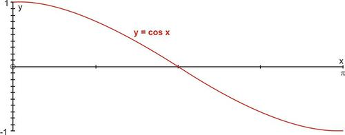

The restriction of $y = \cos x$ is a one-to-one function and it has an inverse that is shown below.

**The domain of** $y = \cos^{-1} x$ is \[-1, 1\] **and the range is** $[0, \pi]$.

The tangent function is restricted to the interval $-\frac{\pi}{2} < x < \frac{\pi}{2}$ and the new function becomes $y = \tan x, -\frac{\pi}{2} < x < \frac{\pi}{2}$. The inverse reflection principle is then applied to this graph as it is reflected in the line $y = x$. The result is the graph of $y = \tan^{-1} x$ (also expressed as $y = \arctan x$).

Graphing the two functions separately will help us to determine the domain and range. If the domain of $y = \tan x$ is restricted to the interval $\left [ -\frac{\pi}{2}, \frac{\pi}{2} \right ]$, the result is a restricted one-to one function. The inverse tangent function $y = \tan^{-1} x$ is the inverse of the restricted section of the tangent function.

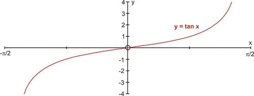

**The domain of** $y = \tan x$ is $\left [ -\frac{\pi}{2}, \frac{\pi}{2} \right ]$ **and the range is** $[-\infty, \infty]$.

The restriction of $y = \tan x$ is a one-to-one function and it has an inverse that is shown below.

**The domain of** $y = \tan^{-1} x$ is $[-\infty, \infty]$ **and the range is** $\left [ -\frac{\pi}{2}, \frac{\pi}{2} \right ]$.

The above information can be readily used to evaluate inverse trigonometric functions without the use of a calculator. These calculations are done by applying the restricted domain functions to the unit circle. To summarize:

| **Restricted Domain Function** | **Inverse Trigonometric Function**       | **Domain**                                       | **Range**                                        | **Quadrants** |
| ------------------------------ | ---------------------------------------- | ------------------------------------------------ | ------------------------------------------------ | ------------- |
| $y = \sin x$                   |                                          | $\left [ -\frac{\pi}{2}, \frac{\pi}{2} \right ]$ | \[-1, 1.                                         | 1 AND 4       |
|                                | $y = \arcsin x$  $y = \sin^{-1} x$ | \[-1, 1.                                         | $\left [ -\frac{\pi}{2}, \frac{\pi}{2} \right ]$ |               |
| $y = \cos x$                   |                                          | $[0, \pi]$                                       | \[-1, 1.                                         | 1 AND 2       |
|                                | $y = \arccos x$  $y = \cos^{-1} x$ | \[-1, 1.                                         | $[0, \pi]$                                       |               |
| $y = \tan x$                   |                                          | $\left ( -\frac{\pi}{2}, \frac{\pi}{2} \right )$ | $(-\infty, \infty)$                              | 1 AND 4       |
|                                | $y = \arctan x$  $y = \tan^{-1}x$  | $(-\infty, \infty)$                              | $\left ( -\frac{\pi}{2}, \frac{\pi}{2} \right )$ |               |

Now that the three trigonometric functions and their inverses have been summarized, let’s take a look at the graphs of these inverse trigonometric functions.

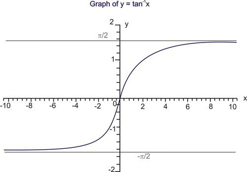

#### Example A

Establish an alternative domain that makes $y=sin(x)$ a one to one function.

**Solution:** Any number of possible solutions can be given, but the important point is that the function must pass the “horizontal line test” and the “vertical line test”. This means that a horizontal line drawn through the graph will intersect the function in only one place, and a vertical line drawn through the graph will intersect the function in only one place.

For the sine curve, this means that the function can't “turn over” or “go in the other direction”, since then it couldn't pass the horizontal line test. So any part of the function that starts at the bottom of the “$y$” values and stops at the top of the “$y$” values will work. (Any value that starts at the top of the “$y$” values and stops at the bottom of the “$y$” values will work as well.

In this example, you can see that the function starts at $\frac{\pi}{2}$ and stops at $\frac{3\pi}{2}$.

#### Example B

Find the range of the function given in Example A

**Solution:** You can see that the function still has the same “$y$” range of values, since the function $y = \sin x$ moves up and down between -1 and 1. Therefore, the range is $-1 \le y \le 1$.

#### Example C

Find the domain and range of the inverse of the function given in Example A.

**Solution:** Since the domain of the inverse function is the range of the original function and the range of the inverse function is the domain of the original function, you only have to take the “$x$” and “$y$” values of the original function and reverse them to get the domain and range of the inverse function.

Therefore, the domain of $y = \sin^{-1} x$ as described in Example A is $-1 \le x \le 1$ and the range is $\frac{\pi}{2} \le y \le \frac{3\pi}{2}$.

#### Concept Problem Solution

To find the inverse of this function through graphing, first restrict the domain of the function so that it is one to one. A graph of $f(x) = 3\sin (x) + 5$, restricted so that the domain is $-\frac{\pi}{2}$ to $\frac{\pi}{2}$ looks like this:

If you apply the inverse reflection principle, you can see that the inverse of this function looks like this:

The range of inverse trigonometric function is called principal value branch.

Similarly, we can determine inverse functions of secant, cosecant and cotangent functions also, along with their principal value branches.

Let us learn now, how to find principal values of inverse trigonometric functions.

---

$$
\begin{align*}
\begin{matrix}
& \sin \theta = \frac{y}{r} \rightarrow \ \ \ \sin^{-1}  \frac{y}{r}  = \theta & \cos \theta = \frac{x}{r} \rightarrow \cos^{-1} \frac{x}{r} = \theta\\ \\
& \tan \theta = \frac{y}{x} \rightarrow \ \ \tan^{-1}  \frac{y}{x} = \theta & \cot \theta = \frac{x}{y} \rightarrow \cot^{-1} \frac{x}{y} = \theta\\ \\
& \text{cosec} \ \theta = \frac{r}{y} \rightarrow \text{cosec}^{-1} \frac{r}{y}  = \theta & \sec \theta = \frac{r}{x} \rightarrow \sec^{-1} \frac{r}{x}  = \theta
\end{matrix}
\end{align*}
$$

These ratios can be used to find any $\theta$ in standard position or in a triangle.

In a sense, this is a way of “undoing” a trigonometric function. Before, to find a trigonometric function, you would use the ratio of two sides. Now, by using the inverse trigonometric ratio, you can find angles when you need them.

Let's investigate this by doing a few examples.

#### Example A

Find the exact value of the expression in $[0, 2\pi)$.

$\sin^{-1} \left ( -\frac{\sqrt{3}}{2} \right )$

**Solution:** This is a value from the special right triangles and the unit circle.

Recall that $-\frac{\sqrt{3}}{2}$ is from the $30-60-90$ triangle. The reference angle for $\sin$ and $\frac{\sqrt{3}}{2}$ would be $60^\circ$. Because this is sine and it is negative, it must be in the third or fourth quadrant. The answer is either $\frac{4\pi}{3}$ or $\frac{5\pi}{3}$.

#### Example B

Find the exact value of the expression in $[0, 2\pi)$.

$\cos^{-1} \left ( -\frac{\sqrt{2}}{2} \right )$

**Solution:** This is a value from the special right triangles and the unit circle.

$-\frac{\sqrt{2}}{2}$ is from an isosceles right triangle. The reference angle is then $45^\circ$. Because this is cosine and negative, the angle must be in either the second or third quadrant. The answer is either $\frac{3\pi}{4}$ or $\frac{5\pi}{4}$.

---

#### Example C

Find the exact value of the expression in principal value branch.

$\tan^{-1} \sqrt{3}$

**Solution:** This is a value from the special right triangles and the unit circle.

$\sqrt{3}$ is also from a $30-60-90$ triangle. Tangent is $\sqrt{3}$ for the reference angle $60^\circ$. Tangent is positive in the first and third quadrants, so the answer would be $\frac{\pi}{3}$.

</article>

### 2.3 Properties and Identities of Inverse Trigonometric Functions

<article>

### Composition of Trigonometric Functions and Their Inverses

You've considered trigonometric functions, and you've considered inverse functions, and now it's time consider how to compose trigonometric functions and their inverses. If someone were to ask you to apply the inverse of a trig function to a different trig function, would you be able to do this? For example, can you find $\sin^{-1} (\cos (\frac{3\pi}{2}))$?

When you complete this Concept, you'll be able to solve this problem.

#### Watch This

!?[Watch the video at](https://www.youtube.com/watch?v=v3LaZBT9sSQ)

#### Guidance

In other Concepts, you learned that for a function $f(f^{-1}(x)) = x$ for all values of $x$ for which $f^{-1}(x)$ is defined. If this property is applied to the trigonometric functions, the following equations will be true whenever they are defined:

$$
\begin{align*}
\sin(\sin^{-1}(x)) = x && \cos(\cos^{-1}(x)) = x && \tan(\tan^{-1}(x)) = x
\end{align*}
$$

As well, you learned that $f^{-1}(f(x)) = x$ for all values of $x$ for which $f(x)$ is defined. If this property is applied to the trigonometric functions, the following equations that deal with finding an inverse trig. function of a trig. function, will only be true for values of $x$ within the restricted domains.

$$
\begin{align*}
\sin^{-1}(\sin(x)) = x && \cos^{-1}(\cos(x)) = x && \tan^{-1}(\tan(x)) = x
\end{align*}
$$

These equations are better known as composite functions. However, it is not necessary to only have a function and its inverse acting on each other. In fact, it is possible to have composite function that are composed of one trigonometric function in conjunction with another different trigonometric function. The composite functions will become algebraic functions and will not display any trigonometry. Let’s investigate this phenomenon.

When solving these types of problems, start with the function that is composed inside of the other and work your way out. Use the following examples as a guideline.

#### Example A

Find $\sin \left ( \sin^{-1} \frac{\sqrt{2}}{2} \right )$.

**Solution:**

We know that $\sin^{-1} \frac{\sqrt{2}}{2} = \frac{\pi}{4}$, within the defined restricted domain. Then, we need to find $\sin \frac{\pi}{4}$, which is $\frac{\sqrt{2}}{2}$. So, the above properties allow for a short cut. $\sin \left ( \sin^{-1} \frac{\sqrt{2}}{2} \right ) = \frac{\sqrt{2}}{2}$, think of it like the sine and sine inverse cancel each other out and all that is left is the $\frac{\sqrt{2}}{2}$.

#### Example B

Without using technology, find the exact value of each of the following:

a) $\cos \left ( \tan^{-1} \sqrt{3} \right )$

b) $\tan \left ( \sin^{-1}\left( -\frac{1}{2} \right ) \right )$

**Solution:**

For all of these types of problems, the answer is restricted to the inverse functions’ ranges.

a) $\cos \left ( \tan^{-1} \sqrt{3} \right )$: First find $\tan^{-1} \sqrt{3}$, which is $\frac{\pi}{3}$. Then find $\cos \frac{\pi}{3}$. Your final answer is $\frac{1}{2}$. Therefore, $\cos \left ( \tan^{-1} \sqrt{3} \right ) = \frac{1}{2}$.

b) $\tan \left ( \sin^{-1} \left ( -\frac{1}{2} \right ) \right ) = \tan \left ( -\frac{\pi}{6} \right ) = -\frac{\sqrt{3}}{3}$

#### Example C

Without using technology, find the exact value of each of the following:

a) $\cos (\tan^{-1} (-1))$

b) $\sin \left ( \cos^{-1}\frac{\sqrt{2}}{2} \right )$

**Solution:**

For all of these types of problems, the answer is restricted to the inverse functions’ ranges.

a) $\cos (\tan^{-1} (-1)) = \cos^{-1} \left ( -\frac{\pi}{4} \right ) = \frac{\sqrt{2}}{2}$.

b) $\sin \left ( \cos^{-1}  \frac{\sqrt{2}}{2}  \right ) = \sin \frac{\pi}{4} = \frac{\sqrt{2}}{2}$

#### Guided Practice

1. Find the exact value of $\cos^{-1}  \frac{\sqrt{3}}{2}$, without a calculator, over its restricted domain.

2. Evaluate: $\sin \left ( \cos^{-1}  \frac{5}{13}  \right )$

3. Evaluate: $\tan \left ( \sin^{-1} \left( -\frac{6}{11} \right) \right )$

---

**Solutions:**

1. $\frac{\pi}{6}$

2. $$
   \begin{align*}
   \cos \theta & = \frac{5}{13}\\
   \sin \left ( \cos^{-1} \left ( \frac{5}{13} \right ) \right ) & = \sin \theta\\
   \sin \theta & = \frac{12}{13}
   \end{align*}
   $$

3. $\tan \left ( \sin^{-1} \left ( -\frac{6}{11} \right ) \right ) \rightarrow \sin \theta = -\frac{6}{11}$.

The third side is $b = \sqrt{121-36} = \sqrt{85}$.

$\tan \theta = -\frac{6}{\sqrt{85}} = -\frac{6\sqrt{85}}{85}$

#### Concept Problem Solution

To solve this problem: $\sin^{-1} (\cos (\frac{3\pi}{2}))$, you can work outward.

First find:

$\cos (\frac{3\pi}{2}) = 0$

Then find:

$\sin^{-1} 0 = 0$

or

$\sin^{-1} 0 = \pi$

#### Watch This

!?[Watch the video at](https://www.youtube.com/watch?v=OSce3YO5_Bg)

#### Example A

Find $\cos \left ( \cot^{-1} \sqrt{3} \right )$.

**Solution:**

First, find $\cot^{-1} \sqrt{3}$, which is also $\tan^{-1}\frac{\sqrt{3}}{3}$. This is $\frac{\pi}{6}$. Now, find $\cos \frac{\pi}{6}$, which is $\frac{\sqrt{3}}{2}$. So, our answer is $\frac{\sqrt{3}}{2}$.

#### Example B

Find $\sec^{-1} \left ( \text{cosec} \frac{\pi}{3} \right )$.

**Solution:**

First, $\text{cosec} \frac{\pi}{3} = \frac{1}{\sin \frac{\pi}{3}} = \frac{1}{\frac{\sqrt{3}}{2}} = \frac{2}{\sqrt{3}} = \frac{2\sqrt{3}}{3}$. Then $\sec^{-1} \frac{2\sqrt{3}}{3} = \cos^{-1} \frac{\sqrt{3}}{2} = \frac{\pi}{6}$.

#### Example C

Evaluate $\cos \left ( \sin^{-1}  \frac{3}{5}  \right )$.

**Solution:**

Even though this problem is not a critical value, it can still be done without a calculator. Recall that sine is the opposite side over the hypotenuse of a triangle. So, 3 is the opposite side and 5 is the hypotenuse. This is a Pythagorean Triple, and thus, the adjacent side is 4. To continue, let $\theta = \sin^{-1}  \frac{3}{5}$ or $\sin \theta = \frac{3}{5}$, which means $\theta$ is in the Quadrant 1 (from our restricted domain, it cannot also be in Quadrant II). Substituting in $\theta$ we get $\cos \left ( \sin^{-1}  \frac{3}{5}  \right ) = \cos \theta$ and $\cos \theta = \frac{4}{5}$.

#### Guided Practice

1. Find the exact value of $\text{cosec} \left ( \cos^{-1}  \frac{\sqrt{3}}{2}  \right )$, over its restricted domains.

2. Find the exact value of $\sec^{-1} ( \tan (\cot^{-1} 1))$, over its restricted domains.

3. Find the exact value of $\tan^{-1} \left ( \cos \frac{\pi}{2} \right )$, over its restricted domains.

**Solutions:**

1. $\text{cosec} \left ( \cos^{-1}  \frac{\sqrt{3}}{2}  \right ) = \text{cosec} \frac{\pi}{6} = 2$

2. $\sec^{-1} (\tan (\cot^{-1} 1)) = \sec^{-1} \left ( \tan  \frac{\pi}{4}  \right ) = \sec^{-1} 1 = 0$

3. $\tan^{-1} \left ( \cos \frac{\pi}{2} \right ) = \tan^{-1} 0 = 0$

### Trigonometry in Terms of Algebra

#### Watch This

!?[Watch the video at](https://www.youtube.com/watch?v=ZffZvSH285c)

#### Guidance

All of the trigonometric functions can be rewritten in terms of only $x$, when using one of the inverse trigonometric functions. Starting with tangent, we draw a triangle where the opposite side (from $\theta$) is defined as $x$ and the adjacent side is 1. The hypotenuse, from the Pythagorean Theorem would be $\sqrt{x^2+1}$. Substituting $\tan^{-1} x$ for $\theta$, we get:

$$
\begin{align*}
\tan \theta & = \frac{x}{1}\\
\tan \theta & = x && hypotenuse = \sqrt{x^2+1}\\
\theta & = \tan^{-1} x
\end{align*}
$$

$$
\begin{align*}
\begin{matrix}
& \sin (\tan^{-1}x)  = \sin \theta = \frac{x}{\sqrt{x^2+1}} & \text{cosec} (\tan^{-1}x) = \csc \theta = \frac{\sqrt{x^2+1}}{x}\\
& \cos (\tan^{-1}x)  = \cos \theta = \frac{1}{\sqrt{x^2+1}} & \sec (\tan^{-1}x) = \sec \theta = \sqrt{x^2+1}\\
& \tan (\tan^{-1}x)  = \tan \theta = x & \cot (\tan^{-1}x) = \cot \theta = \frac{1}{x}
\end{matrix}
\end{align*}
$$

### Definition of Inverse Reciprocal Trigonometric Functions

So far you've had to deal with trigonometric functions, reciprocal functions, and inverse functions. Now you'll start to see inverse reciprocal functions. For example, can you compute

$\sec^{-1} \frac{2}{\sqrt{3}}$

As it turns out, this can be readily computed.

At the end of this Concept, you'll know how to compute this and other inverse reciprocal functions.

#### Watch This

!?[Watch the video at](https://www.youtube.com/watch?v=X4RFThh9qs0)

#### Guidance

We already know that the cosecant function is the reciprocal of the sine function. This will be used to derive the reciprocal of the inverse sine function.

$$
\begin{align*}
\begin{array}{rcl}
y &=& \sin^{-1} x\\
x  &=& \sin y\\
\frac{1}{x}  &=& \text{cosec} \ y\\
\text{cosec}^{-1}  \frac{1}{x}  &=& y\\
\text{cosec}^{-1}  \frac{1}{x} &=& \sin^{-1} x
\end{array}
\end{align*}
$$

Because cosecant and secant are inverses, $\sin^{-1}  \frac{1}{x}  = \csc^{-1} x$ is also true.

The inverse reciprocal identity for cosine and secant can be proven by using the same process as above. However, remember that these inverse functions are defined by using restricted domains and the reciprocals of these inverses must be defined with the intervals of domain and range on which the definitions are valid.

$$
\sec^{-1}  \frac{1}{x}  = \cos^{-1} x \leftrightarrow \cos^{-1}  \frac{1}{x}  = \sec^{-1} x
$$

Tangent and cotangent have a slightly different relationship. Recall that the graph of cotangent differs from tangent by a reflection over the $y-$axis and a shift of $\frac{\pi}{2}$. As an equation, this can be written as $\cot x = -\tan \left ( x-\frac{\pi}{2} \right )$. Taking the inverse of this function will show the inverse reciprocal relationship between arccotangent and arctangent.

$$
\begin{align*}
y & = \cot^{-1} x\\
y & = -\tan^{-1} \left ( x-\frac{\pi}{2} \right )\\
x & = -\tan \left( y-\frac{\pi}{2} \right )\\
-x & = \tan \left ( y-\frac{\pi}{2} \right )\\
\tan^{-1} (-x) & = y-\frac{\pi}{2}\\
\frac{\pi}{2} + \tan^{-1} (-x) & = y\\
\frac{\pi}{2} - \tan^{-1} x & = y
\end{align*}
$$

Remember that tangent is an odd function, so that $\tan(-x) = -\tan(x)$. Because tangent is odd, its inverse is also odd. So, this tells us that $\cot^{-1} x = \frac{\pi}{2} - \tan^{-1} x$ and $\tan^{-1} x =\frac{\pi}{2} - \cot^{-1} x$. To graph arcsecant, arccosecant, and arccotangent in your calculator you will use these conversion identities: $\sec^{-1} x = \cos^{-1}  \frac{1}{x} , \csc^{-1} x = \sin^{-1} \frac{1}{x} , \cot^{-1} x = \frac{\pi}{2} -\tan^{-1} x$. Note: It is also true that $\cot^{-1} x = \tan^{-1}  \frac{1}{x}$.

Now, let’s apply these identities to some problems that will give us an insight into how they work.

#### Example A

Evaluate $\sec^{-1}\sqrt{2}$

---

**Solution:**

Use the inverse reciprocal property. $\sec^{-1} x = \cos^{-1} \frac{1}{x} \rightarrow \sec^{-1} \sqrt{2} = \cos^{-1} \frac{1}{\sqrt{2}}$. Recall that $\frac{1}{\sqrt{2}} = \frac{1}{\sqrt{2}} \cdot \frac{\sqrt{2}}{\sqrt{2}} = \frac{\sqrt{2}}{2}$. So, $\sec^{-1} \sqrt{2} = \cos^{-1} \frac{\sqrt{2}}{2}$, and we know that $\cos^{-1} \frac{\sqrt{2}}{2} = \frac{\pi}{4}$. Therefore, $\sec^{-1} \sqrt{2} = \frac{\pi}{4}$.

#### Example B

Find the exact value of each expression within the restricted domain, without a calculator.

a) $\sec^{-1} \sqrt{2}$

b) $\cot^{-1} \left ( -\sqrt{3} \right )$

c) $\text{cosec}^{-1} \frac{2\sqrt{3}}{3}$

**Solution:**

For each of these problems, first find the reciprocal and then determine the angle from that.

a) $\sec^{-1}  \sqrt{2}  = \cos^{-1}  \frac{\sqrt{2}}{2}$ From the unit circle, we know that the answer is $\frac{\pi}{4}$.

b) $\cot^{-1} \left ( -\sqrt{3} \right ) = \frac{\pi}{2} - \tan^{-1} \left ( -\sqrt{3} \right )$ From the unit circle, the answer is $\frac{5\pi}{6}$.

c) $\text{cosec}^{-1}  \frac{2\sqrt{3}}{3}  = \sin^{-1}  \frac{\sqrt{3}}{2}$ Within our interval, there are is one answer, $\frac{\pi}{3}$.

#### Guided Practice

1. $\sec^{-1} (-2)$
2. $\cot^{-1} (-1)$
3. $\text{cosec}^{-1} \left ( \sqrt{2} \right )$

**Solutions:**

1. $\frac{2\pi}{3}$
2. $-\frac{\pi}{4}$
3. $\frac{\pi}{4}$

#### Concept Problem Solution

The original goal was to evaluate $\sec^{-1} \frac{2}{\sqrt{3}}$

You can start with the inverse reciprocal property:

$\sec^{-1} x = \cos^{-1} \frac{1}{x}$

Substituting in values for “x” gives:

$\sec^{-1} \frac{2}{\sqrt{3}} = \cos^{-1} \frac{1}{\frac{2}{\sqrt{3}}}$

This can be rewritten as: $\cos^{-1}\frac{\sqrt{3}}{2}$ and $\cos^{-1}\frac{\sqrt{3}}{2} = \frac{\pi}{6}$

Therefore,

$\sec^{-1} \frac{2}{\sqrt{3}} = \frac{\pi}{6}$

---

Students may also refer to the following link: http://math.tutorvista.com/trigonometry/inverse-trigonometric-functions.html

#### Explore More

Find the exact value of each of the following.

1. $\sin \left ( \sin^{-1} \frac{1}{2} \right )$
2. $\cos \left ( \cos^{-1} \frac{\sqrt{3}}{2} \right )$
3. $\tan \left ( \tan^{-1} \sqrt{3} \right )$
4. $\cos \left ( \sin^{-1} \frac{1}{2} \right )$
5. $\tan \left ( \cos^{-1} 1 \right )$
6. $\sin \left ( \cos^{-1} \frac{\sqrt{2}}{2} \right )$
7. $\sin^{-1} \left ( \sin \frac{\pi}{2} \right )$
8. $\cos^{-1} \left ( \tan \frac{\pi}{4} \right )$
9. $\tan^{-1} \left ( \sin \pi \right )$
10. $\sin^{-1} \left ( \cos \frac{\pi}{3} \right )$
11. $\cos^{-1} \left ( \sin -\frac{\pi}{4} \right )$
12. $\tan \left ( \sin^{-1} 0 \right )$
13. $\sin \left ( \cos^{-1} \frac{\sqrt{3}}{2} \right )$
14. $\tan^{-1} \left ( \cos \frac{\pi}{2} \right )$
15. $\cos \left ( \sin^{-1} \frac{\sqrt{2}}{2} \right )$

Find the exact value of each of the following. Use the restricted domain for each function.

16. $\sin \left ( \sec^{-1} \sqrt{2} \right )$
17. $\cos \left ( \text{cosec}^{-1} 1 \right )$
18. $\tan \left ( \cot^{-1} \sqrt{3} \right )$
19. $\cos \left ( \text{cosec}^{-1} 2 \right )$
20. $\cot \left ( \cos^{-1} 1 \right )$
21. $\text{cosec} \left ( \sin^{-1} \frac{\sqrt{2}}{2} \right )$
22. $\sec^{-1} \left ( \cos \pi \right )$
23. $\cot^{-1} \left ( \tan \frac{\pi}{4} \right )$
24. $\sec^{-1} \left (\text{cosec} \frac{\pi}{4} \right )$
25. $\text{cosec}^{-1} \left ( \sec \frac{\pi}{3} \right )$
26. $\cos^{-1} \left ( \cot -\frac{\pi}{4} \right )$
27. $\tan \left ( \cot^{-1} 0 \right )$
28. $\sin \left ( \text{cosec}^{-1} \frac{2\sqrt{3}}{3} \right )$
29. $\cot^{-1} \left ( \sin \frac{\pi}{2} \right )$
30. $\cos \left ( \sec^{-1} \frac{2\sqrt{3}}{3} \right )$

Find the exact value of each expression within the restricted domain, without a calculator.

31. $\sec^{-1}(\frac{2\sqrt{3}}{3})$
32. $\text{cosec}^{-1}(1)$
33. $\cot^{-1}(\sqrt{3})$
34. $\text{cosec}^{-1}(2)$
35. $\sec^{-1}(\sqrt{2})$
36. $\cot^{-1}(1)$
37. $\cos^{-1}(\frac{1}{2})$
38. $\sec^{-1}(2)$
39. $\cot^{-1}(\frac{\sqrt{3}}{3})$
40. $\sin^{-1}(\frac{\sqrt{3}}{2})$

</article>

### 2.4 Simplest Form of Inverse Trigonometric Functions by using Substitution

<article>

Students may refer to the following link:

* http://math.stackexchange.com/questions/554183/trick-substitution-in-inverse-trigonometry
* http://math.tutorvista.com/trigonometry/inverse-trigonometric-functions.html

</article>

### 2.5 Inverse Trigonometric Equations

<article>

Students may refer to the following video:

!?[Watch the video at](https://www.youtube.com/watch?v=86zitvSvdeY)

</article>

### 2.6 Summary

<article>

* The domain and ranges (principal value branches) of inverse trigonometric functions are given in the following table:

|     |     |     |
| --- | --- | --- |
| **Functions** | **Domain** | **Range (Principal Value Branch)** |
| $y=\sin^{-1}x$ | \[ -1, 1. | $\left [ -\frac{\pi}{2}, \frac{\pi}{2} \right ]$ |
| $y=\cos^{-1}x$ | \[ -1, 1. | $[0, \pi]$ |
| $y=\text{cosec}^{-1}x$ | R – ( -1, 1) | $\left [ -\frac{\pi}{2}, \frac{\pi}{2} \right  ] - \{0\}$ |
| $y=\sec^{-1}x$ | R – ( -1, 1) | $[0, \pi] - \left \{ \frac{\pi}{2} \right \}$ |
| $y=\tan^{-1}x$ | R   | $\left ( -\frac{\pi}{2}, \frac{\pi}{2} \right )$ |
| $y=\cot^{-1}x$ | R   | $[0, \pi]$ |

* $y=\sin^{-1} x \Rightarrow x = \sin y$
* $x = \sin y \Rightarrow y = \sin^{-1} x$
* $\sin(\sin^{-1}x) = x$
* $\sin^{-1} (\sin x) = x$
* $\sin^{-1} \frac{1}{x} = \cos ec^{-1}x$
* $\cos^{-1} \frac{1}{x} = \sec^{-1}x$
* $\tan^{-1} \frac{1}{x} = \cot^{-1}x$
* $\sin^{-1} (-x) = - \sin^{-1}x$
* $\tan^{-1} (-x) = \tan^{-1}x$
* $\cos ec^{-1} (-x) = -\cos ec^{-1}  x$
* $\cos^{-1}(-x) = \pi - \cos^{-1} x$
* $\cot^{-1} (-x) = \pi - \cot^{-1}x$
* $\sec^{-1}(-x) = \pi - \sec^{-1}x$
* $\sin^{-1}x + \cos^{-1} x = \frac{\pi}{2}$
* $\tan^{-1}x + \cot^{-1}x = \frac{\pi}{2}$
* $\sec^{-1}x + \cos ec^{-1}x = \frac{\pi}{2}$
* $2 \tan^{-1}x = \tan^{-1} \frac{2x}{1 - x^2}, |x| < 1$
* $2 \tan^{-1}x = \sin^{-1} \frac{2x}{1+x^2}, |x| \le 1$
* $2 \tan^{-1} x = \cos^{-1}\frac{1-x^2}{1+x^2}, |x| \ge 0$
* $\tan^{-1}x + \tan^{-1} y= \tan^{-1} \frac{x+y}{1-xy}, xy<1$
* $\tan^{-1}x - \tan^{-1} y  = \tan^{-1} \frac{x-y}{1+xy}, xy > -1$

</article>

### 2.7 Self Assessments

<article>

#### Assessment 1

##### Inverse Trigonometric Functions

http://www.ck12.org/trigonometry/Inverses-of-Trigonometric-Functions/asmtpractice/Inverses-of-Trigonometric-Functions-Practice/?referrer=concept_details

#### Assessment 2

##### Properties of Inverse Trigonometric Functions

http://www.ck12.org/trigonometry/Composition-of-Trig-Functions-and-Their-Inverses/asmtpractice/Composition-of-Trig-Functions-and-Their-Inverses-Practice/?referrer=concept_details

http://www.ck12.org/trigonometry/Definition-of-Inverse-Reciprocal-Trig-Functions/asmtpractice/Definition-of-Inverse-Reciprocal-Trig-Functions-Practice/?referrer=concept_details

http://www.ck12.org/trigonometry/Composition-of-Inverse-Reciprocal-Trig-Functions/asmtpractice/Composition-of-Inverse-Reciprocal-Trig-Functions-Practice/?referrer=concept_details

</article>

### 2.8 Home Assignments

<article>

#### Assignment 1

##### Inverse Trigonometric Functions and Principal Value Branch

NCERT Exercise No. 2.1

Q. No. 2, 3, 6, 7, 10, 12

#### Assignment 2

##### Inverse Trigonometric Identities and Equations

NCERT Exercise No. 2.2

Q. No. 2, 6, 9, 10, 12, 16, 19, 21

#### Assignment 3

##### Miscellaneous Questions

NCERT Miscellaneous Exercise

Q. No. 1, 2, 5, 7, 15

</article>

## 3.0 Matrices

### 3.1 Introduction

Matrices are very important in our lives. We do not see them physically but they have wide range of application in the fields of cryptology and computers which in turn make our lives easier. Matrix (plural - matrices) is a powerful tool in solving system of linear equations which may be taken as the need of origin of matrix as a concept.

Let's learn some basics of matrices in this chapter.

### 3.2 Matrix

<article>

### Defining and Comparing Matrices

For a matinee movie, a movie theater charges the following prices:

Kids: Rs.50 Adults: Rs.80 Seniors: Rs.60

For the same movie at night, the theater charges the following prices:

Kids: Rs.70 Adults: Rs.100 Seniors: Rs.80

How could we organize this data to easily compare the prices?

#### Watch This

Watch the first part of this video, until about 4:45.

!?[Watch the video at](https://www.youtube.com/watch?v=xyAuNHPsq-g)

#### Guidance

A **matrix** consists of data that is organized into rows and columns to form a rectangle. Thus, a matrix can be defined as a rectangular array of numbers or functions. For example, we could organize the data collected at a movie theater food stall during a matinee show into the following matrix:

$$
\begin{align*}
& \quad S \quad M \quad L\\
\begin{matrix}
\text{popcorn \ }\\
\text{ \quad soda \ }\end{matrix} & \begin{bmatrix}
20 & 46 & 32\\
15 & 53 & 29\end{bmatrix}
\end{align*}
$$

Now we can easily compare the quantities of each size sold. These values in the matrix are called **elements or entries of the matrix.**

This particular matrix has two rows and three columns. Basically, horizontal lines of elements are called “Rows” and vertical lines are called “Columns” of the matrix. Matrices are often described in terms of their **dimensions** **or** **orders** (rows by columns). This matrix is a $2 \times 3$ (read as 2 by 3) matrix.

---

#### Example A

Using the matrix above, what is the value of the element in the second row, second column $a_{22}$?

**Solution:**

$$
\begin{align*}
& \qquad \qquad \qquad \qquad {\color{red}{\text{Column 2}}}\\
& \qquad \qquad \quad \qquad \qquad \ \ \downarrow\\
& \quad \qquad \qquad \qquad \quad S \quad M \quad L\\
& \begin{matrix}
\text{\qquad \ \ popcorn \ }\\
{\color{red}{\text{Row 2}}} \rightarrow \text{soda \ }\end{matrix}
\begin{bmatrix}
20 & 46 & 32\\
15 & \boxed{53} & 29 \end{bmatrix}
\end{align*}
$$

We must see where the second row and second column overlap and identify the element in that location. In this case. it is 53.

#### Example B

Determine the order of the matrices below.

a)

$$
\begin{align*}
\begin{bmatrix}
3 & 2\\
-1 & 0
\end{bmatrix}
\end{align*}
$$

b)

$$
\begin{align*}
\begin{bmatrix}
4 & -3 & 2 & 7\\
3 & 5 & -4 & 6\\
9 & 1 & 0 & -2
\end{bmatrix}
\end{align*}
$$

c)

$$
\begin{bmatrix}
2\\
-3\\
1
\end{bmatrix}
$$

**Solution:**

a) This matrix has 2 rows and 2 columns. Therefore it is a $2 \times 2$ matrix.

b) This matrix has 3 rows and 4 columns. Therefore it is a $3 \times 4$ matrix.

c) This matrix has 3 rows and 1 column. Therefore it is a $3 \times 1$ matrix.

**Intro Problem Revisit** To make it easy to compare prices, we could organize the data in matrix like this one:

$$
\begin{align*}
\begin{matrix}
\qquad \qquad K \qquad  A \ \ \quad S \\
\begin{matrix}
\text{Matinee}\\
\text{ Night}\end{matrix}  \begin{bmatrix}
50 & 80 & 60\\
70 & 100 & 80\end{bmatrix}
\end{matrix}
\end{align*}
$$

#### Guided Practice

1. What is the order of the matrix: $[ 3 \quad -5 \quad 1 \quad 0]$?

2. In the matrix,

$$
\begin{align*}
\begin{bmatrix}
8 & -5 & 4\\
-2 & 6 & -3\\
3 & 0 & -7\\
1 & 3 & 9
\end{bmatrix},
\end{align*}
$$

what is the element $a_{23}$?

#### Answers:

1. The dimensions are $1 \times 4$.

2. The element in the second row, third column is -3 as shown below:

$$
\begin{align*}
& \qquad \qquad \qquad \qquad {\color{red}{\text{Column \ 3}}}\\
& \qquad \quad \qquad \qquad \qquad \ \downarrow\\
& \begin{matrix}
{\color{red}{\text{Row 2 }}} \rightarrow
\end{matrix}
\begin{bmatrix}
\\
8 & -5 & 4\\
-2 & 6 & \boxed{-3}\\
3 & 0 & -7\\
1 & 3 & 9\end{bmatrix}
\end{align*}
$$

#### Explore More

Use the matrices below to answer questions 1-7 that follow:

$$
\begin{align*}
A = \begin{bmatrix}
2 & 3 & 1\\
-5 & -8 & 4
\end{bmatrix} \qquad B = \begin{bmatrix}
2 & 1\\
-3 & 5
\end{bmatrix} \qquad C = \begin{bmatrix}
-5 & 1 & 3\\
8 & -2 & 6\\
4 & 9 & 7
\end{bmatrix}
\end{align*}
$$

$$
\begin{align*}
D = \begin{bmatrix}
2 & 1\\
-3 & 5
\end{bmatrix} \qquad E = \begin{bmatrix}
-5 & 2\\
-8 & 3\\
4 & 1
\end{bmatrix} \qquad F = \begin{bmatrix}
5 & -1 & 8\\
-2 & 6 & -3\\
\end{bmatrix}
\end{align*}
$$

1. What are the dimensions of

   a) Matrix $B$?

   b) Matrix $E$?

   c) Matrix $F$?

2. Which matrices have the same dimensions?

3. What is the element $a_{12}$ of Matrix $C$?

4. What is the element $a_{31}$ of Matrix $E$?

5. What is the element $a_{11}$ of Matrix $D$?

6. Write number of elements in a matrix with order $3 \times 4$. Also, write all possible orders of matrices having same number of elements.

7. Write number of elements in a matrix with order $7 \times 2$. Also, write all possible orders of matrices having same number of elements.

Determine if the following statements are true or false.

8. A $3 \times 2 \text{ and a } 2 \times 3$ are equal.

9. A matrix is a way to organize data.

10. The element in row 2, column 2 in $F$ above is -1.

11. The element in row 2, column 2 in $F$ above is 6.

12. Organize the data into a matrix: A math teacher gave her class three tests during the semester. On the first test there were 10 A’s, 8 B’s, 12 C’s, 4 D’s and 1 F. On the second test there were 8 A’s, 11 B’s, 14 C’s, 2 D’s and 0 F’s. On the third test there were 13 A’s, 7 B’s, 8 C’s, 4 D’s and 3 F’s.

</article>

### 3.3 Types of Matrices

<article>

**Matrices can be of the following types:**

1. **Column Matrix** – A matrix having single column is called column matrix. In general, $A=[a_{ij}]_{m \times 1}$

e.g. 

$$
\begin{align*}
\begin{array}{rcl}
A &=& \begin{bmatrix}
1 \\
2 \\
3 \end{bmatrix}
\end{array}
\end{align*}
$$

2. **Row Matrix** – A matrix having single row is called a row matrix. In general, $A=[a_{ij}]_{1 \times n}$

e.g. 

$$
\begin{align*}
\begin{array}{rcl}
A=
\begin{bmatrix}
 1  & 2 & 3     \\
\end{bmatrix}
\end{array}
\end{align*}
$$

3. **Square Matrix** – A matrix having equal number of rows and columns is called a square matrix. In general, $A =[a_{ij}]_{m \times m}$

e.g. 

$$
\begin{align*}
\begin{array}{rcl}
A=
\begin{bmatrix}
  1 & 2 \\
  3 & 4
\end{bmatrix}
\end{array}
\end{align*}
$$

4. **Diagonal Matrix** – A square matrix is called a diagonal matrix if all its non-diagonal elements are zero. In general, $A =[a_{ij}]_{m \times m}$ is diagonal matrix if $a_{ij}=0$ for $i \neq j$

e.g. examples of diagonal matrices of order 1, 2, 3 are respectively 

$$
\begin{align*}
\begin{array}{rcl}
A=[2],
B=
\begin{bmatrix}
  2 & 0 \\
  0 & 5
\end{bmatrix},
C=
\begin{bmatrix}
  1 & 0 & 0 \\
  0 & 2 & 0 \\
  0 & 0 & 3
\end{bmatrix}
\end{array}
\end{align*}
$$

5. **Scalar Matrix** – A diagonal matrix is scalar matrix if all its diagonal elements are equal. In general, $A =[a_{ij}]_{m \times m}$ is diagonal matrix if 

$$
a_{ij}=
\begin{cases}
0, i \neq j \\
k, i=j, \ for \ k \in R
\end {cases}
$$

6. **Identity Matrix** – A scalar matrix having all diagonal elements as 1 and non-diagonal elements as zero. In general, $A =[a_{ij}]_{m \times m}$ is identity matrix if 

$$
a_{ij}=
\begin{cases}
0, i \neq j \\
1, i=j
\end {cases}
$$

Its denoted by $I_n$, where $n$ is order of square matrix. 

$$
\begin{align*}
\begin{array}{rcl}
I_1=[1],
I_2=
\begin{bmatrix}
  1 & 0 \\
  0 & 1
\end{bmatrix},
I_3=
\begin{bmatrix}
  1 & 0 & 0 \\
  0 & 1 & 0 \\
  0 & 0 & 1
\end{bmatrix}
\end{array}
\end{align*}
$$

7. **Zero Matrix** – A matrix of any order having all its elements as zero is called zero or null matrix and is denoted by 0.

**e**.g.

$$
\begin{align*}
\begin{array}{rcl}
[0],
\begin{bmatrix}
  0 \\
  0
\end{bmatrix},
\begin{bmatrix}
  0 & 0 & 0 \\
  0 & 0 & 0 \\
\end{bmatrix}
\end{array}
\end{align*}
$$

are all examples of zero matrices.

---

Students can learn more on identity matrix by using following two links:

!?[Watch the video at](https://www.youtube.com/watch?v=3cnIa0fYJkY)

!?[Watch the video at](https://www.youtube.com/watch?v=l7p1X5pdDoc)

#### Example A

Which two matrices are equal? Explain your answer.

$$
\begin{align*}
A = \begin{bmatrix}
1 & -5\\
-2 & 4\\
8 & 3
\end{bmatrix} \qquad B = \begin{bmatrix}
-5 & 4 & 3\\
1 & -2 & 8
\end{bmatrix} \qquad C = \begin{bmatrix}
1 & -5\\
-2 & 4\\
8 & 3
\end{bmatrix}
\end{align*}
$$

**Solution:**

Matrices $A$ and $C$ are equal matrices. They are both $3 \times 2$ matrices and have all of the same elements. Matrix $B$ is a $2 \times 3$ matrix so even though it contains the same elements, they are arranged differently preventing it from being equal to the other two.

#### Guided Practice

Are the matrices $A = [-1 \quad 4 \quad 9]$ and

$$
B = \begin{bmatrix}
-1\\
4\\
9
\end{bmatrix}
$$

 equal matrices?

**Answer:**

No, $A$ and $B$ are not equal matrices. They have the same elements, but the dimensions are not the same.

</article>

### 3.4 Operations on Matrices

<article>

### Adding and Subtracting Matrices

Using the movie theater example from the previous lesson, how could we determine how much more the theater charges at night for each ticket type?

Recall that for a matinee movie, the movie theater charges the following prices:

Kids: Rs.50 Adults: Rs.80 Seniors: Rs.60

For the same movie at night, the theater charges the following prices:

Kids: Rs.70 Adults: Rs.100 Seniors: Rs.80

#### Watch This

Watch the middle portion of this video, from about 4:00 to 6:25.

!?[Watch the video at](https://www.youtube.com/watch?v=iNty4CSFIpU)

#### Guidance

If two matrices have the same dimensions, then they can be added or subtracted by adding or subtracting corresponding elements as shown below.

**Addition:**

$$
\begin{align*}
\begin{bmatrix}
a & b\\
c & d\end{bmatrix}+\begin{bmatrix}
e & f\\
g & h\end{bmatrix}=\begin{bmatrix}
a+e & b+f\\
c+g & d+h\end{bmatrix}
\end{align*}
$$

**Subtraction:**

$$
\begin{align*}
\begin{bmatrix}
a & b\\
c & d\end{bmatrix}-\begin{bmatrix}
e & f\\
g & h\end{bmatrix}=\begin{bmatrix}
a-e & b-f\\
c-g & d-h\end{bmatrix}
\end{align*}
$$

It is important to note that the two matrices are not required to be square matrices. The requirement is that they are the same dimensions. In other words, you can add two matrices that are both $2 \times 3$, but you cannot add a $2 \times 2$ matrix with a $3 \times 2$ matrix. Before attempting to add two matrices, check to make sure that they have the same dimensions.

#### Investigation: Commutative and Associative Properties of Addition

The Commutative Property of Addition states that $a + b = b + a$ for real numbers, $a$ and $b$. Does this property hold for matrices? The Associative Property of Addition states that $a + (b + c) = (a + b) + c$ for real numbers, $a, b$ and $c$. Does this property hold for matrices? Consider the matrices below:

$$
\begin{align*}
A = \begin{bmatrix}
-3 & 7\\
4 & -1 \end{bmatrix} \qquad B = \begin{bmatrix}
5 & 1\\
-8 & -2 \end{bmatrix} \qquad C = \begin{bmatrix}
-6 & -10\\
5 & 3 \end{bmatrix}
\end{align*}
$$

1. Find

$$
\begin{align*}
A + B \Rightarrow \begin{bmatrix}
-3 &  7\\
4 & -1 \end{bmatrix} + \begin{bmatrix}
5 & 1\\
-8 & -2 \end{bmatrix} = \begin{bmatrix}
2 & 8\\
-4 & -3 \end{bmatrix}
\end{align*}
$$

2. Find

$$
\begin{align*}
B + A \Rightarrow \begin{bmatrix}
5 & 1\\
-8 & -2 \end{bmatrix} + \begin{bmatrix}
-3 & 7\\
4 & -1 \end{bmatrix} = \begin{bmatrix}
2 & 8\\
-4 & -3 \end{bmatrix}
\end{align*}
$$

Since $A + B = B + A$, we can conjecture that matrix addition is commutative.

3. Find

$$
\begin{align*}
(A + B) + C \Rightarrow \left( \begin{bmatrix}
-3 & 7\\
4 & -1 \end{bmatrix} + \begin{bmatrix}
5 & 1\\
-8 & -2 \end{bmatrix} \right) + \begin{bmatrix}
-6 & -10\\
5 & 3 \end{bmatrix} = \begin{bmatrix}
2 & 8\\
-4 & -3 \end{bmatrix} + \begin{bmatrix}
-6 & -10\\
5 & 3 \end{bmatrix} = \begin{bmatrix}
-4 & -2\\
1 & 0 \end{bmatrix}
\end{align*}
$$

4. Find

$$
\begin{align*}
A + (B + C) \Rightarrow \begin{bmatrix}
-3 & 7\\
4 & -1 \end{bmatrix} + \left( \begin{bmatrix}
5 & 1\\
-8 & -2 \end{bmatrix} + \begin{bmatrix}
-6 & -10\\
5 & 3 \end{bmatrix} \right) = \begin{bmatrix}
-3 & 7\\
4 & -1 \end{bmatrix} + \begin{bmatrix}
-1 & -9\\
-3 & 1 \end{bmatrix} = \begin{bmatrix}
-4 & -2\\
1 & 0 \end{bmatrix}
\end{align*}
$$

Since $(A + B) + C = A + (B + C)$, we can conjecture that the associative property is true for matrix addition as well.

**_Properties of Matrix Addition_**

**Commutative Property:** $A + B = B + A$

**Associative Property:** $(A + B) + C = A + (B + C)$

$^*$Note that these properties do not work with subtraction with real numbers. For example: $7 -5 \ne 5 - 7$. Because they do not hold for subtraction of real numbers, they also do not work with matrix subtraction.

#### Example A

Find the sum:

$$
\begin{align*}
\begin{bmatrix}
4 & -5 & 6\\
-3 & 7 & 9 \end{bmatrix} + \begin{bmatrix}
-1 & 4 & 8\\
0 & -3 & 12 \end{bmatrix} =
\end{align*}
$$

**Solution:**

By adding the elements in corresponding positions we get:

$$
\begin{align*}
\begin{bmatrix}
4 & -5 & 6\\
-3 & 7 & 9 \end{bmatrix} + \begin{bmatrix}
-1 & 4 & 8\\
0 & -3 & 12 \end{bmatrix} = \begin{bmatrix}
4+-1 & -5+4 & 6+8\\
-3+0 & 7+-3 & 9+12 \end{bmatrix} = \begin{bmatrix}
3 & -1 & 14\\
-3 & 4 & 21 \end{bmatrix}
\end{align*}
$$

#### Example B

Find the difference:

$$
\begin{bmatrix}
-7\\
6\\
-9\\
10 \end{bmatrix} - \begin{bmatrix}
-3\\
-2\\
8\\
15 \end{bmatrix} =
$$

**Solution:**

By subtracting the elements in corresponding positions we get:

$$
\begin{bmatrix}
-7\\
6\\
-9\\
10 \end{bmatrix} - \begin{bmatrix}
-3\\
-2\\
8\\
15 \end{bmatrix} = \begin{bmatrix}
-7-(-3)\\
6-(-2)\\
-9-8\\
10-15 \end{bmatrix} = \begin{bmatrix}
-4\\
8\\
-17\\
-5 \end{bmatrix}
$$

#### Example C

Perform the indicated operation:

$$
\begin{align*}
\begin{bmatrix}
-4 & 2\\
5 & -3\\
13 & 8 \end{bmatrix} + \begin{bmatrix}
7 & -1 & 0\\
-5 & 2 & 6 \end{bmatrix}
\end{align*}
$$

**Solution:**

In this case the first matrix is $3 \times 2$ and the second matrix is $2 \times 3$. Because they have different dimensions they cannot be added.

**Intro Problem Revisit** We could organize the data into two separate matrices and subtract.

$$
\begin{align*}
\begin{bmatrix}70 & 100 & 80\end{bmatrix} - \begin{bmatrix}50 & 80 & 60\end{bmatrix} = \begin{bmatrix}20 & 20 & 20\end{bmatrix}
\end{align*}
$$

We can now easily see that the movie theater charges Rs.20 more for each ticket type at night.

#### Guided Practice

Perform the indicated operation.

1.

$$
\begin{align*}
\begin{bmatrix}3 & -7\end{bmatrix} + \begin{bmatrix}-1 & 8\end{bmatrix}
\end{align*}
$$

2.

$$
\begin{align*}
\begin{bmatrix}
1\\
-5 \end{bmatrix} - \begin{bmatrix}
3 & -3\\
4 & 1 \end{bmatrix}
\end{align*}
$$

3.

$$
\begin{align*}
\begin{bmatrix}
6 & -7\\
-11 & 5 \end{bmatrix} - \begin{bmatrix}
-2 & 4\\
-3 & 9 \end{bmatrix}
\end{align*}
$$

**Answers:**

1. 

$$
\begin{align*}
\begin{bmatrix}
3 & -7 \end{bmatrix} + \begin{bmatrix}
-1 & 8 \end{bmatrix} = \begin{bmatrix}
3+(-1) & -7+8 \end{bmatrix} = \begin{bmatrix}
2 & 1 \end{bmatrix}
\end{align*}
$$

2. These matrices cannot be subtracted because they have different dimensions.

3. 

$$
\begin{align*}
\begin{bmatrix}
6 & -7\\
-11 & 5 \end{bmatrix} - \begin{bmatrix}
-2 & 4\\
-3 & 9 \end{bmatrix} = \begin{bmatrix}
6-(-2) & -7-4\\
-11-(-3) & 5-9 \end{bmatrix} = \begin{bmatrix}
8 & -11\\
-8 & -4 \end{bmatrix}
\end{align*}
$$

#### Explore More

Perform the indicated operation (if possible).

1. 

__$$
\begin{align*}
\begin{bmatrix}
2 & -1\\
5 & 0 \end{bmatrix} + \begin{bmatrix}
-6 & 0\\
3 & -4 \end{bmatrix}
\end{align*}
$$__

$$
\begin{align*}
\begin{bmatrix}
2 & -1\\
5 & 0 \end{bmatrix} + \begin{bmatrix}
-6 & 0\\
3 & -4 \end{bmatrix}
\end{align*}
$$

2. 

__$$
\begin{align*}
\begin{bmatrix}
3 & -2\\
-5 & 1\\
10 & 9 \end{bmatrix} - \begin{bmatrix}
-2 & 7\\
10 & -8\\
7 & 5 \end{bmatrix}
\end{align*}
$$__

$$
\begin{align*}
\begin{bmatrix}
3 & -2\\
-5 & 1\\
10 & 9 \end{bmatrix} - \begin{bmatrix}
-2 & 7\\
10 & -8\\
7 & 5 \end{bmatrix}
\end{align*}
$$

3. 

__$$
\begin{bmatrix}
4 \\
-2\\
12\\
7 \end{bmatrix} + \begin{bmatrix}
-1 \\
9 \\
-2 \\
0 \end{bmatrix}
$$__

$$
\begin{bmatrix}
4 \\
-2\\
12\\
7 \end{bmatrix} + \begin{bmatrix}
-1 \\
9 \\
-2 \\
0 \end{bmatrix}
$$

4. 

__$$
\begin{align*}
\begin{bmatrix}
-1 & -4 & -1 & 12\\
2 & 6 & 14 & 5\end{bmatrix} - \begin{bmatrix}
-3 & 1\\
7 & -6 \end{bmatrix}
\end{align*}
$$__

$$
\begin{align*}
\begin{bmatrix}
-1 & -4 & -1 & 12\\
2 & 6 & 14 & 5\end{bmatrix} - \begin{bmatrix}
-3 & 1\\
7 & -6 \end{bmatrix}
\end{align*}
$$

5. 

__$$
\begin{align*}
\begin{bmatrix}
4 & -1\end{bmatrix} + \begin{bmatrix}
0 & 5\end{bmatrix} - \begin{bmatrix}
-12 & 3 \end{bmatrix}
\end{align*}
$$__

$$
\begin{align*}
\begin{bmatrix}
4 & -1\end{bmatrix} + \begin{bmatrix}
0 & 5\end{bmatrix} - \begin{bmatrix}
-12 & 3 \end{bmatrix}
\end{align*}
$$

6. 

__$$
\begin{align*}
\begin{bmatrix}
3 & 5 \end{bmatrix} + \begin{bmatrix}-2 & -1 \end{bmatrix}
\end{align*}
$$__

$$
\begin{align*}
\begin{bmatrix}
3 & 5 \end{bmatrix} + \begin{bmatrix}-2 & -1 \end{bmatrix}
\end{align*}
$$

7. 

__$$
\begin{align*}
\begin{bmatrix}
2\\
7 \end{bmatrix} + \begin{bmatrix}
-3 & 5 \end{bmatrix}
\end{align*}
$$__

$$
\begin{align*}
\begin{bmatrix}
2\\
7 \end{bmatrix} + \begin{bmatrix}
-3 & 5 \end{bmatrix}
\end{align*}
$$

8. 

__$$
\begin{align*}
\begin{bmatrix}
11 & 7 & -3\\
9 & 15 & 8 \end{bmatrix} + \begin{bmatrix}
20 & -4 & 7\\
1 & 11 & -13 \end{bmatrix}
\end{align*}
$$__

$$
\begin{align*}
\begin{bmatrix}
11 & 7 & -3\\
9 & 15 & 8 \end{bmatrix} + \begin{bmatrix}
20 & -4 & 7\\
1 & 11 & -13 \end{bmatrix}
\end{align*}
$$

9. 

__$$
\begin{bmatrix}
25\\
19\\
-5 \end{bmatrix} - \begin{bmatrix}
11\\
20\\
-3 \end{bmatrix}
$$__

$$
\begin{bmatrix}
25\\
19\\
-5 \end{bmatrix} - \begin{bmatrix}
11\\
20\\
-3 \end{bmatrix}
$$

10. 

__$$
\begin{align*}
\begin{bmatrix}
2 & -5 & 3\\
9 & 15 & 8\\
-1 & -4 & 6 \end{bmatrix} + \begin{bmatrix}
-3 & 8 & -3\\
11 & -6 & -7\\
0 & 8 & 5 \end{bmatrix}
\end{align*}
$$__

$$
\begin{align*}
\begin{bmatrix}
2 & -5 & 3\\
9 & 15 & 8\\
-1 & -4 & 6 \end{bmatrix} + \begin{bmatrix}
-3 & 8 & -3\\
11 & -6 & -7\\
0 & 8 & 5 \end{bmatrix}
\end{align*}
$$

11. 

__$$
\begin{align*}
\begin{bmatrix}
-3 & 2\\
4 & -1 \end{bmatrix} - \begin{bmatrix}
6 & -11 & 13\\
17 & 8 & 10 \end{bmatrix}
\end{align*}
$$__

$$
\begin{align*}
\begin{bmatrix}
-3 & 2\\
4 & -1 \end{bmatrix} - \begin{bmatrix}
6 & -11 & 13\\
17 & 8 & 10 \end{bmatrix}
\end{align*}
$$

12. 

__$$
\begin{align*}
\begin{bmatrix}
-5 & 2\\
9 & -3 \end{bmatrix} + \begin{bmatrix}
-3 & -5\\
8 & 12 \end{bmatrix}
\end{align*}
$$__

$$
\begin{align*}
\begin{bmatrix}
-5 & 2\\
9 & -3 \end{bmatrix} + \begin{bmatrix}
-3 & -5\\
8 & 12 \end{bmatrix}
\end{align*}
$$

13. 

__$$
\begin{align*}
\left( \begin{bmatrix}
5 & -2\\
-3 & 1 \end{bmatrix} + \begin{bmatrix}
-8 & 5\\
6 & 13 \end{bmatrix} \right) - \begin{bmatrix}
-10 & 8\\
9 & 1 \end{bmatrix}
\end{align*}
$$__

$$
\begin{align*}
\left( \begin{bmatrix}
5 & -2\\
-3 & 1 \end{bmatrix} + \begin{bmatrix}
-8 & 5\\
6 & 13 \end{bmatrix} \right) - \begin{bmatrix}
-10 & 8\\
9 & 1 \end{bmatrix}
\end{align*}
$$

14. 

__$$
\begin{align*}
\begin{bmatrix}
-5 & 2\\
11 & 3 \end{bmatrix} - \left( \begin{bmatrix}
8 & -2\\
3 & 5 \end{bmatrix} + \begin{bmatrix}
-12 & 3\\
-6 & 15 \end{bmatrix} \right)
\end{align*}
$$__

$$
\begin{align*}
\begin{bmatrix}
-5 & 2\\
11 & 3 \end{bmatrix} - \left( \begin{bmatrix}
8 & -2\\
3 & 5 \end{bmatrix} + \begin{bmatrix}
-12 & 3\\
-6 & 15 \end{bmatrix} \right)
\end{align*}
$$

15. 

____$$
\begin{align*}
\left( \begin{bmatrix}
22 & -7\\
5 & 3\\
11 & -8 \end{bmatrix} - \begin{bmatrix}
-8 & 9\\
15 & 12\\
10 & -1 \end{bmatrix} \right) + \begin{bmatrix}
5 & 11\\
17 & -3\\
-9 & 4 \end{bmatrix}
\end{align*}
$$__

$$
\begin{align*}
\left( \begin{bmatrix}
22 & -7\\
5 & 3\\
11 & -8 \end{bmatrix} - \begin{bmatrix}
-8 & 9\\
15 & 12\\
10 & -1 \end{bmatrix} \right) + \begin{bmatrix}
5 & 11\\
17 & -3\\
-9 & 4 \end{bmatrix}
\end{align*}
$$__

__$$
\begin{align*}
\left( \begin{bmatrix}
22 & -7\\
5 & 3\\
11 & -8 \end{bmatrix} - \begin{bmatrix}
-8 & 9\\
15 & 12\\
10 & -1 \end{bmatrix} \right) + \begin{bmatrix}
5 & 11\\
17 & -3\\
-9 & 4 \end{bmatrix}
\end{align*}
$$__

$$
\begin{align*}
\left( \begin{bmatrix}
22 & -7\\
5 & 3\\
11 & -8 \end{bmatrix} - \begin{bmatrix}
-8 & 9\\
15 & 12\\
10 & -1 \end{bmatrix} \right) + \begin{bmatrix}
5 & 11\\
17 & -3\\
-9 & 4 \end{bmatrix}
\end{align*}
$$

### Multiplying Matrices by a Scalar

A group of 8 kids, a group of 8 adults, and a group of 8 seniors are attending a movie.

For a matinee movie, the movie theater charges the following prices:

Kids: Rs.50 Adults: Rs.80 Seniors: Rs.60

For the same movie at night, the theater charges the following prices:

Kids: Rs.70 Adults: Rs.100 Seniors: Rs.80

How could we determine the total amount each group will be charged for each type of movie?

#### Guidance

A matrix can be multiplied by a scalar. A scalar is a real number in matrix algebra-not a matrix. To multiply a matrix by a scalar, each element in the matrix is multiplied by the scalar as shown below:

&nbsp;

$$
\begin{align*}
\ k \begin{bmatrix}
a & b\\
c & d \end{bmatrix} = \begin{bmatrix}
ka & kb\\
kc & kd \end{bmatrix}, \ \text{where} \ k \ \text{is a scalar}.
\end{align*}
$$

#### Investigation: Distributive Property of Scalar Multiplication

Let’s investigate what happens if we distribute the multiplication of a scalar of the addition of two matrices. Consider the matrix expression:

$$
3 \left( \begin{bmatrix}
2\\
-5 \end{bmatrix} + \begin{bmatrix}
-3\\
6 \end{bmatrix} \right)
$$

**Method 1:** Perform the addition inside the parenthesis first and then multiply by the scalar:

$$
3\left( \begin{bmatrix}
2\\
-5 \end{bmatrix} + \begin{bmatrix}
-3\\
6 \end{bmatrix} \right) = 3\begin{bmatrix}
-1\\
1 \end{bmatrix} = \begin{bmatrix}
-3\\
3 \end{bmatrix}
$$

---

**Method 2:** Distribute the scalar into both matrices and then add:

$$
3 \left( \begin{bmatrix}
2\\
-5 \end{bmatrix} + \begin{bmatrix}
-3\\
6 \end{bmatrix} \right) = \begin{bmatrix}
6\\
-15 \end{bmatrix} + \begin{bmatrix}
-9\\
18 \end{bmatrix} = \begin{bmatrix}
-3\\
3 \end{bmatrix}
$$

The results are equivalent. We can conjecture that the Distributive Property of Multiplication over Addition is true for scalar multiplication of matrices. This property can be extended to include distribution of scalar multiplication over subtraction as well.

#### Properties of Scalar Multiplication

**Distributive Property of Addition:** $k(A+B) = kA+kB$

**Distributive Property of Subtraction:** $k(A-B) = kA-KB$

#### Example A

Perform the scalar multiplication:

$$
\begin{align*}
2\begin{bmatrix}
-4 & \frac{1}{2}\\
-1 & 3 \end{bmatrix}
\end{align*}
$$

**Solution:**

In this case we just need to multiply each element of the matrix by 2.

$$
\begin{align*}
\begin{bmatrix}
2(-4) & 2\left( \frac{1}{2} \right)\\
2(-1) & 2(3) \end{bmatrix} = \begin{bmatrix}
-8 & 1\\
-2 & 6 \end{bmatrix}
\end{align*}
$$

#### Example B

Perform the indicated operation:

$$
3\left( \begin{bmatrix}
2\\
-1 \end{bmatrix} + \begin{bmatrix}
\frac{2}{3}\\
4 \end{bmatrix} \right)
$$

**Solution:** This time we need to decide whether to distribute the 3 inside the parenthesis or add first and then multiply by 3. It is possible to complete this problem either way. However, careful observation allows us to observe that there is a fraction inside the second matrix. By distributing the 3 first, we can eliminate this fraction and make the addition easier as shown below.

$$
\left( 3\begin{bmatrix}
2\\
-1 \end{bmatrix} + 3\begin{bmatrix}
\frac{2}{3}\\
4 \end{bmatrix} \right) = \left( \begin{bmatrix}
6\\
-3 \end{bmatrix} + \begin{bmatrix}
2\\
12 \end{bmatrix} \right) = \begin{bmatrix}
8\\
9 \end{bmatrix}
$$

#### Example C

Perform the indicated operation:

$$
\begin{align*}
\frac{1}{2} \left( \begin{bmatrix}
7 & -1\\
2 & 8 \end{bmatrix} + \begin{bmatrix}
-3 & 5\\
2 & 0 \end{bmatrix} \right)
\end{align*}
$$

**Solution:**

Again, we need to decide whether to do the multiplication or addition first. Here, it turns out to be easier to add first and then multiply as shown below.

$$
\begin{align*}
\frac{1}{2} \begin{bmatrix}
7+-3 & -1+5\\
2+2 & 8+0 \end{bmatrix} = \frac{1}{2}\begin{bmatrix}
4 & 4\\
4 & 8 \end{bmatrix} = \begin{bmatrix}
2 & 2\\
2 & 4 \end{bmatrix}
\end{align*}
$$

Not that this problem could have been solved in the other order, but we would have had to deal with fractions.

**Intro Problem Revisit** We could organize the data in a matrix and multiply it by the scalar 8.

$$
\begin{align*}
\begin{matrix}
\qquad \qquad K \qquad  A \ \ \quad S \\
\begin{matrix}
\text{Matinee}\\
\text{ Night}\end{matrix} 8 \begin{bmatrix}
50 & 80 & 60\\
70 & 100 & 80\end{bmatrix}=
\end{matrix}
\end{align*}
$$

$$
\begin{align*}
\begin{matrix}
\qquad \qquad K \qquad  A \ \ \quad S \\
\begin{matrix}
\text{Matinee}\\
\text{ Night}\end{matrix}  \begin{bmatrix}
400 & 640 & 480\\
560 & 800 & 640\end{bmatrix}
\end{matrix}
\end{align*}
$$

We can now easily see that the group of adults will be charged Rs.640 for a matinee, the group of kids will be charged Rs.560 at night, etc.

#### Guided Practice

Perform the indicated operations in the following problems.

1.

$$
\frac{2}{3} \begin{bmatrix}
0\\
6\\
9 \end{bmatrix}
$$

2.

$$
\begin{align*}
-\frac{2}{3} \left( \begin{bmatrix}
2 & -3 & 5 \end{bmatrix} - \begin{bmatrix}
-1 & 0 & 2 \end{bmatrix} \right)
\end{align*}
$$

3.

$$
\begin{align*}
12\left( \begin{bmatrix}
\frac{3}{4} & -\frac{2}{3}\\
\frac{1}{6} & 2 \end{bmatrix} + \begin{bmatrix}
1 & \frac{5}{6}\\
\frac{2}{3} & \frac{5}{4} \end{bmatrix} \right)
\end{align*}
$$

**Answers:**

1. Multiply each element inside the matrix by $\frac{2}{3}$:

$$
\begin{bmatrix}
\frac{2}{3}(0)\\
\frac{2}{3}(6)\\
\frac{2}{3}(9) \end{bmatrix} = \begin{bmatrix}
0\\
4\\
6 \end{bmatrix}
$$

2. If we subtract what is inside the parenthesis first, we can avoid fractions:

$$
\begin{align*}
- \frac{2}{3} \left( \begin{bmatrix}
2-(-1) & -3-0 & 5-2 \end{bmatrix} \right) = - \frac{2}{3} \begin{bmatrix}
3 & -3 & 3 \end{bmatrix} = \begin{bmatrix}
-2 & 2 & -2 \end{bmatrix}
\end{align*}
$$

3. If we distribute first this time, we can avoid fractions:

$$
\begin{align*}
\left( 12\begin{bmatrix}
\frac{3}{4} & -\frac{2}{3}\\
\frac{1}{6} & 2 \end{bmatrix} + 12\begin{bmatrix}
1 & \frac{5}{6}\\
\frac{2}{3} & \frac{5}{4} \end{bmatrix} \right) = \begin{bmatrix}
9 & -8\\
2 & 24 \end{bmatrix} + \begin{bmatrix}
12 & 10\\
8 & 15 \end{bmatrix} = \begin{bmatrix}
21 & 2\\
10 & 39 \end{bmatrix}
\end{align*}
$$

#### Explore More

Perform the indicated operations, if possible.

1. 

$$
\begin{align*}
3\begin{bmatrix}
2 & -1\\
8 & 0 \end{bmatrix}
\end{align*}
$$

2. 

__$$
\begin{align*}
-2\begin{bmatrix}
-6 & 8\\
5 & -2 \end{bmatrix}
\end{align*}
$$__

$$
\begin{align*}
-2\begin{bmatrix}
-6 & 8\\
5 & -2 \end{bmatrix}
\end{align*}
$$

3. 

__$$
\frac{2}{3}\begin{bmatrix}
12\\
6 \end{bmatrix}
$$__

$$
\frac{2}{3}\begin{bmatrix}
12\\
6 \end{bmatrix}
$$

4. 

__$$
\begin{align*}
-\frac{3}{2}\begin{bmatrix}
8 & 0 & -4\\
-6 & 2 & 10 \end{bmatrix}
\end{align*}
$$__

$$
\begin{align*}
-\frac{3}{2}\begin{bmatrix}
8 & 0 & -4\\
-6 & 2 & 10 \end{bmatrix}
\end{align*}
$$

5. 

__$$
\begin{align*}
5\begin{bmatrix}
-3 & 1 & 2 \end{bmatrix}
\end{align*}
$$__

$$
\begin{align*}
5\begin{bmatrix}
-3 & 1 & 2 \end{bmatrix}
\end{align*}
$$

6. 

__$$
\begin{align*}
-1 \begin{bmatrix}
2 & -3\\
5 & 1\\
-8 & -10 \end{bmatrix}
\end{align*}
$$__

$$
\begin{align*}
-1 \begin{bmatrix}
2 & -3\\
5 & 1\\
-8 & -10 \end{bmatrix}
\end{align*}
$$

7. 

__$$
\begin{align*}
2 \begin{bmatrix}
1 & 2\\
4 & -1\end{bmatrix} +
\begin{bmatrix}
4 & -2\\
-3 & -7 \end{bmatrix}
\end{align*}
$$__

$$
\begin{align*}
2 \begin{bmatrix}
1 & 2\\
4 & -1\end{bmatrix} +
\begin{bmatrix}
4 & -2\\
-3 & -7 \end{bmatrix}
\end{align*}
$$

8. 

__$$
\begin{align*}
3 \begin{bmatrix}
4 & -5 & -1 \end{bmatrix} +
4\begin{bmatrix}
8 & -1 & 5\end{bmatrix}
\end{align*}
$$__

$$
\begin{align*}
3 \begin{bmatrix}
4 & -5 & -1 \end{bmatrix} +
4\begin{bmatrix}
8 & -1 & 5\end{bmatrix}
\end{align*}
$$

9. 

__$$
\begin{align*}
-2 \begin{bmatrix}
2 & -3 & 0 \\
-1 & -4 & 3 \\
-1 & -1 & 4 \end{bmatrix} -
(-1)\begin{bmatrix}
3 & 3 & -2\\
-4 & -10 & 8\end{bmatrix}
\end{align*}
$$__

$$
\begin{align*}
-2 \begin{bmatrix}
2 & -3 & 0 \\
-1 & -4 & 3 \\
-1 & -1 & 4 \end{bmatrix} -
(-1)\begin{bmatrix}
3 & 3 & -2\\
-4 & -10 & 8\end{bmatrix}
\end{align*}
$$

10. 

__$$
\begin{align*}
-2 \left( \begin{bmatrix}
\frac{1}{2} & \frac{5}{2} \end{bmatrix} - \begin{bmatrix}
3 & -1 \end{bmatrix} \right)
\end{align*}
$$__

$$
\begin{align*}
-2 \left( \begin{bmatrix}
\frac{1}{2} & \frac{5}{2} \end{bmatrix} - \begin{bmatrix}
3 & -1 \end{bmatrix} \right)
\end{align*}
$$

11. 

__$$
-\frac{1}{3} \left( \begin{bmatrix}
5\\
-2 \end{bmatrix} - \begin{bmatrix}
2\\
4 \end{bmatrix} \right)
$$__

$$
-\frac{1}{3} \left( \begin{bmatrix}
5\\
-2 \end{bmatrix} - \begin{bmatrix}
2\\
4 \end{bmatrix} \right)
$$

12. 

__$$
\begin{align*}
3\begin{bmatrix}
8 & -2\\
\frac{1}{3} & 5 \end{bmatrix} + \begin{bmatrix}
2 & 4\\
-6 & -1 \end{bmatrix}
\end{align*}
$$__

$$
\begin{align*}
3\begin{bmatrix}
8 & -2\\
\frac{1}{3} & 5 \end{bmatrix} + \begin{bmatrix}
2 & 4\\
-6 & -1 \end{bmatrix}
\end{align*}
$$

13. 

__$$
2\begin{bmatrix}
\frac{3}{7}\\
\frac{3}{4} \end{bmatrix}
$$__

$$
2\begin{bmatrix}
\frac{3}{7}\\
\frac{3}{4} \end{bmatrix}
$$

14. 

__$$
\begin{align*}
-6\left( \begin{bmatrix}
\frac{1}{3} & 0\\
2 & - \frac{2}{3} \end{bmatrix} + \begin{bmatrix}
5 & 1\\
- \frac{1}{6} & 2 \end{bmatrix} \right)
\end{align*}
$$__

$$
\begin{align*}
-6\left( \begin{bmatrix}
\frac{1}{3} & 0\\
2 & - \frac{2}{3} \end{bmatrix} + \begin{bmatrix}
5 & 1\\
- \frac{1}{6} & 2 \end{bmatrix} \right)
\end{align*}
$$

15. 

____$$
\begin{bmatrix}
-2\\
3\\
8 \end{bmatrix} -5\left( \begin{bmatrix}
\frac{1}{5}\\
- \frac{2}{5}\\
\frac{11}{5} \end{bmatrix} + \begin{bmatrix}
-2\\
\frac{1}{5}\\
- \frac{3}{5} \end{bmatrix} \right)
$$__

$$
\begin{bmatrix}
-2\\
3\\
8 \end{bmatrix} -5\left( \begin{bmatrix}
\frac{1}{5}\\
- \frac{2}{5}\\
\frac{11}{5} \end{bmatrix} + \begin{bmatrix}
-2\\
\frac{1}{5}\\
- \frac{3}{5} \end{bmatrix} \right)
$$__

__$$
\begin{bmatrix}
-2\\
3\\
8 \end{bmatrix} -5\left( \begin{bmatrix}
\frac{1}{5}\\
- \frac{2}{5}\\
\frac{11}{5} \end{bmatrix} + \begin{bmatrix}
-2\\
\frac{1}{5}\\
- \frac{3}{5} \end{bmatrix} \right)
$$__

$$
\begin{bmatrix}
-2\\
3\\
8 \end{bmatrix} -5\left( \begin{bmatrix}
\frac{1}{5}\\
- \frac{2}{5}\\
\frac{11}{5} \end{bmatrix} + \begin{bmatrix}
-2\\
\frac{1}{5}\\
- \frac{3}{5} \end{bmatrix} \right)
$$

### Multiplying Two Matrices

Mr. Khan writes the following matrices on the board and asks his students to multiply them.

$$
\begin{align*}
\begin{bmatrix}
-3 & 1\\
2 & 0 \end{bmatrix}\cdot\begin{bmatrix}
4\\
-1 \end{bmatrix}
\end{align*}
$$

When they are done multiplying, Mr. Khan asks, “What element is in the first row, second column of your answer?”

Ashok says that because the two matrices do not have the same dimensions they can't be multiplied. Therefore, there is no answer.

Shyam says that the product is a 2 x 1 matrix so there is no element in the first row, second column.

Rohit says that the element requested is 8.

Who is correct?

#### Guidance

To multiply matrices together we will be multiplying each element in each row of the first matrix by each element in each column in the second matrix. Each of these products will be added together to get the result for a particular row and column as shown below.

$$
\begin{align*}
\begin{bmatrix}
\color{red}{a} & \color{red}{b}\\
c & d \end{bmatrix} \cdot \begin{bmatrix}
\color{red}{e} & f\\
\color{red}{g} & h \end{bmatrix} = \begin{bmatrix}
\color{red}{ae}+\color{red}{bg} & af+bh\\
ce+dg & cf+dh \end{bmatrix}
\end{align*}
$$

#### Example A

Multiply the matrices:

$$
\begin{align*}
\begin{bmatrix}
2 & 3\\
-1 & 5 \end{bmatrix}\cdot\begin{bmatrix}
-6 & 0\\
4 & 1 \end{bmatrix}
\end{align*}
$$

**Solution:**

By following the rule given above, we get:

$$
\begin{align*}
\begin{bmatrix}
2(-6)+3(4) & 2(0)+3(1)\\
-1(-6)+5(4) & -1(0)+5(1) \end{bmatrix} = \begin{bmatrix}
-12+12 & 0+3\\
6+20 & 0+5 \end{bmatrix} = \begin{bmatrix}
0 & 3\\
26 & 5 \end{bmatrix}
\end{align*}
$$

#### Example B

Multiply the matrices:

$$
\begin{align*}
\begin{bmatrix}
-1 & 3\\
7 & 0\\
4 & -2 \end{bmatrix}\cdot\begin{bmatrix}
5 & 8\\
-1 & 2 \end{bmatrix}
\end{align*}
$$

---

**Solution:**

In order to multiply these two matrices we need to extend the pattern given in the guidance to apply to a $3\times2$ matrix and a $2\times2$ matrix. It is important to note that matrices do not need to have the same dimensions in order to multiply them together. However, there are limitations that will be explored in the next topic. All matrix multiplication problems in this topic are possible.

Now, let’s multiply each of the rows in the first matrix by each of the columns in the second matrix to get:

$$
\begin{align*}
\begin{bmatrix}
-1 & 3\\
7 & 0\\
4 & -2 \end{bmatrix}\cdot\begin{bmatrix}
5 & 8\\
-1 & 2 \end{bmatrix} = \begin{bmatrix}
-1(5)+3(-1) & -1(8)+3(2)\\
7(5)+0(-1) & 7(8)+0(2)\\
4(5)+-2(-1) & 4(8)+-2(2) \end{bmatrix} = \begin{bmatrix}
-5-3 & -8+6\\
35+0 & 56+0\\
20+2 & 32-4 \end{bmatrix} = \begin{bmatrix}
-8 & -2\\
35 & 56\\
22 & 28 \end{bmatrix}
\end{align*}
$$

#### Example C

Multiply the matrices:

$$
\begin{align*}
\begin{bmatrix}
3 & -7 & 1\\
2 & 8 & -5 \end{bmatrix}\cdot\begin{bmatrix}
2\\
0\\
9 \end{bmatrix}
\end{align*}
$$

**Solution:**

Sometimes, not only are the matrices different dimensions, but the result has dimensions other than either of the original matrices as is the case in this example. Multiply the matrices row by column to get:

$$
\begin{align*}
\begin{bmatrix}
3 & -7 & 1\\
2 & 8 & -5\end{bmatrix}\cdot\begin{bmatrix}
2\\
0\\
9\end{bmatrix} = \begin{bmatrix}
3(2)+-7(0)+1(9) & 2(2)+8(0)+-5(9)\end{bmatrix} = \begin{bmatrix}
6+0+9 & 4+0-45\end{bmatrix} = \begin{bmatrix}
15 & -41\end{bmatrix}
\end{align*}
$$

**Intro Problem Revisit** When the two matrixes are multiplied, the resulting matrix is: 

$$
\begin{bmatrix}
-7\\
8 \end{bmatrix}
$$

.

The matrices can be multiplied, but there is no first row, second column in the resulting matrix. The element 8 is in the second row, first column. Therefore Shyam is right.

#### Guided Practice

Multiply the matrices together.

1.

$$
\begin{align*}
\begin{bmatrix}
-4 & 1\\
5 & -3 \end{bmatrix}\cdot\begin{bmatrix}
2\\
-1 \end{bmatrix}
\end{align*}
$$

2.

$$
\begin{align*}
\begin{bmatrix}
-3\\
2\\
5 \end{bmatrix}\cdot\begin{bmatrix}
-2 & -1 & 4 \end{bmatrix}
\end{align*}
$$

3.

$$
\begin{align*}
\begin{bmatrix}
5 & -2 \end{bmatrix} \cdot \begin{bmatrix}
1 & 4\\
-3 & -7 \end{bmatrix}
\end{align*}
$$

**Answers:**

1.

$$
\begin{align*}
\begin{bmatrix}
-4 & 1\\
5 & -3 \end{bmatrix}\cdot\begin{bmatrix}
2\\
-1 \end{bmatrix} = \begin{bmatrix}
-4(2)+1(-1)\\
5(2)+-3(-1) \end{bmatrix} = \begin{bmatrix}
-8-1\\
10+3 \end{bmatrix} = \begin{bmatrix}
-9\\
13 \end{bmatrix}
\end{align*}
$$

2.

$$
\begin{align*}
\begin{bmatrix}
-3\\
2\\
5 \end{bmatrix}\cdot\begin{bmatrix}-2 & -1 & 4 \end{bmatrix} = \begin{bmatrix}
-3(-2) & -3(-1) & -3(4)\\
2(-2) & 2(-1) & 2(4)\\
5(-2) & 5(-1) & 5(4) \end{bmatrix} = \begin{bmatrix}
6 & 3 & -12\\
-4 & -2 & 8\\
-10 & -5 & 20 \end{bmatrix}
\end{align*}
$$

3.

$$
\begin{align*}
\begin{bmatrix}
5 & -2 \end{bmatrix}\cdot\begin{bmatrix}
1 & 4\\
-3 & -7 \end{bmatrix} = \begin{bmatrix}
5(1)+-2(-3) & 5(4)+-2(-7) \end{bmatrix} = \begin{bmatrix}
5+6 & 20+14 \end{bmatrix} = \begin{bmatrix}
11 & 34 \end{bmatrix}
\end{align*}
$$

#### Explore More

Multiply the matrices together.

1. 

__$$
\begin{align*}
\begin{bmatrix}
2 & -1\\
0 & 3 \end{bmatrix}\cdot\begin{bmatrix}
-4 & 3\\
2 & 5 \end{bmatrix}
\end{align*}
$$__

$$
\begin{align*}
\begin{bmatrix}
2 & -1\\
0 & 3 \end{bmatrix}\cdot\begin{bmatrix}
-4 & 3\\
2 & 5 \end{bmatrix}
\end{align*}
$$

2. 

____$$
\begin{align*}
\begin{bmatrix}
-2 & 7 \end{bmatrix}\cdot\begin{bmatrix}
1 & -4\\
5 & 3 \end{bmatrix}
\end{align*}
$$__

$$
\begin{align*}
\begin{bmatrix}
-2 & 7 \end{bmatrix}\cdot\begin{bmatrix}
1 & -4\\
5 & 3 \end{bmatrix}
\end{align*}
$$__

__$$
\begin{align*}
\begin{bmatrix}
-2 & 7 \end{bmatrix}\cdot\begin{bmatrix}
1 & -4\\
5 & 3 \end{bmatrix}
\end{align*}
$$__

$$
\begin{align*}
\begin{bmatrix}
-2 & 7 \end{bmatrix}\cdot\begin{bmatrix}
1 & -4\\
5 & 3 \end{bmatrix}
\end{align*}
$$

3.

__$$
\begin{align*}
\begin{bmatrix}
-3 & 2\\
5 & -4\\
-1 & 6 \end{bmatrix}\cdot\begin{bmatrix}
-1 & 3\\
4 & -2 \end{bmatrix}
\end{align*}
$$__

$$
\begin{align*}
\begin{bmatrix}
-3 & 2\\
5 & -4\\
-1 & 6 \end{bmatrix}\cdot\begin{bmatrix}
-1 & 3\\
4 & -2 \end{bmatrix}
\end{align*}
$$

4. 

__$$
\begin{align*}
\begin{bmatrix}
-8 & 1\\
3 & 5 \end{bmatrix}\cdot\begin{bmatrix}
-4\\
7 \end{bmatrix}
\end{align*}
$$__

$$
\begin{align*}
\begin{bmatrix}
-8 & 1\\
3 & 5 \end{bmatrix}\cdot\begin{bmatrix}
-4\\
7 \end{bmatrix}
\end{align*}
$$

5. 

__$$
\begin{align*}
\begin{bmatrix}
-1\\
4\\
8 \end{bmatrix}\cdot\begin{bmatrix}
2 & -3 & 6 \end{bmatrix}
\end{align*}
$$__

$$
\begin{align*}
\begin{bmatrix}
-1\\
4\\
8 \end{bmatrix}\cdot\begin{bmatrix}
2 & -3 & 6 \end{bmatrix}
\end{align*}
$$

6. 

__$$
\begin{align*}
\begin{bmatrix}
-5 & 1 \end{bmatrix}\cdot\begin{bmatrix}
-9 & 3 & 0\\
2 & -1 & 6 \end{bmatrix}
\end{align*}
$$__

$$
\begin{align*}
\begin{bmatrix}
-5 & 1 \end{bmatrix}\cdot\begin{bmatrix}
-9 & 3 & 0\\
2 & -1 & 6 \end{bmatrix}
\end{align*}
$$

7. 

__$$
\begin{align*}
\begin{bmatrix}
4 & -1\\
5 & 3 \end{bmatrix}\cdot\begin{bmatrix}
2\\
6 \end{bmatrix}
\end{align*}
$$__

$$
\begin{align*}
\begin{bmatrix}
4 & -1\\
5 & 3 \end{bmatrix}\cdot\begin{bmatrix}
2\\
6 \end{bmatrix}
\end{align*}
$$

8. 

__$$
\begin{align*}
\begin{bmatrix}
-2 & 4 & 7 \end{bmatrix}\cdot\begin{bmatrix}
3\\
-1\\
5 \end{bmatrix}
\end{align*}
$$__

$$
\begin{align*}
\begin{bmatrix}
-2 & 4 & 7 \end{bmatrix}\cdot\begin{bmatrix}
3\\
-1\\
5 \end{bmatrix}
\end{align*}
$$

9. 

__$$
\begin{align*}
\begin{bmatrix}
-1 & 2 & -4\\
5 & 3 & 1\\
-5 & 2 & -1 \end{bmatrix}\cdot\begin{bmatrix}
2 & -3 & 5\\
6 & 2 & 1\\
-4 & 1 & 0 \end{bmatrix}
\end{align*}
$$__

$$
\begin{align*}
\begin{bmatrix}
-1 & 2 & -4\\
5 & 3 & 1\\
-5 & 2 & -1 \end{bmatrix}\cdot\begin{bmatrix}
2 & -3 & 5\\
6 & 2 & 1\\
-4 & 1 & 0 \end{bmatrix}
\end{align*}
$$

10. 

__$$
\begin{align*}
\begin{bmatrix}
1 & -2 & 4 \end{bmatrix}\cdot\begin{bmatrix}
-3 & 1 & 2\\
5 & -1 & 6\\
1 & 2 & -7 \end{bmatrix}
\end{align*}
$$__

$$
\begin{align*}
\begin{bmatrix}
1 & -2 & 4 \end{bmatrix}\cdot\begin{bmatrix}
-3 & 1 & 2\\
5 & -1 & 6\\
1 & 2 & -7 \end{bmatrix}
\end{align*}
$$

11. 

__$$
\begin{align*}
\begin{bmatrix}
6 & 11\\
1 & 2 \end{bmatrix}\cdot\begin{bmatrix}
2 & -11\\
-1 & 6 \end{bmatrix}
\end{align*}
$$__

$$
\begin{align*}
\begin{bmatrix}
6 & 11\\
1 & 2 \end{bmatrix}\cdot\begin{bmatrix}
2 & -11\\
-1 & 6 \end{bmatrix}
\end{align*}
$$

12. 

__$$
\begin{align*}
\begin{bmatrix}
-4 & 5 & 7\\
1 & 2 & -3\\
9 & -6 & 8 \end{bmatrix}\cdot\begin{bmatrix}
1\\
2\\
-1 \end{bmatrix}
\end{align*}
$$__

$$
\begin{align*}
\begin{bmatrix}
-4 & 5 & 7\\
1 & 2 & -3\\
9 & -6 & 8 \end{bmatrix}\cdot\begin{bmatrix}
1\\
2\\
-1 \end{bmatrix}
\end{align*}
$$

---

13. 

__$$
\begin{align*}
\begin{bmatrix}
-2 & -1 & 3\end{bmatrix}\cdot\begin{bmatrix}
-4\\
5\\
-8 \end{bmatrix}
\end{align*}
$$__

$$
\begin{align*}
\begin{bmatrix}
-2 & -1 & 3\end{bmatrix}\cdot\begin{bmatrix}
-4\\
5\\
-8 \end{bmatrix}
\end{align*}
$$

14. 

__$$
\begin{bmatrix}
-10 \end{bmatrix}\cdot\begin{bmatrix}
15\end{bmatrix}
$$__

$$
\begin{bmatrix}
-10 \end{bmatrix}\cdot\begin{bmatrix}
15\end{bmatrix}
$$

15. 

____$$
\begin{align*}
\begin{bmatrix}
2 & 4 \\
-1 & -2 \\
7 & -12 \end{bmatrix}\cdot\begin{bmatrix}
5\\
-3\end{bmatrix}
\end{align*}
$$__

$$
\begin{align*}
\begin{bmatrix}
2 & 4 \\
-1 & -2 \\
7 & -12 \end{bmatrix}\cdot\begin{bmatrix}
5\\
-3\end{bmatrix}
\end{align*}
$$__

__$$
\begin{align*}
\begin{bmatrix}
2 & 4 \\
-1 & -2 \\
7 & -12 \end{bmatrix}\cdot\begin{bmatrix}
5\\
-3\end{bmatrix}
\end{align*}
$$__

$$
\begin{align*}
\begin{bmatrix}
2 & 4 \\
-1 & -2 \\
7 & -12 \end{bmatrix}\cdot\begin{bmatrix}
5\\
-3\end{bmatrix}
\end{align*}
$$

### Limitations of Matrix Multiplication

Mr. Khan writes the following matrix on the board and asks his students to write down a matrix that they could multiply this matrix by.

$$
\begin{align*}
\begin{bmatrix}
-3 & 1\\
2 & 0\\
4 & -3 \end{bmatrix}
\end{align*}
$$

Ashok writes the matrix

$$
\begin{align*}
\begin{bmatrix}
-1 & 2\\
5 & 3\\
0 & -2  \end{bmatrix}
\end{align*}
$$

Shyam writes the matrix

$$
\begin{align*}
\begin{bmatrix}
2 & -3\\
7 & 1 \end{bmatrix}
\end{align*}
$$

Rohit writes the matrix

$$
\begin{align*}
\begin{bmatrix}
-4 & 1 & 0\\
8 & 5 & -3 \end{bmatrix}
\end{align*}
$$

“One of you has made a mistake,” Mr. Khan says. Who made the mistake?

#### Guidance

Matrix multiplication has some limitations which you will discover in the following investigation.

#### Investigation: Limitations to Matrix Multiplication

**Part 1:**

Note the dimensions of the following matrices. Attempt to multiply the matrices together. What do you notice?

1.

$$
\begin{align*}
\begin{bmatrix}
-2 & 3\\
1 & -5 \end{bmatrix}\cdot\begin{bmatrix}
1 & -4\end{bmatrix}
\end{align*}
$$

2.

$$
\begin{bmatrix}
-2\\
3\\
5\end{bmatrix}\cdot\begin{bmatrix}
4\\
-1\\
0\end{bmatrix}
$$

3.

$$
\begin{align*}
\begin{bmatrix}
5\\
-1\end{bmatrix}\cdot\begin{bmatrix}
-3 & 1\\
4 & 3\end{bmatrix}
\end{align*}
$$

1. These matrices are $2 \times 2$ and $1 \times 2$. When we try to multiply them together, there is no element to multiply the values in the second column by as shown below:

$$
\begin{align*}
\begin{bmatrix}
-2 & 3\\
1 & -5\end{bmatrix}\cdot\begin{bmatrix}
1 & -4\end{bmatrix} = \begin{bmatrix}
-2(1)+3(?) & -2(-4)+3(?)\\
1(1)+-5(?) & 1(-4)+-5(?)\end{bmatrix}
\end{align*}
$$

2. These matrices are both $3 \times 1$. Look what happens when we attempt to multiply:

$$
\begin{align*}
\begin{bmatrix}
-2\\
3\\
5\end{bmatrix}\cdot\begin{bmatrix}
4\\
-1\\
0\end{bmatrix} = \begin{bmatrix}
-2(4)+?(-1)+?(0) & \ \\
\\
\\
\end{bmatrix}
\end{align*}
$$

We can see right away that we have a problem.

3. In this case we have a $2 \times 1$ and a $2 \times 2$ matrix. Again we have trouble multiplying:

$$
\begin{align*}
\begin{bmatrix}
5\\
-1\end{bmatrix}\cdot\begin{bmatrix}
-3 & 1\\
4 & 2\end{bmatrix} = \begin{bmatrix}
5(-3)+?(4) & \\
\\
\end{bmatrix}
\end{align*}
$$

**Requirement: In order to multiply two matrices, $A$ and $B$, the number of columns in matrix $A$ must be equal to the number of rows in column B.**

Now, look back at some of the problems in the last concept, _Multiplying Two Matrices_. What do you notice about the dimensions of the two matrices when multiplication _is_ possible? Can you make a conjecture about the requirements of the dimensions of the matrices?

Look at this example:

$$
\begin{align*}
\begin{bmatrix}
-2 & 3\\
1 & 5\end{bmatrix}\cdot\begin{bmatrix}
4\\
-1\end{bmatrix}.
\end{align*}
$$

In this case we have $2 \times {\color{red}2} \cdot {\color{red}2} \times 1$. The two two’s in the middle are the same (i.e., the number of columns in the first matrix matches the number of rows in the second matrix). Now what is left is the 2 on the left and the 1 on the right. The resulting matrix will have these dimensions: $2 \times 1$.

**_Dimensions of the Product: The product of two matrices, $A$ and $B$, will have the following dimensions – the rows in matrix $A$ by the columns in matrix $B$._**

**Part 2:**

Use the following matrices for this exercise:

$$
\begin{align*}
A = \begin{bmatrix}
-2 & 5\\
1 & 3\end{bmatrix}, \ B = \begin{bmatrix}
1 & 3\\
0 & -5\end{bmatrix}
\end{align*}
$$

1. Find $AB$:

$$
\begin{align*}
\begin{bmatrix}
-2 & 5\\
1 & 3\end{bmatrix}\cdot\begin{bmatrix}
1 & 3\\
0 & -5\end{bmatrix} = \begin{bmatrix}
-2+0 & -6-25\\
1+0 & 3-15\end{bmatrix} = \begin{bmatrix}
-2 & -31\\
1 & -12\end{bmatrix}
\end{align*}
$$

2. Find $BA$:

$$
\begin{align*}
\begin{bmatrix}
1 & 3\\
0 & -5\end{bmatrix}\cdot\begin{bmatrix}
-2 & 5\\
1 & 3\end{bmatrix} = \begin{bmatrix}
-2+3 & 5+9\\
0-5 & 0-15\end{bmatrix} = \begin{bmatrix}
1 & 14\\
-5 & -15\end{bmatrix}
\end{align*}
$$

From this exercise we can see that $AB \ne BA$. We only need one example to show that the commutative property does not hold for matrix multiplication.

**_Matrix multiplication is NOT commutative._**

#### Example A

Which of the following matrix multiplication problems are possible? What are the dimensions of the product?

a)

$$
\begin{align*}
\begin{bmatrix}
5\\
-2\\
1\end{bmatrix}\cdot\begin{bmatrix}
0 & -7 & 3\end{bmatrix}
\end{align*}
$$

b)

$$
\begin{align*}
\begin{bmatrix}
4 & -1\\
2 & 3\end{bmatrix}\cdot\begin{bmatrix}
-8\\
0\end{bmatrix}
\end{align*}
$$

**Solution:**

a) Yes, the matrices can be multiplied. The dimensions of the matrices are $3 \times {\color{red}1} \ {\color{red}\text{and}} \ {\color{red}1} \times 3$, so the result is going to be a $3 \times 3$ matrix.

b) Yes, the matrices can be multiplied. The dimensions of the matrices are $2 \times {\color{red}2} \ {\color{red}\text{and}} \ {\color{red}2} \times 1$, so the result is going to be a $2 \times 1$ matrix.

#### Example B

Which of the following matrix multiplication problems are possible? What are the dimensions of the product?

a)

$$
\begin{align*}
\begin{bmatrix}
1 & -3\end{bmatrix}\cdot\begin{bmatrix}
4\\
-1\end{bmatrix}
\end{align*}
$$

b)

$$
\begin{align*}
\begin{bmatrix}
2 & -5\end{bmatrix}\cdot\begin{bmatrix}
-3 & 1\end{bmatrix}
\end{align*}
$$

**Solution:**

a) Yes, the matrices can be multiplied. The dimensions of the matrices are $1 \times {\color{red}2} \ {\color{red}\text{and}} \ {\color{red}2}\times 1$, so the result is going to be a $1 \times 1$ matrix.

b) No, the matrices cannot be multiplied. The dimensions of the matrices are $1 \times {\color{red}2} \ {\color{red}\text{and}} \ {\color{red}1} \times 2$, the number of columns in the first matrix does not match the number of rows in the second matrix.

#### Example C

Given the matrices:

$$
\begin{align*}
A = \begin{bmatrix}
2 & -1 & 8\\
3 & 0 & -5\end{bmatrix}
\end{align*}
$$

and

$$
\begin{align*}
B = \begin{bmatrix}
-1 & 0\\
2 & 4\\
5 & 6\end{bmatrix},
\end{align*}
$$

find $AB$ and $BA$. What do you notice?

**Solution:**

$$
\begin{align*}
AB = \begin{bmatrix}
2 & -1 & 8\\
3 & 0 & -5\end{bmatrix}\cdot\begin{bmatrix}
-1 & 0\\
2 & 4\\
5 & 6\end{bmatrix} &= \begin{bmatrix}
2(-1)+(-1)(2)+8(5) & 2(0)+(-1)(4)+8(6)\\
3(-1)+(0)(2)+(-5)(5) & 3(0)+(0)(4)+(-5)(6)\end{bmatrix}\\
&= \begin{bmatrix}
-2-2+40 & 0-4+48\\
-3+0-25 & 0+0-30\end{bmatrix}
= \begin{bmatrix}
36 & 44\\
-28 & -30\end{bmatrix}
\end{align*}
$$

$$
\begin{align*}
BA = \begin{bmatrix}
-1 & 0\\
2 & 4\\
5 & 6\end{bmatrix}\cdot\begin{bmatrix}
2 & -1 & 8\\
3 & 0 & -5\end{bmatrix} &= \begin{bmatrix}
-1(2)+0(3) & -1(-1)+0(0) & -1(8)+0(-5)\\
2(2)+4(3) & 2(-1)+4(0) & 2(8)+4(-5)\\
5(2)+6(3) & 5(-1)+6(0) & 5(8)+6(-5)\end{bmatrix}\\
&= \begin{bmatrix}
-2+0 & 1+0 & -8-0\\
4+12 & -2+0 & 16-20\\
10+18 & -5+0 & 40-30\end{bmatrix} = \begin{bmatrix}
-2 & 1 & -8\\
16 & -2 & -4\\
28 & -5 & 10\end{bmatrix}
\end{align*}
$$

The dimensions of the products are different based on the order in which we multiply them. Clearly, the results are different and the commutative property does not hold for matrix multiplication.

**Intro Problem Revisit** Mr. Khan's matrix is a 3 x 2 matrix. To multiply it by another matrix, that other matrix must be a 2 x ? matrix, where ? can be any number.

Ashok writes a 3 x 2 matrix, so she is wrong.

Shyam writes a 2 x 2 matrix, so he is correct.

Rohit writes a 2 x 3 matrix, so he is correct.

#### Guided Practice

Given:

$$
\begin{align*}
A = \begin{bmatrix}
1 & -3\\
5 & -14\end{bmatrix}, \qquad B = \begin{bmatrix}
-2\\
1\end{bmatrix}, \qquad C = \begin{bmatrix}
-14 & 3\\
-5 & 1\end{bmatrix},
\end{align*}
$$

find the products, if possible.

1. $AB$

2. $BA$

3. $AC$

4. $CA$

**Answers:**

1.

$$
\begin{align*}
AB = \begin{bmatrix}
1 & -3\\
5 & -14\end{bmatrix}\cdot\begin{bmatrix}
-2\\
1\end{bmatrix} = \begin{bmatrix}
1(-2)+-3(1)\\
5(-2)+-14(1)\end{bmatrix} = \begin{bmatrix}
-2-3\\
-10-14\end{bmatrix} = \begin{bmatrix}
-5\\
-24\end{bmatrix}
\end{align*}
$$

2.

$$
\begin{align*}
BA = \begin{bmatrix}
-2\\
1\end{bmatrix}\cdot\begin{bmatrix}
1 & -3\\
5 & -14\end{bmatrix}
\end{align*}
$$

is not possible.

3.

$$
\begin{align*}
AC = \begin{bmatrix}
1 & -3\\
5 & -14\end{bmatrix}\cdot\begin{bmatrix}
-14 & 3\\
-5 & 1\end{bmatrix} = \begin{bmatrix}
1(-14)+(-3)(-5) & 1(3)+(-3)(1)\\
5(-14)+(-14)(-5) & 5(3)+(-14)(1)\end{bmatrix} = \begin{bmatrix}
-14+15 & 3-3\\
-70+70 & 15-14\end{bmatrix} = \begin{bmatrix}
1 & 0\\
0 & 1\end{bmatrix}
\end{align*}
$$

4.

$$
\begin{align*}
CA = \begin{bmatrix}
-14 & 3\\
-5 & 1\end{bmatrix}\cdot\begin{bmatrix}
1 & -3\\
5 & -14\end{bmatrix} = \begin{bmatrix}
-14(1)+3(5) & -14(-3)+3(-14)\\
-5(1)+1(5) & -5(-3)+1(-14)\end{bmatrix} = \begin{bmatrix}
-14+15 & 52-52\\
-5+5 & 15-14\end{bmatrix} = \begin{bmatrix}
1 & 0\\
0 & 1\end{bmatrix}
\end{align*}
$$

$^{**}$Note: When the product is

$$
\begin{align*}
\begin{bmatrix}
1 & 0\\
0 & 1\end{bmatrix},
\end{align*}
$$

the identity matrix for a $2 \times 2$ matrix, the product can be found by multiplying the matrices in either order as illustrated here in questions 3 and 4. If the product of two matrices is the inverse matrix, then the matrices are multiplicative inverses of one another. This idea is further explored in other matrix concepts.

#### Explore More

Use the following matrices to answer questions 1-10.

$$
\begin{align*}
A = \begin{bmatrix}
2 & -1 & 4\end{bmatrix} \qquad B = \begin{bmatrix}
-3\\
5\\
0\end{bmatrix} \qquad C = \begin{bmatrix}
4 & -1\\
2 & 5\end{bmatrix} \qquad D = \begin{bmatrix}
3 & -2\end{bmatrix}
\end{align*}
$$

$$
\begin{align*}
E = \begin{bmatrix}
8 & -1 & 0\\
2 & 5 & 1\\
3 & 4 & -3\end{bmatrix} \qquad F = \begin{bmatrix}
5 & 0 & -11\\
-1 & 8 & 9\end{bmatrix}
\end{align*}
$$

For each product, determine the dimensions of the resulting matrix or write “cannot be determined”. Do not multiply the matrices together.

1. $AB$

2. $BA$

3. $CD$

4. $DC$

5. $EA$

6. $EB$

7. $CF$

8. $FC$

9. $DF$

10. $BD$

Perform the multiplication if possible. If not possible, write “cannot be determined”.

11. 

__$$
\begin{align*}
\begin{bmatrix}
2 & -1\\
-4 & 8\end{bmatrix}\cdot\begin{bmatrix}
5\\
-3\end{bmatrix}
\end{align*}
$$__

$$
\begin{align*}
\begin{bmatrix}
2 & -1\\
-4 & 8\end{bmatrix}\cdot\begin{bmatrix}
5\\
-3\end{bmatrix}
\end{align*}
$$

12. 

____$$
\begin{align*}
\begin{bmatrix}
5 & -2\\
3 & 7\\
-4 & 1\end{bmatrix}\cdot\begin{bmatrix}
5 & -2 & 3\\
7 & -4 & 1\end{bmatrix}
\end{align*}
$$__

$$
\begin{align*}
\begin{bmatrix}
5 & -2\\
3 & 7\\
-4 & 1\end{bmatrix}\cdot\begin{bmatrix}
5 & -2 & 3\\
7 & -4 & 1\end{bmatrix}
\end{align*}
$$__

__$$
\begin{align*}
\begin{bmatrix}
5 & -2\\
3 & 7\\
-4 & 1\end{bmatrix}\cdot\begin{bmatrix}
5 & -2 & 3\\
7 & -4 & 1\end{bmatrix}
\end{align*}
$$__

$$
\begin{align*}
\begin{bmatrix}
5 & -2\\
3 & 7\\
-4 & 1\end{bmatrix}\cdot\begin{bmatrix}
5 & -2 & 3\\
7 & -4 & 1\end{bmatrix}
\end{align*}
$$

13. 

__$$
\begin{align*}
\begin{bmatrix}
5 & -3\end{bmatrix}\cdot\begin{bmatrix}
-4 & 2\end{bmatrix}
\end{align*}
$$__

$$
\begin{align*}
\begin{bmatrix}
5 & -3\end{bmatrix}\cdot\begin{bmatrix}
-4 & 2\end{bmatrix}
\end{align*}
$$

14.  

__$$
\begin{align*}
\begin{bmatrix}
5 & -1 & 3\end{bmatrix}\cdot\begin{bmatrix}
-4\\
7\\
11\end{bmatrix}
\end{align*}
$$__

$$
\begin{align*}
\begin{bmatrix}
5 & -1 & 3\end{bmatrix}\cdot\begin{bmatrix}
-4\\
7\\
11\end{bmatrix}
\end{align*}
$$

15.

__$$
\begin{align*}
\begin{bmatrix}
5 & 2\\
-3 & 1\end{bmatrix}\cdot\begin{bmatrix}
4 & -7\end{bmatrix}
\end{align*}
$$__

$$
\begin{align*}
\begin{bmatrix}
5 & 2\\
-3 & 1\end{bmatrix}\cdot\begin{bmatrix}
4 & -7\end{bmatrix}
\end{align*}
$$

16. 

____$$
\begin{align*}
\begin{bmatrix}
2 & -5\end{bmatrix}\cdot\begin{bmatrix}
1 & 0\\
-3 & 4\end{bmatrix}
\end{align*}
$$__

$$
\begin{align*}
\begin{bmatrix}
2 & -5\end{bmatrix}\cdot\begin{bmatrix}
1 & 0\\
-3 & 4\end{bmatrix}
\end{align*}
$$__

__$$
\begin{align*}
\begin{bmatrix}
2 & -5\end{bmatrix}\cdot\begin{bmatrix}
1 & 0\\
-3 & 4\end{bmatrix}
\end{align*}
$$__

$$
\begin{align*}
\begin{bmatrix}
2 & -5\end{bmatrix}\cdot\begin{bmatrix}
1 & 0\\
-3 & 4\end{bmatrix}
\end{align*}
$$

17. Challenge Problem

a) Find

$$
\begin{align*}
\begin{bmatrix}
5 & 3\\
8 & 5\end{bmatrix}\cdot\begin{bmatrix}
5 & -3\\
-8 & 5\end{bmatrix}
\end{align*}
$$

b) What is the name of the product matrix?

c) Can you find

$$
\begin{align*}
\begin{bmatrix}
5 & -3\\
-8 & 5\end{bmatrix}\cdot\begin{bmatrix}
5 & 3\\
8 & 5\end{bmatrix}
\end{align*}
$$

Without actually multiplying?

d) What can you conclude about the two matrices in part a?

</article>

### 3.5 Transpose of a Matrix

<article>

A matrix whose rows and columns are interchanged is called transpose of a matrix and is denoted by $A^T$or $A^{\prime}$. If $A=[a_{ij}]_{m \times n}$ then $A^{\prime}=[a_{ij}]_{n \times m}$.

#### Properties of transpose of a matrix:

For any two matrices $A$ and $B$,

1. $(A^{\prime})^{\prime} = A$

2. $(kA)^{\prime} = k A^{\prime}$, for any scalar $k$

3. $(A + B)^{\prime}= A^{\prime}+ B^{\prime}$

4. $(A B)^{\prime}=B^{\prime} A^{\prime}$

!?[Watch the video at](https://www.youtube.com/watch?v=2t0003_sxtU)

</article>

### 3.6 Symmetric and Skew Symmetric Matrices

Students can learn definition and properties of symmetric and skew-symmetric matrix by using following links:

* http://en.wikipedia.org/wiki/Skew-symmetric_matrix
* https://www.youtube.com/watch?v=G6OoxGmJzuc

!?[Watch the video at](https://www.youtube.com/watch?v=G6OoxGmJzuc)

### 3.7 Elementary Operation (Transformation) of a Matrix

Students can learn about elementary operations of matrix by using following links:

* http://en.wikipedia.org/wiki/Elementary_matrix
* https://www.youtube.com/watch?v=SDZ9z9mXG1g

!?[Watch the video at](https://www.youtube.com/watch?v=SDZ9z9mXG1g)

### 3.8 Summary

<article>

1. A **matrix** is an ordered rectangular array of numbers or functions. The numbers or functions are called **elements** of the matrix.

2. A matrix having $m$ rows and $n$ columns is called the matrix of **order** $m \times n$.

3. A matrix is **column matrix** if it has only a single column.

4. A matrix is a **row matrix** if it has only a single row.

5. A matrix having equal number of rows and columns is called **square matrix.**

6. A matrix having all the elements zero is called **zero matrix** or **null matrix**.

7. A square matrix is **diagonal matrix** if all its non diagonal elements are zero.

8. A diagonal matrix in which all diagonal elements are equal is a **scalar matrix.**

9. A scalar matrix in which each diagonal element is 1 is an **identity matrix.**

10. For any three matrices $A, B, C$ and null matrix $O$,

a) $A + B = B + A$

b) $(A + B ) + C =  A + ( B + C)$

c) $A +O = O + A$

d) $A + (-A) = O = (-A ) + A$

e) $k(A+B)=kA+kB, k \ \text{is a scalar}$

f) $(p + q) A = pA + qA, \text{p and q are scalars}$

11. For any three matrices $A, B, C$ and scalar $k$,

a) $(AB)C = A(BC)$

b) $k (AB) = (kA) B = A (k B)$

c) $A ( B + C) = AB + AC$

d) $(A + B) C = AC + BC$

e) In general, $AB \ne BA$

12. If A is a matrix of order $m \times n$ then the matrix obtained by interchanging rows and columns of $A$ is called transpose of matrix $A$ and has order $n \times m$ and is denoted by $A^{\prime}$ or $A^T$.

13. A square matrix $A$ is called **symmetric** if $A = A^{\prime}$ and **skew symmetric** if $A = -A^{\prime}$.

14. Every square matrix $A$ can be uniquely expressed as $A = P + Q$, where $P = \frac{1}{2} \left(A + A^{\prime}\right)$ is a symmetric matrix and $Q = \frac{1}{2} \left(A-A^{\prime}\right)$ is a skew - symmetric matrix.

15. For any two matrices $A$ and $B$ and scalar $k$,

a) $(A^{\prime})^{\prime} = A$

b) $(kA)^{\prime} = k A^{\prime}$

c) $(A + B)^{\prime} = A^{\prime} + B^{\prime}$

d) $(AB)^{\prime} = B^{\prime} A^{\prime}$

16. If $A$ and $B$ are two square matrices such that $AB = BA = I$ then $B$ is the inverse of matrix $A$ and is denoted by $A^{-1}$ and also $A$ is inverse of $A$.

17. Inverse of a matrix, if it exists, is unique.

</article>

### 3.9 Self Assessments

<article>

#### Assessment 1

**Operations on Matrices**

[http://www.ck12.org/algebra/Adding-and-Subtracting-Matrices/asmtpractice/Adding-and-Subtracting-Matrices-Practice](http://www.ck12.org/algebra/Adding-and-Subtracting-Matrices/asmtpractice/Adding-and-Subtracting-Matrices-Practice/?referrer=concept_details)

</article>

### 3.10 Home Assignments

<article>

#### Assignment 1

**Matrix**

NCERT Exercise No. - 3.1

Q.No. - 3, 5, 7, 9

#### Assignment 2

**Operations on Matrices**

NCERT Exercise No. - 3.2

Q.No. - 2, 4, 6, 8, 10, 12, 14, 16, 20 b

#### Assignment 3

**Transpose of a Matrix**

NCERT Exercise No. - 3.3

Q.No. - 3, 5, 7, 9

#### Assignment 4

**Elementary Operation (Transformation)**

NCERT Exercise No. - 3.4

Q.No. - 2, 5, 7

#### Assignment 5

**Miscellaneous Exercise on Chapter 3**

NCERT Misc. Ex.

Q.No. - 3, 8, 9, 13, 14

</article>

### 3.11 References for Advanced Understanding

<article>

#### Reference 1

**Row Operations and Echelon Forms**

http://www.ck12.org/algebra/Row-Operations-and-Row-Echelon-Forms/lesson/Row-Operations-and-Row-Echelon-Forms/

</article>

## 4.0 Determinants

### 4.1 Introduction

In the last chapter, we studied about matrices, an important concept of mathematics. In this chapter, we will learn what is a determinant and how is it connected with a square matrix. Matrices and Determinants are used to solve system of linear equations of any order and number of variables.

You can learn more about determinants by using following link:

http://en.wikipedia.org/wiki/Determinant

Let's learn how to evaluate determinants of 2nd and 3rd order. (In our syllabus, we will study till determinants of order 3 only)

### 4.2 Determinants

<article>

### Determinant of Matrices

A **determinant** is a number computed from the entries in a square matrix. This concept is focused on the procedure of calculating determinants. Once you know how to calculate the determinant of a $2 \times 2$ matrix, then you will be able to calculate the determinant of a $3 \times 3$ matrix. Once you know how to calculate the determinant of a $3 \times 3$ matrix you can calculate the determinant of a $4 \times 4$ and so on. 

A logical question about determinants is where does the procedure come from?  Why are determinants defined in the way that they are?

#### Watch This

!?[Watch the video at](https://www.youtube.com/watch?v=OI07C1HsOuc)

#### Guidance

The determinant of a matrix $A$ is written as $|A|$.  For a $2 \times 2$ matrix $A$, the value is calculated as:

$$
\begin{align*}
A &= \begin{bmatrix}
a & b\\
c & d
\end{bmatrix}\\
\text{det} \ A &= |A|=\begin{vmatrix}
a & b\\
c & d
\end{vmatrix}=ad-bc
\end{align*}
$$

Notice how the diagonals are multiplied and then subtracted. 

The determinant of a $3 \times 3$ matrix is more involved.

$$
\begin{align*}
B=\begin{bmatrix}
a & b & c\\
d & e & f\\
g & h & i
\end{bmatrix}
\end{align*}
$$

Usually you will start by looking at the top row, although any row or column will work.  Then use the checkerboard pattern for signs (shown below) and create smaller $2 \times 2$ matrices.

$$
\begin{align*}
\begin{bmatrix}
+ & - & +\\
- & + & -\\
+ & - & +
\end{bmatrix}
\end{align*}
$$

The smaller $2 \times 2$ matrices are the entries that remain when the row and column of the coefficient you are working with are ignored.

$$
\begin{align*}
\text{det} \ B=|B|=+a \cdot \begin{vmatrix}
e & f\\
h & i
\end{vmatrix}-b \cdot \begin{vmatrix}
d & f\\
g & i
\end{vmatrix}+c \cdot \begin{vmatrix}
d & e\\
g & h
\end{vmatrix}
\end{align*}
$$

Next take the determinant of the smaller $2 \times 2$ matrices and you get a long string of computations.

$$
\begin{align*}
&= +a(ei-fh)-b(di-fg)+c(dh-eg)\\
&= aei-afh-bdi+bfg+cdh-ceg\\
&= aei+bfg+cdh-ceg-afh-bdi
\end{align*}
$$

Most people do not remember this sequence.  A French mathematician named Sarrus demonstrated a great device to memorize the computation of the determinant for $3 \times 3$ matrices.  The first step is simply to copy the first two columns to the right of the matrix. Then draw three diagonal lines going down and to the right.

$$
\begin{align*}
B=\begin{bmatrix}
a & b & c\\
d & e & f\\
g & h & i
\end{bmatrix}
\end{align*}
$$

$\text{det} \ B=aei+bfg+cdh-ceg-afh-bdi$

Sarrus’s rule does not work for the determinants of matrices that are not of order $3 \times 3$.

#### Example A

Find $\text{det} \ A$ for

$$
\begin{align*}
A=\begin{bmatrix}
3 & 2\\
1 & 5
\end{bmatrix}
\end{align*}
$$

**Solution:**

$$
\begin{vmatrix}
3 \quad 2\\
1 \quad 5
\end{vmatrix}=3 \cdot 5-2 \cdot 1=15-2=13
$$

#### Example B

Find $\text{det} \ B$ for

$$
\begin{align*}
B=\begin{bmatrix}
3 & 2 & 1\\
5 & 0 & 2\\
2 & 1 & 5
\end{bmatrix}
\end{align*}
$$

---

**Solution:**

**

$$
\begin{align*}
\begin{vmatrix}
3 & 2 & 1\\
5 & 0 & 2\\
2 & 1 & 5
\end{vmatrix} &=3 \begin{vmatrix}
0 & 2\\
1 & 5
\end{vmatrix}-2 \begin{vmatrix}
5 & 2\\
2 & 5
\end{vmatrix}+1 \begin{vmatrix}
5 & 0\\
2 & 1
\end{vmatrix}\\&=3(0 \cdot 5-2 \cdot 1)-2(5 \cdot 5-2 \cdot 2)+1(5 \cdot 1-2 \cdot 0)\\
&= -6-42+5=-43
\end{align*}
$$

**

#### Concept Problem Revisited

Determinants for $2 \times 2$ matrices are defined the way they are because of the general solution to a system of 2 variables and 2 equations.

$$
\begin{align*}
ax+by &= e\\
cx+dy &= f
\end{align*}
$$

To eliminate the $x$, multiply the first equation by $c$ and the second equation by $a$.

$$
\begin{align*}
acx+bcy &= ec\\
acx+ady &= af
\end{align*}
$$

Subtract the second equation from the first and solve for $y$. 

$$
\begin{align*}
ady-bcy &= af-ec\\
y(ad-bc) &= af-ec\\
y &= \frac{af-ec}{ad-bc}
\end{align*}
$$

When you solve for $x$ you also get $ad-bc$ in the denominator of the general solution.  This pattern led people to start using this strategy in solving systems of equations.  The determinant is defined in this way so it will always be the denominator of the general solution of either variable.

#### Guided Practice

1. Find the determinant of the following matrix.

$$
\begin{align*}
C=\begin{bmatrix}
-4 & 12\\
1 & -3
\end{bmatrix}
\end{align*}
$$

2. Find the determinant of the following matrix.

$$
\begin{align*}
D=\begin{bmatrix}
4 & 8 & 3\\
0 & 1 & 7\\
12 & 5 & 13
\end{bmatrix}
\end{align*}
$$

**Answers:**

1. 

$$
\begin{align*}
\text{det} \ C=\begin{vmatrix}
-4 & 12\\
1 & -3
\end{vmatrix}=12-12=0
\end{align*}
$$

2. 

$$
\begin{align*}
\text{det} \ D=\begin{vmatrix}
4 & 8 & 3\\
0 & 1 & 7\\
12 & 5 & 13
\end{vmatrix}=4 \cdot 13+8 \cdot 7 \cdot 12+0-36-5 \cdot 7 \cdot 4-0=548
\end{align*}
$$

#### Practice

Find the determinants of each of the following matrices.

1.

$$
\begin{align*}
\begin{bmatrix}
4 & 5\\
2 & 3
\end{bmatrix}
\end{align*}
$$

2.

$$
\begin{align*}
\begin{bmatrix}
-3 & 6\\
2 & 5
\end{bmatrix}
\end{align*}
$$

3. 

$$
\begin{align*}
\begin{bmatrix}
-1 & 2\\
2 & 0
\end{bmatrix}
\end{align*}
$$

4. 

$$
\begin{align*}
\begin{bmatrix}
1 & 0\\
0 & 1
\end{bmatrix}
\end{align*}
$$

5. 

$$
\begin{align*}
\begin{bmatrix}
6 & 5\\
2 & -2
\end{bmatrix}
\end{align*}
$$

6. 

$$
\begin{align*}
\begin{bmatrix}
1 & 2\\
6 & 3
\end{bmatrix}
\end{align*}
$$

7. 

$$
\begin{align*}
\begin{bmatrix}
-1 & 3 & -4\\
4 & 2 & 1\\
1 & 2 & 5
\end{bmatrix}
\end{align*}
$$

8. 

$$
\begin{align*}
\begin{bmatrix}
4 & 5 & 8\\
9 & 0 & 1\\
0 & 3 & -2
\end{bmatrix}
\end{align*}
$$

9. 

$$
\begin{align*}
\begin{bmatrix}
0 & 7 & -1\\
2 & -3 & 1\\
6 & 8 & 0
\end{bmatrix}
\end{align*}
$$

10. 

$$
\begin{align*}
\begin{bmatrix}
4 & 2 & -3\\
2 & 4 & 5\\
1 & 8 & 0
\end{bmatrix}
\end{align*}
$$

11. 

$$
\begin{align*}
\begin{bmatrix}
-2 & -6 & -12\\
-1 & -5 & -2\\
2 & 3 & 4
\end{bmatrix}
\end{align*}
$$

12. 

$$
\begin{align*}
\begin{bmatrix}
-2 & 6 & 3\\
2 & 4 & 0\\
-8 & 2 & 1
\end{bmatrix}
\end{align*}
$$

</article>

### 4.3 Properties of Determinants

Students can refer to the following links:

!?[Watch the video at](https://www.youtube.com/watch?v=I5XbsLClLc4)

http://www.vitutor.com/alg/determinants/properties_determinants.html

### 4.4 Area of a Triangle

<article>

Using the determinant to find the **Area of a Triangle** in the coordinate plane:

We can find the area of a triangle with vertices $(x_1,y_1), (x_2,y_2)$ and $(x_3,y_3)$ using the formula below

$$
\begin{align*}
A = \pm\frac{1}{2}\begin{vmatrix}
x_1 & y_1 & 1\\
x_2 & y_2 & 1\\
x_3 & y_3 & 1\end{vmatrix},
\end{align*}
$$

 where the $\pm$ accounts for the possibility that the determinant could be negative but area should always be positive.

#### Example A

Find the area of the triangle with vertices (2, -1), (4, 5) and (8, 1)

**Solution:**

$$
\begin{align*}
\begin{array}{rcl}
\text{Area of the triangle} & = & \frac{1}{2} \begin{vmatrix}2 & -1 & 1. 4 & 5 & 1. 8 & 1 & 1\end{vmatrix}\\ \\
& = & \frac{1}{2} [2 \cdot (5-1) + 1(4-8) + 1(4-40)]\\ \\
& = & \frac{1}{2}(8-4-36)\\ \\
& = & \frac{1}{2} (-32)\\ \\
& = & -16
\end{array}
\end{align*}
$$

Rejecting negative sign, Area = 16 square units.

---

#### Guided Practice

Find the area of the triangle with vertices (-5, 2), (8, -1) and (3, 9)

**Solution:**

$$
\begin{align*}
\begin{array}{rcl}
\text{Area of the triangle} &=& \frac{1}{2}\begin{vmatrix}
-5 &  2 & 1\\
8 &  -1 & 1\\
3 & 9 & 1\end{vmatrix} \\ \\
&=& \frac{1}{2} [-5 \cdot (-1 -9)-2(8-3)+1(72+3)] \\ \\
&=& \frac{1}{2} (50-10+75) \\ \\
&=& \frac{1}{2} (115) \\ \\
&=& 57.5 \ square \ units
\end{array}
\end{align*}
$$

</article>

### 4.5 Minors and Cofactors

<article>

### Multimedia Links

Find the minor of the matrix

!?[Watch the video at](media/143810.mp4)

Find the cofactor of the matrix

!?[Watch the video at](media/143809.mp4)

#### Finding and Using the Determinant of a Matrix - Overview

!?[Watch the video at](media/143811.mp4)

</article>

### 4.6 Adjoint and Inverse of a Matrix

<article>

### Finding the Inverse of a Matrix

At your school book fair, you buy 3 paperback and 2 hardcovers. Your best friend buys 2 paperbacks and 4 hardcovers. What is the inverse of the matrix represented by this situation?

#### Guidance

Recall that the **multiplicative inverse** of a real number is the reciprocal of the number and that the product of a number and its multiplicative inverse is the **multiplicative identity**, or 1. For example: $\frac{3}{7} \times \frac{7}{3}=1$. Now we need to define a multiplicative identity and a multiplicative inverse for a square matrix. For real numbers, 1 is considered the identity because we can multiply any number, $a$, by 1 and the result is $a$. In other words, the value of the number does not change. For matrices, the multiplicative inverse of a square matrix will be a square matrix in which the values of the main diagonal are 1 and the remaining values are all zero. The following are examples of identity matrices.

$$
\begin{align*}
I= \begin{bmatrix}
1 & 0\\
0 & 1 \end{bmatrix} \qquad I= \begin{bmatrix}
1 & 0 & 0\\
0 & 1 & 0\\
0 & 0 & 1 \end{bmatrix} \qquad I= \begin{bmatrix}
1 & 0 & 0 & 0\\
0 & 1 & 0 & 0 \\
0 & 0 & 1 & 0\\
0 & 0 & 0 & 1 \end{bmatrix}
\end{align*}
$$

The products below illustrate how we can multiply a matrix by the identity and the result will be the original matrix.

Given:

$$
\begin{align*}
A= \begin{bmatrix} 2 & -1\\
-3 & 5 \end{bmatrix}, \ AI=\begin{bmatrix} 2 & -1\\
-3 & 5 \end{bmatrix} \begin{bmatrix} 1 & 0\\
0 & 1 \end{bmatrix}= \begin{bmatrix} 2(1)+(-1)(0) & 2(0)+(-1)(1)\\ (-3)(1)+5(0) & (-3)(0)+5(1) \end{bmatrix} = \begin{bmatrix} 2 & -1\\
-3 & 5 \end{bmatrix}
\end{align*}
$$

In fact, it does not matter which order we multiply by the identity matrix. In other words, $AI=IA=A$.

Now that we have defined an identity matrix, we can determine an inverse matrix such that $A(A^{-1})=(A^{-1})A=I$.

The formula for finding the **Inverse of a $2 \times 2$ matrix** is:

Given:

$$
\begin{align*}
A=\begin{bmatrix}
a & b\\
c & d \end{bmatrix}, \ A^{-1}= \frac{1}{det[A]}\begin{bmatrix}
d & -b\\
-c & a \end{bmatrix}=\frac{1}{ad-bc}\begin{bmatrix}
d & -b\\
-c & a \end{bmatrix},
\end{align*}
$$

where $ad-bc \ne 0$

$^*$Note: If $ad-bc = 0$ or $det[A]=0$, the matrix $A$ is called **singular**. The inverse of a singular matrix cannot be determined.

#### Example A

Find the inverse of the matrix 

$$
\begin{align*}
\begin{bmatrix}
1 & 2\\
-3 & 7 \end{bmatrix}
\end{align*}
$$

 and verify that your result is the inverse.

**Solution:**

First, use the formula above to find the inverse.

$$
\begin{align*}
\begin{bmatrix} 1 & 2\\
-3 & 7 \end{bmatrix}^{-1} = \frac{1}{(1)(7)-(2)(-3)}
\begin{bmatrix} 7 & -2\\
3 & 1 \end{bmatrix} = \frac{1}{13}\begin{bmatrix} 7 & -2\\
3 & 1 \end{bmatrix} = \begin{bmatrix} \frac{7}{13} & -\frac{2}{13}\\ \frac{3}{13} & \frac{1}{13} \end{bmatrix}
\end{align*}
$$

To verify that this is indeed the inverse we must show that the product of the inverse and the original matrix is the identity matrix for a $2 \times 2$ matrix. It will be easier to find this product using the form of the inverse where the reciprocal of the determinant has not been distributed inside the matrix as shown below:

$$
\begin{align*}
\frac{1}{13} \begin{bmatrix}
7 & 2\\
-3 & 1
\end{bmatrix} \begin{bmatrix}
1 & -2\\
3 & 7
\end{bmatrix} = \frac{1}{13}\begin{bmatrix}
(7)(1)+(-2)(-3) & (7)(-2)+(2)(7)\\
(-3)(1)+(1)(3) & (-3)(-2)+(1)(7)
\end{bmatrix} = \frac{1}{13}\begin{bmatrix}
13 & 0\\
0 & 13
\end{bmatrix} = \begin{bmatrix}
1 & 0\\
0 & 1
\end{bmatrix}
\end{align*}
$$

#### Example B

Are 

$$
\begin{align*}
\begin{bmatrix} 4 & -3\\
-3 & 2 \end{bmatrix}
\end{align*}
$$

 and 

$$
\begin{align*}
\begin{bmatrix} -2 & -3\\
-3 & -4 \end{bmatrix}
\end{align*}
$$

 inverses?

**Solution:**

If the matrices are inverses then their product will be the identity matrix.

$$
\begin{align*}
\begin{bmatrix} 4 & -3\\
-3 & 2 \end{bmatrix} \begin{bmatrix} -2 & -3\\
-3 & -4 \end{bmatrix}= \begin{bmatrix}
(4)(-2)+(-3)(-3) & (4)(-3)+(-3)(-4)\\
(-3)(-2)+(2)(-3) & (-3)(-3)+(2)(-4) \end{bmatrix} = \begin{bmatrix} 1 & 0\\
0 & 1 \end{bmatrix}
\end{align*}
$$

Since the product is the identity matrix, the matrices are inverses of one another.

#### Example C

Find the inverse of the matrix

$$
\begin{align*}
\begin{bmatrix} 4 & 6\\
-2 & -3 \end{bmatrix}
\end{align*}
$$

.

**Solution:**

Use the formula above to find the inverse.

$$
\begin{align*}
\begin{bmatrix} 4 & 6\\
-2 & -3 \end{bmatrix}^{-1} = \frac{1}{(4)(-3)-(6)(-2)}
\begin{bmatrix} -3 & -6\\
2 & 4 \end{bmatrix} = \frac{1}{0}
\begin{bmatrix} -3 & -6\\
2 & 4 \end{bmatrix} \Rightarrow \ & \text{the inverse does not exist.}\\
& \text{This matrix is singular.}
\end{align*}
$$

**Intro Problem Revisit** The matrix that represents this situation is:

$$
\begin{align*}
\begin{bmatrix} 3 & 2\\
2 & 4 \end{bmatrix}
\end{align*}
$$

Use the formula you learned in this lesson to find the inverse.

$$
\begin{align*}
\begin{bmatrix} 3 & 2\\
2 & 4 \end{bmatrix}^{-1} = \frac{1}{[(3)(4)-(2)(2)]}
\begin{bmatrix} 4 & -2\\
-2 & 3 \end{bmatrix} = \frac{1}{8}\begin{bmatrix} 4 & -2\\
-2 & 3 \end{bmatrix} = \begin{bmatrix} \frac{1}{2} & -\frac{1}{4}\\ -\frac{1}{4} & \frac{3}{8} \end{bmatrix}
\end{align*}
$$

#### Guided Practice

1. Are matrices 

$$
\begin{align*}
\begin{bmatrix} -\frac{1}{3} & 1\\
-\frac{1}{2} & 2 \end{bmatrix}
\end{align*}
$$

 and

$$
\begin{align*}
\begin{bmatrix} -12 & 6\\
-3 & 2 \end{bmatrix}
\end{align*}
$$

 inverses of each other?

2. Find the inverse of

$$
\begin{align*}
\begin{bmatrix} 4 & 2\\
10 & 5 \end{bmatrix}.
\end{align*}
$$

3. Find the inverse of

$$
\begin{align*}
\begin{bmatrix} 3 & -4\\
6 & -7 \end{bmatrix}.
\end{align*}
$$

#### Answers:

1.

$$
\begin{align*}
\begin{bmatrix} -\frac{1}{3} & 1\\
-\frac{1}{2} & 2 \end{bmatrix}
\begin{bmatrix} -12 & 6\\
-3 & 2 \end{bmatrix} = \begin{bmatrix} \left(-\frac{1}{3}\right)(-12)+(1)(-3) & \left(-\frac{1}{3}\right)(6)+(1)(2) \\
\left(-\frac{1}{2}\right)(-12)+(2)(-3) & \left(-\frac{1}{2}\right)(6)+(2)(2) \end{bmatrix} = \begin{bmatrix} 1 & 0 \\
0 & 1 \end{bmatrix}.
\end{align*}
$$

Yes, they are inverses.

2.

$$
\begin{align*}
\begin{bmatrix} 4 & 2\\
10 & 5 \end{bmatrix}^{-1} = \frac{1}{(4)(5)-(2)(10)}
\begin{bmatrix} 5 & -2\\
-10 & 4 \end{bmatrix} = \frac{1}{0} \begin{bmatrix} 5 & -2\\
-10 & 4 \end{bmatrix} \Rightarrow & \ \text{inverse does not exist.}\\
& \text{This matrix is singular.}
\end{align*}
$$

3.

$$
\begin{align*}
\begin{bmatrix} 3 & -4\\
6 & -7 \end{bmatrix}^{-1} = \frac{1}{(3)(-7)-(-4)(6)}
\begin{bmatrix} -7 & 4\\
-6 & 3 \end{bmatrix} = \frac{1}{3} \begin{bmatrix} -7 & 4\\
-6 & 3 \end{bmatrix} = \begin{bmatrix} -\frac{7}{3} & \frac{4}{3}\\
-2 & 1 \end{bmatrix}
\end{align*}
$$

#### Explore More

Determine whether the following pairs of matrices are inverses of one another.

1.

$$
\begin{align*}
\begin{bmatrix} 5 & -15\\
3 & -10 \end{bmatrix} \qquad \text{and} \qquad \begin{bmatrix} 2 & -3\\
\frac{3}{5} & -1 \end{bmatrix}
\end{align*}
$$

2.

$$
\begin{align*}
\begin{bmatrix} 3 & 7\\
1 & 2 \end{bmatrix} \qquad \text{and} \qquad \begin{bmatrix} -2 & 7\\
1 & -3 \end{bmatrix}
\end{align*}
$$

3.

$$
\begin{align*}
\begin{bmatrix} -5 &  8\\
1 & 3 \end{bmatrix} \qquad \text{and} \qquad \begin{bmatrix} 3 & -8\\
-1 & -5 \end{bmatrix}
\end{align*}
$$

4.

$$
\begin{align*}
\begin{bmatrix}
-5 & 4\\
-9 & 7 \end{bmatrix} \qquad \text{and} \qquad \begin{bmatrix}
7 & -4\\
9 & -5 \end{bmatrix}
\end{align*}
$$

Find the inverse of each matrix below, if it exists.

5.

$$
\begin{align*}
\begin{bmatrix} -11 & 7\\
-3 & 2 \end{bmatrix}
\end{align*}
$$

6.

$$
\begin{align*}
\begin{bmatrix} 6 & -3\\
8 & -5 \end{bmatrix}
\end{align*}
$$

7.

$$
\begin{align*}
\begin{bmatrix} 1 & 2\\
4 & 9 \end{bmatrix}
\end{align*}
$$

8.

$$
\begin{align*}
\begin{bmatrix} -2 & -3\\
6 & 9 \end{bmatrix}
\end{align*}
$$

9.

$$
\begin{align*}
\begin{bmatrix} -2 & 4\\
5 & 3 \end{bmatrix}
\end{align*}
$$

10.

$$
\begin{align*}
\begin{bmatrix} 0 & 1\\
3 & 2 \end{bmatrix}
\end{align*}
$$

---

11.

$$
\begin{align*}
\begin{bmatrix} -4 & 7\\
0 & 2 \end{bmatrix}
\end{align*}
$$

12.

$$
\begin{align*}
\begin{bmatrix} 2 & -6\\
-6 & 18 \end{bmatrix}
\end{align*}
$$

13.

$$
\begin{align*}
\begin{bmatrix} 7 & 5\\
14 & 10 \end{bmatrix}
\end{align*}
$$

14.

$$
\begin{align*}
\begin{bmatrix} -2 & 5\\
-2 & 6 \end{bmatrix}
\end{align*}
$$

15. For two $2 \times 2$ matrices, $A$ and $B$, to be inverses of each other, what must be true of $AB$ and $BA$?

#### Finding and Using the Inverse of a Matrix - Overview

!?[Watch the video at](media/143812.mp4)

</article>

### 4.7 Applications of Determinants and Matrices

<article>

### Writing and Solving a Matrix Equation for a Linear System

On Friday, an ice cream shop sold 15 small chocolate cones and 25 X-large chocolate cones. It also sold 20 small vanilla cones and 50 X-large vanilla cones. The shop's chocolate sales for the day totaled Rs.220 and its vanilla sales totaled Rs.410. How much did the shop charge for a small cone versus an X-large cone.

#### Watch This

Watch the first half of this video, until about 4:30.

!?[Watch the video at](https://www.youtube.com/watch?v=ieFpNMrd9kU)

#### Guidance

Look at the system:

$$
\begin{align*}
3x-5y &= 11\\
7x-y &= 15.
\end{align*}
$$

Working backwards, this system can be written as the matrix equation:

$$
\begin{align*}
\begin{bmatrix} 3 & -5\\
7 & -1 \end{bmatrix} \begin{bmatrix} x\\
y \end{bmatrix} = \begin{bmatrix} 11 \\ 15 \end{bmatrix}
\end{align*}
$$

where the variables, $x$ and $y$ are the components of a variable matrix for which we can solve using an inverse as shown:

$$
\begin{align*}
\frac{1}{32} \begin{bmatrix} -1 & 5\\
-7 & 3 \end{bmatrix}
\begin{bmatrix} 3 & -5 \\
7 & -1 \end{bmatrix}
\begin{bmatrix} x \\
y \end{bmatrix} &= \frac{1}{32} \begin{bmatrix} -1 & 5\\
-7 & 3 \end{bmatrix}
\begin{bmatrix} 11\\
15 \end{bmatrix}\\
\begin{bmatrix} 1 & 0\\
0 & 1 \end{bmatrix} \begin{bmatrix} x\\
y \end{bmatrix} &= \frac{1}{32}\begin{bmatrix} 64\\
-32 \end{bmatrix}\\
\begin{bmatrix} x \\
y \end{bmatrix} &= \begin{bmatrix} 2\\
-1 \end{bmatrix}
\end{align*}
$$

In general, any system of linear equations in two variables can be written as a matrix equation that can then be solved using inverses. The coefficients of $x$ and $y$ form a $2 \times 2$ matrix and the constants form a $2 \times 1$ matrix as shown below.

$$
\begin{align*}
ax+by &= e \quad \Rightarrow \quad \begin{bmatrix} a & b\\
c & d \end{bmatrix} \begin{bmatrix} x \\
y \end{bmatrix} = \begin{bmatrix} e \\
f \end{bmatrix}\\
cx+dy &= f
\end{align*}
$$

If we let

$$
\begin{align*}
A = \begin{bmatrix} a & b \\
c & d \end{bmatrix}, \ X= \begin{bmatrix} x \\
y \end{bmatrix}
\end{align*}
$$

and

$$
B=\begin{bmatrix} e \\
f \end{bmatrix},
$$

then we could write the equation as $AX=B$. Now we can see what happens when we multiply both sides by $A^{-1}$:

$$
\begin{align*}
A^{-1} AX &= A^{-1} B\\
IX &= A^{-1} B\\
X &= A^{-1} B
\end{align*}
$$

So, we can find the matrix, $X$, by “left multiplying” the matrix, $B$, by $A^{-1}$.

#### Example A

Solve the system using matrices:

$$
\begin{align*}
3x+4y &= -14\\
-2x + y &= -9
\end{align*}
$$

**Solution:**

First, let’s translate the system into a matrix equation:

$$
\begin{align*}
\begin{bmatrix} 3 & 4 \\
-2 & 1 \end{bmatrix} \begin{bmatrix} x \\
y \end{bmatrix} = \begin{bmatrix} -14\\
-9 \end{bmatrix}
\end{align*}
$$

Now we can “left multiply” both sides by the inverse of the coefficient matrix and solve:

$$
\begin{align*}
\begin{bmatrix} x \\
y \end{bmatrix} &= \frac{1}{11} \begin{bmatrix} 1 & -4 \\
2 & 3 \end{bmatrix} \begin{bmatrix} -14\\
-9 \end{bmatrix}\\
\begin{bmatrix} x \\
y \end{bmatrix} &= \frac{1}{11} \begin{bmatrix} 22\\
-55 \end{bmatrix}\\
\begin{bmatrix} x \\
y \end{bmatrix} &= \begin{bmatrix} 2 \\
-5 \end{bmatrix}\\
\end{align*}
$$

Therefore, the solution is (2, -5).

#### Example B

Solve the system using matrices:

$$
\begin{align*}
-5x-2y &= 1\\
3x+y &= -2
\end{align*}
$$

**Solution:**

First, let’s translate the system into a matrix equation:

$$
\begin{align*}
\begin{bmatrix} -5 & -2 \\
3 & 1 \end{bmatrix} \begin{bmatrix} x \\
y \end{bmatrix} = \begin{bmatrix} 1 \\
-2 \end{bmatrix}
\end{align*}
$$

Now we can “left multiply” both sides by the inverse of the coefficient matrix and solve:

$$
\begin{align*}
\begin{bmatrix} x \\
y \end{bmatrix} &= \frac{1}{1} \begin{bmatrix} 1 & 2\\
-3 & -5 \end{bmatrix} \begin{bmatrix} 1\\
-2 \end{bmatrix}\\
\begin{bmatrix} x\\
y \end{bmatrix} &= 1 \begin{bmatrix} -3 \\
7 \end{bmatrix}\\
\begin{bmatrix} x \\ y \end{bmatrix} &= \begin{bmatrix} -3 \\ 7 \end{bmatrix}
\end{align*}
$$

Therefore, the solution is (-3, 7).

**Intro Problem Revisit** The system of equations represented by this situation is

$$
\begin{align*}
15x + 25y &= 220\\
20x + 50y &= 410
\end{align*}
$$

**Solution:**

First, let’s translate the system into a matrix equation:

$$
\begin{align*}
\begin{bmatrix} 15 & 25 \\
20 & 50 \end{bmatrix} \begin{bmatrix} x \\
y \end{bmatrix} = \begin{bmatrix} 220 \\
410 \end{bmatrix}
\end{align*}
$$

Now we can “left multiply” both sides by the inverse of the coefficient matrix and solve:

$$
\begin{align*}
\begin{bmatrix} x \\
y \end{bmatrix} &= \frac{1}{250} \begin{bmatrix} 50 & -25\\
-20 & 15 \end{bmatrix} \begin{bmatrix} 220\\
410 \end{bmatrix}\\
\begin{bmatrix} x\\
y \end{bmatrix} &= \frac{1}{250} \begin{bmatrix} 750 \\
750 \end{bmatrix}\\
\begin{bmatrix} x \\ y \end{bmatrix} &= \begin{bmatrix} 3 \\ 7 \end{bmatrix}
\end{align*}
$$

Therefore, the shop charges Rs.3 for a small cone and Rs.7 for an X-large cone.

#### Guided Practice

Solve the systems using matrices.

1.

$$
\begin{align*}
\begin{array}{rcl}
2x+y &=& -5\\
-3x-2y &=& 2
\end{array}
\end{align*}
$$

2.

$$
\begin{align*}
\begin{array}{rcl}
7x-y &=& 8\\
3y &=& 21x-24
\end{array}
\end{align*}
$$

3.

$$
\begin{align*}
\begin{array}{rcl}
4x+5y &=& 5\\
-8x+15y &=& 5
\end{array}
\end{align*}
$$

#### Answers:

1. Translate to a matrix equation and solve.

$$
\begin{align*}
\begin{bmatrix} 2 & 1 \\ -3 & -2 \end{bmatrix} \begin{bmatrix} x \\ y \end{bmatrix} &= \begin{bmatrix} -5 \\
2\end{bmatrix}\\
\begin{bmatrix} x \\
y \end{bmatrix} &= \frac{1}{-1} \begin{bmatrix} -2 & -1 \\ 3 & 2 \end{bmatrix} \begin{bmatrix} -5 \\
2\end{bmatrix}\\
\begin{bmatrix} x \\
y \end{bmatrix} &= -1 \begin{bmatrix} 8\\
-11 \end{bmatrix} \\
\begin{bmatrix} x \\
y \end{bmatrix} &= \begin{bmatrix} -8 \\
11 \end{bmatrix}
\end{align*}
$$

Therefore, the solution is (-8, 11).

2. First, rewrite the second equation as $-21x+3y=-24$ so the coefficient matrix can be identified.

$$
\begin{align*}
\begin{bmatrix} 7 & -1 \\
-21 & 3 \end{bmatrix} \begin{bmatrix} x \\
y \end{bmatrix} = \begin{bmatrix} 8 \\
-24 \end{bmatrix},
\end{align*}
$$

However

$$
\begin{align*}
\begin{bmatrix} 7 & -1 \\ -21 & 3 \end{bmatrix}^{-1}
\end{align*}
$$

does not exist. Using linear combinations:

&nbsp;

$$
\begin{align*}
& \quad \ 3(7x-y=8) \quad \Rightarrow \quad \ \cancel{21x} -3y =24\\
& -21x +3y =-24 \qquad \ \underline{- \cancel{21x} +3y =-24 \;}\\
& \qquad \qquad \qquad \qquad \qquad \qquad \qquad 0=0
\end{align*}
$$

Therefore, there are infinite solutions.

3. Translate to a matrix equation and solve.

$$
\begin{align*}
\begin{bmatrix} 4 & 5\\
-8 & 15 \end{bmatrix} \begin{bmatrix} x\\
y \end{bmatrix} &= \begin{bmatrix} 5\\
5 \end{bmatrix}\\
\begin{bmatrix} x\\
y \end{bmatrix} &= \frac{1}{100} \begin{bmatrix} 15 & -5\\
8 & 4 \end{bmatrix} \begin{bmatrix} 5 \\
5 \end{bmatrix}\\
\begin{bmatrix} x\\
y \end{bmatrix} &= \frac{1}{100} \begin{bmatrix} 50\\
60 \end{bmatrix}\\
\begin{bmatrix} x\\
y \end{bmatrix} &= \begin{bmatrix} \frac{1}{2}\\
\frac{3}{5} \end{bmatrix}
\end{align*}
$$

Therefore, the solution is $\left( \frac{1}{2} , \frac{3}{5} \right)$ .

#### Explore More

Solve the systems of linear equations using matrices.

1.

$$
\begin{align*}
\begin{array}{rcl}
2x+13y &=& -29\\
4x-3y &=& 29
\end{array}
\end{align*}
$$

2.

$$
\begin{align*}
\begin{array}{rcl}
3x-7y &=& 98\\
-2x+5y &=& -69
\end{array}
\end{align*}
$$

3.

$$
\begin{align*}
\begin{array}{rcl}
7x-9y &=& 31\\
10x+5y &=& -45
\end{array}
\end{align*}
$$

4. 

$$
\begin{align*}
\begin{array}{rcl}
3x-2y &=& 1\\
7x-5y &=& -2
\end{array}
\end{align*}
$$

5. 

$$
\begin{align*}
\begin{array}{rcl}
3x-5y &=& 2\\
-9x+15y &=& 4
\end{array}
\end{align*}
$$

 

6. 

$$
\begin{align*}
\begin{array}{rcl}
4x-3y &=& -5\\
12x+9y &=& -3
\end{array}
\end{align*}
$$

 

7. 

$$
\begin{align*}
\begin{array}{rcl}
6x+9y &=& -3\\
-5x-7y &=& -1
\end{array}
\end{align*}
$$

8. 

$$
\begin{align*}
\begin{array}{rcl}
x+4y &=& 7\\
-2x &=& 8y -14
\end{array}
\end{align*}
$$

9. 

$$
\begin{align*}
\begin{array}{rcl}
x+y &=& 45\\
-3x+2y &=& -10
\end{array}
\end{align*}
$$

10. 

$$
\begin{align*}
\begin{array}{rcl}
4x+6y &=& 8\\
-9y &=& 2x-2
\end{array}
\end{align*}
$$

11.

$$
\begin{align*}
\begin{array}{rcl}
2x-y &=& -30\\
x+2y &=& 10
\end{array}
\end{align*}
$$

12. 

$$
\begin{align*}
\begin{array}{rcl}
14x-7y &=& -1\\
7x+21y &=& 10
\end{array}
\end{align*}
$$

13.

$$
\begin{align*}
\begin{array}{rcl}
-3x+4y &=& 5\\
2x-y &=& -10
\end{array}
\end{align*}
$$

14.

$$
\begin{align*}
\begin{array}{rcl}
6x-12y &=& -18\\
5x-10y &=& -15
\end{array}
\end{align*}
$$

15. Tarun and Mohan start a lawn care business. They both charge by the hour for mowing and raking leaves. One week Tarun mowed lawns for 10 hours and raked leaves for 6 hours and earned a total of rupees 1300. In the same week, Mohan mowed lawns for 8 hours and raked leaves for 9 hours and earned a total of rupees 1250. Assuming they both charge the same rates for each of their services, how much do they charge per hour for mowing? For raking leaves?

</article>

### 4.8 Summary

<article>

* To every square matrix $A$ of order $n$, we can associate a number called **determinant** of $A$ and is denoted by det $A$ or $|A|$.
* **Inverse** of a square matrix is $A^{-1} = \frac{\text{adj} \ A}{|A|}, |A| \neq 0$, where $\text{adj} \ A$ is the **adjoint** matrix which is transpose of the cofactor matrix.
* A square matrix is called **singular** if $|A|=0$, otherwise it is called non singular.
* If $A$ is a non singular matrix then its inverse exists and $A$ is called an invertible matrix.
* If $A$ is any non singular matrix of order of $n$ then $|\text{adj} \ A| = |A|^{n-1}$.
* If $A$ is any given matrix of order $n$ then A $(\text{adj} \ A) = (\text{adj} \ A) A = |A|I$, where $I$ is an identity matrix of order $n$.
* $|AB|=|A||B|$, $A$ and $B$ are square matrices of same order.
* If $AB=BA = I$ then $A$ and $B$ are inverse of each other.
* $(A^{-1})^{-1}=A$
* $(AB)^{-1}=B^{-1}A^{-1}$
* $\text{adj} \ (AB) = (\text{adj} \ B)(\text{adj} \ A)$
* $(A^{\prime})^{-1} = (A^{-1})^{\prime}$
* For any square matrix $A$, $|A^{\prime}| = |A|$
* If $A$ is a matrix of order $n$ then $|k \cdot A| = k^{n} |A|$
* To determine inverse by using elementary row/column operations, use row operations if $A = IA$ and use column operations if $A=AI$
* Area of a triangle with vertices

    $$
    \begin{align*}
    (x_1, y_1), (x_2, y_2), (x_3, y_3) = \triangle = \frac{1}{2} \quad \begin{vmatrix} x_1 & y_1 & 1 \\ x_2 & y_2 & 1 \\ x_3 & y_3 & 1 \\ \end{vmatrix}
    \end{align*}
    $$

* The points $(x_1, y_1), (x_2, y_2), (x_3, y_3)$ are collinear

    $$
    \begin{align*}
    \Longleftrightarrow \begin{vmatrix} x_1 & y_1 & 1 \\ x_2 & y_2 & 1 \\ x_3 & y_3 & 1 \\ \end{vmatrix} = 0
    \end{align*}
    $$

* Unique solution of equation $AX=B$ is given by $X=A^{-1}B$, where $|A| \neq 0$
* A system of equation is consistent or inconsistent according as its solution exists or not.
* For a square matrix $A$ in matrix equation $AX=B$

i) $|A| \neq 0$, there exists unique solution

ii) $|A| = 0$ and $(\text{adj} \ A)B \neq 0$, there exists no solution

iii) $|A| = 0$ and $(\text{adj} \ A)B=0$, system is consistent with infinitely many solutions.

</article>

### 4.9 Self Assessments

<article>

#### 1. Determinants

http://www.ck12.org/algebra/Determinants/asmtpractice/Determinants-Practice/?referrer=concept_details

#### 2. Inverse of a Matrix

http://www.ck12.org/algebra/Inverse-Matrices/asmtpractice/Inverse-Matrices-Practice/?referrer=concept_details

</article>

### 4.10 Home Assignments

<article>

#### 1. Determinants

NCERT Exercise no. 4.1

Q. No. 2, 4, 6, 8

#### 2. Properties of Determinants

NCERT Exercise no. 4.2

Q. No. 2, 4, 9, 10, 16

#### 3. Area of a Triangle

NCERT Exercise no. 4.3

Q. No. 2, 4, 5

#### 4. Minors and Cofactors

NCERT Exercise no. 4.4

Q. No. 2, 4,5

#### 5. Adjoint of a Matrix

NCERT Exercise no. 4.5

Q. No. 2, 4, 6, 8, 10, 12, 13, 16

#### 6. Applications of Matrices and Determinants

NCERT Exercise no. 4.6

Q. No. 2, 3, 5, 6, 8, 9, 10, 13, 14

#### 7. Miscellaneous Questions

NCERT Miscellaneous Exercise

Q. No. 2, 3, 5, 7, 8, 10, 13, 18, 19

</article>

### 4.11 References for Advanced Understanding

<article>

#### Cramer's Rule

http://www.ck12.org/algebra/Cramers-Rule/lesson/Cramers-Rule/

http://www.ck12.org/algebra/Cramers-Rule/lesson/Cramers-Rule-Precalculus/

</article>

## 5.0 Continuity and Differentiability

### 5.1 Introduction

<article>

In class XI, we have studied about limits and derivatives. In this chapter, we will learn to use concept of limit to determine continuity of a function; relationship between continuity and differentiability; derivatives of various functions, second order derivatives; mean value theorems etc.

</article>

### 5.2 Continuity

<article>

### Continuity and Discontinuity

Continuity is a property of functions that can be drawn without lifting your pencil. Some functions, like the reciprocal functions, have two distinct parts that are unconnected. Functions that are unconnected are discontinuous. What are the three ways functions can be discontinuous and how do they come about?

#### Watch This

!?[Watch the video at](https://www.youtube.com/watch?v=sNWTxomEMEE)

#### Guidance

Functions that can be drawn without lifting up your pencil are called continuous functions. You will define continuity of a function in a more mathematically rigorous way after you study this concept.

There are three types of discontinuities: Removable, Jump and Infinite. 

**Removable discontinuities** occur when a rational function has a factor with an $x$ that exists in both the numerator and the denominator. Removable discontinuities are shown in a graph by a hollow circle that is also known as a hole. Below is the graph for $f(x) = \frac{(x + 2) (x + 1)}{x + 1}$. Notice that it looks just like $y = x + 2$ except for the hole at $x = -1$. There is a hole at $x = -1$ because when $x = -1, f(x) = \frac{0}{0}$.

$ continuous you could redefine it as:")

$$
\begin{align*}
f(x)=
\begin{cases}
\frac{(x + 2) (x + 1)}{x + 1},  & x \neq -1 \\
1, & x = -1
\end{cases}
\end{align*}
$$

**Jump discontinuities** occur when a function has two ends that don’t meet even if the hole is filled in. In order to satisfy the vertical line test and make sure the graph is truly that of a function, only one of the end points may be filled. Below is an example of a function with a jump discontinuity.

Identify the discontinuity of the function algebraically and then graph the function.

$$
f(x) = \frac{(x - 2) (x + 2) (x - 1)}{(x - 1)}
$$

**Solution:** Since the factor $x - 1$ is in both the numerator and the denominator, there is a removable discontinuity at $x = 1$.

When graphing the function, you should cancel the removable factor, graph like usual and then insert a hole in the appropriate spot at the end.

Identify the discontinuity of the piecewise function graphically. 

$$
\begin{align*}
f(x) =
\begin{cases}
x^2 - 4  & x < 1\\
-1 & x = 1\\
- \frac{1}{2} x + 1 & x > 1
\end{cases}
\end{align*}
$$

#### Example C

Identify the discontinuity of the function below.

#### Concept Problem Revisited

There are three ways that functions can be discontinuous. When a rational function has a vertical asymptote as a result of the denominator being equal to zero at some point, it will have an infinite discontinuity at that point. When the numerator and denominator of a rational function have one or more of the same factors, there will be removable discontinuities corresponding to each of these factors. Finally, when the different parts of a piecewise function don’t “match”, there will be a jump discontinuity.

---

#### Guided Practice

1. Describe the continuity or discontinuity of the function $f(x) = \sin \left( \frac{1}{x} \right)$.

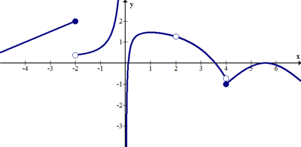

1. The function seems to oscillate infinitely as $x$ approaches zero. One thing that the graph fails to show is that 0 is clearly not in the domain. The graph does not shoot to infinity, nor does it have a simple hole or jump discontinuity. Calculus and Real Analysis are required to state more precisely what is going on. 

2. There is a jump discontinuity at $x = -1$ and an infinite discontinuity at $x = 2$.

3. There are jump discontinuities at $x = -2$ and $x = 4$. There is a removable discontinuity at $x = 2$. There is an infinite discontinuity at $x = 0$.

---

#### Practice

Describe any discontinuities in the functions below:

1. $y = x$

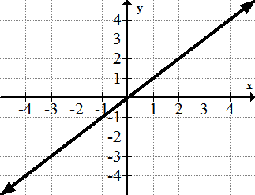

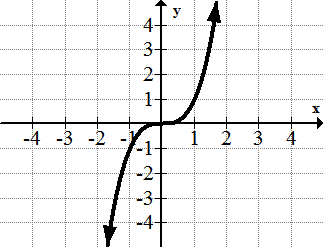

4. $y = \sqrt{x}$

$")

8. $y = \frac{1}{1 + e^{-x}}$

")

\[Figure 18\]

10. ")

\[Figure 20\]

12. $f(x)$ has a jump discontinuity at $x = 3$, a removable discontinuity at $x = 5$, and another jump discontinuity at $x = 6$. Draw a picture of a graph that could be $f(x)$.

13. $g(x)$ has a jump discontinuity at $x = -2$, an infinite discontinuity at $x = 1$, and another jump discontinuity at $x = 3$. Draw a picture of a graph that could be $g(x)$.

14. $h(x)$ has a removable discontinuity at $x = -4$, a jump discontinuity at $x = 1$, and another jump discontinuity at $x = 7$. Draw a picture of a graph that could be $h(x)$.

15. $j(x)$ has an infinite discontinuity at $x = 0$, a removable discontinuity at $x = 1$, and a jump discontinuity at $x = 4$. Draw a picture of a graph that could be $j(x)$.

The continuity of a function is related to the conceptual notion of a function not having any breaks or sudden jumps as the independent variable takes on all values over some interval. There are no range gaps, or sudden jumps over the domain of interest. With this in mind, see if you can determine which of the following could be considered to represent a continuous function: (a) daily outdoor temperature variation; (b) weight of a cart as 10 kg bags of sand are loaded on it; (c) the rise and fall of the level of a reservoir of water; (d) the amount of money collected at a movie theater for a specific showing.

#### Watch This

!?[Watch the video at](https://www.youtube.com/watch?v=Q7tEPyKS4Jg)

As you know, continuity of a function is conceptually the characteristic of a function curve that has the values of the range “flow” continuously without interruption over some interval, as if never having to lift pencil from paper while drawing the curve. This intuitive notion needs to be formalized mathematically.

**Definition:** **_Continuity of a Function_**

The function $f(x)$ is **_continuous at_** $x=a$ if the following conditions all hold:

1. $a$ is in the domain of $f(x)$;

2. $\lim_{x \to a} f(x)$ exists;

3. $\lim_{x \to a} f(x)=f(a)$

When a function is not continuous at $x=a$, then it is discontinuous at $a$, and _$a$_ is a point of discontinuity.

Now let's answer the questions framed in the beginning. Which of the following could be considered to represent a continuous function:

a) daily outdoor temperature variation: Could be considered a continuous function of time as because all temperature values occur in the range of variation.

b) weight of a cart as 10 kg bags of sand are loaded: Would not be considered a continuous function of the number of bags because only integer numbers of bags are possible and the total weight changes in 10 kg increments, so there are gaps.

c) the rise and fall of the level of water in a reservoir: Could be considered continuous function of time because all levels occur in the range of variation.

d) the amount of money collected at a movie theater for a specific showing: Would not be considered a continuous function since the number of people buying and the price per ticket are quantized so that only certain total dollar amounts are possible.

#### Guided Practice

**Problem 1.** Find a value of $k$ which makes the following function continuous:

$$
\begin{align*}
f(x) =
\begin{cases}
kx+1,  & x \le 3 \\
-(5-x)^3, & x>3
\end{cases}
\end{align*}
$$

**Solution 1:**

If $f(x)$ is to be considered continuous everywhere, it must be continuous at $x=3$. This means that:

1. $x=3$ must be in the domain of $f(x)$; it is.

2. $\lim_{x \to 3^-} f(x)=\lim_{x \to 3^+} f(x)$ so that $\lim_{x \to 3} f(x)$ would exist;

Now, $\lim\limits_{x \to 3^-}f(x)=\lim\limits_{x \to 3^-}(kx+1)=3k+1$

Also, $\lim\limits_{x \to 3^+}f(x)=\lim\limits_{x \to 3^+} \left[-(5-x)^3 \right]=-8$

Also, $f(3)=3k+1$

Since, $f(x)$ is continuous at $x=3$

Therefore, 

$$
\begin{align*}
\begin{array}{rcl}
\lim\limits_{x \to 3^-}f(x) &=& \lim\limits_{x \to 3^+}f(x)=f(3) \\
\Rightarrow 3k+1 &=& -8 \\
\Rightarrow k &=& -3
\end{array}
\end{align*}
$$

Therefore, the function

$$
f(x) = \begin{cases} -3x+1, \quad x  \le 3 \\
-(5-x)^3, \ x>3 \end{cases}
$$

 is continuous at $x=3$.

**Problem 2.** Let’s recall our basic square root function, $f(x)=\sqrt{x}$, shown below. Is it continuous at $x=0$?

Since the domain of $f(x)=\sqrt{x}$ is $x \ge 0$, we see that $\lim_{x \to 0} \sqrt{x}$ does not exist. Specifically, we cannot find open intervals around $x=0$ that satisfy the limit definition. Therefore, the function is not continuous at $x=0$. However we do note that as we approach $x=0$ from the right-hand side, we see the successive values tending towards $x=0$.

#### Practice

1. Generate the graph of $f(x)=\frac{(|x+1|)}{(x+1)}$ and discuss the continuity of the function.

2. Discuss the continuity of $f(x)=\frac{(3x-6)}{(x^2-4)}$.

3. Is the function $f(x)=|x-3|$ continuous at $x=3$?

4. Is the function $f(x)=\frac{6x-1}{4x^2+20x+25}$ continuous at $x=-\frac{5}{2}$?

5. Is the function $f(x)=\frac{3x^2-13x-10}{x^3-4x^2-2x-15}$ continuous at $x=5$?

6. Find a value of $k$ which makes the following function continuous:

$$
f(x) = \begin{cases} x^2+2x+k, \  x \le -1 \\
-x-4, \ \quad \quad x>-1
\end{cases}
$$

7. For the function 

$$
f(x)=\begin{Bmatrix} \sqrt{1-x}, \ x<-3 \\
\frac{4}{3}x+6, \ -3 < x \le 3 \\
x^2, \ x>3\end{Bmatrix}
$$

classify the discontinuities at

a) $x=-3$ and

b) $x=3$.

8. For the function $f(x)=\frac{3x^3-x^2-27x+9}{3x^2+2x-1}$classify the discontinuities at

a) $x=-1$ and

b) $x=\frac{1}{3}$.

9. On what intervals is $f(x)=\frac{(x^2-1)(4x+1)}{x(x^2+1)(4x+1)}$ continuous?

10. On what intervals is $f(x)=\frac{2}{x-3}+3$ continuous?

11. On what interval is $f(x)=\cot^2 (x)$ continuous?

12. True or False: $f(x)=\frac{\cos x}{x \sqrt{x-1} (2x-1)}$ is continuous on the interval \[0, 1\].

13. True or False: $f(x)=\frac{\sin (x)}{\sin (3x)}$ is continuous on the interval $\left[\frac{\pi}{4}, \frac{\pi}{2}\right]$.

14. On what intervals is $f(x)=\sqrt{x^2-4x+2}$ continuous?

15. On what intervals is $f(x)=\sqrt{x^2+4x+5}$ continuous?

### Properties of Continuous Functions

The previous concept identified the characteristics of a function that is continuous at a point, and over an interval. Let’s explore Given two functions $f(x)$ and $g(x)$ that are continuous over a closed interval $[a,b]$, would you expect that arithmetic operations on these two functions would also yield functions continuous over $[a,b]$?

---

#### Example A

Given the functions $f(x)=x+3$  and $g(x)=-x+0.5$ in the closed interval $[-1,1]$, determine if the following are continuous in the interval:

a) $f(x)$ and $g(x)$

b) $h(x)=f(x)+g(x)$

c) $h(x)=f(x)g(x)$

**Solutions:**

a) The functions $f(x)$ and $g(x)$ are shown in the graph. Inspection of each function graph and its equation, shows that they are each defined over the closed interval and the function limit at each point in the interval equals the function value at the point. Both functions are continuous in the interval.

 The sum of the two functions is given by $h(x)=3.5$, and is shown in the figure. The sum function, a constant, is defined over the closed interval and the function limit at each point in the interval equals the constant function value at each point. The sum function is continuous in the interval.")

 The product of the two functions is given by $h(x)=(x+3)(-x+0.5)=-x^2+2.5x-1.5$, and is shown in the figure. The product function, a parabola, is defined over the closed interval and the function limit at each point in the interval equals the product function value at each point. The product function is continuous in the interval.")

#### Example B

Given the functions $f(x)=x+3$ and $g(x)=-x+0.5$ in the closed interval $[-1,1]$, determine if $\frac{f(x)}{g(x)}$ is continuous in the interval.

**Solutions:**

The quotient of the two functions is given by $h(x)=\frac{x+3}{-x+0.5}$, and is shown in the figure.

$ is undefined, and $\lim_{x \to 0.5} h(x)$ does not exist. The function $h(x)$ is not continuous at $x=0.5$, or in the closed interval.")

The findings in the above simple functions can be generalized in the following properties.

**Basic Properties of Continuous Functions**

If $f(x)$ and $g(x)$ are continuous at any real value $c$ over the closed interval $[a, b ]$, then the following are also continuous at any real value $c$ over the closed interval $[a, b ]$:

---

a) $f(x) + g(x)$

b) $f(x) - g(x)$

c) $f(x)g(x)$

d) $\frac{f(x)}{g(x)}$, as long as $g(c)\ne 0$.

The Intermediate Value Theorem and the Extreme Value (Min-Max Theorem) are two other properties of a function that is continuous over a closed interval:

**Intermediate Value Theorem**

If a function is continuous on a closed interval $[a,b]$, then the function assumes every value between $f(a)$ and $f(b)$.

The Extreme Value (Min-Max Theorem) is a consequence of the Intermediate Value Theorem.

**Extreme Value (Min-Max) Theorem:**

If a function $f(x)$ is continuous in a closed interval $I$, then $f(x)$ has both a maximum value and a minimum value in $I$.

The Intermediate Value Theorem can be used to analyze and approximate zeros of functions.

**_Properties of Continuous Functions_**

Let’s consider functions:

$$
f(x)= 1/(x + 1),\ g(x) = -1.
$$

We saw that $f(g(x))$ is undefined and has the indeterminate form of $1/0$. Hence $\lim_{x \to -1} (f \circ g)(x)$ does not exist.

In general, we will require that $f$ be continuous at $x = g(a)$ and $x = g(a)$ must be in the domain of $(f \circ g)$ in order for $\lim_{x \to a} (f \circ g)(x)$ to exist.

This means that if $f \circ g$ is defined at $x = a$ and $g(x)$ is continuous at $x = a$ and $f(x)$ is continuous at $g(a)$ then $(f \circ g)$ will also be continuous at $x = a$.

Also, all trigonometric functions, exponential function, logarithmic function, reciprocal function, polynomial function, rational function are continuous in their respective domains.

</article>

### 5.3 Differentiability

<article>

#### The Derivative

You have already studied about derivatives. Now we shall study it by using concept of continuity. The function $f^{\prime}$ is defined by the new function

$$
f'(x) = \lim_{h \to 0} \frac{f(x+h) - f(x)} {h}
$$

where $f^{\prime}(x)$ **_is called the_** _derivative_ **_of_** $f$ **_with respect to_** $x$. **_The domain of_** $f$ consists of all the values of $x$ for which the limit exists.

The derivative $f^{\prime}$ represents the slope of the tangent line to the function $f$, at point $x$. Another way of interpreting it is to say that the function $y = f(x)$ has a derivative $f^{\prime}(x)$ whose value at $x$ is the instantaneous rate of change of $y$ with respect to point $x$.

#### Existence and Differentiability of a Function

If, at the point $(x_0, f(x_0))$, the following limit does not exist, then the derivative of the function $f(x)$ at this point does not exist either. That is,

if

$$
\lim_{x \to x_0} \frac{f(x) - f(x_0)} {x - x_0} = \text{Does not exist}
$$

then the derivative $f^{\prime}(x)$ also fails to exist as $x \rightarrow x_0$. The following examples show four cases where the derivative fails to exist.

1. At a _corner_. For example $f(x) = |x|$, where the derivative on both sides of $x = 0$ differ (Figure 1).

2. At a _cusp_. For example $f(x) = x^{2/3}$, where the slopes of the secant lines approach $+\infty$ on the right and $-\infty$ on the left (Figure 2).

3. A _vertical tangent_. For example $f(x) = x^{1/3}$, where the slopes of the secant lines approach $+\infty$ on the right and $-\infty$ on the left (Figure 3).

4. A _jump discontinuity_. For example, the function (Figure 4)

$$
\begin{align*}
f(x) =\begin{cases}
-2, & x < 0\\
2, & x \ge 0
\end{cases}
\end{align*}
$$

where the limit from the left is $-2$ and the limit from the right is $2$.

**Figure 3**

Many functions in mathematics do not have corners, cusps, vertical tangents, or jump discontinuities. We call them **differentiable functions**.

From what we have learned already about differentiability, it will not be difficult to show that continuity is an important condition for differentiability. The following theorem is one of the most important theorems in calculus:

#### Differentiability and Continuity

If $f$ is differentiable at $x_0$, then $f$ is also continuous at $x_0$.

The logically equivalent statement is quite useful: If $f$ is _not_ continuous at $x_0$, then $f$ is not differentiable at $x_0$.

(The converse is not necessarily true.)

We have already seen that the converse is not true in some cases. The function can have a cusp, a corner, or a vertical tangent and still be continuous, but it is not differentiable.

We know that a function $f(x)$ is differentiable if $\lim\limits_{x \to c}\frac{f(x)-f(c)}{x-c}$ exists.

This means, $\lim\limits_{x \to c^-}\frac{f(x)-f(c)}{x-c}=\lim\limits_{x \to c^+}\frac{f(x)-f(c)}{x-c}$ i.e., both LHD and RHD exist finitely and are equal. Here LHD and RHD refer to Left Hand Derivative and Right Hand Derivative.

Also, we should note that $f(x)$ is differentiable in the interval $[a, b]$ if it is differentiable at every point of the interval $[a, b]$.

---

#### Example 1

Prove that the function $f$ defined as $f(x) =\frac{|x-5|}{x-5}$  is not differentiable at $x = 5$

**Solution:**

We will find Left hand Derivative (LHD) and right Hand Derivative (RHD) and show that they are not equal.

$$
\begin{align*}
\begin{array}{rcl}
\text{LHD} &=& \lim\limits_{x \to 5^-}\frac{|x-5|}{x-5}= \lim\limits_{x \to 5^-}\frac{-(x-5)}{x-5}=\lim\limits_{x \to 5^-}(-1)=-1 \\
\text{RHD} &=& \lim\limits_{x \to 5^+}\frac{|x-5|}{x-5}= \lim\limits_{x \to 5^+}\frac{(x-5)}{x-5}=\lim\limits_{x \to 5^+}(1)=1 \\
\text{LHD} & \ne & \text{RHD}
\end{array}
\end{align*}
$$

$f(x)$ is not differentiable at $x = 5$

</article>

### 5.4 Derivatives of Composite Functions (Chain Rule)

<article>

We want to derive a rule for the derivative of a composite function of the form $f \circ g$ in terms of the derivatives of $f$ and $g$. This rule allows us to differentiate complicated functions in terms of known derivatives of simpler functions.

#### The Chain Rule

If $g$ is a differentiable function at $x$ and $f$ is differentiable at $g(x)$, then the composite function $f \circ g = f(g(x))$ is differentiable at $x$. The derivative of the composite function is:

$$
(f \circ g)'(x) = f '(g(x))g '(x).
$$

Another way of expressing, if $u = u(x)$ and $f = f(u)$, then

$$
\frac {d}{dx}[f(u)] = f'(u)\frac {du}{dx}.
$$

And a final way of expressing the chain rule is the easiest form to remember: If $y$ is a function of $u$ and $u$ is a function of $x$, then

$$
\frac {dy}{dx}= \frac {dy}{du}.\frac {du}{dx}.
$$

#### Example 1

Differentiate $f(x) = (2x^3 - 4x^2 + 5)^2$ with respect to $x$.

**Solution:**

Using the chain rule, let $u = 2x^3 - 4x^2 + 5.$ Then

$$
\begin{align*}
\frac {d}{dx}[(2x^2-4x^2+5)^2] & =  \frac {d}{dx}[u^2]\\
& = 2u \frac {du}{dx}\\
& = 2(2x^3-4x^2+5)(6x^2-8x).
\end{align*}
$$

The example above is one of the most common types of composite functions. It is a power function of the type

$$
y = [u(x)]^n.
$$

The rule for differentiating such functions is called the **General Power Rule.** It is a special case of the Chain Rule.

#### The General Power Rule

if

$$
y = \left[ u(x) \right] ^n
$$

then

$$
\frac {dy}{dx} = n[u(x)]^{n-1} u'(x).
$$

In simpler form, if

$$
y = u^n
$$

then

$$
y' = n u^{n-1} \cdot u'.
$$

#### Example 2

What is the derivative of the function $y = \sqrt {x^2 - 3x + 2}$ with respect to $x$.

**Solution:**

We can write $y = (x^2 - 3x + 2)^{1/2}.$ This example illustrates the point that $n$ can be any real number including fractions. Using the General Power Rule,

$$
\begin{align*}
\frac{dy} {dx} &= \frac{1} {2} (x^2 - 3x + 2)^{\frac{1} {2} - 1}(2x - 3)\\
&= \frac{1} {2} (x^2 - 3x + 2)^{-1/2}(2x - 3)\\
&= \frac{(2x - 3)} {2 \sqrt{x^2 - 3x + 2}}
\end{align*}
$$

#### Example 3

Find $dy/dx$ for $y = \sin^3x$.

**Solution:**

The function can be written as $y = [\sin x]^3.$ Thus

$$
\begin{align*}
\frac{dy} {dx} &= 3[\sin x]^2 [\cos x] \\
&= 3 \sin^{2} x \cos x
\end{align*}
$$

#### Example 4

Find $dy/dx$ for $y = 5 \cos(3x^2 - 1).$

**Solution:**

Let $u = 3x^2 - 1.$ By the chain rule,

$$
\frac{d} {dx} [f(u)] = f'(u) \frac{du} {dx}
$$

where $f(u) = 5 \cos u.$ Thus

$$
\begin{align*}
\frac{dy} {dx} & = 5(-\sin u)(6x)\\
& = -5(6x)\sin u\\
& = -30x \sin(3x^2 - 1)
\end{align*}
$$

#### Example 5

Find $dy/dx$ for $y= [\cos(\pi x^2)]^3.$

**Solution:**

This example applies the chain rule twice because there are several functions embedded within each other.

Let $u$ be the inner function and $w$ be the innermost function.

$$
y = (u(w))^3.
u(x) = \cos x \\
w (x)= \pi x^2.
$$

Using the chain rule,

$$
\begin{align*}
\frac{d} {dx} [f(u)] &= f'(u) \frac{du} {dx}\\
 \frac{d} {dx} [u^3] &= \frac{d} {dx} [\cos^3(\pi x^2)]\\
&= \frac{d} {dx} [\cos(\pi x^2)]^3\\
&= 3[\cos(\pi x^2)]^2 [-\sin(\pi x^2)](2\pi x)\\
&= -6\pi x [\cos(\pi x^2)]^2 \sin(\pi x^2).
\end{align*}
$$

---

#### Multimedia Links

!?[Watch the video at](https://www.youtube.com/watch?v=XIQ-KnsAsbg)

!?[Watch the video at](https://www.youtube.com/watch?v=PT11CSo-WkQ)

!?[Watch the video at](https://www.youtube.com/watch?v=1x_wMYFOliQ)

#### Practice Questions

Find $f'(x)$.

1. $f(x) = (2x^2 - 3x)^{39}$

2. $f(x) = \left (x^3 - \frac{5} {x^2} \right)^{-3}$

3. $f(x) = \frac{1} {\sqrt{3x^2 -6x + 2}}$

4. $f(x) = \sin^3x$

5. $f(x) = \sin x^3$

6. $f(x) = \sin^3x^3$

7. $f(x) = \tan(4x^5)$

8. $f(x) = \sqrt{4x - \sin^2 2x}$

9. $f(x) = \frac{\sin x} {\cos(3x - 2)}$

10. $f(x) = (5x + 8)^3 (x^3 + 7x)^{13}$

11. $f(x) = \left (\frac{x - 3} {2x - 5} \right)^3$

</article>

### 5.5 Derivatives of Implicit Functions

<article>

Consider the equation

$$
2xy = 1.
$$

We want to obtain the derivative $dy/dx$. One way to do it is to first solve for $y$,

$$
y = \frac{1} {2x},
$$

and then project the derivative on both sides,

$$
\begin{align*}
\frac{dy} {dx} &= \frac{d} {dx} \left [\frac{1} {2x} \right]\\
&= \frac{-1} {2x^2}.
\end{align*}
$$

There is another way of finding $dy/dx$. We can directly differentiate both sides:

$$
\frac{d} {dx} [2xy] = \frac{d} {dx} [1].
$$

Using the Product Rule on the left-hand side,

$$
\begin{align*}
y \frac{d} {dx} [2x] + 2x \frac{d} {dx} [y] &= 0\\
y[2] + 2x \frac{dy} {dx} &= 0.
\end{align*}
$$

Solving for $dy/dx$,

$$
\frac{dy} {dx} = \frac{-2y} {2x}  = \frac{-y} {x}.
$$

But since $y = \frac{1} {2x}$ , substitution gives

$$
\begin{align*}
\frac{dy} {dx} &= \frac{-1} {x(2x)}\\
&= \frac{-1} {2x^2}.
\end{align*}
$$

which agrees with the previous calculations. This second method is called the **implicit differentiation** method. You may wonder and say that the first method is easier and faster and there is no reason for the second method. That’s probably true, but consider this function:

$$
3y^2 - \cos y = x^3.
$$

How would you solve for $y$? That would be a difficult task. So the method of implicit differentiation sometimes is very useful, especially when it is inconvenient or impossible to solve for $y$ in terms of $x$. Explicitly defined functions may be written with a direct relationship between two variables with clear independent and dependent variables. Implicitly defined functions or relations connect the variables in a way that makes it impossible to separate the variables into a simple input output relationship. More notes on explicit and implicit functions can be found at http://en.wikipedia.org/wiki/Implicit_function.

#### Example 1

Find $dy/dx$ if $3y^2 - \cos y = x^3.$

**Solution:**

Differentiating both sides with respect to $x$ and then solving for $dy/dx$,

$$
\begin{align*}
\begin{array}{rcl}
 \frac{d} {dx} [3y^2 - \cos y]  & = & \frac{d} {dx} [x^3]\\ \\
3 \frac{d} {dx} [y^2] - \frac{d} {dx} [\cos y] & = & 3x^2. \\
3(2y \frac{dy} {dx}) - (-\sin y) \frac{dy} {dx} & = & 3x^2. \\
6y \frac{dy} {dx} + \sin y \frac{dy} {dx} & = & 3x^2. \\
\left [ 6y + \sin y \right ] \frac{dy} {dx} & = & 3x^2.
\end{array}
\end{align*}
$$

Solving for $dy/dx$, we finally obtain

$$
\frac{dy} {dx} = \frac{3x^2} {6y + \sin y}.
$$

Implicit differentiation can be used to calculate the slope of the tangent line as the example below shows.

---

#### Example 2

Find derivative of $8y^3 + x^2 y - x = 3$ with respect to $x$.

**Solution:**

Using implicit differentiation,

$$
\begin{align*}
\begin{array}{rcl}
 \frac{d} {dx} [8y^3 + x^2y - x] & = & \frac{d} {dx} [3]\\  \\
24y^2 \frac{dy} {dx} + [(x^2)(1) \frac{dy}  {dx} + y(2x)] - 1 & = & 0.  \\
24y^2 \frac{dy} {dx} + x^2 \frac{dy} {dx} + 2xy - 1 & = & 0.  \\
\left [ 24y^2 + x^2 \right ] \frac{dy} {dx} & = & 1 - 2xy\\  \\
\frac{dy} {dx} & = & \frac{1 - 2xy} {24y^2 + x^2}.
\end{array}
\end{align*}
$$

#### Example 3

If $5x^2 - 4y^2 = 9$ then find $dy/dx$.

**Solution:**

$$
\begin{align*}
\frac{d} {dx} [5x^2 - 4y^2] & = \frac{d} {dx} [9]\\
10x - 8y \frac{dy} {dx} & = 0.
\end{align*}
$$

Solving for $dy/dx$,

$$
\frac{dy} {dx} = \frac{5x} {4y}.
$$

#### Multimedia Links

!?[Watch the video at](https://www.youtube.com/watch?v=1scXr6g7HdA)

!?[Watch the video at](https://www.youtube.com/watch?v=jv4gTxWqeBE)

!?[Watch the video at](https://www.youtube.com/watch?v=wTYvMpVITg8)

#### Practice Questions

Find $dy/dx$ for the following functions.

1. $x^2 + y^2 = 500$

2. $x^2 y + 3 xy - 2 = 1$

3. $\frac{1} {x} + \frac{1} {y} = \frac{1} {2}$

4. $\sqrt{x} - \sqrt{y} =\sqrt{3}$

5. $\sin(25xy^2) = x$

6. $\tan^3 (x^2 - y^2) = \tan(\pi/4)$

7. $x^2 y - y^2 x = 0$

8. $\sin(xy) = y$

9. $x^3y^3 = 5$

</article>

### 5.6 Derivatives of Inverse Trigonometric Functions

<article>

If you are interested in baseball, you know that making contact with a fast ball is difficult, especially when the ball is thrown at speeds that can be up to 100 m/s. What makes it difficult? The difficulty is the batsman’s ability to follow the ball as it goes past the plate. The rate of change of the batsman’s observing angle as the ball goes by is just too fast compared with the eye/brain’s ability to follow. The batsman really does have to predict where the ball is going to be. Can you determine how fast a ball would have to be thrown so that a batsman standing $h$ metres from the plate would see the ball traveling with a rate of change of observing angle $\frac{d\theta}{dt}$ no greater than 3 radians/sec (about the maximum rate the eye/brain can follow)? Can you do it now? If not, try answering the question as soon as you can.

#### Watch This

!?[Watch the video at](https://www.youtube.com/watch?v=ZJLhn5GYYDM)

!?[Watch the video at](https://www.youtube.com/watch?v=Vy002NmyT5s)

!?[Watch the video at](https://www.youtube.com/watch?v=yNYhNARIG50)

!?[Watch the video at](https://www.youtube.com/watch?v=qTqBttouhW0)

#### Guidance

**Derivatives of Inverse Trigonometric Functions:**

|     |     |
| --- | --- |
| $y = f(x)$ | $f^{\prime}(x)$ |
| $\sin^{-1} x$ | $\frac{1}{\sqrt{1-x^2}}$ |
| $\cos^{-1} x$ | $\frac{-1}{\sqrt{1-x^2}}$ |
| $\tan^{-1} x$ | $\frac{1}{1+x^2}$ |
| $\cot^{-1} x$ | $\frac{-1}{1+x^2}$ |
| $\sec^{-1} x$ | $\frac{1}{\|x\| \sqrt{x^2-1}}$ |
| $\text{cosec}^{-1} x$ | $\frac{-1}{\|x\| \sqrt{x^2-1}}$ |

If $u(x)$ is a differentiable function of $x$ then the generalized derivative formulas for the inverse trigonometric functions are:

|     |     |
| --- | --- |**Derivatives of Inverse Trigonometric functions**
| $\frac{d}{dx}[\arcsin u] = \frac{1}{\sqrt{1-u^2}}\frac{du}{dx}, \ \|u\|<1$ | $\frac{d}{dx}[\text{arc} \csc u] = \frac{-1}{\|u\|\sqrt{u^2-1}}\frac{du}{dx}, \ \|u\|>1$ |
| $\frac{d}{dx}[\arccos u] = \frac{-1}{\sqrt{1-u^2}}\frac{du}{dx}, \ \|u\|<1$ | $\frac{d}{dx}[\text{arc} \sec u] = \frac{-1}{\|u\|\sqrt{u^2-1}}\frac{du}{dx}, \ \|u\|>1$ |
| $\frac{d}{dx}[\arctan u] = \frac{1}{1+u^2}\frac{du}{dx}$ | $\frac{d}{dx}[\text{arc} \cot u] = \frac{-1}{1+u^2}\frac{du}{dx}$ |

Notice that there are just three results to remember because the other three are related by a change of sign:

* $\frac{d}{dx}[\arccos u]=-\frac{d}{dx}[\arcsin u]$
* $\frac{d}{dx}[\text{arc} \cot u]=-\frac{d}{dx}[\arctan u]$
* $\frac{d}{dx} [ \text{arc} \csc u ]= - \frac{d}{dx} [ \text{arc} \sec u ]$

The above relationships can each be derived using the following type of procedure example for $\frac{d}{dx}[\arcsin u]$, where we let $y = \arcsin u$:

$$
\begin{align*}
y &= \arcsin u \\
\sin y &=\sin(\arcsin u) \\
\sin y &= u\\
\frac{d}{dx}[\sin y] &=\frac{du}{dx}\\
\cos y \cdot \frac{dy}{dx} &=\frac{du}{dx}\\
\frac{dy}{dx} &= \frac{1}{\cos y}\frac{du}{dx} \\
\frac{d}{dx}[\arcsin u] &= \frac{1}{\sqrt{1-\sin^2 y}}\frac{du}{dx}\\
\frac{d}{dx}[\arcsin u] &= \frac{1}{\sqrt{1-u^2 }}\frac{du}{dx}
\end{align*}
$$

#### Example A

Differentiate $y=\sin^{-1}\left(2x^4\right)$.

**Solution:**

Let $u=2x^4$. Then $y=\sin^{-1}u$.

Using the formula for $\frac{d}{dx}[\sin^{-1}u]$ gives:

$$
\begin{align*}
\frac{dy}{dx} &=\frac{1}{\sqrt{1-u^2}}\frac{du}{dx}\\
&=\frac{1}{\sqrt{1-\left(2x^4\right)^2}}\cdot \left(8x^3\right)\\
&=\frac{8x^3}{\sqrt{1-4x^8}}
\end{align*}
$$

#### Example B

Differentiate $\tan^{-1}\left(e^{3x}\right)$.

**Solution:**

Let $u=e^{3x}$. Then $y=\tan^{-1}u$.

Using the formula for $\frac{d}{dx}[\tan^{-1}u]$ gives:

$$
\begin{align*}
\frac{dy}{dx} &=\frac{1}{1+u^2}\frac{du}{dx}\\
&=\frac{1}{1+\left(e^{3x}\right)^2}\cdot 3e^{3x}\\
&=\frac{3e^{3x}}{1+e^{6x}}
\end{align*}
$$

#### Example C

Find $\frac{dy}{dx}$ if $y=\cos^{-1}(\sin x)$.

**Solution:**

Let $u=\sin x$. Then $y=\cos^{-1}u$.

Using the formula for $\frac{d}{dx}[\cos^{-1} u]$ gives:

$$
\begin{align*}
\frac{dy}{dx} &=\frac{-1}{\sqrt{1-u^2}}\frac{du}{dx}\\
&=\frac{-1}{\sqrt{1-\sin^2 x}}\cos x\\
&=-1
\end{align*}
$$

#### Concept Question Wrap-up

Can you determine how fast a ball would have to be thrown $(\text{speed} = v)$ so that a batsman standing $h$ metres from the plate would see the ball traveling with a rate of change of observing angle $\frac{d\theta}{dt}$ no greater than 3 radians/sec (about the maximum rate the eye/brain can follow)?

A figure depicting the problem geometry is shown below.

The batsman's observing angle can be expressed as:

$$
\tan\theta (t) = \frac{d}{h}=\frac{60.5 - vt}{h} \text{ or } \theta(t) = \text{arctan} \left ( \frac{60.5-vt}{h}\right )
$$

where 60.5 m is the distance from the batsman's box to the pitcher, $v$ is the velocity of the ball, and $t$ is time in seconds.

The rate of change of $\theta$ is $\frac{d}{dt}\theta(t) = \frac{d}{dt}\text{arctan}\left(\frac{60.5-vt}{h}\right )=\frac{1}{1+\left(\frac{60.5-vt}{h}\right)^2}\left(\frac{-v}{h}\right)$.

When the ball arrives at the plate, $\frac{d}{dt}\theta(t)=\left(\frac{-v}{h}\right)$, so that if $h=3 \ m$ and $\frac{d}{dt}\theta(t)=3 \ radians/sec$, then $v=3 \cdot 3=9 \ m/s \approx 6 \ m/s$. This is 15-17 times slower than the 90 to 100 m/s speeds thrown by good pitchers.

#### Guided Practice

Find the derivative of the function $\arctan(x+y)=y^2+\frac{\pi}{4}$ with respect to $x$.

**Solution:**

$$
\begin{align*}
\frac{d}{dx}[\arctan(x+y)] &= \frac{d}{dx}\left[y^2+\frac{\pi}{4}\right]\\
\frac{1}{1+(x+y)^2}\frac{d}{dx}(x+y)&=2yy^{\prime}\\
\frac{1}{1+(x+y)^2}(1+y^{\prime})&=2yy^{\prime}\\
y^{\prime}&=\frac{1}{1-2y[1+(x+y)^2]}
\end{align*}
$$

#### Practice

For each of the following, find the derivative with respect to the independent variable “$x$”:

1. $y=\sec^{-1}x^2$.

2. $y = \frac{1}{\tan^{-1}x}$.

3. $y=\ln(\cos^{-1}x)$.

4. $y  = \sin^{-1}e^{-4x}$.

5. $y=\sin^{-1}(x^2 \ln x)$.

6. $y=3x^2 \arctan x$.

7. $y=\sin^{-1}\sqrt{2x}$.

8. $y=\tan^{-1}2t^3$.

9. $x=\sin^{-1}\sqrt{1-t^4}$.

10. $y=t\cot^{-1}(1+3t^2)$.

11. $x=\frac{t}{\sqrt{1-t^2}}+\cos^{-1}t$.

12. $z=\cot^{-1}\left(\frac{y}{1-y^2}\right )$.

</article>

### 5.7 Derivatives of Exponential and Logarithmic Functions

<article>

Using the “first principle method” for  the derivative, $f^{\prime}(x) = \lim\limits_{h\rightarrow 0} \frac{f(x+h) - f(x)}{h}$, it is possible to determine the derivatives of the exponential function $f(x)=b^x$, and the logarithm function $f(x) = \log_b x$. Before you proceed, see if you can apply the definition to obtain these derivatives; then compare your results with the derivations in the Guidance section. Try letting the $b = e$ to simplify the work. Your results should show that the rate of change of the exponential varies directly with the exponential; and the rate of change of the logarithm varies inversely with $x$.

#### Watch This

!?[Watch the video at](https://www.youtube.com/watch?v=4HVg0YCTsFo)

#### Guidance

We will look first at the derivative of logarithmic functions, and then the derivative of the exponential function.

**The Derivative of a Logarithmic Function**

1. Given the logarithmic function $f(x) = \log_b x$, where $x>0$, and the base $b>0$ and $b \neq 1$, then:

$$
\frac{d}{dx}[\log_b x] = \frac{1}{x \log_e b} = \frac{1}{x \ln b}
$$

where $e$ is the base of the natural logarithm.

2. Given the logarithm function $f(x) = \log_b u$, where $u = g(x) > 0$ and $g(x)$ is a differentiable function, then by the Chain Rule:

$$
\frac{d}{dx}[\log_b u] = \frac{1}{u \log_e b} \cdot \frac{du}{dx} = \frac{1}{u \ln b} \cdot \frac{du}{dx}
$$

Note: $\frac{d}{dx} [\ln u] = \frac{1}{u}\frac{du}{dx}$

---

#### Example A

Find the derivative of each of the functions:

1. $y = x^3 \log_5 2x$

2. $y = \ln (2x^2 -4x+3)$

**Solution:**

1. For $y=x^3 \log_5 2x$, we use the Product Rule along with the derivative formula

$$
\begin{align*}
\frac{d}{dx} [\log_b u] & = \frac{1}{u \ln b} \frac{du}{dx}\\
\frac{d}{dx} [x^3 \log_5 2x] & = x^3 \cdot \frac{d}{dx} [\log_5 2x] + \frac{d}{dx} [x^3] \cdot \log_5 2x\\
& = x^3 \cdot \frac{1}{x \ln 5} + 3x^2 \cdot \log_5 2x\\
& = \frac{x^2}{\ln 5} + 3x^2 \log_5 2x.
\end{align*}
$$

2. For $y = \ln (2x^2-4x+3)$, let $u = 2x^2-4x+3$.

$$
\begin{align*}
\frac{d}{dx} [\ln u] & = \frac{1}{u}\frac{du}{dx}\\
\frac{du}{dx} & = 4x-4\\
\frac{dy}{dx} & = \frac{1}{2x^2-4x+3} \frac{d}{dx}[2x^2-4x+3]\\
& = \frac{1}{2x^2-4x+3}(4x-4)\\
& = \frac{4(x-1)}{2x^2-4x+3}.
\end{align*}
$$

_Derivation of the Derivative of a Logarithmic Function_

The above results for the derivative of a logarithmic function are obtained by using the limit definition of the derivative that you already studied:

$f^{\prime} (x) = \lim\limits_{h \rightarrow 0} \frac{f(x+h) - f(x)}{h} = \lim\limits_{w \rightarrow x} \frac{f(w) - f(x)}{w-x}$.

To get the derivative of $y = \log_b x$, use the limit definition of the derivative and the rules of logarithms:

$$
\begin{align*}
\frac{d}{dx} [\log_b x] & = \lim_{w \rightarrow x} \frac{\log_b w - \log_b x}{w-x}\\
& = \lim_{w \rightarrow x} \frac{\log_b \left ( \frac{w}{x} \right )}{w-x}\\
& = \lim_{w \rightarrow x} \left [ \frac{1}{w-x} \log_b \left ( \frac{w}{x} \right )\right ]\\
& = \lim_{w \rightarrow x} \left [ \frac{1}{w-x} \log_b \left ( \frac{x+(w-x)}{x} \right )\right ]\\
& = \lim_{w \rightarrow x} \left [ \frac{1}{w-x} \log_b \left ( 1+ \frac{w-x}{x} \right )\right ]\\
& = \lim_{w \rightarrow x} \left [ \frac{1}{x(w-x)} \log_b \left ( 1+ \frac{w-x}{x} \right )\right ]\\
& = \lim_{w \rightarrow x} \left [ \frac{x}{x(w-x)} \log_b \left ( 1+ \frac{w-x}{x} \right )\right ].
\end{align*}
$$

At this stage, let $a=\frac{(w-x)}{(x)}$, so that the limit of $w \rightarrow x$ then becomes $a \rightarrow 0$.

Substituting, we get

$$
\begin{align*}
& = \lim_{a\rightarrow 0} \left [ \frac{1}{x} \frac{1}{a} \log_b (1+a) \right ]\\
& = \frac{1}{x} \lim_{a\rightarrow 0} \left [ \frac{1}{a} \log_b (1+a) \right ]\\
& = \frac{1}{x} \lim_{a\rightarrow 0} \left [ \log_b (1+a)^{\frac{1}{a}} \right ].
\end{align*}
$$

Inserting the limit,

$= \frac{1}{x} \log_b \left [ \lim\limits_{a\rightarrow 0} (1+a)^{\frac{1}{a}} \right ]$.

But by the definition $e = \lim\limits_{a \rightarrow 0} (1+a)^{\frac{1}{a}}$,

$\frac{d}{dx} [\log_b x] = \frac{1}{x} \log_b e$.

We can express $\log_b e$ in terms of natural logarithm by the using the change of base formula: $\log_b w = \frac{\ln w}{\ln b}$.

Then

$\log_b e = \frac{\ln e}{\ln b} = \frac{1}{\ln b}$.

Thus we conclude

$\frac{d}{dx} [\log_b x] = \frac{1}{x \ln b}$.

In the special case where $b = e$,

$\frac{d}{dx} [\ln x] = \frac{1}{x}$.

The Chain Rule can be used to obtain the generalized derivative rule for logarithmic functions, if $u$ is a differentiable function of $x$ and if $u(x)>0$.

**Remark:** Students often wonder why the constant $e$ is defined the way it is. The answer is in the derivative of $f(x) = \ln x$. With any other base, the derivative of $f(x) = \log_b x$ would be equal to the more complicated expression $f^{\prime} (x) = \frac{1}{x \ln b}$, rather than $\frac{1}{x}$. This is similar to the situation where the derivative of $f(x) = \sin x$ is the simple expression $f^{\prime} (x) = \cos (x)$ only if $x$ is in radians. In degrees, $f^{\prime} (x) = \frac{\pi}{180} \cos (x)$, which is more cumbersome and harder to remember.

**Derivatives of Exponential Functions**

The summary of the formula for the derivative of the exponential function is given below:

**Derivatives of Exponential Functions**

1. Given the exponential function $f(x) = b^x$, where the base _$b$_ is a positive, real number, then:

$$
\frac{d}{dx} [b^x] = \ln b \cdot b^x
$$

2. Given the exponential function $f(x) = b^u$, where $u=g(x)$ and $g(x)$ is a differentiable function, then:

$$
\frac{d}{dx} [b^u] = (\ln b \cdot b^u) \frac{du}{dx}
$$

#### Example B

Find the derivative of the following functions

1. $y=2^{x^2}$

2. $y = e^{x^2}$

**Solution:**

1. For $y=2^{x^2}$, let $u = x^2$,

$\frac{d}{dx} [b^u] = (\ln b \cdot b^u) \frac{du}{dx}$

$$
\begin{align*}
y^\prime & = (2x) 2^{x^2} \ln 2\\
& = 2^{x^2 + 1} \cdot x \cdot \ln 2.
\end{align*}
$$

2. For $y=e^{x^2}$, let $u = x^2$.

$$
\begin{align*}
\frac{d}{dx} [e^u] & = u^\prime e^u,\\
y^\prime & = 2xe^{x^2}.
\end{align*}
$$

_Derivation of the Derivative of an Exponential Function_

We have discussed above that the exponential function is simply the inverse function of the logarithmic function. To obtain a derivative formula for the exponential function with base $b$ we rewrite $y=b^x$ as

$x = \log_b y$.

Differentiating implicitly,

$1 = \frac{1}{y \ln b} \cdot \frac{dy}{dx}$.

Solving for $\frac{dy}{dx}$ and replacing $y$ with $b^x$,

$\frac{dy}{dx} = y \ln b = b^x \ln b$.

Thus the derivative of an exponential function is

$\frac{d}{dx} [b^x] = b^x \ln b$.

In the special case where the base is $b^x = e^x$, since $\ln e=1$ the derivative rule becomes

$\frac{d}{dx} [e^x] = e^x$.

To generalize, if $u$ is a differentiable function of $x$, with the use of the Chain Rule the above derivatives take the general form

$\frac{d}{dx} [b^u] = b^u \cdot \ln b \cdot  \frac{du}{dx}$.

And if $b=e$,

$\frac{d}{dx} [e^u] = e^u \cdot \frac{du}{dx}$.

In the following example the derivative of functions containing both exponential and logarithmic expressions will be evaluated using the differentiation rules you have learned.

#### Example C

Find $dy/dx$ of the function $f(x) = e^{x^3} \ln \left ( \frac{1}{x+1} \right )$.

**Solution:**

The derivative of the function is:

$$
\begin{align*}
\frac{d}{dx} \left [ e^{x^3} \ln \left ( \frac{1}{x+1} \right ) \right ] & = 3x^2 e^{x^3} \ln \left ( \frac{1}{x+1} \right ) + e^{x^3} (x+1) \frac{-1}{(x+1)^2}\\
& = \left [ 3x^2 \ln \left ( \frac{1}{x+1} \right ) - \frac{1}{(x+1)} \right ] e^{x^3}
\end{align*}
$$

#### Concept Question Wrap-up

Were you able to use the limit definition of the derivative to find expressions for the simple exponential and logarithm functions? If not, study the derivations in the guidance section until they make sense.

#### Guided Practice

Find $f^{\prime} (x)$, for the function $f(x) = \frac{1}{\sqrt{\pi \sigma}} e^{-\alpha k(x-x_0)^2}$,  where $\sigma, \alpha, x_0,$ and $k$ are constants and $\sigma \neq 0$.

**Solution:**

The function $f(x) = \frac{1}{\sqrt{\pi \sigma}} e^{-\alpha k(x-x_0)^2}$, can be thought of as $f(x) = \frac{1}{\sqrt{\pi \sigma}} e^{u(x)}$, where $u(x) = - \alpha k(x-x_0)^2$.

We apply the exponential derivative and the Chain Rule:

$$
\begin{align*}
f^{\prime}(x) & = \frac{d}{dx} \left [ \frac{1}{\sqrt{\pi \sigma}} e^{u(x)} \right ]\\
& = \frac{1}{\sqrt{\pi \sigma}} e^{u(x)} \frac{d}{dx} u(x)\\
& = \frac{1}{\sqrt{\pi \sigma}} e^{-\alpha k (x-x_0)^2} \frac{d}{dx} \left [ -\alpha k (x-x_0)^2 \right ]\\
& = \frac{-2\alpha k(x-x_0)^2}{\sqrt{\pi \sigma}} e^{-\alpha k (x-x_0)^2}
\end{align*}
$$

#### Practice

Find the derivative of each of the functions and give the applicable domain if necessary:

1. $y=\log_7 (2x+5)$

2. $y=\frac{1}{\log x}$

3. $y = \frac{5}{\log (x+4)}$

4. $y = \log_2 x^2 \cdot \log_5 x^3$

5. $y = \ln (\sin x)$

6. $y = \ln (\cos 5x)^3$

7. $y=\ln  \frac{x}{x+1}$

8. $y = \ln (\sin (\ln x))$

Find the derivative of each of the functions:

9. $y=e^{6x}$

10. $y=e^{3x^3-2x^2 +6}$

11. $y=x^2 e^{-3x}$

12. $y=\frac{e^x - e^{-x}}{e^x + e^{-x}}$

13. $y=\text{cosec} (e^x)$

14. $y=\frac{\log (x)}{e^x}$

15. $y = e^{x^2} \cdot \ln \left ( \frac{1}{x} \right )$

**Students can refer to the section “References for Basic Understanding” to study about Exponential and Logarithmic Functions.**

</article>

### 5.8 Logarithmic Differentiation

<article>

Suppose you want to differentiate $y=\sin(\cos x)$ or $y= \sin x \cdot \cos x$ then you know how to differentiate.  Here $y=\sin(\cos x)$ is a composite function and can be differentiated by using chain rule. Also, $y =\sin x \cdot \cos x$ is product of two funcions and can be differentiated by using product rule. But how will you differentiate function $y=(\sin x)^{\cos x}$ with respect to $x$?

To differentiate all such functions, we use logarithm to the base $e$ and its properties.

We will take $\log$ on both the sides.

$$
\begin{align*}
\begin{array}{rcl}
\log y &=& \log [(\sin x)^{\cos x}] \\ \\
&=& \cos x [\log (\sin x)] \quad [\text{Because } \log m^n = n \log m]
\end{array}
\end{align*}
$$

Differentiating both the sides with respect to $x$,

$$
\begin{align*}
\begin{array}{rcl}
\frac{1}{y} \frac{dy}{dx} &=& -\sin x [\log \sin x] + \cos x \cdot \frac{1}{\sin x} \cdot  \cos x  \\ \\
&& \text{[use product rule and chain rule to differentiate RHS]} \\ \\
\Rightarrow \frac{dy}{dx} &=& y [-\sin x \log(\sin x) + \cos x \cot x] \\ \\
\Rightarrow \frac{dy}{dx} &=& (\sin x)^{\cos x} [-\sin x \log (\sin x) + \cos x \cot x]
\end{array}
\end{align*}
$$

Logarithmic Differentiation is a powerful technique for differentiating functions involving product of many functions, quotients of many functions, exponents of any function, $[f(x)]^{g(x)}$.

Before taking more examples, let us revise properties of logarithm. Here we are dealing with $\log$ to the base $e$ or $\ln$ or natural $\log$.

**Properties of** $\log_e x :$

1. $\log_e (m \cdot n)=\log_e m+ \log_e n$

2. $\log_e \left  (\frac{m}{n} \right)=\log_e m  - \log_e n$

3. $\log_e (m^n )=n \cdot \log_e m$

4. $\log_n(m)=\frac{\log_e m} {\log_e n}, \text{ Base Change Formula}$

5. $\log_e e=1, \ \log \text{ of any number to the base of same number is always equal to one}.$

6. $\log_e 1=0, \ \log 1 \text{ to any base is equal to zero}$

7. $e^{\log_{e^x}}=1$

---

#### Example A

Find $\frac{dy}{dx}$ where $y=(x-1)(x-2)(x-3)$

**Solution:**

$y=(x-1)(x-2)(x-3)$

Taking $\log$ on both the sides,

$$
\begin{align*}
\begin{array}{rcl}
\log y &=& \log [(x-1)(x-2)(x-3)] \\ \\
&=& \log(x-1)+\log(x-2) + \log(x-3)
\end{array}
\end{align*}
$$

Differentiating both the sides with respect to $x$

$$
\begin{align*}
\begin{array}{rcl}
\frac{1}{y} \frac{dy}{dx} &=& \frac{1}{x-1} + \frac{1}{x-2} + \frac{1}{x-3} \\ \\
\Rightarrow \frac{dy}{dx} &=& y \left[\frac{1}{x-1} + \frac{1}{x-2}+\frac{1}{x-3} \right] \\ \\
&=& (x-1)(x-2)(x-3) \left[ \frac{(x-2)(x-3)+(x-1)(x-3)+(x-1)(x-2)}{(x-1)(x-2)(x-3)}\right] \\ \\
&=& x^2 - 5x+6 + x^2 - 4x + 3 + x^2 - 3x+2 \\ \\
&=& 3x^2 - 12x + 11
\end{array}
\end{align*}
$$

#### Example B

Find $\frac{dy}{dx}$ if $y=\sqrt[3]{\frac{x^2 - 1}{x^2 - 2x}}$

**Solution:**

$y=\sqrt[3]{\frac{x^2 -1}{x^2 - 2x}}$

Taking $\log$ on both the sides,

$$
\log y = \frac{1}{3} [ \log(x^2 - 1) - \log(x^2 - 2x)]
$$

Differentiating both the sides with respect to $x$

$$
\begin{align*}
\begin{array}{rcl}
\frac{1}{y} \frac{dy}{dx} &=& \frac{1}{3} \left[ \frac{2x}{x^2-1} - \frac{2x-2}{x^2-2x}\right]\\ \\
\Rightarrow \frac{dy}{dx} &=& y \cdot \frac{1}{3} \left[ \frac{2x}{x^2-1} - \frac{2x-2}{x^2-2x} \right] \\ \\
&=& \frac{1}{3} \left(\frac{x^2-1}{x^4-2x} \right)^{\frac{1}{3}} \left[\frac{2x}{x^2-1} - \frac{2x-2}{x^2-2x} \right]
\end{array}
\end{align*}
$$

#### Example C

Find $\frac{dy}{dx} \ \text{if}\  y= \tan^{-1} x + (\cot x)^{\sin x}$

**Solution:**

$$
\begin{align*}
\begin{array}{rcl}
y&=&\tan^{-1}x+(\cot x)^{\sin x} \\ \\
\frac{dy}{dx} &=& \frac{1}{1+x^2} + \frac{du}{dx}, \qquad \text{where} \ u=(\cot x) ^{\sin x}
\end{array}
\end{align*}
$$

Consider $u=(\cot x)^{\sin x} \quad \ldots \ (1)$

Taking $\log$, $\log u =\sin x \log(\cot x) \quad \text{[Product of two functions]}$

Differentiating,

$$
\begin{align*}
\begin{array}{rcl}
\frac{1}{u} \frac{du}{dx} & = & \cos x \log (\cot x) - \sin x \frac{1}{\cot x} \text{cosec}^2 x\\ \\
\Rightarrow \frac{du}{dx} & = & u  [\cos x (\log  \cot x) - \sin x \tan x \ \text{cosec}^2 x] \\ \\
 & = & (\cot x)^{\sin x} [\cos x (\log \cot x) - \sec x] \quad \ldots \ (2)
\end{array}
\end{align*}
$$

From (1) & (2)

$$
\frac{dy}{dx} = \frac{1}{1+x^2} + (\cot x)^{\sin x} [\cos x(\log \cot x) - \sec x]
$$

#### Example D

Find $\frac{dy}{dx} \ \text{if} \ y=x^{\tan x}+(\tan x)^x$

**Solution:**

Let $y=x^{\tan x} + (\tan x)^x$

$$
\begin{align*}
\begin{array}{rcl}
y & = & u+v \qquad \quad [\text{assume} \ u=x^{\tan x} \text{ and} \ v=(\tan x)^x] \\ \\
\Rightarrow \frac{dy}{dx} & =& \frac{du}{dx}+\frac{dv}{dx} \quad \ldots \ (1)
\end{array}
\end{align*}
$$

Consider $u=x^{\tan x}$

Taking $\log$, $\log u=\tan x \log x$

Differentiating,

$$
\begin{align*}
\begin{array}{rcl}
\frac{1}{u} \frac{du}{dx} & = & \sec^2 x \log x + \tan x \frac{1}{x} \\ \\
\Rightarrow \frac{du}{dx} & = & x^{\tan x} [\sec^2 x \log x + \frac{1}{x} \tan x] \quad \ldots \ (2)
\end{array}
\end{align*}
$$

Consider $v= (\tan x)^x$

Taking $\log$, $\log v = x \log  (\tan x)$

Differentiating,

$$
\begin{align*}
\begin{array}{rcl}
\frac{1}{v} \frac{dv}{dx} & = & 1 \cdot \log (\tan x) + x \frac{1}{\tan x} \cdot \sec^2 x \\ \\
\Rightarrow \frac{dv}{dx} & = & (\tan x)^x [\log (\tan x) + x \cot x \cdot \sec^2 x]
\end{array}
\end{align*}
$$

**Note:**

In the above example, we have divided $y$ into two functions $u$ and $v$ and differentiated $u$ and $v$ separately by using logarithm and then combining $\frac{du}{dx}$ and $\frac{dv}{dx}$ students should consider it seriously that

$$
\log(m+n) \neq \log m + \log n
$$

#### Multimedia Links

!?[Watch the video at](https://www.youtube.com/watch?v=Y4jOBIKOJkA)

!?[Watch the video at](https://www.youtube.com/watch?v=Q27MGfI1V70)

!?[Watch the video at](https://www.youtube.com/watch?v=fc8uoHzGans)

!?[Watch the video at](https://www.youtube.com/watch?v=Z-_cTFx0WPg)

</article>

### 5.9 Derivatives of Parametric Functions

<article>

A parametric equation gives the equation for a curve on the coordinate plane. It usually takes the form of $F(t)=(x(t),y(t))$ where the $x$ and $y$ coordinates are given by two different functions of the variable $t$. Scientists and engineers find parametric equations most useful for analyzing variables that change over time, such as position in space, or how two populations relate to each other.

When an object moves on a plane, you can write one equation to describe its horizontal movement over time and one equation to describe its vertical movement over time. The parametric equation then describes the object’s position on the plane over time.

#### Concept

Monika has her house key attached to a carabineer. As she studies for her upcoming Calculus test, she twirls it around her finger. A key becomes detached from the ring and flies off the carabineer and across the room. Monika’s floor is covered in papers and laundry. How can she narrow down her search and find her key?

#### Watch This

!?[Watch the video at](https://www.youtube.com/watch?v=k5QnaGVk1JI)

!?[Watch the video at](https://www.youtube.com/watch?v=qyycNbNJAqg)

#### Guidance

By now, you’ve become familiar in finding the derivatives for functions in terms of $y$ and $x$.  You may recall that the derivative of a function at a point $(x,y)$ gives the slope of the line that forms a tangent to the function at that point.  You may also remember that the slope of a function is the change in the $y$ value of the function divided by the change in the $x$ value of the function.

Since a parametric function is a function of the form $F(t)= (x(t), y(t))$ where $x(t)$ and $y(t)$ are themselves functions, you can express the derivative for a parametric function at point $t$ as $\frac{y^\prime (t)}{x^\prime (t)}$. That is, you can find the derivatives for $y(t)$ and $x(t)$, and then divide. When you differentiate a parametric function, you use the same identities and techniques that you’ve used to differentiate functions written in terms of $x$ and $f(x)$.

#### Example A

Given the parametric function

$$
\begin{align*}
F(t)&= (x(t), y(t))\\
x(t) & = 4t + 7\\
y(t) & = 10t^2-3t
\end{align*}
$$

Find $dy/dx$.

**Solution:**

First, find the derivative of $x(t)$: $x^\prime (t)=4$

Now, find the derivative of $y(t)$: $y^\prime (t)=20t-3$

Divide to find the derivative of $F(t)$: $\frac{y^\prime (t)}{x^\prime (t)} = \frac{20t-3}{4}$

#### Example B

Find $dy/dx$ for the following at $t=\frac{\pi}{4}$.

$$
\begin{align*}
F(t)&= (x(t), y(t))\\
x(t) & = 4\cos (t)\\
y(t) & = -6 \sin (t)
\end{align*}
$$

**Solution:**

First, use the derivatives for trigonometric functions to find $x^\prime (t)$ and $y^\prime (t)$.

$$
\begin{align*}
x^\prime (t) & = -4\sin (t)\\
y^\prime (t) & = -6 \cos (t)
\end{align*}
$$

Divide to find the derivative of $F(t)$:

$$
\frac{y^\prime (t)}{x^\prime (t)} = \frac{-6 \cos (t)}{-4\sin (t)}
$$

Evaluate the derivative when $t=\frac{\pi}{4}$:

$$
\frac{y^\prime (t)}{x^\prime (t)} = \frac{-6 \cos \frac{\pi}{4}}{-4\sin \frac{\pi}{4}}  = \frac{3}{2}
$$

#### Concept Problem Revisited

Now, you’re ready to find Monika’s missing keys, or at least narrow down her search. Monika’s keys are traveling in a circle that you can measure with centimeters.

Assume the radius of Monika’s circle (carabineer and keys together), is 10 centimeters.  The keys make about one revolution per second. That means that you can write a parametric equation for the keys’ path as they circle her finger. The following equation can model the keys’ movement.

$$
\begin{align*}
F(t)&= (x(t), y(t))\\
x(t) & = 10\cos (2\pi t)\\
y(t) & = 10 \sin (2\pi t)
\end{align*}
$$

Multiplying $t$ by $2\pi$ means that when 1 second has passed, the keys have made one revolution.  Assume that the keys fly off Monika’s finger about halfway through their spin, when $t$ is 0.5.

Now, find the derivative of the equation and its value when $t$ is 0.5.

$$
\frac{y^\prime (t)}{x^\prime (t)} = \frac{10\cos (2\pi t)}{-10 \sin (2\pi t)}
$$

When $t=0.5$:

$$
\frac{y^\prime (0.5)}{x^\prime (0.5)} = -\frac{\cos (\pi)}{\sin (\pi)} = undefined
$$

Notice that $\sin(\pi)$ is 0 which makes the slope undefined. This means that the keys fly off along a vertical line that runs parallel to the $y$\-axis of your coordinate plane.  So the equation of the line will take the form:

$x=K$ where $K$ is a constant.  To find the value of $K$, find the value of $x$ when $t$ is 0.5.

$$
\begin{align*}
x(.5) & = 10 \cos (2 \pi (.5))\\
x(.5) & = 10 \cos (\pi)\\
x(.5) & = 10 (-1)\\
x(.5) & = -10
\end{align*}
$$

The keys will fly away and land somewhere along the line $x=-10$.

#### Guided Practice

1. A function is defined by the following parametric equation. Find the derivative, then evaluate it when $t=3$.

$$
\begin{align*}
F(t)&= (x(t), y(t))\\
x(t) & = t^4+2\\
y(t) & = \ln (t)
\end{align*}
$$

2. Find $dy/dx$ to the hyperbola described by the equation below at $t=\frac{\pi}{6}$:

$$
\begin{align*}
F(t)&=(x(t),y(t))\\
x(t)&=5 \sec (t)\\
y(t)&= 4 \tan(t)
\end{align*}
$$

**Answers:**

1. First, check to make sure the functions can be differentiated when $t=3$. $\ln (t)$ is undefined for all numbers less than or equal to 0. However, you can differentiate  $\ln (t)$  when $t=3$. Now, find the derivative of $F(t)$.

$$
\begin{align*}
F(t)&=(x(t),y(t))\\
x(t)&=t^4+2\\
y(t)&= \ln (t)\\
x^\prime (t)&=4t^3\\
y^\prime (t)&=\frac{1}{t}\\
\frac{y^\prime(t)}{x^\prime(t)} &= \frac{1}{4t^3} = \frac{1}{4t^4}
\end{align*}
$$

Evaluate the derivative at $t=3$ to get:

$$
\frac{1}{4t^4}=\frac{1}{4(3^4)}=\frac{1}{324}
$$

2. First, see if the function can be differentiated at $\frac{\pi}{6}$.  If $x(t)$ is undefined at this point, $x^\prime(t)$ will also be undefined.  The function is defined at this point, and it’s continuous, so you can differentiate it.

Find the derivatives of $x(t)$ and $y(t)$ to find the derivative for the parametric equations:

$$
\begin{align*}
x(t) &= 5 \sec(t) \\
x^\prime (t) &= 5 \sec (t) \tan (t) \\
y(t) &= 4 \tan (t) \\
y^\prime (t) &= 4 \sec^2 (t)\\
\frac{y^\prime (t)}{x^\prime (t)} &= \frac{4 \sec^2 (t)}{5 \sec (t) \tan (t)} = \frac{4 \sec (t)}{5 \tan (t)}
\end{align*}
$$

Now, evaluate the derivative when $t=\frac{\pi}{6}$.

$$
\frac{4 \sec \left (\frac{\pi}{6} \right )}{5 \tan \left (\frac{\pi}{6} \right )} = \frac{4 (2)}{5 \left ( \frac{\sqrt{3}}{3}\right )} = \frac{24}{5 \sqrt{3}} = \frac{24 \sqrt{3}}{15} = \frac{8}{5} \sqrt{3}
$$

#### Practice

1. A function is defined by the following parametric equation. Find the derivative, then evaluate it when $t=6$.

$$
\begin{align*}
M(t) &= (x(t),y(t)) \\
x(t) &= t+6 \\
y(t) &= 3t+t^3
\end{align*}
$$

2. A function is defined by the following parametric equation. Find the derivative, then evaluate it when $t=\frac{\pi}{4}$.

$$
\begin{align*}
N(t) &= (x(t),y(t)) \\
x(t) &= 7 \cos (2t) \\
y(t) &= \sin (2t)
\end{align*}
$$

3. A function is defined by the following parametric equation. Find the derivative, then evaluate it when $t=1$.

$$
\begin{align*}
P(t) &= (x(t),y(t)) \\
x(t) &= t^2 \\
y(t) &= 3t^4+2t^2-6t
\end{align*}
$$

4. Find the derivative of $y$ with respect to $x$ to the following curve when $t=0$.

$$
\begin{align*}
F(t) &= (x(t),y(t)) \\
x(t) &= 4t \\
y(t) &= 3t+t^2
\end{align*}
$$

5. Find the derivative of $y$ with respect to $x$ to the following curve when $t=3$.

$$
\begin{align*}
G(t) &= (x(t),y(t)) \\
x(t) &= t^2 \\
y(t) &= t^3+1
\end{align*}
$$

6. Find the derivative of $y$ with respect to $x$ to the following curve when $t=\frac{\pi}{4}$.

$$
\begin{align*}
H(t) &= (x(t),y(t)) \\
x(t) &= 2 \cos (t) \\
y(t) &= 2 \sin (t)
\end{align*}
$$

---

7. Find the derivative of  with respect to  to the following curve when $t=\frac{\pi}{3}$.

$$
\begin{align*}
J(t) &= (x(t),y(t)) \\
x(t) &= 3 \cos (t) \\
y(t) &= 5 \sin (t)
\end{align*}
$$

8. Find the derivative of $y$ with respect to $x$ to the following curve when $t=\frac{\pi}{4}$.

$$
\begin{align*}
K(t) &= (x(t),y(t)) \\
x(t) &= 2 \sec (t) \\
y(t) &= 4 \tan (t)
\end{align*}
$$

9. Find the derivative of $y$ with respect to $x$ to the following curve when $t=0$.

$$
\begin{align*}
F(t) &= (x(t),y(t)) \\
x(t) &= 4t \\
y(t) &= 3t+t^2
\end{align*}
$$

10. Find the derivative of $y$ with respect to $x$ to the following curve when $t=3$.

$$
\begin{align*}
G(t) &= (x(t),y(t)) \\
x(t) &= t^2 \\
y(t) &= t^3+1
\end{align*}
$$

11. Find the derivative of $y$ with respect to $x$ to the following curve when $t=\frac{\pi}{4}$.

$$
\begin{align*}
H(t) &= (x(t),y(t)) \\
x(t) &= 2 \cos (t) \\
y(t) &= 2 \sin (t)
\end{align*}
$$

12. Find the derivative of $y$ with respect to $x$ to the following curve when $t=\frac{\pi}{3}$.

$$
\begin{align*}
J(t) &= (x(t),y(t)) \\
x(t) &= 3 \cos (t) \\
y(t) &= 5 \sin (t)
\end{align*}
$$

13. Find the derivative of $y$ with respect to $x$ to the following curve when $t=\frac{\pi}{4}$.

$$
\begin{align*}
K(t) &= (x(t),y(t)) \\
x(t) &= 2 \sec (t) \\
y(t) &= 4 \tan (t)
\end{align*}
$$

</article>

### 5.10 Second Order Derivatives

<article>

Lavina is preparing for her Track and Field competition. Her friend had been recording on her laptop the position signals from the GPS transmitter Lavina was wearing during her race. She was using a laptop program she had written to process the once per second GPS position signals so she could determine how far she had run at time during the race. These distance and time points were plotted on her laptop. She had created a program that also gave her a mathematical model of her distance so that she could take the derivative of the math function at any time point to get her “instantaneous” speed.

What if, instead of just finding her _speed_ at any time during the race, she wanted to find her _acceleration_? How would that be done?

#### Watch This

!?[Watch the video at](https://www.youtube.com/watch?v=NaFZDaAAbok)

#### Guidance

If the function $f$ has a derivative $f^{\prime}$ that is differentiable, then the derivative of $f^{\prime}$, denoted by $f^{{\prime}{\prime}}$ is called the _second derivative_ of $f$. We can continue the process of differentiating derivatives and obtain third, fourth, fifth and higher derivatives of $f$. They are denoted as shown below:

|     |     |     |     |     |
| --- | --- | --- | --- | --- |**Notations for Higher Order Derivatives**
| **1st** | **2nd** | **3rd** | **4th** | **$n$th order** |
| $f^{\prime}$ | $f^{{\prime}{\prime}}$ | $f^{{\prime}{\prime}{\prime}}$ | $f^{(4)}$ | $f^{(n)}$ |
| $y^{\prime}$ | $y^{{\prime}{\prime}}$ | $y^{{\prime}{\prime}{\prime}}$ | $y^{(4)}$ | $y^{(n)}$ |
| $\frac{dy}{dx}$ | $\frac{d^2y}{dx^2}$ | $\frac{d^3y}{dx^3}$ | $\frac{d^4y}{dx^4}$ | $\frac{d^ny}{dx^n}$ |
| $D_xy$ | $D^2_xy$ | $D^3_xy$ | $D^4_xy$ | $D^n_xy$ |

---

#### Example A

Given $f(x)=-2x^2-4x-1$. What is $f^{{\prime}{\prime}}(x)$?

**Solution:**

Recall that $f^{{\prime}{\prime}}(x)$ means “The second derivative of $f(x)$”, or “The derivative of the derivative of $f(x)$”. The function $f(x)$ must be differentiated twice as follows:

$$
\begin{align*}
f^{\prime}(x) &= \frac{d}{dx}(-2x^2-4x-1) && \ldots \text{Determine the} \ 1^{\text{st}} \ \text{derivate}. \\
&= -4x-4 \\
f^{{\prime}{\prime}}(x) &= \frac{d}{dx}(-4x-4) && \ldots \text{Determine the} \ 2^{\text{nd}} \ \text{derivate}. \\
&= -4
\end{align*}
$$

Therefore, $f^{{\prime}{\prime}}(x)=-4$

#### Example B

Given $f(x)=(-x^4-4x^3-5x^2+3)$. Find $f^{{\prime}{\prime}}(x)$ when $x=3$.

**Solution:**

Again, the function $f(x)$ must be differentiated twice; then the 2_nd_ derivative must be evaluated:

$$
\begin{align*}
f^{\prime}(x) &= \frac{d}{dx}(-x^4-4x^3-5x^2+3) && \ldots \text{Determine the} \ 1^{\text{st}} \ \text{derivate}. \\
&= -4x^3-12x^2-10x \\
f^{{\prime}{\prime}}(x) &= \frac{d}{dx}(-4x^3-12x^2-10x) && \ldots \text{Determine the} \ 2^{\text{nd}} \ \text{derivate}. \\
&= -12x^2-24x-10 \\
f^{\prime \prime}(3) &= -12(3)^2-24(3)-10 && \ldots \text{Evaluate the} \ 2^{\text{nd}} \ \text{derivate} \\
&= -190
\end{align*}
$$

Therefore, $f^{{\prime}{\prime}}(3)=-190$.

#### Concept question wrap-up

Since Lavina has already created a program to calculate her instantaneous speed at a given point on the track by finding the derivative of the mathematical model to her GPS position data, she could then take the derivative of _that_ function, the second derivative, to find her instantaneous _acceleration_ at the same point in the race.

By finding her instantaneous speed and acceleration at different points in the race, she can learn a lot about her performance during the race, and hopefully target areas she needs to work on to improve her overall success.

**Better racing through Calculus!**

---

#### Higher-Order Derivatives

Explains the importance of knowing higher-order derivatives and how to find them.

!?[Watch the video at](https://www.youtube.com/watch?v=_-_VkzdNok4)

#### Practice

1. Given: $v(x)=-4x^3+3x^2+2x+3$. What is $v^{{\prime}{\prime}}(x)$?

2. Given: $m(x)=x^2+5x$. What is $m^{{\prime}{\prime}}(x)$?

3. Given: $d(x)=3x^4e^x$. What is $d^{{\prime}{\prime}}(x)$?

4. Given: $t(x)=-2x^5 \sin(x)$. What is $\frac{d^2t}{dx^2}$?

5. What is $\frac{d^2}{dx^2}3x^5e^x$?

6. Suppose $u^{\prime}(0)=98$ and $\left(\frac{u}{q}\right)^{\prime}(0)=7$. Find $q(0)$ assuming $u(0)=0$?

7. Given: $b(x)=\frac{x^2-5x+4}{-5x+2}$. What is: $b^{\prime \prime}(2)$?

8. Given: $m(x)=\frac{e^x}{3x+4}$. What is derivative of $\frac{dm}{dx}$ or second derivative of $m(x)$?

</article>

### 5.11 Mean Value Theorems

<article>

#### Concept

Jatin was telling his friend about an over-speeding fine he had received recently for going over 80 km/h one weekend morning when there was little traffic on the highway. Apparently two police officers at different locations along the highway had recorded him going 60 and 65 km/h respectively as he went by each of their speed trap positions. Jatin said he knew where the speed traps were located and always made sure he was within the speed limit going by, so he could not understand how they could say he was speeding. Jatin’s friend asked whether the officer who issued the challan had said anything. Jatin recalled that the officer had mentioned that the speed traps were exactly 3 km apart, and that they knew Jatin’s car had covered the distance in 2 minutes. Jatin’s friend smiled and said, “Oh, that’s how they did it: The Mean Value Theorem”. Jatin looked very perplexed.

Can you figure out how the police officer could have issued a challan without actually witnessing Jatin’s car going over 80 km/hr?

#### Watch This

!?[Watch the video at](https://www.youtube.com/watch?v=2_FCYzch8ww)

This video explains and provided examples of Rolle'sTheorem.

!?[Watch the video at](https://www.youtube.com/watch?v=RHQvYvL679o)

This video explains the Mean Value Theorem and provides example problems.

#### Guidance

In an earlier concept, the derivative of a function was introduced as the slope of the tangent line at a point. We looked at how the slope of a secant line changed as one of the two points approached the other. The secant line became the tangent line in the limit as illustrated below.

**_Rolle’s_** **_Theorem_**

If $f$ is continuous on a closed interval $[a,b]$ and differentiable on the open interval $(a, b)$, and if $f(a)=f(b)$ then $f$ has at least one value $c$ in the open interval $(a,b)$ such that $f^\prime(c)=0$.

Let’s see if you can make use of Rolle’s Theorem.

#### Example A

For the function $f(x)=x^2-3x-10$, show that it satisfies the conditions of Rolle’s theorem on the interval \[-2, 5. and find all numbers $c$ in (-2, 5) that satisfy$f^\prime(c)=0$

Being polynomial function, $f(x)$ is continuous in $[-2, 5]$ ; $f^{\prime}(x) =2x-3; f(x)$ is differentiable in $(-2, 5)$

Evaluating $f(x)$ at $x=-2$ and _$x=5$ yields_:

$$
\begin{align*}
f(-2) &=(-2)^2-3(-2)-10\\
&=0\\
f(5) &=(5)^2-3(5)-10\\
&=0
\end{align*}
$$

Therefore $f(-2)=f(5)$, which satisfies the conditions for Rolle’s theorem to hold.

Now to find values of $c$ that satisfy $f^\prime(c)=0$.

$$
\begin{align*}
\begin{array}{rcl}
\frac{dy}{dx} & =& 2x-3. \\
f^\prime(c)& =& 0. \\
& =& 2(c)-3. \\
\text{Therefore }c & = & \frac{3}{2} \ \text{which lies in } (-2, 5)
\end{array}
\end{align*}
$$

So Rolle’s Theorem is satisfied.

#### Example B

Consider the function $f(x)=x^{\frac{2}{3}}$. On the interval \[-4, 4\], $f(-4)=f(4)$. However, is there any point at which the derivative of $f(x)=x^{\frac{2}{3}}$ is equal to zero? Is this a contradiction of Rolle's theorem?

**Solution:**

The function curve for $f(x)=x^{\frac{2}{3}}$ is shown below.

=\frac{2}{3x^{\frac{1}{3}}}$, which is undefined at $x=0$, and there is no point at which the derivative is 0. Because the function is not differentiable over the interval, Rolle’sTheorem does not apply. There is no contradiction.")

Rolle’s Theorem requires that $f(a) = f(b)$. But Rolle’s theorem is the basis for proving the important general theorem called the Mean Value Theorem which does not require $f(a) = f(b)$.

**_Mean Value Theorem_**

If $f$ is a continuous function on a closed interval $[a,b]$ and if $f^\prime$ contains the open interval $(a,b)$ in its domain, then there exists a number $c$ in the interval $(a,b)$ such that

$$
f^\prime(c)=\frac{f(b)-f(a)}{b-a}
$$

An equivalent form is: $f(b)-f(a)=(b-a)f^\prime(c)$.

An illustration of the meaning of the Mean Value Theorem is shown in the figure below, where the slope of the secant line connecting $f(a)$ and $f(b)$ can be found to be the same as the slope of the tangent line at $f(c)$.

Verify that the Mean Value Theorem applies for the function $f(x)=x^3+3x^2-24x$ on the interval \[1, 4\].

**Solution:**

$f^{\prime} (x) = 3x^2 + 6x - 24; f(x)$ is differentiable in $(1, 4)$

Since $f(x)$ is differentiable; therefore $f(x)$ is continuous also in $[1, 4]$

We need to find $c$ in the interval (1, 4) such that $f^\prime(c) =\frac{f(4)-f(1)}{(4-1)}$

$$
\begin{align*}
f^\prime(c) &=\frac{f(4)-f(1)}{(4-1)}\\
&=\frac{16+20}{3}\\
&=12
\end{align*}
$$

Note that

$f^\prime (x)=3x^2+6x-24,$

Hence, we must solve the following equation:

$$
\begin{align*}
3c^2+6c-24&=12\\
3c^2+6c-32 &=0\\
c^2+2c-12 &=0\\
c &=-1\pm\sqrt{13}
\end{align*}
$$

Since we need to have $c$ in the interval (1, 4), the positive root is the solution:

$$
c\approx2.61.
$$

#### Concept Question Wrap-up

Do you know how Jatin could have received an over-speeding fine for going at least 80 km/h when his car’s speed was recorded at 60 km/h and 65 km/h?

The key information was that the police officer determined that Jatin had travelled 3 km in 2 minutes, so that Jatin’s average speed was 90 km/h. Jatin’s friend knew that by the Mean Value Theorem there had to have been at least one time when Jatin’s actual speed was 90 km/h, definitely exceeding 80 km/h.

#### Guided Practice

Verify that the Mean Value Theorem applies for the function $f(x)=2\sin x+3\cos x$ on the interval $(0, 2\pi )$.

**Solution:**

$f^{\prime}(x) = 2 \cos x - 3 \sin x; f(x)$ is differentiable in $(0, 2 \pi)$

So, $f(x)$ is continuous in $[0, 2 \pi]$

We need to find $c$ in the interval $(0, 2\pi )$ such that $f^\prime(c)=\frac{f(2\pi)-f(0)}{(2\pi-0)}$:

$$
\begin{align*}
f^\prime(c)&=\frac{f(2\pi)-f(0)}{(2\pi-0)}\\
&=\frac{2-2}{2\pi}\\
&=0
\end{align*}
$$

Note that

**$f^\prime(x)=2\cos x-3\sin x$**

Hence, we must solve the following equation:

$$
\begin{align*}
2\cos c-3\sin c &=0\\
\tan c &=\frac{2}{3}\\
c &=\tan^{-1}\left(\frac{2}{3}\right)\\
c &=0.588 \ \text{radians} \ \ldots \ \text{and also} \ (0.588+\pi) \ \text{radians in the interval} \ (0,2\pi).
\end{align*}
$$

The Mean Value Theorem applies in two places in the interval $(0,2\pi)$.

---

#### Multimedia Links

For a video presentation of Rolle's Theorem **(8.0)**.

!?[Watch the video at](https://www.youtube.com/watch?v=2_FCYzch8ww)

For more information about the Mean Value Theorem **(8.0)**.

!?[Watch the video at](https://www.youtube.com/watch?v=RHQvYvL679o)

#### Practice

For 1-5, if possible, verify Rolle’s Theorem for the following functions if it is not possible, state why.

1. $f(x)=3x^3-12x, [2, 5]$

2. $f(x)=x^2-\frac{2}{x-1}, [-2, 2]$

3. $f(x)=-2x^2-12x+5, [5, 7]$

4. $f(x)=|2x-3|,[-2, 2]$

5. $f(x)=2\sin x+3\cos x, [0, 2 \pi]$

6. $f(x)=x^4-2x^2, [3, 6]$

Verify that the Mean Value Theorem works for each the following function in the specified interval, or state why it does not:

7. $f(x)=\frac{(x+2)}{x}$, \[1, 2\]

8. $f(x)=\frac{2}{x}$, \[-1,1\]

9. $f(x)=x^2-5x+1$, \[0, 3\]

10. $f(x)=5-\frac{4}{x}$, \[1, 4\]

11.$f(x)=x^3-8x-5$, \[1, 4\]

12. $f(x)=\sin x$, $\left[0,\frac{\pi}{2}  \right]$

13. $f(x)=\cos x$, $\left[0,\frac{\pi}{2}  \right]$

14. $f(x)=2^x$, \[0, 3\]

</article>

### 5.12 Summary

<article>

* A function $f(x)$ is said to be **continuous** at $x=c$ if $\lim \limits_{x \to c} f(x) =f(c)$, i.e.,

$$
\lim \limits_{x\to c^-} f(x) = \lim \limits_{x\to c^+} f(x) = f(c)
$$

* $f(x)$ and $g(x)$ are continuous functions at $x=c$ and $d$ is constant then, $f+g, f-g, df, f \cdot g, f+d, \frac{f}{g}$, are all continuous at $x=c$ provided $g(c)\neq0$. Also composite functions like $f \circ g(x)$ and $g\circ f(x)$ will also be continuous.
* Every polynomial function, trigonometric function, exponential function and logarithmic function are continuous in their respective domains.
* $f(x)$ is **differentiable** at $x=c$ if $\lim \limits_{h \to 0}\frac{f(c+h)-f(c)}{h}$ exists and the value of this limits is called the derivative at $x=c$ and is denoted by $f^{\prime}(c)$.
* Every differentiable function is continuous but every continuous function may or may not be differentiable.
* **Derivatives of Standard Functions:** Derivative of a function $y=f(x)$ is denoted by the notations, $\frac{dy}{dx}, y_1, y^{\prime}, f^{\prime}(x)$. derivatives of standard functions are listed hereunder:

|     |     |
| --- | --- |
| **$y=f(x)$** | $f^{\prime}(x)$ |
| $\sin x$ | $\cos x$ |
| $\cos x$ | $- \sin x$ |
| $\tan x$ | $\sec^2 x$ |
| $\cot x$ | $- \text{cosec}^2 x$ |
| $\sec x$ | $\sec x \cdot \tan x$ |
| $\text{cosec}x$ | $-\text{cosec} x \cdot \cot x$ |
| $x^n$ | $n \cdot x^{n-1}$ |
| $a \cdot x ; \ \text{where } “a” \ \text{is a constant}$ | $a$ |
| $\text{constant}$ | $0$ |

* **Rules of Differentiation**

**Product Rule: $\frac{d}{dx} (u \cdot v) = u \frac{dv}{dx} + v \frac{du}{dx}$**

**Quotient Rule: $\frac{d}{dx}  \left(\frac{u}{v} \right)= \frac{v \frac{du}{dx} - u \frac{dv}{dx}}{v^2}$
**

* **Derivative of Composite Functions (Chain Rule):**  If $y=f(g(x))$ then $y^{\prime} = f^{\prime} (g(x)) \cdot g^{\prime}(x)$
* **Derivative of Inverse Trigonometric Functions**:

---

|     |     |
| --- | --- |
| **$y=f(x)$** | $f^{\prime}(x)$ |
| $\sin^{-1}x$ | $\frac{1}{\sqrt{1-x^2}}$ |
| $\cos^{-1}x$ | $\frac{-1}{\sqrt{1-x^2}}$ |
| $\tan^{-1}x$ | $\frac{1}{1+x^2}$ |
| $\cot^{-1}x$ | $\frac{-1}{1+x^2}$ |
| $\sec^{-1}x$ | $\frac{1}{x\sqrt{x^2-1}}$ |
| $\text{cosec}^{-1}x$ | $\frac{-1}{x\sqrt{x^2-1}}$ |

* **Derivative of Exponential Function:** $\frac{d}{dx}(a^x) = a^x \cdot \log a$, where “$a$” is a positive constant $\frac{d}{dx}(e^x) = e^x$
* **Derivative of Logarithmic Function:** $\frac{d}{dx}(\log x) = \frac{1}{x}$, $x>0$
* **Logarithmic Differentiation:** Logarithms are used for differentiating functions involving products of many terms, quotient of many terms, exponents of functions or $f(x)^{g(x)}$
* **Properties of Logarithm:** If $a^x = N \Leftrightarrow x = \log_a N$ for $x>0$. We will deal with logarithmic functions to the base “$e$”, until otherwise stated.

$$
\begin{align*}
\begin{array}{rcl}
\log (m \cdot n) &=& \log m + \log n \\ \\
\log (m / n) &=& (\log m)-(\log n) \\ \\
\log(m^n) &=& n \cdot \log m \\ \\
\log_b m &=& \frac{\log_e m}{\log_e b}
\end{array}
\end{align*}
$$

* **Derivative of Parametric Function:** If $y=f(t)$ and $x=f(t)$ then $\frac{dy}{dx} = \frac{dy}{dt} \times \frac{dt}{dx}$
* **Second order Derivative:** $\frac{d^2y}{dx^2} = \frac{d}{dx} \left ( \frac{dy}{dx} \right )$
* **Rolle’s Theorem:** If a real function $f(x)$ is continuous in $[a, b]$ and derivable in $(a, b)$ and $f(a)=f(b)$ then there exists at least one real number $c\in (a, b)$ such that $f^{\prime}(c)=0$
* **Lagrange’s Mean Value Theorem:** If a real function $f(x)$ is continuous in $[a, b]$ and derivable in $(a, b)$ then there exists at least one real number $c \in (a, b)$ such that $f^{\prime}(c) = \frac{f(b)-f(a)}{b-a}$

</article>

### 5.13 Self Assessments

<article>

#### 1. Continuity

http://www.ck12.org/calculus/Continuity/asmtpractice/Continuity-Practice/?referrer=concept_details

##### Previous Years' Boards Questions

1. Find the value of $k$ if the following function is continous at $x=0$

$$
f(x) = \begin{cases} \frac{\sqrt{1+kx}-\sqrt{1-kx}}{x}, -1 \le x < 0 \\
\frac{2x+1}{x-1}, \qquad \qquad \qquad 0 \le x < 1 \end{cases} \qquad \text{[A.I.C.B.S.E. 2013]}
$$

2. Show that the function $f(x)=|x-3|, x \in R$, is continous but not differentiable at $x=3$. \[C.B.S.E. (Delhi) 2013\]

3. Find the values of $a$ and $b$ such that the following function $f(x)$ is a continuous function: 

$$
f(x) = \begin{cases} 5, \qquad \ x \le 2 \\
ax+b, 2 < x < 10 \\
21, \qquad x \ge 10 \end{cases} \qquad \text{[C.B.S.E. (Delhi) 2011]}
$$

4. Find the relationship between $a$ and $b$ so that the function defined as

$$
f(x) = \begin{cases} ax+1, \ x \le 3 \\ bx+3, \ x > 3 \end{cases}
$$

is continous at $x=3$. \[A.I.C.B.S.E. 2011\]

5. Find all the points of discontinuity of $f$, where

$$
f(x) = \begin{cases} |x| + 3, \ x \le -3 \\
-2x, \quad -3 < x < 3 \\
6x+2, \ x \ge 3 \end{cases} \qquad \text{[C.B.S.E. (Delhi) 2010]}
$$

#### 2. Differentiability

##### Differentiability and Continuity

http://www.ck12.org/calculus/Differentiability-Implies-Continuity/asmtpractice/Differentiability-Implies-Continuity-Practice/?referrer=concept_details

---

##### Chain Rule

http://www.ck12.org/calculus/Chain-Rule/asmtpractice/Chain-Rule-Practice/?referrer=concept_details

##### Derivative of Inverse Trigonometric Functions

http://www.ck12.org/calculus/Derivative-Rule-for-Inverses/asmtpractice/Derivative-Rule-for-Inverses-Practice/?referrer=concept_details

##### Mean Value Theorems

http://www.ck12.org/calculus/Maxima-and-Minima-Mean-Value-Theorem-Rolles-Theorem/asmtpractice/Maxima-and-Minima-Mean-Value-Theorem-Rolles-Theorem-Practice/?referrer=concept_details

##### Derivative of Implicit Function

http://www.ck12.org/calculus/Implicit-Differentiation/asmtpractice/Implicit-Differentiation-Practice/?referrer=concept_details

</article>

### 5.14 Home Assignments

<article>

#### 1. Continuity

NCERT Exercise No. 5.1

Q. No. 2, 4, 9, 10, 13, 15, 20, 23, 27, 29, 33, 34

#### 2. Differentiability and Chain Rule

NCERT Exercise No. 5.2

Q. No. 3, 5, 7, 8

#### 3. Derivatives of Implicit Functions and Inverse Trigonometric Functions

NCERT Exercise 5.3

Q. NO. 2, 3, 5, 7, 10, 12

#### 4. Derivatives of Exponential and Logarithmic Functions

NCERT Exercise No. 5. 4

Q. No. 3, 4, 6, 9

#### 5. Logarithmic Differentiation

NCERT Exercise No. 5. 5

Q. No. 5, 8, 11, 14, 15

#### 6. Derivatives of Parametric Functions

NCERT Exercise No. 5.6

Q. No. 2, 3, 4, 9, 10

#### 7. Second Order Derivatives

NCERT Exercise No. 5.7

Q. No. 2, 3, 4, 7, 10, 14, 15

---

#### 8. Mean Value Theorems

NCERT Exercise No. 5.8

Q. No. 2(ii), (iii), 5, 6

#### 9. Miscellaneous Questions on Derivatives

NCERT Miscellaneous Exercise

Q. No. 2, 5, 7, 8, 9, 18, 19, 20, 22

</article>

### 5.15 References for Basic Understanding

<article>

#### 1. Techniques of Differentiation

http://www.ck12.org/book/CK-12-Calculus/section/2.3/

http://www.ck12.org/book/CK-12-Math-Analysis/section/8.5/

#### 2. Exponential and Logarithmic Functions

http://www.ck12.org/book/CK-12-Calculus-Concepts/section/7.2/

**Students can refer to the following link to study basic concepts of Exponential Function:**

http://www.ck12.org/analysis/Basic-Exponential-Functions/lesson/Basic-Exponential-Functions/

**Students can refer to the following link to study basic concepts of Logarithmic Functions:**

http://www.ck12.org/analysis/Logarithmic-Functions/lesson/Logarithmic-Functions/

http://www.ck12.org/analysis/Graphs-of-Logarithmic-Functions/lesson/Graphs-of-Logarithmic-Functions/

http://www.ck12.org/analysis/Common-and-Natural-Logarithms/lesson/Common-and-Natural-Logarithms/

**The number “e”**

http://www.ck12.org/analysis/The-Number-e/lesson/The-Number-e/

</article>

## 6.0 Application of Derivatives

### 6.1 Introduction

<article>

In classes XI and XII, you have studied about limits, continuity, differentiability and derivatives of various functions; different techniques of derivatives, etc. In this chapter, you will learn applications of derivatives in different disciplines and fields of life. We will study applications of derivatives like, rate of change of quantities, tangents and normals, increasing and decreasing functions, approximate values of exponents and maximization and minimization.

</article>

### 6.2 Rate of Change of Quantities

<article>

#### Objectives

In this concept, you learn to solve problems where there is some relationship between two or more derivatives, i.e., where there are related rates.

#### Concept

In the concept on implicit differentiation, you learned that given a relationship between two quantities, the relationship between their respective rates of change can be determined. This is often an invaluable tool in applications, since it allows us to find the rate at which some quantity is changing by relating it to other quantities whose rates of change are known (or at least more easily found). For example, if you were at the scene of an accident where an oil spill from a large tanker was spreading in a circular pattern whose radius you determined was increasing by about 1 metre per second, would you be able to tell someone how fast the oil spill area was increasing when the radius was about 30 metres?

#### Watch This

!?[Watch the video at](https://www.youtube.com/watch?v=I9iWnLfHmHk)

http://mathispower4u.wordpress.com/

#### Guidance

What do we mean by related rates? These are simply the derivatives, rates, of one or more parameters that are related to each other through an equation. The relationship between the rates is obtained by taking the derivative of some other relationship between the parameters.

A simple example with a familiar geometric shape should help illustrate the concept.

---

#### Example A

Consider the simple right triangle in the figure below with sides $x, y,$ and $z$. The relationship between the sides is governed by the Pythagoras Theorem.

$$
x^2+y^2=z^2
$$

$$
\begin{align*}
\frac{d}{dt} [x^2+y^2] &= \frac{d}{dt} [z^2]\\
2x \frac{dx}{dt}+2y\frac{dy}{dt} &= 2z \frac{dz}{dt}\\
x \frac{dx}{dt}+y \frac{dy}{dt} &= z \frac{dz}{dt} \qquad \ldots \text{Equation} \ 1
\end{align*}
$$

Implicit differentiation of the Pythagoras relationship between the side lengths has yielded relationships between the side length derivatives, and since the derivatives are rates, this is an example of **_related rates_**.

How might the relationship above be used to solve or answer a problem?

#### Example B

A person is walking in the $x$\-direction at 5 km/hr, and that another person is walking in the $y$\-direction at 3 km/hr. The distance, $z$, between the walkers is changing with time, and the time rate of change of, $z, \frac{dz}{dt},$ is dependent on the rates at which the two people are walking.

At what rate is the distance between $x$ and $y$ increasing after one hour? That is, what is $\frac{dz}{dt}$ after one hour?

**Solution:**

Assume that they have walked for one hour. So $x=5$ and $y=3$.

Using the Pythagoras Theorem, we find the distance between them after one hour is $z=\sqrt{34}=5.83 \ km$.

$$
5(5)+3(3) = \sqrt{34} \ \frac{dz}{dt}\\
34 =\sqrt{34} \ \frac{dz}{dt}\\
\frac{34}{\sqrt{34}} = \frac{dz}{dt}.
$$

Hence after one hour the distance between the two people is increasing at a rate of: $\frac{dz}{dt}=\frac{34}{\sqrt{34}} \approx 5.83 \ km/hr$.

#### Example C

Suppose we have a rectangular field and we know that at an instant of time, the length is changing at the rate of 8 m/s and the perimeter is changing at a rate of 24 m/s. At what rate is the width changing at that instant? At what rate is the area changing at that instant?

**Solution:**

You are familiar with the formula for Perimeter:

$$
P=2l+2w
$$

If we differentiate the perimeter equation, we have

**Equation 2:**

$$
\frac{dP}{dt}=2 \frac{dl}{dt}+2 \frac{dw}{dt}.
$$

Substituting our known information into Equation 2, we have

$$
\begin{align*}
24 &= (2 \times 8)+2 \times \frac{dw}{dt}\\
8 &= 2 \times \frac{dw}{dt}\\
4 &= \frac{dw}{dt}.
\end{align*}
$$

The width is changing at a rate of 4 m/s.

#### Concept Question Wrap-up

If you were at the scene of an accident where an oil spill from a large tanker was spreading in a circular pattern whose radius you determined was increasing by about 1 metre per second, would you be able to tell someone how fast the oil spill area was increasing when the radius was about 30 metres?

Since the circular area of the spill is $A=\pi r^2$, the time rate of change of the area is $\frac{dA}{dt}=\pi 2 r \frac{dr}{dt}$. This means that with $\frac{dr}{dt}=1 \ m/sec$, when $r=30 \ m, \frac{dA}{dt}=60 \pi \ m^2/sec$.

#### Guided Practice

We have a water tank shaped as an inverted right circular cone. Suppose that water flows into the tank at the rate of $5 \ m^3/s$. At what rate is the water level rising when the height of the water in the tank is 6 metres?

We know that the volume of water in the water tank is:

$$
V=\frac{1}{3} \pi r^2 h
$$

When we differentiate this equation we get:

$$
\frac{dV}{dt}=\frac{1}{3} \pi (h)(2r) \frac{dr}{dt}+\frac{1}{3} \pi r^2 \frac{dh}{dt}
$$

This is a related rates equation. The rate $\frac{dV}{dt}$ is related to the rates $\frac{dr}{dt}$ and $\frac{dh}{dt}$.

We know $\frac{dV}{dt}=5 \ m^3/s$, do not know $\frac{dr}{dt}$, but want to find $\frac{dh}{dt}$. We need to somehow find a relationship between $h$ and $r$.

Let $r_1$ be the radius of the surface of the water as it flows out of the tank.

$$
\begin{align*}
\frac{r_1}{h} &= \frac{8}{20}\\
r_1 &= \frac{8h}{20}=\frac{2h}{5}.
\end{align*}
$$

We can write this as a general relationship between $r$ and $h$.

$r=\frac{2h}{5}$, which means also that $\frac{dr}{dt}=\frac{2}{5} \frac{dh}{dt}$. We have the relationships we need.

Now we can solve the problem in a couple of ways: (a) substitute $r=\left(\frac{2h}{5}\right)$ into the original equation for $V$, or (b) substitute $r=\left(\frac{2h}{5}\right)$ and $\frac{dr}{dt}=\frac{2}{5} \frac{dh}{dt}$ into the equation for $\frac{dV}{dt}$. Let’s try approach (a).

$$
V=\frac{1}{3} \pi \left(\frac{2h}{5}\right)^2 h=\frac{4 \pi}{75} h^3
$$

Hence $\frac{dV}{dt}=\frac{12 \pi}{75} h^2 \frac{dh}{dt}$, and by substitution,

$$
5 = \frac{12 \pi}{75} (36) \frac{dh}{dt}\\
\frac{dh}{dt} = \frac{375}{432 \pi} \approx 0.28 \frac{m}{s}.
$$

---

#### Practice

1. Make up a related rates problem about the area of a rectangle. Illustrate the solution to your problem.

2. Suppose that a particle is moving along the curve $4x^2+16y^2=32$. When it reaches the point (2, 1), the $x$\-coordinate is increasing at a rate of 3 m/sec. At what rate is the $y$\-coordinate changing at that instant?

3. A regulation softball diamond is a square with each side of length 60 meter. Suppose a player is running from first base to second base at a speed of 18 m/sec. At what rate is the distance between the runner and home plate changing when the runner is $\frac{2}{3}$ of the way from first to second base?

4. At a recent Hot Air Balloon festival, a hot air balloon was released. Upon reaching a height of 300 ft, it was rising at a rate of 20 ft/sec. Mr. Sharma was 100 ft away from the launch site watching the balloon. At what rate was the distance between Mr. Sharma and the balloon changing at that instant?

5. Two trains left New Delhi railway station in the late morning. The first train was traveling East at a constant speed of 65 km/hr. The second train traveled South at a constant speed of 75 km/hr. At 3 PM, the first train had traveled a distance of 120 km while the second train had traveled a distance of 130 km. How fast was the distance between the two trains changing at that time?

6. Suppose that a 17 ft ladder is sliding down a wall at a rate of -6 ft/sec. At what rate is the bottom of the ladder moving when the top is 8 ft from the ground?

7. Suppose that the length of a rectangle is increasing at the rate of 6 cm/s and the width is increasing at a rate of 2 cm/s. At what rate is the area of the rectangle changing when its length is 25 cm and its width is 15 cm?

8. Suppose that the quantity demand of new $40^{\prime\prime}$ plasma TVs is related to its unit price by the formula $p+x^2=1200$, where $p$ is measured in Rupees and $x$ is measured in units of one thousand. How is the quantity demand changing when $x=20, p=1500,$ and the price per TV is decreasing at a rate of Rs.10?

9. The volume of a cube with side $s$ is changing. At a certain instant, the sides of the cube are 6 cm and increasing at the rate of $\frac{1}{4} \ cm/sec$. How fast is the volume of the cube increasing at that time?

10. (1) Suppose that the area of a circle is increasing at a rate of $24 \ cm^2/s$. How fast is the radius increasing when the area is $36 \pi \ cm^2$?

(2) How fast is the circumference changing at that instant?

11. The radius of a circle is getting bigger at a rate of 5 centimeters per second. How fast is the area of the circle increasing when the radius is equal to ten centimeters?

12. The area of a circle is expanding at a rate of 100 square centimeters a second at an instant when its radius is expanding at a rate of 50 centimeters a second. What is the circle’s radius at that instant?

13. At a given instant, the volume of a cylinder with a cross sectional area of 6 square centimeters is increasing at a rate of 10 cubic centimeters a second. What is the rate of increase of its height at that instant?

14. Express the rate of change of a cylinder’s volume as a function of its radius, its height, and the rate of change of its radius, if its height is assumed to be held constant.

</article>

### 6.3 Increasing and Decreasing Functions

<article>

Look at the following graphs:

")

\[Figure 2\]

")

\[Figure 4\]

In figures 1 and 2, graphs are moving upwards as we move from left to right, but there is some difference. In figure 1, graph is not moving upwards constantly as in figure 2.

#### Conclusion:

Graph 1 is increasing function and graph 2 is strictly increasing function.

Similarly, you can observe that in figures 3 and 4, graphs are moving downwards as we move from left to right; but in figure 4, graph is moving downwards constantly.

#### Conclusion:

Graph 3 is decreasing function and graph 4 represents strictly decreasing function.

What about graph 5? Its increasing in some of the intervals and decreasing in others. In such cases, we can conclude that function is neither increasing nor decreasing for the given interval but we can determine intervals for increasing & decreasing functions.

In this lesson we will consider the function values in between extrema (extremes: minimums or maximums), focusing on where function values are **increasing** or **decreasing.**

**_Formally:_**

__A function is increasing on some interval of its domain if $f(a) > f(b)$ for all $a$, $b$ in that interval such that $a > b$.__

A function is decreasing on some interval of its domain if $f(a) < f(b)$ for all _$a$_, $b$ in that interval such that $a > b$.

**_Informally:_**

__A function is increasing on a section if the graph of that section **“rises”** to the right.__

A function is decreasing on a section if the graph of that section **“falls**” to the right.

### Increasing and Decreasing

It is important to be able to distinguish between when functions are increasing and when they are decreasing. In business this could mean the difference between making money and losing money. In physics it could mean the difference between speeding up and slowing down. 

How do you decide when a function is increasing or decreasing? 

#### Watch This

!?[Watch the video at](https://www.youtube.com/watch?v=78b4HOMVcKM)

#### Guidance

**Increasing** means places on the graph where the slope is positive.

$ where every $b, c \in (a, d)$ with $b < c$ has $f(b) \le f(c)$.")

 < f(c)$_ is substituted into the definition. ")

**Decreasing** means places on the graph where the slope is negative. The formal definition of decreasing and strictly decreasing are identical to the definition of increasing with the inequality sign reversed.

Let “$b$” be any point in the domain of the real valued function $f$. Then there exists an interval $I = (b-h, b+h)$ and for $h>0$ and for $a$, $c$ in $I$; $f$ is said to be

(i) increasing at “$b$” if, if $a< c$ in $I$ then $f(a) < f (c)$

(ii) decreasing at “$b$” if $a< c$ in $i$ then $f(a) >f(c)$

Identifying analytically where functions are increasing and decreasing often requires Calculus.

---

#### Example A

Identify which of the basic functions are monotonically increasing. 

**Solution:**

Of the basic functions, the monotonically increasing functions are:

$$
f(x) = x, f(x) = x^3, f(x) = \sqrt{x}, f(x) = e^x, f(x) = \ln x, f(x) = \frac{1}{1 + e^{-x}}
$$

The only basic functions that are not monotonically increasing are:

$$
f(x) = x^2, f(x) = |x|, f(x) = \frac{1}{x}, f(x) = \sin x
$$

#### Example B

Identify whether the green, red or blue function is monotonically increasing and explain why.

The green function seems to be discrete values along the line $y = x + 2$. While the discrete values clearly increase and the line would be monotonically increasing, these values are missing a key part of what it means to be monotonic. The green function does not have a positive slope and is therefore not monotonic. 

The red function also seems to be increasing, but the slope at every $x$ value is zero. In Calculus the definition of monotonic will be refined to handle special cases like this. For now, this function is not monotonic.

The blue function seems to be $y = \sqrt{x} - 2$, is increasing everywhere that is visible, and probably extends to the right. This function is monotonic where the function is defined for $x \in (0, \infty)$. 

---

#### Example C

Estimate the intervals where the function is increasing and decreasing.

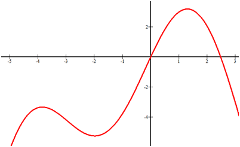

Increasing: $x \in (- \infty, -4) \cup (-2, 1.5)$

Decreasing: $x \in (-4, -2) \cup (1.5, \infty)$

Note that open intervals are used because at $x = -4, -2, 1.5$ the slope of the function is zero. This is where the slope transitions from being positive to negative. The reason why open parentheses are used is because the function is not actually increasing or decreasing at those specific points. 

##### Concept Problem Revisited

Increasing is where the function has a positive slope and decreasing is where the function has a negative slope. A common misconception is to look at the squaring function and see two curves that symmetrically increase away from zero. Instead, you should always read functions from left to right and draw slope lines and decide if they are positive or negative.

#### Guided Practice

1. Estimate where the following function is increasing and decreasing.

, a global minimum at (5, -12) and has no relative extrema or other places with a slope of zero. What are the increasing and decreasing intervals for this function? ")

**Answers:**

1. Increasing: $x \in (-\infty, -1.5) \cup (1.5, \infty)$. Decreasing: $x \in (-1.5, 1.5)$

2. Increasing $x \in (-\infty, -4) \cup (-4, -2.7) \cup (-1, 2) \cup (2, \infty)$. Decreasing $x \in (-2.7, -1)$

3. Increasing $x \in (-\infty, 3) \cup (5, \infty)$. Decreasing $x \in (3, 5)$

_Notice that the $y$ coordinates are not used in the intervals. A common mistake is to want to use the $y$ coordinates._

Now we will learn a method “First Derivative Test” to determine the intervals where a function is increasing or decreasing.

#### Definition

A function $f$ is said to be **_increasing_** on $[a,b]$ contained in the domain of $f$ if $f(x_1) \le f(x_2)$ whenever $x_{1} \le x_{2}$ for all $x_1, x_2 \in [a,b].$ A function $f$ is said to be **_decreasing_** on $[a,b]$ contained in the domain of $f$ if $f(x_1) \ge f(x_2)$ whenever $x_1 \ge x_2$ for all $x_1, x_2 \in [a,b].$

If $f(x_1) < f(x_2)$ whenever $x_1 < x_2$ for all $x_1, x_2 \in [a,b],$ then we say that $f$ is **_strictly increasing_** on $[a,b].$ If $f(x_1) > f(x_2)$ whenever $x_1 > x_2$ for all $x_1, x_2 \in [a,b],$ then we say that $f$is **_strictly decreasing_** on $[a,b].$

#### Example 1

The function $f(x) = x^3$ is strictly increasing on $(-\infty, +\infty)$:

The function indicated here is strictly increasing on $(0,a)$ and $(b,c)$ and strictly decreasing on $(a,b)$ and $(c,d).$

**_Theorem_**: If $f$ is continuous on interval $[a,b],$ then:

1. If $f'(x) > 0$ for every $x \in [a,b],$ then $f$ is strictly increasing in $[a,b].$

2. If $f'(x) < 0$ for every $x \in [a,b],$ then $f$ is strictly decreasing in $[a,b].$

**_Proof_**: We will prove the first statement. A similar method can be used to prove the second statement and is left as an exercise to the student.

Consider $x_1, x_2 \in [a,b]$ with $x_1 < x_2.$ By the Mean Value Theorem, there exists $c \in (x_1,x_2)$ such that

$$
f(x_2) - f(x_1) = (x_2 - x_1) f'(c).
$$

By assumption, $f'(x) > 0$ for every $x \in [a,b]$; hence $f'(c) > 0.$ Also, note that $x_2 - x_1 > 0.$

Hence $f(x_2) - f(x_1) > 0$ and $f(x_2) > f(x_1).$

We can observe the consequences of this theorem by observing the tangent lines of the following graph. Note the tangent lines to the graph, one in each of the intervals $(0,a), (a,b),$ $(b,+\infty).$

$ to negative for $x \in (a,b)$ and then back to positive for $x \in (b, +\infty)$.")

#### Example 3

Our previous example showed a graph that had both a local maximum and minimum. Let’s reconsider $f(x) = x^3$ and observe the graph around $x = 0.$ What happens to the first derivative near this value?

=3x^2$) verifies this fact, and that the slopes of the tangent line are positive for all nonzero $x$. Although $f'(0)=0$, and so $f$ has a critical value at $x=0$, the third part of the First Derivative Test tells us that the failure of $f'$ to change sign at $x=0$ means that $f$ has neither a local minimum nor a local maximum at $x=0$.")

#### Example 4

Let's consider the function $f (x) = x^2 + 6 x - 9$ and observe the graph around $x = -3.$ What happens to the first derivative near this value?

$ and positive for $x \in (-3, -\infty).$")

#### Example 5

Find the intervals in which the function $f(x) = \sin x - \cos x, 0 \le x \le 2 \pi$ is strictly increasing or strictly decreasing.

**Solution:**

**

$$
\begin{align*}
\begin{array}{rcl}
f(x) & = & \sin x - \cos x \\
f^{\prime}(x) & = & \cos x + \sin x\end{array}
\end{align*}
$$

**

Consider $f^{\prime}(x) = 0$

$$
\begin{align*}
\begin{array}{rcl}
\Rightarrow \cos x + \sin x & = & 0 \\
\Rightarrow \sin x & = & - \cos x \\
\Rightarrow \tan x & = & -1 \\
\Rightarrow x & = & \frac{3 \pi}{4}, \frac{5 \pi}{4}\end{array}
\end{align*}
$$

The points $x = \frac{3 \pi}{4}, \frac{5 \pi}{4}$ divide interval $[0, 2 \pi]$ into three disjoint intervals.

|     |     |     |
| --- | --- | --- |
| **Interval** | **Sign of $f^{\prime}(x)$** | **Nature of function** |
| $\left[0, \frac{3 \pi}{4}\right)$ | $>0$ | strictly increasing |
| $\left(\frac{3 \pi}{4}, \frac{5 \pi}{4}\right)$ | $<0$ | strictly decreasing |
| $\left(\frac{5 \pi}{4}, 2 \pi\right]$ | $>0$ | strictly increasing |

Therefore, $f(x)$ is strictly decreasing in $\left(\frac{3 \pi}{4}, \frac{5 \pi}{4}\right)$ and strictly increasing in interval $\left[0, \frac{3 \pi}{4}\right) \cup \left(\frac{5 \pi}{4}, 2 \pi \right)$.

#### Multimedia Links

For more examples on determining whether a function is increasing or decreasing **(9.0)**, see Math Video Tutorials by James Sousa, Determining where a function is increasing and decreasing using the first derivative (10:05).

!?[Watch the video at](https://www.youtube.com/watch?v=6YM3TrudIzQ)

For more information on finding relative extrema using the first derivative **(9.0)**, see Math Video Tutorials by James Sousa, Finding relative extrema using the first derivative (6:18).

!?[Watch the video at](https://www.youtube.com/watch?v=Oc6P7p7wyCs)

#### Practice

Use the graph below for 1-2.

 where the function is increasing.")

2. Identify the intervals (if any) where the function is decreasing.

Use the graph below for 3-4.

 where the function is increasing.")

4. Identify the intervals (if any) where the function is decreasing.

Use the graph below for 5-6.

 where the function is increasing.")

6. Identify the intervals (if any) where the function is decreasing.

Use the graph below for 7-8.

 where the function is increasing.")

8. Identify the intervals (if any) where the function is decreasing.

Use the graph below for 9-10.

 where the function is increasing.")

10. Identify the intervals (if any) where the function is decreasing.

#### Review Questions

Find the intervals in which the following functions are increasing or decreasing.

1. $f(x) = -x^2 -4x - 1$

2. $f(x) = x^3 + 3x^2 - 9x + 1$

3. $f(x) = x^\frac{2} {3} (x - 5)$

4. $f(x) = 2x{\sqrt{x^2 + 1}}$.

</article>

### 6.4 Tangents and Normals

<article>

### The Tangent Line

If two points $P(x_0, y_0)$ and $Q(x_1, y_1)$ are two different points of the curve $y = f(x)$, then the slope of the secant line connecting the two points is given by

$$
\begin{align*}
m_{sec} = \frac{y_1 - y_0} {x_1 - x_0} = \frac{f(x_1) - f(x_0)} {x_1 - x_0}& &(1)
\end{align*}
$$

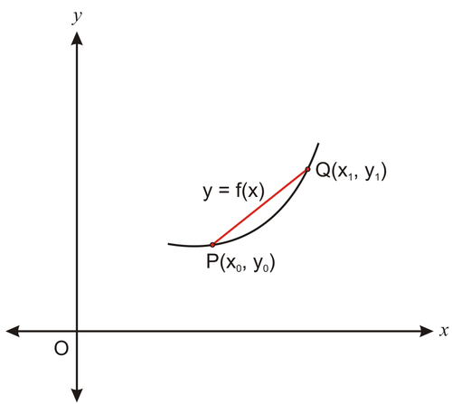

Now if we let the point $x_1$ approach $x_0, Q$ will approach $P$ along the graph $f$. Thus the slope of the secant line will gradually approach the slope of the tangent line as $x_1$ approaches $x_0$. Therefore (1) becomes

$$
\begin{align*}
m_{tan} =\lim_{x_1 \to x_0} \frac{f(x_1) - f(x_0)} {x_1 - x_0}.& &(2)
\end{align*}
$$

If we let $h = x_1 - x_0,$ then $x_1 = x_0 + h$ and $h \rightarrow 0$ becomes equivalent to $x_1 \rightarrow x_0$, so $(2)$ becomes

$$
m_{tan} =\lim_{h \to 0} \frac{f(x_0 + h) - f(x_0)} {h}.
$$

If the point $P(x_0, y_0)$ is on the curve $f$, then the tangent line at $P$ has a slope that is given by

$$
m_{tan} =\lim_{h \to 0} \frac{f(x_0 + h) - f(x_0)} {h}
$$

provided that the limit exists.

Therefore, slope of tangent to curve $f(x) = f^{\prime}(x)$ and, slope of normal to the curve $f(x) = -\frac{1}{f^{\prime}(x)}.$

Recall from algebra that the _point-slope_ form for the tangent line is given by

$$
y - y_0 = m_{tan}(x - x_0).
$$

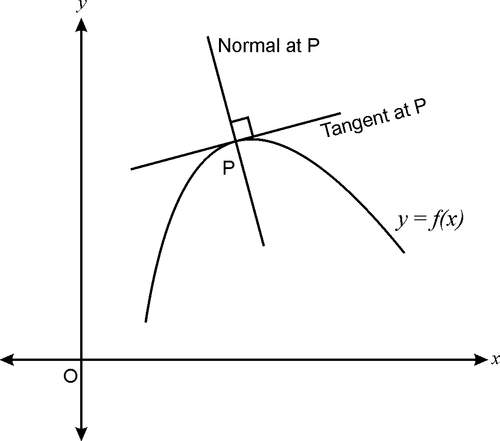

We know that Normal to any curve $y=f(x)$ is a line which is perpendicular to tangent to the curve.

We know, slope of tangent $=\frac{dy}{dx}$

Therefore, Slope of normal $=-\frac{dx}{dy}$

Therefore, Equation of normal at the point $(x_1, y_1)$ is $y-y_1 = -\left[\frac{dx}{dy}\right]_{(x_1, y_1)}(x-x_1)$

#### Example 1

Find the equation of the tangent line to the curve $f(x) = x^3$ passing through point $P(2, 8)$.

**Solution:**

$$
\begin{align*}
\begin{array}{rcl} \\
f(x) &=& x^3 \\
f^{\prime}(x) &=& 3x^2 \\
f^{\prime}(x)\ \text{at} \ (2, 8) &=& 3 \times 2^2 = 12
\end{array}{}
\end{align*}
$$

Thus the slope of the tangent line is 12. Using the point-slope formula, equation of tangent to $f(x)$ is

$$
y - 8 = 12(x - 2)
$$

or

$$
y = 12x - 16
$$

#### Example 2

If $f(x) = x^2 - 3,$ find the slope of the tangent line at $x = 2$ and $x = -1.$

**Solution:**

Since

To find the slope, we simply substitute $x = 2$ into the result $f^{\prime}(x)$,

$$
\begin{align*}
f'(x) &= 2x\\
f'(2) &= 2(2)\\
&= 4
\end{align*}
$$

and

$$
\begin{align*}
f'(x) &= 2x\\
f'(-1) &= 2(-1)\\
&= -2
\end{align*}
$$

Thus slopes of the tangent lines at $x = 2$ and $x = -1$ are 4 and -2, respectively.

#### Example 3

Find the equation of the tangent line to the curve $y = \frac{1}{x}$ that passes through the point $(1, 1)$.

**Solution:**

$y =\frac{1}{x} \ \text{so} \ y^{\prime} =\frac{-1}{x^2}$

Substituting $x = 1$,

$$
\begin{align*}
y' &= \frac{-1} {1}\\
&= -1.
\end{align*}
$$

Thus the slope of the tangent line at $x = 1$ for the curve $y = \frac{1}{x}$ is $m = -1.$ To find the equation of the tangent line, we simply use the point-slope formula,

$$
y - y_0 = m(x - x_0),
$$

where $(x_{0}, y_{0}) = (1, 1).$

$$
\begin{align*}
y - 1 &= -1 ( x - 1)\\
&= -x + 1 + 1\\
&= -x + 2,
\end{align*}
$$

which is the equation of the tangent line.

#### Example 4

Find the equation of the normal to the curve $x = a \cos^2 \theta, y=b \sin^2 \theta$ at $\theta = \frac{\pi}{4}$

**Solution:**

$$
\begin{align*}
\begin{array}{rcl}
\frac{dx}{d \theta} & = & -2 a \cos \theta \sin \theta \\
\\
\frac{dy}{d \theta} & = & 2b \sin \theta \cos \theta \\
\\
\frac{dy}{dx} & = & \frac{dy/d \theta}{dx/d\theta} = - \frac{b}{a}
\end{array}
\end{align*}
$$

Slope of normal = $-\frac{dx}{dy} = \frac{a}{b}$

Equation of normal to the curve at $\theta = \frac{\pi}{4}$ is

$$
\begin{align*}
\begin{array}{rcl}
y - y_1 & = & - \frac{dx}{dy} (x-x_1) \\ \\
\Rightarrow y -b \sin^2 \frac{\pi}{4} & = & \frac{a}{b} \left(x-a \cos^2 \frac{\pi}{4}\right) \\ \\
\Rightarrow y -\frac{b}{2} & = & \frac{a}{b} \left(x-\frac{a}{2}\right) \\ \\
\Rightarrow \frac{2y-b}{2} & = & \frac{a}{b} \left(\frac{2x-a}{2} \right) \\ \\
\Rightarrow b(2y-b) & = & a(2x-a) \\ \\
\Rightarrow 2by - b^2 & = & 2ax-a^2 \\ \\
\Rightarrow 2ax-2by - a^2+b^2 & = & 0. \\
\end{array}
\end{align*}
$$

---

#### Multimedia Links:

!?[Watch the video at](https://www.youtube.com/watch?v=FJ7AMaR9miI)

!?[Watch the video at](https://www.youtube.com/watch?v=C5G2Js2_Ep4)

</article>

### 6.5 Approximation

<article>

Let $y=f(x)$ be a real function.

Let $\triangle x$ denotes a small increment in $x$ then corresponding increment in $y$ is $\triangle y$, which is given by

$$
\triangle y = f(x+\triangle x) - f(x)
$$

Also,

$dy = \left(\frac{dy}{dx}\right) \triangle x$ or $dy = f^{\prime}(x) \cdot dx$

#### Example A

Use differentials to approximate (28)_1/3_.

**Solution:**

Let $y=x^{\frac{1}{3}}$ then $\frac{dy}{dx}=\frac{1}{3} x^{\frac{-2}{3}}$

Let $x=27$ and $\triangle x = 1$

Consider

$$
\begin{align*}
\begin{array}{rcl}
x^{\frac{1}{3}} & = & y \\
\\
\Rightarrow (x+\triangle x)^{\frac{1}{3}} & = & y + \triangle y \\
\\
\Rightarrow (28)^{\frac{1}{3}} & = & y + \frac{dy}{dx} \cdot \triangle x \\
\\
& = & x^{\frac{1}{3}} + \frac{1}{3} x^{\frac{-2}{3}} \cdot \triangle x \\
\\
& = & (27)^{\frac{1}{3}} + \frac{1}{3} (27)^{\frac{-2}{3}} \cdot 1 \\
\\
& = & 3 + \frac{1}{3} \times \frac{1}{9} =  3 + \frac{1}{27} = 3 + 0.037 \\
\\
& = & 3.037
\end{array}
\end{align*}
$$

#### Example B

Find the approximate value of $f(2.03)$, where $f(x) = x^2+2x+1$.

---

**Solution:**

Let $x=2$ and $\triangle x = 0.03$

Also

$$
\begin{align*}
\begin{array}{rcl}
\triangle y & = & f(x+\triangle x) - f(x) \\
\\
\Rightarrow f(x+\triangle x) & = & f(x) = \triangle y \\
\\
& = & f(x) + f^{\prime}(x) \triangle x \\
\\
\Rightarrow f(2.03) & = & (x^2+2x+1)+(2x+2)(0.03) \\
\\
& = & (4+4+1)+(4+2)(0.03) \ \ \ [\text{Put} \ x=2] \\
\\
& = & 9+6 \times(0.03) \\
\\
& = & 9+0.18 \\
\\
& = & 9.18 \\
\end{array}
\end{align*}
$$

#### Example C

Find the approximate change in the area $A$ of a square of side “$x$” metres caused by increasing the side by 2%.

**Solution:**

**

$$
\begin{align*}
\begin{array}{rcl}
A & = & x^2 \\
\\
dA & = & \left(\frac{dA}{dx}\right) \triangle x \\ \\
& = & 2x \cdot \triangle x \\ \\
& = & 2x (0.02x) \\ \\
& = & 0.04 x^2 \ m^2
\end{array}
\end{align*}
$$

**

Thus approximate change in the area is $0.04 x^2 \ m^2$.

#### Example D

If the radius of a sphere is measured as 7cm with an error of 0.04 cm, then find the approximate error in calculating its volume.

---

**Solution:**

Let $r$ be the radius of the sphere then $\triangle r$ be the error in radius.

Then $r =7 \ cm$ and $\triangle r = 0.04 \ cm$

Let Volume of Sphere be $V$.

$$
\begin{align*}
\begin{array}{rcl}
V & = & \frac{4}{3} \pi r^3 \\
\\
\frac{dv}{dr} & = & 4 \pi r^2 \\
\\
dv & = & \left(\frac{dv}{dr}\right) \triangle r = (4 \pi r^2) (0.04) \\
\\
& = & (4 \pi \cdot 7^2)(0.04) \\
\\
& = & 7.84 \pi \ cm^3 \\
\end{array}
\end{align*}
$$

Thus approximate error in calculating the volume is $7.84 \pi \ cm^3$.

</article>

### 6.6 Maxima and Minima

<article>

When riding a roller coaster there is always one point that is the absolute highest off the ground. There are usually many other places that reach fairly high, just not as high as the first. How do you identify and distinguish between these different peaks in a precise way? 

#### Watch This

!?[Watch the video at](https://www.youtube.com/watch?v=votVWz-wKeI)

#### Guidance

A global maximum refers to the point with the largest $y$ value possible on a function. A global minimum refers to the point with the smallest $y$ value possible. Together these two values are referred to as global extrema. There can only be one global maximum and only one global minimum. Global refers to entire space where the function is defined. Global extrema are also called absolute extrema.

In addition to global maximums and global minimums, there are also local extrema or relative maximums and relative minimums. The word relative is used because in relation to some neighborhood, these values stand out as being the highest or the lowest. 

Identify and categorize all extrema:

Since the function appears from the arrows to increase and decrease beyond the display, there are no global extrema. There is a local maximum at approximately (0, 3) and a local minimum at approximately (2.8, -7). 

#### Example B

Identify and categorize all extrema:

Since the function seems to abruptly end at the end points and does not go beyond the display, the endpoints are important.

There is a global minimum at (0, 0). There is a local maximum at (-1, 1) and a global maximum at (5, 5). 

---

#### Example C

Identify and categorize all extrema.

Since this function appears to increase to the right as indicated by the arrow there is no global maximum. There are not any other high points either, so there are no local maximums. There is only the end point at (0, 0) which is a global minimum.

##### Concept Problem Revisited

Maximums and minimums should be intuitive because they simply identify the highest points and the lowest points, or the peaks and the valleys, in a graph. There is a formal distinction about whether a maximum is the highest on some local open interval (does not matter how small), or whether it is simply the highest overall.

#### Guided Practice

1. Identify and categorize all extrema. 

1. There are no global or local maximums or minimums. The function flattens, but does not actually reach a peak or a valley. 

2. There are no global extrema. There appears to be a local maximum at (0, 0) and a local minimum at (1, -1). 

3. There are no global extrema. There appears to be a local maximum at (-1.2, 5.3) and a local minimum at (1.2, -1.8). These values are approximated. If a function was given, you would need to graph the function on a calculator and use the maximum and minimum features to identify more exact points.

Now we will learn to use derivatives to determine maximum and minimum values of any function.

#### First Derivative Test

Suppose that $f$ is a continuous function and that $x = c$ is a critical value of $f.$ Then:

1. If $f'$ changes from positive to negative at $x = c,$ then $f$ has a local maximum at $x = c.$

2. If $f'$ changes from negative to positive at $x = c,$ then $f$ has a local minimum at $x = c.$

3. If $f'$ does not change sign at $x = c,$ then $f$ has neither a local maximum nor minimum at $x = c.$

#### Second Derivative Test

Now we will discuss a property about the shapes of graphs called concavity, and introduce a method with which to study this phenomenon, the Second Derivative Test. This method will enable us to identify precisely the intervals where a function is either increasing or decreasing, and also help us to determine extreme values of the function.

#### Definition

A function $f$ is said to be **_concave upward_** on $[a, b]$ contained in the domain of $f$ if $f'$ is an increasing function on $[a, b]$ and **_concave downward_** on $[a, b]$ if $f'$ is a decreasing function on $[a, b].$

Here is an example that illustrates these properties.

#### Example 1

Consider the function $f(x) = x^3 - x$:

$ and concave up for all intervals in $(0, +\infty)$. Where do you think the concavity of the graph changed from concave down to concave up? If you answered at $x = 0$ you would be correct. In general, we wish to identify both the extrema of a function and also the points where the graph changes concavity. The following definition provides a formal characterization of such points.")

#### Definition

A point on a graph of a function $f$ where the concavity changes is called an **_inflection point_**.

The example above had only one inflection point. But we can easily come up with examples of functions where there is more than one point of inflection.

---

#### Example 2

Consider the function $f(x) = x^4 - 3 x^3 + x - 2.$

.")

In general we can use the following two tests for concavity and determining where we have relative maximums, minimums, and inflection points.

_**Test for Concavity**_

Suppose that $I$ is some interval $[a, b]$ in the domain of $f$ and that $f$ is continuous on $I$.

1. If $f''(x) > 0$ for all $x \in I,$ then the graph of $f$ is concave upward on $I.$

2. If $f''(x) < 0$ for all $x \in I,$ then the graph of $f$ is concave downward on $I.$

A consequence of this concavity test is the following test to identify extreme values of $f.$

_**Second Derivative Test for Extrema**_

Suppose that $f$ is a continuous function near $c$ and that $c$ is a critical value of $f.$ Then

1. If $f''(c) > 0,$ then $f$ has a relative minimum at $x = c.$

2. If $f''(c) < 0,$ then $f$ has a relative maximum at $x = c.$

3. If $f''(c) = 0,$ then the test is inconclusive and $x = c$ may be a point of inflection.

Recall the graph $f(x) = x^3.$ We observed that $x = 0,$ and that there was neither a maximum nor minimum. The Second Derivative Test cautions us that this may be the case since at $f''(0) = 0$ at $x = 0.$

So now we wish to use all that we have learned from the First and Second Derivative Tests to sketch graphs of functions. The following table provides a summary of the tests and can be a useful guide in sketching graphs.

---

|     |     |     |
| --- | --- | --- |
| **Signs of first and second derivatives** | **Information from applying First and**  **Second Derivative Tests** | **Shape of the graphs** |
| $f'(x) > 0$  $f''(x) > 0$ | $f$ is increasing  $f$ is concave upward |   \[Figure 10. |
| $f'(x) > 0$  $f''(x) < 0$ | $f$ is increasing  $f$ is concave downward |   \[Figure 11. |
| $f'(x) < 0$  $f''(x) > 0$ | $f$ is decreasing  $f$ is concave upward |   \[Figure 12. |
| $f'(x) < 0$  $f''(x) < 0$ | $f$ is decreasing  $f$ is concave downward |   \[Figure 13. |

Lets’ look at an example where we can use both the First and Second Derivative Tests to find out information that will enable us to sketch the graph.

#### Example 3

Let’s examine the function $f(x) = x^5 - 5x + 2.$

1. Find the critical values for which $f'(c) = 0.$

$f'(x) = 5x^4 - 5 = 0,$ or

$x^4 - 1 = 0$ at $x = \pm 1.$

Note that $f''(x) = 20 x^3 = 0$ when $x = 0.$

2. Apply the First and Second Derivative Tests to determine extrema and points of inflection.

We can note the signs of $f'$ and $f''$ in the intervals partitioned by $x = \pm 1, 0.$

---

| **_Key intervals_** | **$f'(x)$** | **$f''(x)$** | **_Shape of graph_** |
| --- | --- | --- | --- |
| $x < -1$ | $+$ | $-$ | Increasing, concave down |
| $-1 < \times < 0$ | $-$ | $-$ | Decreasing, concave down |
| $0 < \times < 1$ | $-$ | $+$ | Decreasing, concave up |
| $x > 1$ | $+$ | $+$ | Increasing, concave up |

Also note that $f'' (-1) = - 20 < 0.$ By the Second Derivative Test we have a relative maximum at $x = -1,$ or the point $(-1, 6).$

In addition, $f'' (1) = 20 > 0.$ By the Second Derivative Test we have a relative minimum at $x = 1,$ or the point $(1, -2).$ Now we can sketch the graph.

Consider the following example: you run a business making boxes of cookies. While you earn money by selling cookies, it costs you money to construct every box. (These costs include the materials, as well as all of the costs to run the business, such as paying your employees!)

As the owner of the business, you will want to **maximize** your profits, and you will want to **minimize** your costs. That is, you want to make the most money that you can, while spending as little as you can in the process. In this chapter you will examine situations in which you will want to maximize or minimize some quantity. You will learn how to identify maxima and minima by writing functions to represent situations, and by examining the graphs of these functions.

#### Min-Max situations

In the example above, one quantity would be maximized, while the other would be minimized. In general, however, not every situation would necessarily include both of these ideas. For example, consider a situation in which you want to make a box that has a volume of 12 cm_3_, but you want the surface area of the box to be as small as possible.

You might also have a situation in which you are given a fixed amount of material with which to make the box, and you want to make as _large_ a box as possible. In this situation, you would want to find the _maximum_ volume of the box, given a fixed surface area.

Whether you will be looking for a maximum or a minimum depends on the specific situation. Consider the situations in example 1.

#### Example 1

In each situation determine if a quantity should be maximized or minimized.

a) You have 100 m of fence to enclose a field, and you want to create the largest field possible.

b) You run a factory that packages toilet paper, and you want to use the least amount of plastic possible for each roll.

**Solution:**

a) This situation involves maximizing the area of the field.

b) This situation involves minimizing the amount of plastic used per roll. (This would be the surface area of a cylinder.)

#### Expressions to be minimized or maximized

Consider the example above of the box with volume 12 cm_3_. The volume of a box is the product of its three dimensions: length, width, and height. So we can express the volume of the box as an equation: _LWH_ \= 12. There are infinitely many boxes with volume 12. Three possible boxes are shown below:

Let’s consider a slightly simpler situation: a box with a square base and a fixed volume of 12 cm_3_. Now let the length and the width of the box be _x_ cm, and the height be _h_ cm. We can write the volume equation as $x \cdot x \cdot h = x^{2}h=12$. We can also express the surface area in terms of _x_ and _h_:

$$
\,\! \text{Surface area} = S = 4xh+2x^{2}
$$

(Make sure you understand this formula: The base and the top are squares with area = $x^{2}$ and the four sides are each rectangles of area equal to $xh$ ).

We can express the surface area as a function of $x$ if we consider the volume equation and the surface area equation as a system of equations:

__$$
\begin{cases}
x^2h = 12 \\
4xh + 2x^2 = S \\
\end{cases}
$$__

$$
\begin{cases}
x^2h = 12 \\
4xh + 2x^2 = S \\
\end{cases}
$$

We want to work with the surface area equation since that is what we want to minimize. However, there are currently three variables in that equation: _S_, _x_, and _h_. It will be easier to graph and analyze surface area if we can express _S_ in terms of just one other variable. So, we want to use substitution to get rid of one of the variables. We can use the volume equation to rewrite the surface area equation as a function of _x_.

First, rewrite the volume equation:

$$
x^2h = 12 \Rightarrow h = \frac{12} {x^2}
$$

Now, use substitution:

$$
\begin{align*}
S(x)&=4xh+2x^{2}\\
&=4x \left( \frac{12}{x^2}\right) +2x^{2}\\
&=\frac{48}{x}+2x^{2}
\end{align*}
$$

The values of the function _S_(_x_) represent different possibilities for the surface area of the box, given that the base is a square, and given that the volume of the box is 12 cm_3_. Therefore to identify the minimum surface area, we need to find the lowest function values for _S_(_x_). When you study calculus, you will learn algebraic techniques for determining maximum and minimum values of a function. Here, we will rely on our knowledge of graphing to identify the minimum value of _S_(_x_).

The graph below shows the function _S_(_x_) on the interval \[0,5\]. It is important to note that the function _S_(_x_) has the domain of all real numbers except zero, but we are only interested in _x_ values greater than zero since _x_ represents the side length of the box.

. This tells us that when the side length of the box is approximately 2.3 cm, the surface area is approximately 31.4 cm_2_, which is the smallest it can be.")

The example below asks you to find a maximum value.

**Example 2**

You have 100 m of fence with which to enclose a plot of land on the side of a barn. You want the enclosed land to be a rectangle. What size rectangle should you make with the fence in order to maximize the area of the rectangular enclosure?

**Solution:**

The plot of land will look like the picture below:

 = _xh_. We can eliminate _h_ from the equation if we consider that we have 100 m of fence, and we write an equation about how we are using that 100 m of fence: _x_ \+ 2_h_ \= 100. (The fourth side of the rectangle does not require fence because of the barn.) We can solve this equation for _h_ and substitute into the area equation:")

$$
\begin{align*}
A(x) &= xh \\
&= x \left( 50 - \frac{x} {2} \right) \\
&= 50x-\frac{x^2}{2}
\end{align*}
$$

The graph of _A_(_x_) is shown here on the interval \[0,100\]. Using a maximum function on a graphing utility tells us that the point (50,1250) is the maximum point. This tells us that when the rectangle’s width is 50 m, the area is 1250 m_2_.

=\frac{48}{x}+2x^{2}$ and $A(x)=50x-\frac{x^2}{2}$ for all real values of _x_, you will notice a difference in their graphs: the point we identified on _A_(_x_) is the highest point the function has on its entire domain. This is not the case for _S_(_x_). In the next lesson we will consider more functions like _S_(_x_). In the remainder of this lesson we will consider functions like _A_(_x_).")

#### Symbolic definition of minimum

Consider the function $f(x)=x^{2}-5$. If you graph this function, you should see that the point (0, -5) is the lowest point on the graph. Even if we greatly increase the interval on which we view the graph, this point will always be the lowest point.

We formally define the minimum point of a function as follows: The point (_c, f_(_c_)) is the minimum value of a function if _f_(_c_) ≤ _f_(_a_) for all elements _a_ (_a_ ≠ _c_) of the domain of _f_. Simply put: the point (_c, f_(_c_)) is the minimum if all other function values are greater than or equal to _f_(_c_).

We can define the maximum of a function in a similar manner.

#### Symbolic definition of maximum

The function $A(x)=50x-\frac{x^2}{2}$ has a **global maximum** at the point (50, 1250). Formally we can define the maximum of a function as follows: The point (_c_, _f_(_c_)) is the maximum of _f_(_x_) if _f_(_c_) ≥ _f_(_a_) for all elements a (_a_ ≠ _c_) of the domain of _f_. Simply put: the point (_c_, _f_(_c_)) is the maximum if all other function values are less than or equal to _f_(_c_).

Together, maximum and minimum points are called **extrema.** It is important to note that not all functions have extrema.

#### Example 3

Determine if each function has a minimum or a maximum point

a) $y=2x-1$

b) $y=x^4$

**Solution:**

a) The graph of _y_ \= 2_x_ \- 1 is a line. It does not have a maximum or a minimum.

b) The graph of _y_ \= _x__4_ has a minimum value at (0,0). It does not have a maximum.

#### Example 4

An architect wants to make a large window in a hall to admit maximum light and air. Find the dimensions of the window if its perimeter is 6 m and window has shape of an equilateral triangle whose base is fixed on a rectangle.

**Solution:**

Let sides of the rectangle be “$x$” and “$y$” units and let side of the equilateral triangle be “$x$” units.

Perimeter of the window = 6

$$
\begin{align*}
\begin{array}{rcl}
\Rightarrow 2y+3x & = & 6 \\
\Rightarrow y & = & \frac{6-3x}{2} \quad \ldots \quad (1) \\
\end{array}
\end{align*}
$$

Let $A$ be the area of the window.

$$
\begin{align*}
\begin{array}{rcl}
A & = & xy + \frac{\sqrt{3}}{4} x^2 \\ \\
& = & x \left(\frac{6-3x}{2}\right) + \frac{\sqrt{3}}{4} x^2 \qquad  \left[ \text{Using } (1)\right] \\ \\
A & = & 3x - \frac{3}{2}x^2 + \frac{\sqrt{3}}{4} x^2 \\ \\
\frac{dA}{dx} & = & 3 - 3x + \frac{\sqrt{3}}{2} x
\end{array}
\end{align*}
$$

For maxima or minima,

$$
\begin{align*}
\begin{array}{rcl}
\frac{dA}{dx} & = & 0 \\ \\
\Rightarrow 3-3x+\frac{\sqrt{3}}{2} x & = &  0 \\ \\
\Rightarrow 3x - \frac{\sqrt{3}}{2} x & = & 3 \\ \\
\Rightarrow x & = & \frac{3}{3 - \frac{\sqrt{3}}{2}} \\ \\
\Rightarrow x & = & \frac{6}{6-\sqrt{3}} \longrightarrow \text{ Critical Point}
\end{array}
\end{align*}
$$

$\frac{d^2A}{dx^2} = -3 + \frac{\sqrt{3}}{2} < 0$

$\frac{d^2A}{dx^2} \bigg ]_x = \frac{6}{6 - \sqrt{3}} < 0 \Rightarrow A$ is maximum at $x = \frac{6}{6-\sqrt{3}}$

Also, $y = 3 - \frac{3}{2} \left(\frac{6}{6-\sqrt{3}}\right) = 3 - \frac{9}{6-\sqrt{3}} = \frac{18-3\sqrt{3}-9}{6-\sqrt{3}} = \frac{9-3\sqrt{3}}{6-\sqrt{3}}$

Hence dimensions of the window are $\frac{6}{6-\sqrt{3}}$ and $\frac{9-3\sqrt{3}}{6-\sqrt{3}}$ units.

#### Review Questions

1. Find all extrema using the Second Derivative Test. $f(x) =\frac{x^2} {4} + \frac{4} {x}$

2. Consider $f(x) = x^2 + ax + b,$ with $f(1) = 3.$

a) Determine $a$ and $b$ so that $x = 1$ is a critical value of the function $f.$

b) Is the point $(1, 3)$ a maximum, a minimum or neither?

In problems #3–6, find all extrema and inflection points.

3. $f(x) = x^3 + x^2$

4. $f(x) = \frac{x^2 +3} {x}$

5. $f(x) = x^3 - 12x$

6. $f(x) = -\frac{1} {4} x^4 + 2x^2$

7. What quantity should be maximized? What quantity should be minimized? You are manufacturing chairs, and it costs you a certain amount of money to make each chair. You need to determine the selling price of the chairs.

8. A rectangle has area 20 in_2_. Write an expression for the perimeter of the rectangle as a function of its width _x_.

9. What dimensions of the rectangle in problem #2 will minimize its perimeter? What is the minimum perimeter? (These values will be approximations.)

10. A rectangle has a perimeter of 24 cm. What is the maximum area the rectangle can have?

11. A cylindrical canister has a volume of 30 cm_3_. What is the radius of the canister with minimum surface area? (Volume of a cylinder is $V=\pi r^{2} h$)

12. Consider the function _f_(_x_) = _bx__2_ + 7. For what values of _b_ will the function have a maximum?

13. Consider the function $S(x)=\frac{48}{x}+2x^{2}$. How can you tell that this function does not have a global maximum or minimum?

</article>

### 6.7 Summary

<article>

#### Points to Remember

Let $I$ be an open interval contained in the domain of a real valued function. Then $f$ is said to be

* **Increasing** on I, if $x_1 < x_2 \Rightarrow f(x_1) \le f(x_2), \forall x_1, x_2 \in I$
* **Strictly increasing** on I, if $x_1 < x_2 \Rightarrow f(x_1) < f(x_2), \forall x_1, x_2 \in I$
* **Decreasing** on I, if $x_1 < x_2 \Rightarrow f(x_1) \ge f(x_2), \forall x_1, x_2 \in I$
* **Strictly decreasing** on I, if $x_1 < x_2 \Rightarrow f(x_1) > f(x_2), \forall x_1, x_2 \in I$

Let $f$ be a continuous function in the closed interval $[a, b]$ and differentiable in the open interval $(a, b)$ then

* $f$ is **increasing** in $[a, b] \ \text{if} \ f^{\prime} (x) > 0, \forall x \in (a, b)$
* $f$ is **decreasing** in $[a, b] \ \text{if} \ f^{\prime}(x) < 0 , \forall x \in (a, b)$
* $f$ is a **constant function** in $[a, b] \ \text{if} \ f^{\prime} (x) = 0, \forall x \in (a, b)$

If for a given interval $I \subseteq R$ function $f$ increases for some values in $I$ and decreases for the other values in $I$, then we say that function is neither increasing nor decreasing.

For the curve $y=f(x), \frac{dy}{dx}$ represents, geometrically, the **slope of the tangent** to the curve and $-\frac{dx}{dy}$, the **slope of the normal** to the curve.

If $\frac{dy}{dx}=0$ then tangent is parallel to $x$\-axis and vice – versa.

If $\frac{dy}{dx}$ is not defined than tangent is parallel to $y$\-axis or vice – versa.

**Equation of the tangent** to the curve $y=f(x)$ at $(x_1, y_1)$ is $y-y_1 = \frac{dy}{dx} (x-x_1)$

**Equation of the normal** to the curve $y=f(x)$ at $(x_1, y_1)$ is $y-y_1=-\frac{dx}{dy}(x-x_1)$

For **approximating** values, $y+\triangle y=y+\frac{dy}{dx} \triangle x$

Let $f$ be a function defined in the closed interval $I$. If there exists a point in the interval such that $f(a) \ge f(x), \forall x \in I$, then $f$ has **absolute maximum** at $a$; $f(a) \le f(x), \forall x \in I$, then $f$ has **absolute minimum** at $a$.

Let $f$ be a real valued function, If $f$ has a local maximum or local minimum at $x=a$ then either $f^{\prime}(a)$ or $f$ is not differentiable at $x=a$.

#### First Derivative Test:

Let $f$ be a function defined on an open interval $I$ and $f$ be continuous at a critical point $c$ in $I$. Then

(i) If $f^{\prime}(x)$ changes sign from positive to negative as $x$ increases through $c$ then $c$ is a point of local maxima.

(ii) If $f^{\prime}(x)$ changes sign from negative to positive as $x$ increases through $c$ then $c$ is a point of local minima.

(iii) If $f^{\prime}(x)$ does not change sign as $x$ increases through $c$, then $c$ is called point of inflection.

---

#### Second Derivative Test:

Let $f$ be a function defined on an interval $I$ and $c \in I$. Let $f$ be twice differentiable at $c$ then

(i) $x=c$ is a point of local maxima if $f^{\prime}(c)=0$ and $f^{{\prime}{\prime}}(c) < 0$ and $f(c)$ is local maxima value of $f$.

(ii) $x=c$ is a point of local minima if $f^{\prime}(c)=0$ and $f^{{\prime}{\prime}}(c)>0$ and $f(c)$ is local minimum value of $f$.

(iii) the test fails if $f^{\prime}(c)=0$ and $f^{{\prime}{\prime}}(c)=0$

#### Mensuration Formulae:

|     |     |     |     |
| --- | --- | --- | --- |
| **S.No.** | **Figure** | **Area** | **Perimeter** |
| 1   | Square | (side) × (side) | 4(side) |
| 2   | Rectangle | Length × Breadth | 2(length + breadth) |
| 3   | Circle | $\pi r^2$, $r$ is radius of circle | $2 \pi r$, $r$ is radius of circle |
| 4   | Triangle | $\frac{1}{2}$ (base × height) | Sum of boundaries |

|     |     |     |     |     |     |
| --- | --- | --- | --- | --- | --- |
| **S.No.** | **Figure** | **Dimensions** | **Volume** | **Curved surface area** | **Total surface area** |
| 1   | Cuboid | l = length, b = breadth, h = height | $lbh$ | $2(l + b)h$ | $2(lb + bh + lh)$ |
| 2   | Cube | a = length of edge | ${a}^{3}$ | $4a^2$ | $6a^2$ |
| 3   | Cylinder | r = base radius, h = height | $\pi r^2 h$ | $2 \pi rh$ | $2 \pi r (r+h)$ |
| 4   | Cone | r = base radius, h = height , l = slant height | $\frac{1}{3} (\pi r^2 h)$ | $\pi r l$ | $\pi r (l+r)$ |
| 5   | Sphere | r = radius | $\frac{4}{3} \pi r^3$ | \-  | $4 \pi r^2$ |
| 6   | Hemi-sphere | r = radius | $\frac{2}{3} \pi r^3$ | $2 \pi r^2$ | $3 \pi r^2$ |

</article>

### 6.8 Self Assessments

<article>

#### 1. Rate of Change of Quantities

http://www.ck12.org/calculus/Related-Rates/asmtpractice/Related-Rates-Practice/?referrer=concept_details

#### 2. Increasing & Decreasing Functions

http://www.ck12.org/book/CK-12-Calculus-Concepts/section/4.4/

#### 3. Tangents & Normals

[https://www.khanacademy.org/math/differential-calculus/derivative\_applications/normal-tangent-line-eq/](https://www.khanacademy.org/math/differential-calculus/derivative_applications/normal-tangent-line-eq/e/applications-of-derivatives--tangent-and-normal-lines)

#### 4. Maxima & Minima

http://www.ck12.org/calculus/Approximation-Errors/asmtpractice/Approximation-Errors-Practice/?referrer=concept_details

#### 5. Previous Years' Boards Questions

1. Show that the semi-vertical angle of the cone of the maximum volume and of given slant height is $\cos^{-1} \frac{1}{\sqrt{3}}$. \[CBSE (DELHI) 2014\]

2. Find the intervals in which the function $f(x)=3x^4 - 4x^3 - 12x^2 + 5$ is

i) strictly increasing and

ii) strictly decreasing. \[CBSE (DELHI) 2014\]                                                                                          

3. Find the equations of the tangent and normal to the curve $x=a \sin^3 \theta$ and $y=a \cos^3 \theta$ at $\theta = \frac{\pi}{4}$. \[CBSE (DELHI) 2014\]

4. Show that the altitude of the right circular cone of maximum volume that can be inscribed in a sphere of radius $r$ is $\frac{4r}{3}$. Also show that the maximum volume of the cone is $\frac{8}{27}$ of the volume of the sphere. \[AICBSE 2014, CBSE(FORIEGN) 2013, 2012\]

5. Find the value (s) of $x$ for which $y=[x(x-2)]^2$ is an increasing function. \[AICBSE 2014\]

6. Find the equations of the tangent and normal to the curve $\frac{x^2}{a^2} - \frac{y^2}{b^2} = 1$ at the point $\left(\sqrt{2}a, b \right)$. \[AICBSE 2014\]

7. Prove that the height of the cylinder of maximum volume that can be inscribed in a sphere of radius $R$ is $\frac{2R}{\sqrt{3}}$. Also, find the maximum value. \[AICBSE 2014, DELHI 2013\]

8. If the sum of the lengths of the hypotenuse and a side of a right triangle is given, show that the area of the triangle is maximum when the angle between them is $60^ \circ$. \[AICBSE 2014\]

9. Show that the normal at any point $\theta$ to the curve $x =a \cos \theta + a \sin \theta$, $y= a \sin \theta - a \cos \theta$ is at a constant distance from the origin. \[CBSE(FOREIGN) 2013\]

10. Find the equations of tangent to the curve $3x^2-y^2=8$, which pass through the point $\left(\frac{4}{3},0 \right)$. \[CBSE (OUTSIDE DELHI) 2013\]

11. Find the equations of tangent and normal at a point on the curve $x^2 = 4y$ which pass through the point (1, 2). \[CBSE (DELHI) 2013\]

12. Find the area of the greatest rectangle that can be inscribed in an ellipse $\frac{x^2}{a^2}+\frac{y^2}{b^2}=1$. \[CBSE (OUTSIDE DELHI) 2013\]

13. A ladder 5 m long is leaning against a wall. The bottom of the ladder is pulled along the ground, away from the wall, at the rate of 2 cm/s, How fast is its height on the wall decreasing when the foot of the ladder is 4 m away form the wall? \[AICBSE 2012\]

14. Prove that the radius of the right circular cylinder of greatest curved surface area which can be inscribed in a given cone is half of that of the cone. \[AICBSE 2012\]

15. An open box with a square base is to be made out of a given quantity of cardboard of area c_2_ sq.units. Show that the maximum volume of the box is $\frac{c^3}{6 \sqrt{3}}$ cubic units. \[AICBSE 2012\]

16. Find the point on the curve $y=x^3 - 11x + 5$ at which the equation of the tangent is $y=x-11$. \[CBSE(DELHI) 2012\]

17. Using differentials, find the approximate value of $\sqrt{49.5}$. \[CBSE (DELHI) 2012\]

18. Show that the height of a closed right circular cylinder of given surface and maximum volume is equal to the diameter of its base. \[CBSE (DELHI) 2012\]

19. Show that $y=\log (1+x)-\frac{2x}{2+x}, x>-1$, is an increasing function of $x$ throughout its domain. \[CBSE (FOREIGN) 2012\]

20. Find the equation of the normal at the point $(am^2, am^3)$ for the curve $ay^2=x^3$. \[CBSE (FOREIGN) 2012\]

21. Prove that $y=\frac{4 \sin \theta}{2+\cos \theta} - \theta$ is an increasing function in $\left[0, \frac{\pi}{2} \right]$. \[AICBSE 2011\]

22. If the radius of a sphere is measured as 9 cm with an error of 0.03 cm, then find the approximate error in calculating its surface area. \[AICBSE 2011\]

23. Show that the right circular cone of least curved surface and given volume has an altitude equal to $\sqrt{2}$ times the radius of the base. \[AICBSE 2011\]

24. A window has the shape of a rectangle surmounted by an equilateral triangle. If the perimeter of the window is 12 m, find the dimensions of the rectangle that will produce the largest area of the window. \[AICBSE 2011\]

25. Sand is pouring from a pipe at the rate of 12 cm_3_/s. The falling sand forms a cone on the ground in such a way that the height of the cone is always one-sixth of the radius of the base. How fast is the height of the sand cone increasing when the height is 4 cm? \[CBSE (DELHI) 2011\]

26. Find the points of the curve $x^2+y^2-2x-3 = 0$ at which the tangents are parallel to $x$\-axis. \[CBSE (DELHI) 2011\]

27. Show that of all the rectangles inscribed in a given fixed circle, the square has the maximum area. \[CBSE (DELHI) 2011\]

28. Find the equation of the tangent to the curve $y=\frac{x-7}{(x-2)(x-3)}$ at the point, where it cuts the $x$\-axis. \[CBSE (DELHI) 2010\]

29. Find the intervals in which the function $f(x)= \sin x -\cos x$, $0 \le x \le 2 \pi$ is strictly increasing or decreasing. \[CBSE (DELHI ) 2010\]

30. If the length of three sides of a trapezium other than base is 10 cm each, find the area of the trapezium, when it is maximum. \[AICBSE 2010\]

</article>

### 6.9 Home Assignments

<article>

#### 1. Rate of Change of Quantities

NCERT Exercise No. 6.1

Q. No. 2, 4, 6, 9, 12, 15, 17, 18

#### 2. Increasing and Decreasing Functions

NCERT Exercise No. 6.2

Q. No. 2, 4, 5, 11, 13, 17, 18

#### 3. Tangents and Normals

NCERT Exercise No. 6.3

Q. No. 2, 4, 8, 11, 14, 20, 22, 25, 27

#### 4. Approximations

NCERT Exercise No. 6.4

Q. No. 1- ii, v, vii, x, xii, xiv , 3, 5, 11, 19

#### 5. Maxima and Minima

NCERT Exercise No. 6.5

Q. No. 3, 6, 7, 10, 12, 13, 16, 18, 21

#### 6. Miscellaneous Questions

NCERT Miscellaneous Exercise

Q. No. 1, 4, 6, 7, 10, 13, 14, 15

</article>

## 7.0 Definite Integrals

### 7.1 Introduction

<article>

By now, you are well versed with the geometrical meaning of indefinite integration. You have also learned various techniques for evaluation of integrals. You have learned many formulae as well. But have you ever thought of evaluation of integrals within specified limits? What may be geometrical interpretation of such Integrals? What will happen to constant of integration “c” in such cases? All these questions will be answered after studying this chapter.

All such integrals which are calculated within specified limits are called “Definite Integrals”. In this chapter, you will not only learn geometrical interpretation of definite integrals but will also learn to calculate them by using specific methods, substitution method, use of its properties for evaluation of integrals.

</article>

### 7.2 Definite Integrals as the Limit of a Sum

<article>

Approximating the area under a function curve by summing a finite number of rectangles in a Riemann Sum can yield very accurate results. Intuitively, we know, however, that the more sub-intervals we have the better the result. Taking the limit of the Riemann Sum as the subintervals get smaller (number of rectangles gets larger) should asymptotically give the true area. For some function curves, the Riemann limit can be evaluated algebraically; for complex curves, the area can only be determined by brute force numerical computations of Riemann Sums.

#### Watch This

!?[Watch the video at](https://www.youtube.com/watch?v=gFpHHTxsDkI)

!?[Watch the video at](https://www.youtube.com/watch?v=GE4OLfmJ8P8)

**Definition**

If $f$ is continuous on $[a,b]$, and:

1. The interval $[a,b]$ is divided into $n$ sub-intervals of equal width $\triangle x$, with $\triangle x=\frac{b-a}{n}$, and

2. The endpoints of these sub-intervals are $x_0=a,x_1,x_2,..., x_n=b$, and

3. $x_1^*,x_2^*, \ldots ,x_n^*$ are _any_ sample points in these sub-intervals, then the **_definite integral_** of $f$ from $x=a$ to $x=b$ is

$$
\int\limits_{a}^{b}f(x)dx=\lim_{n \to \infty} \sum_{i=1}^n f(x_i^*) \triangle x.
$$

provided the limit exists.

If the above limit exists, $f$ is said to be integrable on the closed interval $[a,b]$ and the definite integral exists. This method is called **Evaluation of Definite Integrals** as Limit of a Sum.

Note: The sample point $x_i^*$ can be any sample point in the $i$\-th sub-interval, with common choices being right, or mid-point, or left.

**Let’s check out this more workable formula for evaluation of definite integrals as limit of a sum:**

$$
\int\limits_a^b f(x)dx=(b-a) \lim\limits_{n \to \infty} \frac{1}{n} [f(a)+f(a+h)+f(a+2h)+ \ldots + f(a+\overline{n-1} h)]
$$

Where $h=\frac{b-a}{n} \rightarrow 0 \text{ as } n \rightarrow \infty$

Or, $\int\limits_a^b f(x)dx=\lim\limits_{h \to 0} h[f(a)+f(a+h)+f(a+2h)+ \ldots + f(a+ \overline{n-1}h)]$

Use the following results whichever is required:

i) $1+2+3+ \ldots + n=\frac{n(n+1)}{2} \Rightarrow 1+2+3+ \ldots +(n-1)=\frac{n(n-1)}{2}$

ii) $1^2+2^2+3^2+ \ldots + n^2=\frac{n(n+1)(2n+1)}{6} \Rightarrow 1^2+2^2+3^2+ \ldots +(n-1)^2=\frac{n(n-1)(2n-1)}{6}$

iii) $1^3+2^3+3^3+ \ldots + n^3=\left[\frac{n(n+1)}{2} \right]^2 \Rightarrow 1^3+2^3+3^3+ \ldots +(n-1)^3=\left[\frac{n(n-1)}{2} \right]^2$

iv) Sum of $n$ terms of 

$$
\begin{align*}
G.P=S(n) =
\begin{cases}
\frac{a(1-r^n)}{1-r}, r < 1 & \\
\frac{a(r^n-1)}{r-1}, r > 1 &
\end{cases}
\end{align*}
$$

, where $a$ is first term and $r$ is common ratio of G.P.

v) $\lim\limits_{h \to 0} \frac{e^h-1}{h}=1$

#### Example A

Evaluate $\int\limits_{0}^{3} x^3 dx$ as limit of a sum.

**Solution:**

We need to find $\int\limits_0^3 x^3 dx=\lim\limits_{n \to \infty} \sum\limits_{i=1}^n f(x_i^*) \triangle x$.

We will use right endpoints to compute the integral. First need to divide \[0, 3. into $n$ sub-intervals of length $\triangle x=\frac{3-0}{n}=\frac{3}{n}$. Since we are using right endpoints, $x_0=0,x_1=\frac{3}{n}, x_2=\frac{6}{n}, \ldots , x_i=\frac{3i}{n}.$

The definite integral is then evaluated as follows:

$$
\begin{align*}
\int\limits_{0}^{3} x^3 dx&= \lim_{n \to \infty} \sum_{i=1}^n f(x_i^*) \triangle x. \qquad \ \ldots \text{The definite integral as the limit of Riemann sum.} \\
&= \lim_{n \to \infty} \sum_{i=1}^n f \left(\frac{3i}{n} \right) \left(\frac{3}{n} \right) \quad \ldots \text{Use sub-intervals of equal length and right side endpoints.} \\
&= \lim_{n \to \infty} \left(\frac{3}{n} \right)
\sum_{i=1}^n \left(\frac{3i}{n} \right)^3 \\
&= \lim_{n \to \infty} \left(\frac{3}{n} \right)^4 \sum_{i=1}^n i^3 \qquad \quad \ldots \text{Makes use of the following:} \\
&= \lim_{n \to \infty} \left(\frac{3}{n} \right)^4 \left(\frac{n(n+1)}{2} \right )^2  \sum_{i=1}^n i^3=\left(\frac{n(n+1)}{2} \right)^2 \\
&= \left (\frac{3^4}{4} \right) \cdot \lim_{n \to \infty} \left(\frac{1}{n^4} \right) \left(\frac{n(n+1)}{1} \right)^2 \\
&= \left (\frac{3^4}{4} \right) \cdot \lim_{n \to \infty} \left(1+ \frac{1}{n} \right)^2 \\
\int\limits_{0}^{3} x^3 dx &=\left (\frac{3^4}{4} \right)
\end{align*}
$$

Hence $\int\limits_0^3 x^3 dx=\frac{81}{4}$.

Notice that the value $x=3$, could have be some $x=c$, where $c$ is a constant $> 0$, so that we would have $\int\limits_0^c x^3 dx=\frac{c^4}{4}$.

**Alternate Method:**

To evaluate $\int\limits_0^3 x^3 dx$ as the limit of a sum,

We have, $f(x)=x^3, a=0, b=3, nh=b-a=3-0=3$

$f(a)=0, f(a+h)=f(h)=h^3, f(a+2h)=(2h)^3, f(a+(n-1)h)=(n-1)^3h^3$

$$
\begin{align*}
\begin{array}{rcl}
\int\limits_0^3 x^3 dx &=& \lim\limits_{h \to 0} h[0+h^3+2^3 h^3+ \ldots + (n-1)^3 h^3] \\
&=& \lim\limits_{h \to 0} h[h^3 \{1^3+2^3 + 3^3+ \ldots + (n-1)^3 \}] \\
&=& \lim\limits_{h \to 0} h^4 \left[\frac{n(n-1)}{2} \right]^2 \\
&=& \lim\limits_{h \to 0} \left[\frac{nh(nh-h)}{2} \right]^2 \\
&=& \lim\limits_{h \to 0} \left[\frac{3(3-h)}{2} \right]^2 \\
&=& \frac{3^4}{2^2} \\
&=& \frac{81}{4}
\end{array}
\end{align*}
$$

#### Guided Practice

Evaluate definite integral of $f(x)$ as limit of a sum, where $f(x)=3x^2-x+7$ over the interval \[0, 1\].

**Solution:**

We need to find $\int\limits_0^1 (3x^2-x+7)dx=\lim\limits_{n \to \infty} \sum\limits_{i=1}^n f(x_i^*) \triangle x$

We will use right endpoints to compute the integral. First divide \[0, 1. into $n$ sub-intervals of length $\triangle x=\frac{1-0}{n}=\frac{1}{n}$. Since we are using right endpoints, $x_0=0,x_1=\frac{1}{n},x_2=\frac{2}{n},...,x_i=\frac{i}{n}$. 

The definite integral is then evaluated as follows:

$$
\begin{align*}
\int\limits_0^1 (3x^2-x+7)dx &=\lim_{n \to \infty} \sum_{i=1}^n f(x_i^*) \triangle x. \quad \ldots \text{The definite integral as the limit of Riemann sum}. \\
\int\limits_0^1 (3x^2-x+7)dx &= \lim_{n \to \infty} \sum_{i=1}^n f(x_i^*) \triangle x. \quad \ldots \text{The definite integral as the limit of Riemann sum.} \\
&=\lim_{n \to \infty} \sum_{i=1}^n f \left(\frac{i}{n} \right) \frac{1}{n} \quad \  \ \ldots \text{Use sub-intervals of equal length and right side endpoints.} \\
&=\lim_{n \to \infty} \left(\frac{1}{n} \right) \sum_{i=1}^n \left[3 \left(\frac{i}{n} \right)^2- \left(\frac{i}{n} \right)+7 \right] \\
&=\lim_{n \to \infty} \left[3 \left(\frac{1}{n} \right)^3 \sum_{i=1}^n i^2 - \left(\frac{1}{n} \right)^2 \sum_{i=1}^n i+ \left(\frac{7}{n} \right) \sum_{i=1}^n 1 \right] \quad \ldots \text{Makes use of the following:} \\
&=\lim_{n \to \infty} \left[\frac{3}{n^3} \left(\frac{n^3}{3}+ \frac{n^2}{2}+ \frac{n}{6} \right)- \frac{1}{n^2} \left(\frac{n^2}{2}+ \frac{n}{2} \right)+ \left(\frac{7}{n} \right) n \right] \quad \quad \sum_{i=1}^n i=\frac{n(n+1)}{2} \ \text{and} \\
&= \lim_{n \to \infty} \left[1+ \frac{3}{2n}+ \frac{1}{2n^2}- \frac{1}{2}- \frac{1}{2n}+7 \right]  \quad \quad \sum_{i=1}^n i^2=\left(\frac{n(n+1)(2n+1)}{6} \right) \\
&= \lim_{n \to \infty}\left[7.5+ \frac{1}{n}+ \frac{1}{2n^2} \right] \\
\int\limits_{0}^{1}(3x^2-x+7)dx &= 7.5
\end{align*}
$$

#### Practice

Evaluate the following integrals as limit of a sum:

1. $\int\limits_3^7 4 dx$.

2. $\int\limits_0^5 2x dx$.

3. $\int\limits_0^1 3x^2 dx$.

4. $\int\limits_0^2 3x^3 dx$.

5. $\int\limits_2^4 (3x^2+5x+1)dx$.

</article>

### 7.3 Fundamental Theorem of Calculus

<article>

In the beginning of this lesson on Definite Integrals, we evaluated definite integrals using the limit definition. This process was long and tedious. In this lesson we will learn some practical ways to evaluate definite integrals. We begin with a theorem that provides an easier method for evaluating definite integrals. Newton discovered this method that uses antiderivatives to calculate definite integrals.

**_Fundamental Theorem of Calculus:_**

Let $f$ be continuous on the closed interval $[a, b].$

1. If function $F$ is defined by $F(x) = \int_a^x f(t) dt,$ on $[a, b]$ , then $F'(x) = f(x)$ on $[a , b].$

2. If $g$ is any antiderivative of $f$ on $[a, b],$ then

$$
\int_a^b f(t) dt = g(b) - g(a).
$$

We sometimes use the following shorthand notation to indicate $\int_a^b f(x) dx = F(b) - F(a):$

$$
\int_a^b f(x) dx = F(x) \big ]_a^b.
$$

**Think about this Theorem.** Two of the major unsolved problems in science and mathematics turned out to be solved by calculus which was invented in the seventeenth century. These are the ancient problems:

1. Find the areas defined by curves, such as circles or parabolas.

2. Determine an instantaneous rate of change or the slope of a curve at a point.

With the discovery of calculus, science and mathematics took huge leaps, and we can trace the advances of the space age directly to this Theorem.

#### Example 1

Use the Fundamental Theorem to find the derivative of the following function:

$$
g(x) = \int_0^x(1 + \sqrt[3]{t})dt.
$$

**Solution:**

While we could easily integrate the right side and then differentiate, the Fundamental Theorem enables us to find the answer very routinely.

$$
g'(x) = \frac{d} {dx} \int_0^x(1 + \sqrt[3]{t})dt = 1 + \sqrt[3]{x}.
$$

This application of the Fundamental Theorem becomes more important as we encounter functions that may be more difficult to integrate such as the following example.

#### Example 2

Use the Fundamental Theorem to find the derivative of the following function:

$$
g(x) = \int_2^x(t^2 \cos t)dt.
$$

**Solution:**

In this example, the integral is more difficult to evaluate. The Fundamental Theorem enables us to find the answer routinely.

$$
g'(x) = \frac{d} {dx} \int_2^x(t^2 \cos t)dt = x^2 \cos x.
$$

#### Multimedia Link:

For a video presentation of the Fundamental Theorem of Calculus **(15.0)**, see http://www.youtube.com/watch?v=PGmVvIglZx8

!?[Watch the video at](https://www.youtube.com/watch?v=PGmVvIglZx8)

#### Example 3

Compute the following definite integral:

$$
\int_0^3 x^3 dx.
$$

**Solution:**

$$
\int_0^3 x^3 dx = \frac{x^4} {4} \bigg ]_0^3 = \frac{81} {4} - \frac{0} {4} = \frac{81} {4}.
$$

#### Example 4

Compute $\int_{-2}^{2} (x - \sqrt{x}) dx.$

**Solution:**

$$
\int_1^4 (x - \sqrt{x}) dx = \int_1^4 x dx - \int_1^4 \sqrt{x}dx = \frac{x^2} {2} \Big ]_1^4 - \frac{2} {3} x^{\frac{3} {2}} \Big ]_1^4 = \left (8 - \frac{1} {2}\right ) - \frac{2} {3} (8 - 1) = \frac{15} {2} - \frac{14} {3} = \frac{17} {6}.
$$

#### Example 5

Compute $\int_{0}^{\frac{\pi} {2}} (x + \cos x) dx.$

**Solution:**

$$
\int_0^{\frac{\pi} {2}} (x + \cos x) dx = \int_0^{\frac{\pi} {2}} (x) dx
+ \int_0^{\frac{\pi} {2}} (\cos x) dx = \frac{x^2} {2} \Big |_0^{\frac{\pi} {2}} + \frac{\sin x} {1} \Big |_0^{\frac{\pi} {2}} = \frac{\pi^2} {8} + 1 = \frac{\pi^2 + 8} {8}.
$$

#### Review

Evaluate the following integrals:

1. $f(x) = 2 x + 3,$ $[0, 4]$

2. $f(x) = e^x ,$$[0, 2]$

3. $f(x) = x^2 + x,$$[1, 3]$

4. $f(x) = x^2 - x,$$[0, 2]$

5. $\int_{-1}^{+1} |x| dx$

6. $\int_0^3 |x^3 - 2| dx$

7. $\int_{-2}^{+4} \left [|x - 1| + |x + 1| \right] dx$

8. $\int_4^9 (\frac{3} {\sqrt{x}}) dx$

9. $\int_0^1 (t - t^2)dt$

10. $\int_2^5 (\frac{1} {\sqrt{x}} + \frac{1} {\sqrt{2}}) dx$

11. $\int_0^1 4(x^2 - 1) (x^2 + 1)dx$

12. $\int_2^8 (\frac{4} {x} + x^2 + x) dx$

13. $\int_2^4 (e^{3x})dx$

14. $\int_1^4 \frac{2} {x + 3}dx$

</article>

### 7.4 Evaluation of Definite Integrals by Substitution

<article>

In computing an indefinite integral, the technique of performing a change of variable, or variable substitution ($u$\-substitution), is often a way to make a “difficult” integral $\int f(x)dx$ easier to integral $\int f(u) du$ evaluate. Once the easier integration is performed to obtain an antiderivative, the “new” variable is replaced in the antiderivative by its equivalent “old” variable expression. But, if the integral being evaluated is a definite integral $\int\limits_{a}^{b}f(x) dx$, and we want to write the easier definite integral $\int\limits_{?}^{?}f(u) du$, do the limits of integration change? Formulate an answer before continuing and then check at the end of the concept.

#### Watch This

!?[Watch the video at](https://www.youtube.com/watch?v=VfvJ5C9FjcA)

!?[Watch the video at](https://www.youtube.com/watch?v=pmekyFVIorE)

#### Guidance

The technique of $u$\-substitution (or change of variable) can also be used when evaluating definite integrals, but it requires the additional step of changing the limits of integration to be consistent. The required formulation is summarized as follows:

**Substitution for Definite Integrals**

**Problem:** Evaluate $\int\limits_{a}^{b}f(x)dx$

**Substitution:** Let $u=g(x)$, so that $du=g^\prime(x)dx$ and $f(x)dx=f(g(x))g^\prime(x)dx$

**Transform Problem:** $\int\limits_{a}^{b}f(x)dx=\int\limits_{a}^{b}f(g(x))g^\prime(x)dx=\int\limits_{g(a)}^{g(b)}f(u)du$

The goal is to make $\int\limits_{g(a)}^{g(b)}f(u)du$ easier to evaluate than $\int\limits_{a}^{b}f(x)dx$.

#### Example A

Evaluate $\int\limits_{0}^{3}\frac{dx}{4x+5}$.

**Solution:**

Try $u=4x+5$. Then $du=4dx$.

Lower limit: For $x=0,\ u=4\cdot 0+5=5$

Upper limit: For $x=3,\ u=4\cdot 3+5=17$.

Therefore

$$
\begin{align*}
\int\limits_{0}^{3}\frac{dx}{4x+5} &\int\limits_{5}^{17}\frac{du}{4u}\\
&=\frac{1}{4}[\ln u]_5^{17}\\
\int\limits^3_0 \frac{dx}{4x+5} & \int\limits^{17}_5 \frac{du}{4u}\\
&=\frac{1}{4}[\ln 17 -\ln 5]
\end{align*}
$$

Let’s try the substitution method of definite integrals with a trigonometric integrand.

#### Example B

Evaluate $\int\limits_{0}^{\frac{\pi}{4}}\sin 4xdx$.

**Solution:**

Let $u=4x$. Then $du=4dx$.

Lower limit: For $x=0,\ u=4\cdot 0=0$

Upper limit: For $x=\frac{\pi}{4},\ u=4\frac{\pi}{4}=\pi$.

Therefore

$$
\begin{align*}
\int\limits_{0}^{\frac{\pi}{4}}\sin 4xdx &\int\limits_{0}^{\pi}\frac{\sin u}{4}du\\
&=\frac{1}{4}[-\cos u]_0^{\pi}\\
&=\frac{1}{4}[-(-1)-(-1)]\\
\int\limits_{0}^{\frac{\pi}{4}}\sin 4xdx &=\frac{1}{2}
\end{align*}
$$

#### Example C

Evaluate $\int\limits_{1}^{3}\frac{x}{\sqrt{2x-1}}dx$

**Solution:**

Let $u=2x-1$. Then $du=2dx$, or $dx=\frac{du}{2}$.

Before we substitute, we need to determine the new limits of integration in terms of the $u$ variable. To do so, we simply substitute the current limits of integration into $u=2x-1$:

Lower limit: For $x=1,\ u=2(1)-1=1$.

Upper limit: For $x=3,\ u=2(3)-1=5$.

We now substitute $u$ and the associated limits into the integral:

$$
\int\limits_{1}^{5}\frac{x}{\sqrt{u}}\frac{du}{2}
$$

As you can see, the variable $x$ still appears in the integrand. To write it in terms of $u$, we use the substitution $u=2x-1$ and solve for $x$ to get, $x=\frac{(u+1)}{2}$.

Substituting back into the integral,

$$
\begin{align*}
\int\limits_{1}^{3}\frac{x}{\sqrt{2x-1}}dx &=\int\limits_{1}^{5}\frac{u+1}{2\sqrt{u}}\frac{du}{2}\\
&=\frac{1}{4}\int\limits_1^5\frac{u+1}{\sqrt{u}}du\\
&=\frac{1}{4}\int\limits_1^5\left(u^{\frac{1}{2}}+u^{-\frac{1}{2}}\right)du\\
&=\frac{1}{4}\left[\frac{2}{3}u^{\frac{3}{2}}+2u^{\frac{1}{2}}\right]_1^5
\end{align*}
$$

---

Applying the Fundamental Theorem of Calculus by inserting the limits of integration and calculating and simplifying, we get

$$
\begin{align*}
\int\limits_{1}^{3}\frac{x}{\sqrt{2x-1}}dx &=\frac{1}{4}\left[\left(\frac{2}{3}5^{\frac{3}{2}}+2\cdot 5^{\frac{1}{2}}\right)-\left(\frac{2}{3}1^{\frac{3}{2}}+2\cdot 1^{\frac{1}{2}}\right)\right]\\
&=\frac{4\sqrt{5}-2}{3}
\end{align*}
$$

We could have chosen the substitution $u=\sqrt{2x-1}$ instead. This is left as an exercise in the Practice section. Determine for yourself which is the easier approach.

#### Concept Question Wrap-up

What are the limits of integration for the new integral after $u$\-substitution? Are they different from the old limits?

They can be! If the $u$\-substitution is $u=g(x)$, then

$$
\int\limits_{a}^{b}f(x)dx=\int\limits_{u=g(a)}^{u=g(b)}f(u)du.
$$

#### Guided Practice

Evaluate $\int\limits_{0}^{\frac{\pi}{4}}\tan x\sec^2 xdx$.

**Solution:**

Try $u=\tan x$. Then $du=\sec^2 xdx$.

Lower limit: For $x=0,\ u=\tan 0=0$

Upper limit: For $x=\frac{\pi}{4},\ u=\tan\frac{\pi}{4}=1$.

Thus,

$$
\int\limits_{0}^{\frac{\pi}{4}}\tan x\sec^2 xdx = \int\limits_{0}^{1}udu\\
=\left[\frac{u^2}{2}\right]_0^1\\
=\frac{1}{2}
$$

---

#### Practice

Evaluate the following definite integrals.

1. $\int\limits_{1}^{3}\frac{x}{\sqrt{2x-1}}dx$.

2. $\int\limits_{0}^{2}xe^{x^2}dx$.

3. $\int\limits_{0}^{\sqrt{\pi}}x\sin x^2dx$.

4. $\int\limits_{0}^{1}x(x+5)^4 dx$.

5. $\int\limits_{0}^{5}2x\cos(x^2)dx$.

6. $\int\limits_{2}^{3}\cos(x)\sin(\sin(x))dx$.

7. $\int\limits_{\pi}^{5\pi}\sqrt{2x+1}dx$.

8. $\int\limits_{1}^{4}\frac{x^2}{\sqrt{x^3-8}}dx$.

9. $\int\limits_{8}^{10}\frac{\cos(\sqrt{x})}{\sqrt{x}}dx$.

10. $\int\limits_{0}^{\frac{\pi}{2}}4\sin\left(\frac{x}{3}\right)dx$.

11. $\int\limits_{0}^{3}x^2e^{-x^3}dx$.

12. $\int\limits_{0}^{1}(3x-1)^{27}dx$.

13. $\int\limits_{0}^{1}(5x^5+x^2)^3(25x^4+2x)dx$.

14. $\int\limits_{\frac{\pi}{2}}^{\pi}\cos\left(\frac{x}{2}+\pi\right)dx$.

15. $\int\limits_{1}^{3}\frac{1}{x^2}\sqrt{1+\frac{1}{x}}dx$.

</article>

### 7.5 Properties of Definite Integrals

<article>

Given what you know about the definite integral as the limit of a Riemann Sum, see if you can determine, before you start this lesson, how the definite integral of the sum or difference of two functions could be determined. What other properties of definite integrals can you think of?

#### Watch This

!?[Watch the video at](https://www.youtube.com/watch?v=LGpjvDlSRC0)

#### Guidance

**_Useful Properties for Evaluating Definite Integrals_**

If $f(x)$ is an integrable function on the closed interval $[a, b]$, then:

1. $\int \limits_a^a f(x)dx = 0$ if $f(a)$ exists.

2. If $b>a$, then $\int\limits_b^a f(x)dx =-\int\limits_a^b f(x)dx$.

The above definitions as well as the following rules that mirror the rules for indefinite integrals, will enable the evaluation of a wide variety of definite integrals.

**_General Rules for Evaluating Definite Integrals_**

If $f(x)$ and $g(x)$are both integrable functions on the closed interval $[a, b]$, then:

1. $\int\limits_a^b k \cdot f(x)dx  = k \int \limits_a^b f(x)dx$, for any real number $k$.

2. $\int\limits_a^b [f(x) \pm g(x)]dx  = \int\limits_a^b f(x)dx  \pm \int\limits_a^b g(x)dx$.

3. $\int\limits_a^c f(x)dx  = \int\limits_a^b f(x)dx  + \int\limits_b^c f(x)dx$, for $a < b < c$.

For more properties, students may refer to the following link:

* http://www.pinkmonkey.com/studyguides/subjects/calc/chap7/c0707501.asp

#### Example A

Compute $\int\limits_1^4 \left(x - \sqrt x\right) dx$.

**Solution:**

The rule for the difference of two functions can be used to evaluate this definite integral.

$$
\begin{align*}
\int \limits_1^4 \left(x -\sqrt{x}\right) dx &= \int \limits_1^4 x dx - \int \limits_1^4 \sqrt{x} dx \\
&= \frac{x^2}{2} \Bigg]_1^4 - \frac{2}{3}x^{\frac{3}{2}}\Bigg]_1^4 \\
 &= \left(8 - \frac{1}{2}\right) - \frac{2}{3} \left(8 - 1\right) \\
&= \frac{15}{2} - \frac{14}{3} \\
\int\limits_1^4 \left(x - \sqrt{x}\right) dx &= \frac{17}{6}
\end{align*}
$$

#### Example B

Compute $\int \limits_0^\frac{\pi}{2} (x + \cos x) dx$.

**Solution:**

The rule for the sum of two functions can be used to evaluate this definite integral.

$$
\begin{align*}
\int\limits_0^{\frac{\pi}{2}} (x + \cos x)dx &= \int \limits_0^{\frac{\pi}{2}} (x)dx + \int\limits_0^{\frac{\pi}{2}} {(\cos x)dx}\\
&= \frac{x^2}{2}\Bigg]_0^{\frac{\pi}{2}} + \frac{\sin x}{1}\Bigg]_0^{\frac{\pi}{2}} \\
&= \frac{\pi^2}{8} + 1\\
\int \limits_0^{\frac{\pi}{2}} (x + \cos x)dx &= \frac{\pi ^2+8}{8}
\end{align*}
$$

#### Example C

Show that $\int\limits_2^5 (x^3+4)dx  = \int\limits_2^4 (x^3+4)dx  + \int\limits_4^5 (x^3+4)dx$.

---

**Solution:**

To show that the equality holds, just evaluate separately the two components on the right hand side of the equation, and then add and compare with the left hand side:

|     |     |     |     |
| --- | --- | --- | --- |
|     | **I** | **II** | **Comment** |
| $\int\limits_2^5 (x^3+4)dx$ | $\int\limits_2^4 (x^3+4)dx$ | $\int\limits_4^5 (x^3+4)dx$ | . . . Each function is integrable |
| $\int\limits_2^5 x^3 dx  + \int\limits_2^5 4 dx$ | $\int\limits_2^4 x^3 dx  + \int\limits_2^4 4 dx$ | $\int\limits_4^5 x^3 dx  + \int\limits_4^5 4 dx$ | . . . Addition property |
| $\frac{x^4}{4}\Big\|_2^5 + 4x \Big\|_2^5$ | $\frac{x^4}{4}\Big\|_2^4 + 4x \Big\|_2^4$ | $\frac{x^4}{4} \Big\|_4^5 +4x \Big\|_4^5$ |     |
| $\left(\frac{625}{4} - \frac{16}{4}\right) + \left(20 - 8 \right)$ | $\left(\frac{256}{4} - \frac{16}{4} \right) + \left(16 - 8 \right)$ | $\left(\frac{625}{4} - \frac{256}{4}\right) + \left(20 - 16 \right)$ |     |
| $$ \frac{{609}}{4} + 12 $$ | $$ \frac{{240}}{4} + 8 $$ | $$ \frac{{369}}{4} + 4 $$ |     |
| $$ \frac{{657}}{4}= $$ | $$ \frac{{272}}{4}+ $$ | $$ \frac{{385}}{4} $$ |     |
| $$ \frac{{657}}{4} $$ | $$ \frac{{657}}{4} $$ |     |     |

#### Concept Question Wrap-up

If Riemann sums were used to compute the integral of the sum or difference of two functions, the result could be determined by using a separate sum for each function. This is what the rules above have established. But we now have an easier method, using antiderivatives, to evaluate definite integrals.

#### Guided Practice

Compute $\int\limits_0^{15} g(x) dx$, where 

$$
g(x) = \begin{cases}
\qquad \ \ 5^x, \qquad \quad 0 \le x \le 3 \\
\qquad 125, \qquad \quad 3 \le x \le 5 \\
1.25(x - 15)^2,  \quad 5 \le x \le 15
\end{cases}
$$

.

**Solution:**

The function $g(x)$ is a piece-wise continuous function over \[0, 15. that requires integration over 3 subintervals, as follows:

|     |     |     |     |
| --- | --- | --- | --- |**Subinterval**
|     | $0 \le x \le 3$ | $0 \le x \le 3$ | $5 \le x \le 15$ |
| $\int\limits_0^{15} g(x) dx$ | $= \int\limits_0^3 5^xdx$ | $+ \int\limits_3^5 125 dx$ | $+ \int\limits_5^{15} 1.25(x - 15)^2dx$ |
|     | $= \frac{5^x}{\ln 5} \Big\|_0^3$ | $+125 x \Big\|_3^5$ | $$ + \frac{1.25}{3}(x - 15)^3 \bigg\|_5^{15} $$ |
|     | $= \frac{{125}}{{\ln 5}} - \frac{1}{{\ln 5}}$ | $+ 625 - 375$ | $+ 0 + \frac{{1250}}{3}$ |
|     | $= \frac{{124}}{{\ln 5}}$ | $+ 250$ | $+ \frac{{1250}}{3}$ |
|     | $= 77.0$ | $+ 250$ | $+ 416.7$ |
| $\int\limits_0^{15} g(x) dx$ | $= 743.7 \approx 744$ |     |     |

#### Practice

Compute the definite integral.

1. $\int\limits_4^9 \left(\frac{3}{\sqrt{x}}\right) dx$

2. $\int\limits_0^1 (t-t^2) dt$

3. $\int\limits_2^5 \left(\frac{1}{\sqrt{x}} + \frac{1}{\sqrt{2}}\right) dx$

4. $\int\limits_0^1 4 (x^2-1)(x^2+1)dx$

5. $\int\limits_2^8 \left(\frac{4}{x}+x^2+x\right) dx$

6. $\int\limits_2^4 (e^{3x}) dx$

7. $\int\limits_1^4 {\frac{2}{x + 3}} dx$

8. $\int\limits_0^{\frac{\pi}{2}} (3\cos x-5)dx$

9. $\int\limits_0^1(5x^5-7x^2+4)dx$

10. $\int\limits_0^1 5xe^{-2x^2}dx$

11. $\int\limits_0^{\frac{\pi}{4}} (\sec^2 x(2\tan x-1))dx$

12. $\int\limits_0^1 (5x + 1)^3 dx$

</article>

### 7.6 Summary

<article>

#### Definite Integral as Limit of a Sum

$$
\int\limits_a^b f(x)dx=(b-a)\lim\limits_{n \to \infty} \frac{1}{n} [f(a)+f(a+h)+f(a+2h)+ \ldots + f(a+\overline{n-1} h)]
$$

Where $h=\frac{b-a}{n} \rightarrow 0 \text{ as } n \rightarrow \infty$

Or, $\int\limits_a^b f(x)dx=\lim\limits_{h \to 0} h[f(a)+f(a+h)+f(a+2h)+ \ldots + f(a+ \overline{n-1}h)]$

Use the following results whichever is required:

i) $1+2+3+ \ldots + n=\frac{n(n+1)}{2} \Rightarrow 1+2+3+ \ldots +(n-1)=\frac{n(n-1)}{2}$

ii) $1^2+2^2+3^2+ \ldots + n^2=\frac{n(n+1)(2n+1)}{6} \Rightarrow 1^2+2^2+3^2+ \ldots +(n-1)^2=\frac{n(n-1)(2n-1)}{6}$

iii) $1^3+2^3+3^3+ \ldots + n^3=\left[\frac{n(n+1)}{2} \right]^2 \Rightarrow 1^3+2^3+3^3+ \ldots +(n-1)^3=\left[\frac{n(n-1)}{2} \right]^2$

iv) Sum of $n$ terms of

$$
\begin{align*}
G.P= S_n =
\begin{cases}
\frac{a(1-r^n)}{1-r}, r < 1 & \\
\frac{a(r^n-1)}{r-1}, r > 1 &
\end{cases}
\end{align*}
$$

, where $a$ is first term and $r$ is common ratio of G.P.

v) $\lim\limits_{h \to 0} \frac{e^h-1}{h}=1$

**Properties of Definite Integrals**

$P_0 : \int\limits_a^b f(x)dx=\int\limits_a^b f(t)dt$

$P_1 : \int\limits_a^b f(x)dx=- \int\limits_b^a f(x)dx. \text{ In particular}, \int\limits_a^a f(x)dx=0$

$P_2 : \int\limits_a^b f(x)dx=\int\limits_a^c f(x)dx+ \int\limits_c^b f(x)dx$

$P_3 : \int\limits_a^b f(x)dx=\int\limits_a^b f(a+b-x)dx$

$P_4 : \int\limits_0^a f(x)dx=\int\limits_0^a f(a-x)dx$

$P_5 : \int\limits_0^{2a} f(x)dx=\int\limits_0^a f(x)dx+\int\limits_0^a f(2a-x)dx$

$$
\begin{align*}
P_6 : \int\limits_0^{2a} f(x)dx=
\begin{cases}
2 \int\limits_0^a f(x)dx, f(2a-x)=f(x) \\
0, f(2a-x)=-f(x) &
\end{cases}
\end{align*}
$$

$$
\begin{align*}
P_7 : \int\limits_{-a}^a f(x)dx=
\begin{cases}
2 \int\limits_0^a f(x)dx, f(-x)=f(x) \\
0, f(-x)=-f(x) &
\end{cases}
\end{align*}
$$

$f(x)$ is an even function if $f(-x) = f(x)$ and an odd function if $f(x)=-f (x)$

Students may refer to the following multimedia links:

!?[Watch the video at](https://www.youtube.com/watch?v=0RdI3-8G4Fs)

!?[Watch the video at](https://www.youtube.com/watch?v=CXCtqBlEZ7g)

!?[Watch the video at](https://www.youtube.com/watch?v=xR4AnXDBnsw)

</article>

### 7.7 Self Assessments

<article>

#### Assessment 1

##### Definite Integrals as the Limit of a Sum

Students may refer to the following link:

https://www.math.ucdavis.edu/~kouba/CalcTwoDIRECTORY/defintdirectory/DefInt.html

#### Assessment 2

##### Fundamental Theorem of Calculus

http://www.ck12.org/calculus/Using-Finite-Sums-to-Distance/asmtpractice/Using-Finite-Sums-to-Distance-Practice/?referrer=concept_details

#### Assessment 3

##### Evaluation of Definite Integrals by Substitution

http://www.ck12.org/calculus/Trigonometric-Substitution/asmtpractice/Trigonometric-Substitution-Practice/?referrer=concept_details

#### Assessment 4

##### Properties of Definite Integrals

http://www.ck12.org/calculus/Properties-of-Definite-Integrals/asmtpractice/Properties-of-Definite-Integrals-Practice/?referrer=concept_details

</article>

### 7.8 Home Assignments

<article>

#### Assignment 1

##### Definite Integrals as the Limit of a Sum

NCERT Exercise No. 7.8

Q. No. 2, 3, 5

#### Assignment 2

##### Fundamental Theorem of Calculus

NCERT Exercise No. 7.9

Q. No. 2, 3, 6, 9, 13, 17, 18, 19

#### Assignment 3

##### Evaluation of Definite Integrals by Substitution

NCERT Exercise No. 7.10

Q. No. 5, 7

#### Assignment 4

##### Properties of Definite Integrals

NCERT Exercise No. 7.11

Q. No. 3, 4, 6, 9, 13, 18, 20

#### Assignment 5

##### Miscellaneous Questions

NCERT Miscellaneous Exercise

Q. No. 29, 35, 37, 39, 42

</article>

## 8.0 Indefinite Integrals

### 8.1 Introduction

<article>

You have spent many classes learning about how to find the derivative, $f^\prime(x)$, of a function $f(x)$, and the process of differentiation. There would be a name for the function $f(x)$, or family of functions, that can generate $f^\prime(x)$ when differentiated: $f(x)$ and $f^\prime(x)$ are a pair of inverse functions, and $f(x)$ is called an antiderivative of $f^\prime(x)$. Before continuing with the lesson, try listing functions that are antiderivative and derivative pairs? By doing so you are presenting the results of differentiation and integration operations. In this chapter, you will learn about all such functions which are anti-derivatives of some of the functions. Besides that, you will also learn various techniques of integration.

</article>

### 8.2 Integration as Anti-Derivative

<article>

In this section, you will learn about the relationship between a function and its antiderivative.

#### Watch This

!?[Watch the video at](https://www.youtube.com/watch?v=0s4_ojV_HNY)

#### Guidance

Let’s start off and introduce the idea of the **_antiderivative_** of a function.

**Definition**

A function $F(x)$ is called an **_antiderivative_** of a function $f$ if $F^\prime(x) = f(x)$ for all $x$ in the domain of $f$.

How is this definition used?

#### Example A

Consider the function $f(x) = 3{x^2}.$

Can you think of a function $F(x)$ such that $F^\prime(x) = f(x)$? You should be able to think of lots of them.

Since we differentiate $F(x)$ to get $f(x)$, we see that $F(x) = {x^3} + C$ will work for any constant $C$. Graphically, we can think of the set of all antiderivatives as vertical transformations of the graph of $F(x) = x^3$. The figure shows two such transformations.

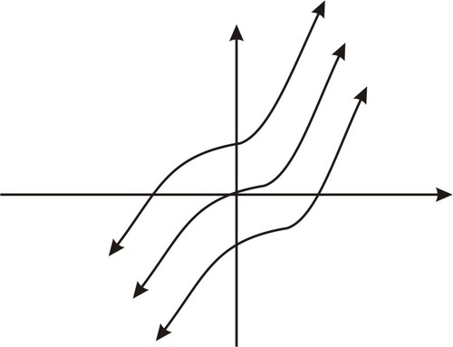

**_Notation and Introduction to Indefinite Integrals_**

The process of finding antiderivatives is called **_antidifferentiation_**, more commonly referred to as _**integration.**_ Here is how the integration is indicated and how it works:

$F^\prime(x) =f(x)$ ... Start with the **_differential equation_** that represents the definition of the antiderivative

$\int F^\prime (x)dx =\int f(x) dx$ ... Invoke the integration (antidifferentiation) operation using the special symbol $\int$.

$F(x)+C=\int f(x) dx$ ... Obtain the antiderivative $F(x)$ and a constant of integration, $C$.

$\int f(x) dx=F(x)+C$ ... Note that if we differentiate both sides, we get back the original equation:

$$
\frac{d}{dx}\left[\int f(x)dx\right]=f(x)=\frac{d}{dx} \left[F(x)+C \right]=F^ \prime(x)
$$

We refer to $\int f (x)dx$ as “the indefinite integral of $f(x)$ with respect to $x$”. The function $f(x)$ is called the **_integrand_** and the constant $C$ is called the **_constant of integration_**__**.**__ Finally the symbol $dx$ indicates that we are to integrate with respect to $x$.

Using this notation, we would summarize the last example as follows:

$$
\int 3x^2 dx=x^3+C
$$

#### Example B

Consider the function $f(x) = \cos x$

Can you think of a function $F(x)$ such that $F^\prime(x) = f(x)$?

If you said $F(x) = \sin x + C$ you would be correct and here is how this would be written.

$f(x)=F^\prime(x)$ . . . Start with the **_differential equation_** that represents the definition of the antiderivative

$\cos x=F^\prime(x)$ . . . Substitute for $f(x)$

$\int \cos x\ dx=\int F^\prime(x) dx$ . . . Invoke the integration (antidifferentiation) operation using the special symbol $\int$.

$\int \cos x\ dx=F(x)+C$ . . . Obtain the antiderivative $F(x)$ and a constant of integration, $C$.

$\int\cos x\ dx=\sin x+C$ . . . We know $F(x)=\sin x$ because if we differentiate both sides, we get back the original equation.

We have looked at the derivatives of a number of functions through the calculus concepts and can put together a list of functions and their antiderivatives as shown below.

|     |     |
| --- | --- |**Summary of Basic Indefinite Integrals And Antiderivatives**
| **Function $f(x)$** | **Antiderivative $\int f(x)dx=F(x)+C$** |
| 1   | $x+C$ |
| $x$ | $\frac{{{x^2}}}{2} + C$ |
| ${x^2}$ | $$ \frac{{{x^3}}}{3} + C $$ |
| ${x^n}{\rm{,}}$  $n \ne  - 1$ | $$ \frac{{{x^{n + 1}}}}{{n + 1}} + C $$ |
| $\frac{1}{x}$ | $\ln x + C$ |
| $\sin x$ | $- \cos x + C$ |
| $\cos x$ | $\sin x+C$ |
| ${\sec ^2}x$ | $\tan x + C$ |
| ${\text{cosec} ^2}x$ | $- \cot x + C$ |
| $\sec x\tan x$ | $\sec x + C$ |
| $\text{cosec} \ x \cot x$ | $- \text{cosec} \ x + C$ |
| ${e^x}$ | ${e^x} + C$ |
| ${b^x}$  $b > 0$ | $\frac{{{b^x}}}{{\ln b}} + C$ |
| $\frac{1}{{x\ln b}}$ | ${\log _b}x + C$ |

As with differentiation, there are several rules for dealing with the sum and difference of integrable functions. They are stated as follows:

**Basic Integration Rules**

If $f$ and $g$ are integrable functions, and $C$ is a constant, then:

$$
\begin{align*}
\int[f(x)+g(x)]dx &=\int f(x)dx+\int g(x)dx, \\
\int[f(x)-g(x)]dx &=\int f(x)dx-\int g(x)dx, \\
\int[Cf(x)]dx &=C\int f(x)dx.
\end{align*}
$$

#### Example C

Compute the following indefinite integral.

$$
\int \left[2x^3+\frac{3}{x^2}-\frac{1}{x}\right]dx.
$$

**Solution:**

Using our rules we have

$$
\begin{align*}
\int\left[2x^3+\frac{3}{x^2}-\frac{1}{x}\right]dx &=2\int x^3dx+3\int\frac{1}{x^2}dx-\int\frac{1}{x}dx\\
&=2\left(\frac{x^4}{4}\right)+3\left(\frac{x^{-1}}{-1}\right)-\ln x+C\\
&=\frac{x^4}{2}-\frac{3}{x}-\ln x+C.
\end{align*}
$$

Sometimes our rules need to be modified slightly due to operations with constants as is the case in the following example.

#### Concept Question Wrap-up

Recall that you were asked to try listing functions that are antiderivative and derivative pairs? By doing so you are presenting the results of differentiation and integration operations. If all you did was to list the function being differentiated as the antiderivative, this is correct. By now you have realized that there is a family of antiderivatives you could have chosen from, each differing by a constant of integration.

#### Guided Practice

Compute the following indefinite integral:

$$
\int e^{3x}dx.
$$

**Solution:**

We first note that our rule for integrating exponential functions does not work here since $\frac{d}{dx}e^{3x}=3e^{3x}$. However, if we remember to divide the original function by the constant then we get the correct antiderivative and have

$$
\int e^{3x}dx=\frac{e^{3x}}{3}+C.
$$

We can now re-state the rule in a more general form as

$$
\int e^{kx}dx=\frac{e^{kx}}{k}+C.
$$

#### Practice

In problems #1-6, find an antiderivative of the function

1. $f(x) = 1 - 3{x^2} - 6x$

2. $f(x) = x - {x^{\frac{2}{3}}}$

3. $f(x) = \sqrt[5]{{2x + 1}}$

4. $f(x) = \cos x - x$

5. $f(x) = {x^5} - 7{x^2} + 2$

6. $f(x) = {e^{ - 2x}} + {e^x}$

In #7-12, find the indefinite integral

7. $\int \left(2 + \sqrt 5 \right) dx$

8. $\int 2 {(x - 3)^3}dx$

9. $\int \left(x^2 \cdot \sqrt[3]{x}\right) dx$

10. $\int {\left( {x + \frac{1}{{{x^4}\sqrt x }}} \right)} dx$

11. $\int {(\cos x + 2\sin x)dx}$

12. $\int {2\sin x\cos xdx}$

13. Find  $f(x)$ if $f^\prime(x) = 4{x^3} - 3{x^2} + x - 3$.

14. Find the antiderivative $F(x)$ of the function $f(x) = 2{e^{2x}} + x - 2$ that satisfies $F(0) = 5$.

15. Evaluate the indefinite integral $\int | x|dx$ (Hint: Examine the graph of $f(x) = |x|$.)

</article>

### 8.3 Integration by Substitution

<article>

Each basic rule of integration that you have studied so far was derived from a corresponding differentiation rule. Even though you have learned all the necessary tools for differentiating exponential, logarithmic, trigonometric, and algebraic functions, your set of tools for integrating these functions is not yet complete. In this chapter we will explore different ways of integrating functions and develop several integration techniques that will greatly expand the set of integrals to which the basic integration formulae can be applied. Before we do that, let us review the basic integration formulae that you are already familiar with from previous chapters.

1. The Power Rule $(n \neq -1)$:

$$
\int x^n dx = \frac{x^{n + 1}} {n + 1} + C.
$$

2. The General Power Rule $(n \neq -1)$:

$$
\int u^n \frac{du} {dx} dx = \int u^n du = \frac{u^{n + 1}} {n + 1} + C.
$$

3. The Simple Exponential Rule:

$$
\int e^x dx = e^x + C.
$$

4. The General Exponential Rule:

$$
\int e^u \frac{du} {dx} dx = \int e^u du = e^u + C.
$$

5. The Simple Log Rule:

$$
\int \frac{1} {x} dx = \ln |x| + C.
$$

6. The General Log Rule:

$$
\int \frac{du/dx} {u} dx = \int \frac{1} {u} du = \ln |u|+ C.
$$

It is important that you remember the above rules because we will be using them extensively to solve more complicated integration problems. The skill that you need to develop is to determine which of these basic rules is needed to solve an integration problem.

Probably one of the most powerful techniques of integration is _integration by substitution._ In this technique, you choose part of the integrand to be equal to a variable we will call $u$ and then write the entire integrand in terms of $u.$ The difficulty of the technique is deciding which term in the integrand will be best for substitution by $u.$ However, with practice, you will develop a skill for choosing the right term.

Recall that if $u$ is a differentiable function of $x$ and if $n$ is a real number and $n \neq -1,$ then the Chain Rule tells us that

$$
\frac{d} {dx} [u^n] = nu^{n - 1} \frac{du} {dx}.
$$

The reverse of this formula is the integration formula,

$$
\int u^n du = \frac{u^{n + 1}} {n + 1} + C, n \ne -1.
$$

Sometimes it is not easy to integrate directly. For example, look at this integral:

$$
\int (5x - 2)^2 dx.
$$

One way to integrate is to first expand the integrand and then integrate term by term.

$$
\begin{align*}
\int (5x - 2)^2 dx & = \int (25x^2 - 20x + 4)dx\\
& = 25 \int x^2 dx - 20 \int x dx + \int 4 dx\\
& = \frac{25} {3} x^3 - 10x^2 + 4x + C.
\end{align*}
$$

That is easy enough. However, what if the integral was

$$
\int (5x - 2)^{15} dx?
$$

Would you still expand the integrand and then integrate term by term? That would be impractical and time-consuming. A better way of doing this is to change the variables. Changing variables can often turn a difficult integral, such as the one above, into one that is easy to integrate. The method of doing this is called **_integration by substitution,_** or for short, the $u$**_\-substitution method_**. The examples below will show you how the method is used.

#### Example 1

Evaluate $\int (x + 1)^5 dx.$

**Solution:**

Let $u = x + 1.$ Then $du = d(x + 1) = 1dx = dx.$ Substituting for $u$ and $du$ we get

$$
\int (x + 1)^5 dx = \int u^5 du.
$$

---

Integrating using the power rule,

$$
= \frac{u^6} {6} + C.
$$

Since $u = x + 1,$ substituting back,

$$
= \frac{(x + 1)^6} {6} + C.
$$

#### Example 2

Evaluate $\int \sqrt{4x + 3}dx.$

**Solution:**

Let $u = 4x + 3.$ Then $du = 4dx.$ Solving for $dx,$

$$
\begin{align*}
dx & = du/4.
\end{align*}
$$

Substituting,

$$
\begin{align*}
& = \int u^{1/2}\cdot \frac{1} {4} dx\\
& = \frac{1} {4} \int u^{1/2} dx\\
& = \frac{1} {4} \frac{u^{3/2}} {3/2} + C.
\end{align*}
$$

Simplifying,

$$
\begin{align*}
& = \frac{1} {6} u^{3/2} + C\\
& = \frac{1} {6} (4x + 3)^{3/2} + C.
\end{align*}
$$

#### Trigonometric Integrands

We can apply the change of variable technique to trigonometric functions as long as $u$ is a differentiable function of $x.$ Before we show how, recall the basic trigonometric integrals:

---

$$
\begin{align*}
\begin{array}{rcl}
\int \cos u du  &=& \sin u + C, \\ \\
\int \sin u du &=& -\cos u + C, \\ \\
\int \sec^2 u du &=& \tan u + C, \\ \\
\int \text{cosec}^2 u du  &=& -\cot u + C, \\ \\
\int (\sec u) (\tan u) du  &=& \sec u + C,\\ \\
\int (\text{cosec}\ u) (\cot u) du  &=& -\text{cosec} \ u + C
\end{array}
\end{align*}
$$

#### Example 3

Evaluate $\int \cos(3x + 2)dx.$

**Solution:**

The argument of the cosine function is $3x + 2.$ So we let $u = 3x + 2.$ Then $du = 3dx,$ or $dx = du/3.$

Substituting,

$$
\begin{align*}
\int \cos(3x + 2)dx & = \int \cos u \cdot \frac{1} {3} dx\\
& = \frac{1} {3} \int \cos u dx.
\end{align*}
$$

Integrating,

$$
\begin{align*}
& = \frac{1} {3} \sin u + C\\
& = \frac{1} {3} \sin(3x + 2) + C.
\end{align*}
$$

#### Example 4

This example requires us to use trigonometric identities before we substitute. Evaluate

$\int \frac{1} {cos^2 3x} dx.$

**Solution:**

Since $\sec 3x = \frac{1} {\cos 3x}$, the integral becomes

$$
\int \frac{1} {cos^2 3x} dx = \int \sec^2 3x dx.
$$

Substituting for the argument of the secant, $u = 3x,$ then $du = 3dx,$ or $dx = du/3.$ Thus our integral becomes,

$$
\begin{align*}
\int \sec^2 u . \frac{1} {3} du & = \frac{1} {3} \int \sec^2 u du\\
& = \frac{1} {3} \tan u + C\\
& = \frac{1} {3} \tan(3x) + C.
\end{align*}
$$

Some integrations of trigonometric functions involve the logarithmic functions as a solution, as shown in the following example.

#### Example 5

Evaluate $\int \tan x dx$.

**Solution:**

As you may have guessed, this is not a straightforward integration. We need to make use of trigonometric identities to simplify it. Since $\tan x = \sin x/\cos x,$

$$
\int \tan x dx = \int \frac{\sin x} {\cos x} dx.
$$

Now make a change of variable $x.$ Choose $u = \cos x.$ Then $du = -\sin x dx,$ or $dx = -du/\sin x.$ Substituting,

$$
\begin{align*}
\int \frac{\sin x} {\cos x} dx & = \int \frac{\sin x} {u} \left (\frac{-du} {\sin x} \right)\\
& = -\int \frac{du} {u}.
\end{align*}
$$

This integral should look obvious to you. The integrand is the derivative of the natural logarithm $\ln u.$

$$
\begin{align*}
& = -\ln|u| + C\\
& = -\ln|\cos x| + C.
\end{align*}
$$

Another way of writing it, since $-\ln |u| = \ln \frac{1} {|u|}$, is

$$
\begin{align*}
& = \ln \left |\frac{1} {\cos x}\right | + C\\
& = \ln |\sec x| + C.
\end{align*}
$$

### Trigonometric Substitutions

When we are faced with integrals that involve radicals of the forms $\sqrt{a^2 - x^2}, \sqrt{x^2 - a^2},$ and $\sqrt{x^2 + a^2},$ we may make substitutions that involve trigonometric functions to eliminate the radical. For example, to eliminate the radical in the expression

$$
\sqrt{a^2 - x^2}
$$

we can make the substitution

$$
x = a \sin\theta, \\
-\pi/2 \le \theta \le \pi/2,
$$

(Note: $\theta$ must be limited to the range of the inverse sine function.)

which yields,

$$
\begin{align*}
\sqrt{a^2 - x^2} & = \sqrt{a^2 - a^2 \sin^2 \theta} = \sqrt{a^2(1 - \sin^2 \theta)}\\
& = a \sqrt{\cos^2 \theta} = a \cos \theta.
\end{align*}
$$

The reason for the restriction $-\pi/2 \le \theta \le \pi/2$ is to guarantee that $\sin \theta$ is a one-to-one function on this interval and thus has an inverse.

The table below lists the proper trigonometric substitutions that will enable us to integrate functions with radical expressions in the forms above.

| **Expression in Integrand** | **Substitution** | **Identity Needed** |
| --- | --- | --- |
| $\sqrt{a^2 - x^2}$ | $x = a \sin \theta$ | $1 - \sin^2 \theta = \cos^2 \theta$ |
| $\sqrt{a^2 + x^2}$ | $x = a \tan \theta$ | $1 + \tan^2 \theta = \sec^2 \theta$ |
| $\sqrt{x^2 - a^2}$ | $x = a \sec \theta$ | $sec^2 \theta - 1 = \tan^2 \theta$ |

In the second column are listed the most common substitutions. They come from the reference right triangles, as shown in the figure below. We want any of the substitutions we use in the integration to be reversible so we can change back to the original variable afterward. The right triangles in the figure below will help us reverse our substitutions.

Evaluate $\int \frac{dx} {x^2 \sqrt{4 - x^2}}.$

**Solution:**

Our goal first is to eliminate the radical. To do so, look up the table above and make the substitution

$$
x = 2 \sin \theta, -\pi/2 \le \theta \le \pi/2,
$$

so that

$$
\frac{dx} {d\theta} = 2 \cos \theta
$$

Our integral becomes

$$
\begin{align*}
\begin{array}{rcl}
\int \frac{dx} {x^2 \sqrt{4 - x^2}}  &=& \int \frac{2 \cos \theta d\theta} {(2 \sin \theta)^2 \sqrt{4 - 4 \sin^2 \theta}}\\ \\
&=& \int \frac{2 \cos \theta d\theta} {(2 \sin \theta)^2 (2 \cos \theta)}\\ \\
 &=& \frac{1} {4} \int \frac{d\theta} {\sin^2 \theta}\\ \\
 &=& \frac{1} {4} \int \text{cosec}^2 \theta d\theta\\ \\
 &=& - \frac{1} {4} \cot\theta + C.
\end{array}
\end{align*}
$$

Up to this stage, we are done integrating. To complete the solution however, we need to express $\cot\theta$ in terms of $x.$ Looking at the figure of triangles above, we can see that the second triangle represents our case, with $a = 2.$ So $x = 2 \sin \theta$ and $2 \cos \theta = \sqrt{4 - x^2}$, thus

$$
\cot\theta = \frac{\sqrt{4 - x^2}} {x},
$$

since

$$
\cot\theta = \frac{\cos \theta} {\sin \theta}.
$$

so that

$$
\begin{align*}
\int \frac{dx} {x^2 \sqrt{4 - x^2}} & = -\frac{1} {4} \cot\theta + C\\
& = - \frac{1} {4} \frac{\sqrt{4 - x^2}} {x} + C.
\end{align*}
$$

#### Example 2

Evaluate $\int \frac{\sqrt{x^2 - 3}} {x} dx$.

---

**Solution:**

Again, we want to first to eliminate the radical. Consult the table above and substitute $x = \sqrt{3} \sec \theta$. Then $dx = \sqrt{3} \sec \theta  \tan \theta d\theta$. Substituting back into the integral,

$$
\begin{align*}
\int \frac{\sqrt{x^2 - 3}} {x} dx & = \int \frac{\sqrt{3 \sec^2 \theta - 3}} {\sqrt{3} \sec \theta} \sqrt{3} \sec \theta \tan \theta d\theta\\
& = \sqrt{3} \int \tan^2 \theta d\theta.
\end{align*}
$$

Using the integral identity from the section on Trigonometric Integrals,

$$
\int \tan^m x dx = \frac{\tan^{m - 1} x} {m - 1} - \int \tan^{m - 2} x dx.
$$

and letting $m = 2$ we obtain

$$
\int \frac{\sqrt{x^2 - 3}} {x} dx = \sqrt{3} ((\tan \theta) - \theta) + C.
$$

Looking at the triangles above, the third triangle represents our case, with $a = \sqrt{3}$. So $x = \sqrt{3} \sec \theta$ and thus $\cos x = \sqrt{3}/x$, which gives $\tan \theta = \sqrt{x^2 - 3}/\sqrt{3}$. Substituting,

$$
\begin{align*}
\int \frac{\sqrt{x^2 - 3}} {x} dx & = \sqrt{3} ((\tan \theta) - \theta) + C\\
& = \sqrt{3} \left ( \frac{\sqrt{x^2-3}}{\sqrt{3}} - \tan^{-1} \left ( \frac{\sqrt{x^2-3}}{\sqrt{3}} \right ) \right ) + C\\
& = \sqrt{x^2 - 3} - \sqrt{3} \tan^{-1} \left (\frac{\sqrt{x^2 - 3}} {\sqrt{3}} \right) + C.
\end{align*}
$$

#### Example 3

Evaluate $\int \frac{dx}{x^{2} \sqrt{x^{2}+1}}$.

**Solution:**

From the table above, let $x = \tan \theta$ then $dx = \sec^2\theta d\theta.$ Substituting into the integral,

$$
\int \frac{dx} {x^2 \sqrt{x^2 + 1}} = \int \frac{ \sec^2 \theta d\theta} {\tan^2 \theta \sqrt{\tan^2 \theta + 1}}.
$$

But since $\tan^2\theta + 1 = \sec^2\theta,$

$$
\begin{align*}
\begin{array}{rcl}
 &=& \int \frac{\sec^2 \theta d \theta} {\tan^2 \theta \sec \theta}\\ \\
 &=& \int \frac{\sec \theta} {\tan^2 \theta} d\theta\\ \\
&=& \int \frac{1} {\cos \theta} \frac{\cos^2 \theta} {\sin^2 \theta} d\theta \\ \\
&=& \int \cot\theta \ \text{cosec} \ \theta \ d \theta
\end{array}
\end{align*}
$$

Since $\frac{d} {d\theta} (\text{cosec} \ \theta) = -\cot\theta \ \text{cosec} \ \theta,$

$$
\int \frac{dx} {x^2 \sqrt{x^2 + 1}}  = \int \cot\theta \ \text{cosec} \ \theta \ d \theta\\
 = -\text{cosec} \ \theta + C.
$$

Looking at the triangles above, the first triangle represents our case, with $a = 1.$ So $x = \tan \theta$ and thus $\sin x = \frac{x} {\sqrt{1 + x^2}},$ which gives $\text{cosec} \ \theta = \frac{\sqrt{1 + x^2}} {x}.$ Substituting,

$$
\begin{align*}
\begin{array}{rcl}
\int \frac{dx} {x^2 \sqrt{x^2 + 1}}  &=& -\text{cosec} \theta + C\\
 &=& - \frac{\sqrt{1 + x^2}} {x} + C.
\end{array}
\end{align*}
$$

#### Multimedia Links:

For video presentations on Trigonometric Substitutions

!?[Watch the video at](https://www.youtube.com/watch?v=yW6Odu0YHL0)

!?[Watch the video at](https://www.youtube.com/watch?v=hxt5hd0CFXc)

### Indefinite Integration: Change of Variable

#### Concept

In a previous concept you learned how to find the derivative of a composite function using the Chain Rule. An obvious question in discussing antiderivatives: Is there some similar rule or method that can help in finding the antiderivative of a composite function? The answer is yes! By performing a change of variable, or variable substitution, the integrand can sometimes be made so that it is easier to evaluate, or find an antiderivative.

#### Watch This

!?[Watch the video at](https://www.youtube.com/watch?v=VfvJ5C9FjcA)

#### Guidance

Let’s illustrate the problem and solution.

#### Example A

Suppose we needed to compute the following integral:

$$
\int[2x + 1]^2 dx
$$

We are looking for an antiderivative $F$ of $f$, and can put together a solution by either of the following ways:

* Expand the integrand into the polynomial $f(x) = 4x^2 + 4x + 1$ and use the Sum Rule for evaluating an integrand to obtain $F(x) = \frac{4}{3}x^3 + \frac{4}{2}x^2 + x + C$; or
* Use our knowledge of differentiation to put together the function $F$ such that $F(x) = \frac{1}{3 \cdot 2}[2x + 1]^3 + C$.

Let’s consider a different approach. We recognize the function $f(x) = [2x + 1]^2$ as a composite function $f \circ g = f(g(x))$, with $f(x) = x^2$ and $g(x) = 2x + 1$. We know how to find the antiderivative of $f(x) = x^2$. But how do we factor in $g(x) = 2x + 1$?

1. Make the substitution $u = 2x + 1$

2. Then $\frac{du}{dx} = 2$, or $du = 2dx$. This means $dx = \frac{du}{2}$.

3. Now the integral can be represented as $\int [2x + 1]^2 dx = \int u^2 \frac{du}{2}  = \frac{1}{2}\int{u^2}du$, which we know how to integrate.

4. The new integral is evaluated to find the antiderivative $F(u) = \frac{1}{2}\int u^2 du  = \frac{1}{3 \cdot 2}u^3 + C$.

5. Finally, we can return to using the variable $x$ to get $F(x) = \frac{1}{3 \cdot 2}[2x + 1]^3 + C$.

Therefore,

$$
\int [2x + 1]^2 dx =\frac{1}{3 \cdot 2}[2x + 1]^3 + C.
$$

The technique we have used is called _**Integration by Substitution**_, a technique that can often simplify the integrand considerably and allow us to recognize an antiderivative.

Sometimes the integrand looks more complex, and requires more effort to recognize how to simplify.

#### Example B

Suppose we needed to compute the following integral:

$$
\int 3x^2\sqrt{1+x^3} dx
$$

**Solution:**

The integrand is the product of $3x^2$ and a composite function $f \circ g = f(g(x))$, with $f(x) = \sqrt{x}$ and $g(x) = 1+x^3$.

Let’s try to use the substitution approach and see what happens.

1. Let $u=1+x^3$.

2. Differentiate both sides so $du = 3x^2 dx$; we recognize that $3x^2$ is $g^{\prime}(x)$, one of the factors in the integrand, and this fact is very helpful.

Note that integral is of the form $\int f(g(x)) \cdot g^{\prime}(x)dx= \int F^{\prime}(g(x)) \cdot g^{\prime}(x)dx$.

3. Change the original integral in $x$ to an integral in $u$:

$\int \sqrt{1+x^3} \cdot 3x^2 dx = \int \sqrt{u} du$, where $u = 1+x^3$ and $du = 3x^2 dx$.

4. Integrate with respect to $u$:

$\int \sqrt{u} du= \int u^{\frac{1}{2}} du = \frac{2}{3}u^{\frac{3}{2}}+C$.

5. Now change the answer back to $x$:

$$
\frac{2}{3}u^{\frac{3}{2}} + C = \frac{2}{3}(1 +
x^3)^{\frac{3}{2}} + C
$$

Substitution is a very powerful method for solving a variety of problems.

#### Guided Practice

Suppose we needed to compute the following integral:

$$
\int \frac{x \sin \left(\sqrt{3x^2 + 1} \right)}{\sqrt{3x^2 +1}}dx
$$

**Solution:**

We notice that the sine function in the integrand is a composite function $f \circ g = f(g(x))$, with $f(x) = \sin x$ and $g(x) = \sqrt{3x^2+ 1}$.

Let’s try to use the substitution approach and see what happens.

1. Let $u = \sqrt{3x^2+ 1}$.

2. Differentiate both sides so $du = \frac{6x}{2 \sqrt{3x^2+1}}dx$; we recognize that $\frac{du}{3} = \frac{x}{\sqrt{3x^2+1}}dx$ is $\frac{1}{3}g^{\prime}(x)$, one of the factors in the integrand, and this fact is very helpful.

Note that integral is of the form $\int f(g(x))  \cdot g^{\prime}(x)dx=\int F^{\prime}(g(x))  \cdot g^{\prime}(x)dx$.

3. Change the original integral in $x$ to an integral in $u$: $\int \frac{x \sin \sqrt {3x^2+1}}{\sqrt{3x^2+1}}dx  = \frac{1}{3}\int \sin u \ du$

4. Integrate with respect to $u$: $\frac{1}{3}\int \sin u \ du =  -\frac{1}{3}\cos u + C$

5. Now change the answer back to $x$: $\int \frac{x \sin \sqrt{3x^2 +1}}{\sqrt{3x^2+1}}dx  =  -\frac{1}{3}\cos \sqrt {3{x^2} + 1}  + C$

#### Practice

Compute the integrals:

1. $\int (3x + 8)^{11}dx$

2. $\int 5(5x - 3)^3 dx$

3. $\int \sin 3x dx$

4. $\int 5 \cos \frac{\pi }{2}xdx$

5. $\int x(2x^2 + 1)^2 dx$

6. $\int (2x + 1)(x^2 + x - 1)^4 dx$

7. $\int 4x^3 (7x^4 + 6)^5 dx$

8. $\int x^5 (2x^6 + 7)^3 dx$

9. $\int \sec^2 x \tan xdx$

10. $\int \frac{x}{\sqrt{2x + 1}} dx$

11. $\int \frac{x^2}{(5x^3+3)^{\frac{3}{2}}} dx$

12. $\int x^3 \sqrt{1 - x^2} dx$

13. $\int x^2 \sqrt{x^3+9} dx$

14. $\int \left(x \cdot e^{x^2}\right) dx$

15. $\int \left(\frac{1}{x^2} \cdot e^{\frac{1}{x}}\right) dx$

In the following exercises, evaluate the integrals.

16. $\int \frac{3} {(x - 8)^2} dx$

17. $\int \sqrt{2 + x} dx$

18. $\int \frac{1} {\sqrt{2 + x}} dx$

19. $\int \frac{x^2} {x + 1} dx$

20. $\int \frac{e^{-x}} {e^{-x} + 2} dx$

21. $\int \frac{3\sqrt{t} + 5} {t} dt$

22. $\int \frac{2} {\sqrt{3x - 1}} dx$

23. $\int \sin x \cos x dx$

24. $\int \cos x \sqrt{1 - \cos^2 x} dx$

25. $\int \sin^5 x \cos x dx$

26. $\int x^3 \cos 4x^4 dx$

27. $\int \sec^2(2x + 4) dx$

Evaluate the integrals.

28. $\int \sqrt{4 - x^2} dx$

29. $\int \frac{1} {\sqrt{9 + x^2 }} dx$

30. $\int \frac{x^3} {\sqrt{1 - x^2}} dx$

31. $\int \frac{1} {\sqrt{1 - 9x^2}} dx$

32. $\int x^3 \sqrt{4 - x^2} dx$

33. $\int \frac{1} {x^2 \sqrt{x^2 - 36}} dx$

34. $\int \frac{1} {(x^2 + 25)^2} dx$

</article>

### 8.4 Integration Using Trigonometric Identities

<article>

### Integrating Powers of Sines and Cosines

#### Guidance

In this section we study methods of integrating functions of the form:

$$
\int \sin^m x \cos^n x dx
$$

where $m$, and $n$ are non-negative integers.

The following three general categories or problem forms are of interest:

1. $n=0$, so that problems look like $\int \sin^m x dx$;

2. $m=0$, so that problems look like $\int \cos^n x dx$;

3. $m \ge 1$ and $n \ge 1$, so that problems look like $\int \sin^m x \cos^n x dx$.

Let’s look at the three forms in order.

**Problem Form I: $\int \sin^m x dx$**

This integral form can be evaluated using a general **reduction formula** (derived by applying integration by parts, which is given in later section in the same chapter). A _reduction formula_ is a formula solution that solves an integral problem by _reducing_ it to a problem of solving an easier integral problem, which in turn can be solved by reducing the new integral to an easier problem, and so on. The reduction formula for the integral is:

**Reduction Formula: $\int \sin^m x dx$**

**

$$
\int \sin^m x dx=- \frac{1}{m} \sin^{m-1}x \cos x+ \frac{m-1}{m} \int \sin^{m-2}x dx
$$

**

You can check that this formula works by trying it out for the case $m=1$, which leads to$\int \sin^1 x dx=- \frac{1}{1} \sin^{1-1} x \cos x+ \frac{1-1}{1} \int \sin^{m-2}x dx=- \cos x$.

This is a familiar result.

As an alternative to using the reduction formula, the table below provides a guide to evaluating problems with this form based on whether the exponent is odd or even.

---

| $\int \sin^m x dx$ | **Procedure** | **Key Identities** |
| --- | --- | --- |
| $m > 1$ is odd $(m=2p+1)$ | 1) Convert integral:  $\int \sin^m x dx=\int \sin^{2p} x \sin x dx$  2) Use the identity to convert integral:  $\int \sin^{2p} x \sin x dx=\int (1- \cos^2 x)^p \sin x dx$  3) Use $u$\-substitution to change variables: $u=\cos x$ and $du=- \sin x dx$ yields  $\int (1- \cos^2 x)^p \sin x dx=- \int (1-u^2)^p du$  4) Expand the polynomial in $u$.  5) Integrate the resulting polynomial in terms of $u$.  6) Substitute back $\cos x$ for $u$. | $\sin^2 x=(1- \cos^2 x)$ |
| $m$ is even $(m=2p)$ | 1) Convert the integral:  $\int \sin^m x dx=\int \sin^{2p}x dx$  2) Use the identity to convert the integral:  $\int \sin^{2p}x dx=\int \left(\frac{1}{2}(1- \cos 2x) \right)^p dx$  3) Expand in powers of $\cos 2x$ and apply the odd/even procedure of **Problem Form II** as many times as necessary to simplify the integrand. | $\sin^2 x=\frac{1}{2} (1- \cos 2x)$ |

#### Example A

Evaluate $\int \sin^3 x dx$.

**Solution:**

$$
\begin{align*}
\int \sin^3 x dx&=\int \sin^2 x \sin x dx && \ldots \text{Separate to even and odd powers because} \ m=3, \ \text{odd}. \\
&=\int (1- \cos^2 x) \sin x dx && \ldots \text{Used the identity}. \ \sin^2 x=(1- \cos^2 x) \\
&=- \int (1-u^2)du && \ldots \text{Used substitution}: \ u=\cos x \ \text{and} \ du=- \sin x dx \\
&=- \left(u- \frac{u^3}{3} \right)+C && \ldots \text{Integrated} \\
\int \sin^3 x dx&=- \cos x+ \frac{\cos^3 x}{3}+C && \ldots \text{Substituted} \ \cos x \ \text{for} \ u.
\end{align*}
$$

**Problem Form II: $\int \cos^n x dx$**

This integral form can also be evaluated using a general **reduction formula** (derived by applying integration by parts).

**Reduction Formula:** $\int \cos^n x dx$

$$
\int \cos^n x dx=\frac{1}{n} \cos^{n-1}x \sin x+ \frac{n-1}{n} \int \cos^{n-2}x dx
$$

You can check that this formula works by trying it out for the case $n=1$, which leads to $\int \cos^1 x dx=\frac{1}{1} \cos^{1-1}x \sin x+ \frac{1-1}{1} \int \cos^{n-2} x dx=\sin x$.

This is a familiar result.

Again, as an alternative to using the reduction formula, the table below provides a guide to evaluating problems with this form based on whether the exponent is odd or even.

| $\int \cos^n x dx$ | **Procedure** | **Key Identities** |
| --- | --- | --- |
| $n$ is odd$(n=2p+1)$ | 1) Convert integral:  $\int \cos^n x dx=\int \cos^{2p} x \cos x dx$  2) Use the identity to convert integral:  $\int \cos^{2p} x \cos x dx=\int (1- \sin^2 x)^p \cos x dx$  3) Use $u$\-substitution to change variables: $u=\sin x$ and $du=\cos x dx$ yields  $\int (1- \sin^2 x)^p \cos x dx=\int (1-u^2)^p du$  4) Expand the polynomial in $u$.  5) Integrate the resulting polynomial in terms of $u$.  6) Substitute back $\sin x$ for $u$. | $\cos^2 x=(1- \sin^2 x)$ |
| $n$ is even $(n=2p)$ | 1) Convert the integral:  $\int \cos^n x dx=\int \cos^{2p}x  dx$  2) Use the identity to convert the integral:  $\int \cos^{2p}x dx=\int \left(\frac{1}{2}(1+ \cos 2x) \right)^p dx$  3) Expand the integrand to get powers of $\cos 2x$ and apply the odd/even procedure as many times as necessary to simplify the integrand. | $\cos^2 x=\frac{1}{2}(1+ \cos 2x)$ |

#### Example B

Evaluate $\int \cos^4 x dx$

**Solution:**

$$
\begin{align*}
\int \cos^4 x dx &=\int(\cos^2 x)^2 dx && \ldots n=4, \ \text{even}. \\
&=\int \left(\frac{1}{2}(1+ \cos 2x) \right)^2 dx && \ldots \text{Used the identity}: \ \cos^2 x=\frac{1}{2}(1+ \cos 2x) \\
&=\left(\frac{1}{2} \right)^2 \int (1+2 \cos 2x+ \cos^2 2x)dx && \ldots \text{Expanded the square} \\
&=\left(\frac{1}{2} \right)^2 \int \left(1+2 \cos 2x+ \frac{1}{2}(1+ \cos 4x) \right)dx && \ldots \text{Used the identity} \ \cos^2 x=\frac{1}{2}(1+ \cos 2x) \\
&=\left(\frac{1}{4} \right) \int \left(\frac{3}{2}+2 \cos 2x+ \frac{1}{2} \cos 4x \right) dx \\
&=\left(\frac{1}{4} \right) \left(\frac{3}{2}x+ \sin 2x+ \frac{1}{8} \sin 4x \right)+C && \ldots \text{Integrated term-by-term} \\
\int \cos^4 x dx &=\frac{3}{8}x+ \frac{1}{4} \sin 2x+ \frac{1}{32} \sin 4x+C
\end{align*}
$$

**Problem Form III: $\int \sin^m x \cos^n x dx$, $m \ge 1$ and $n \ge 1$**

The table below provides a guide to evaluating problems with this form.

| $\int \sin^m x \cos^n x dx$ | **Procedure** | **Key Identities** |
| --- | --- | --- |
| $m$ is odd $(m=2p+1)$ | 1) Convert integral:  $\int \sin^m x \cos^n x dx=\int \sin^{2p} x \cos x \sin x dx$  2) Use the identity to convert integral:  $\int \sin^{2p} x \cos^n x \sin x dx=\int(1- \cos^2 x)^p \cos^n x \sin x dx$  3) Use $u$\-substitution to change variables: $u=\cos x$ and $du=- \sin x dx$ yields  $\int(1- \cos^2 x)^p \cos^n x \sin x dx = - \int (1-u^2)^p u^n du$  4) Expand the product of $u^n$ and the polynomial in $u$.  5) Integrate the resulting polynomial in terms of $u$.  6) Substitute back $\cos x$ for $u$. | $\sin^2 x=(1- \cos^2 x)$ |
| $n$ is odd $(n=2p+1)$ | 1) Convert integral:  $\int \sin^m x \cos^n x dx=\int \sin^m x \cos^{2p} x \cos x dx$  2) Use the identity to convert integral:  $\int \sin^m x \cos^{2p} x \cos x dx=\int \sin^m x \cdot (1- \sin^2 x)^p \cos x dx$  3) Use $u$\-substitution to change variables: $u=\sin x$ and $du=\cos x dx$ yields  $\int \sin^m x \cdot (1- \sin^2 x)^p \cos x dx = \int u^m (1-u^2)^p du$  4) Expand the product of $u^m$ and the polynomial in $u$.  5) Integrate the resulting polynomial in terms of $u$.  6) Substitute back $\sin x$ for $u$. | $\cos^2 x=(1- \sin^2 x)$ |
| $m$ and $n$ are even $(m=2p, n=2r)$ | 1) Convert the integral:  $\int \sin^m x \cos^n x dx=\int \sin^{2p} x \cos^{2r} x dx$  2) Use the half-angle identities to reduce the exponents by one-half and convert the integral:  $\int \sin^{2p} x \cos^{2r} x dx= \int \left(\frac{1}{2}(1- \cos 2x) \right)^p \left(\frac{1}{2}(1+ \cos 2x) \right)^r$  3) Expand the integrand to get powers of $\cos 2x$ and apply the odd/even procedure as many times as necessary to simplify the integrand. | $$ \begin{align*} \sin^2 x &=\frac{1}{2}(1- \cos 2x) \\ \cos^2 x &=\frac{1}{2}(1+ \cos 2x) \end{align*} $$ |

#### Example C

Evaluate **$\int \sin^3 x \cos^4 x dx$**

**Solution:**

$$
\begin{align*}
\int \sin^3 x \cos^4 x dx &=\int \sin^2 x \cos^4 x \sin x dx && \ldots m=3, \  \text{odd}. \\
&=\int(1- \cos^2 x) \cos^4 x \sin x dx && \ldots \text{Used the identity} \ \sin^2 x=(1- \cos^2 x) \\
&=- \int (1-u^2)u^4 du && \ldots \text{Used substitution}: \ u=\cos x \ \text{and} \ du=- \sin x dx \\
&=- \int (u^4-u^6)du \\
&=- \frac{u^5}{5}+ \frac{u^7}{7}+C && \ldots \text{Integrated} \\
\int \sin^3 x \cos^4 x dx &=- \frac{\cos^5 x}{5}+ \frac{\cos^7 x}{7}+C && \ldots \text{Substituted} \ \cos x \ \text{for} \ u.
\end{align*}
$$

#### Guided Practice

Evaluate $\int \sin^4 x \cos^4 x dx$.

**Solution:**

Here, $m=n=4$ We follow the third procedure in the table above:

$$
\begin{align*}
\int \sin^4 x \cos^4 x dx &=\int (\sin^2 x)^2 (\cos^2 x)^2 dx && \ldots m, n \ \text{are even}. \\
& && \ldots \text{Used the identities}: \\
& =\int \left(\frac{1}{2}(1- \cos 2x) \right)^2 \left(\frac{1}{2}(1+ \cos 2x) \right)^2 dx &&\sin^2 x=\frac{1}{2}(1- \cos 2x) \\
& && \cos^2 x=\frac{1}{2}(1+ \cos 2x) \\
&=\left(\frac{1}{2} \right)^4 \int (1- \cos^2 2x)^2 dx && \ldots \text{Simplified the integrand} \\
&=\left(\frac{1}{16} \right) \int (\sin^2 2x)^2 dx && \ldots \text{Used the identity} \ 1- \cos^2 x=\sin^2 x \\
&=\left(\frac{1}{16} \right) \int \left(\frac{1}{2}(1- \cos 4x) \right)^2 dx && \ldots \text{Used the identities}: \ \sin^2 2x=\frac{1}{2}(1- \cos 4x) \\
&=\left(\frac{1}{64} \right) \int (1-2 \cos 4x+ \cos^2 4x)dx && \ldots \text{Expanded the integrand} \\
&=\left(\frac{1}{64} \right) \int \left(1- 2 \cos 4x+ \frac{1}{2}(1+ \cos 8x) \right)dx \\
&=\left(\frac{1}{64} \right) \int \left(\frac{3}{2}-2 \cos 4x+ \frac{\cos 8x}{2} \right)dx \\
&=\left(\frac{1}{64} \right) \left(\frac{3x}{2}- \frac{\sin 4x}{2}+ \frac{\sin 8x}{16} \right)+C && \ldots \text{Integrated terms} \\
\int \sin^4 x \cos^4 x dx &=\frac{3x}{128}- \frac{\sin 4x}{128}+ \frac{\sin 8x}{1024}+C
\end{align*}
$$

---

#### Watch This

!?[Watch the video at](https://www.youtube.com/watch?v=Sv-bSbAQeXc)

!?[Watch the video at](https://www.youtube.com/watch?v=vPnuigP8I6I)

### Integrating Powers of Secants and Tangents

#### Concept

In many applications, particularly those involving arc length and surface area, one needs to evaluate integrals of the general form $\int \tan^{m}x \sec^{n}xdx$, where $m$ and $n$ are positive integers. In the previous concept on integrating powers of sines and cosines, some useful integration rules were given based the identity $\sin^{2}x+\cos^{2}x=1$, the derivative relationships between the sine and cosine functions, and application of simple $u$\-substitution or integration by parts techniques. In a similar way, useful guidelines for integrating powers of secants and tangents are derived by using their identity and derivative relationships. Before proceeding, see if you can write down the identity relationship between the tangent and secant functions (can you derive it using the sine/cosine relationship?). Do you know their derivative relationships? Can you evaluate $\int\tan x \sec^{2}xdx$?

#### Watch This

!?[Watch the video at](https://www.youtube.com/watch?v=laBBImqdyqk)

!?[Watch the video at](https://www.youtube.com/watch?v=o8sIHlS17qc)

#### Guidance

In this section we study methods of integrating functions of the form:

$\int \tan^{m}x \sec^{n}xdx$

where $m$, and $n$ are nonnegative integers.

The following three general categories of problems are of interest:

1. $n=0$, so that problems look like $\int \tan^{m}xdx$;

2. $m=0$, so that problems look like $\int\sec^{n}xdx$;

3. $m\ge 1$ and $n\ge 1$, so that problems look like $\int \tan^{m}x \sec^{n}xdx$.

**Problem Form I: $\int\tan^{m}xdx$**

This integral form can be evaluated using a general **reduction formula** (derived by applying integration by parts). A _reduction formula_ is a formula solution that solves an integral problem by _reducing_ it to a problem of solving an easier integral problem, which in turn can be solved by reducing the new integral to an easier problem, and so on. The reduction formula for the integral is:

**Reduction Formula: $\int\tan^{m}xdx,m\ge 2$**

**

$$
\int\tan^{m}xdx=\frac{\tan^{m-1}x}{m-1}-\int\tan^{m-2}xdx
$$

**

Note that the reduction formula applies for $m\ge 2$. But what is the result for $m=1$?

For the case of $m=1$, the integral is evaluated as follows:

$$
\begin{align*}
\int\tan x dx & = \int\frac{\sin x}{\cos x} dx\\
& = -\int\frac{1}{u}du\\
& = -\ln|u|+C\\
\int\tan x dx & = -\ln|\cos x|+C
\end{align*}
$$

For cases where $m\ge 2$, the table below provides an alternative guide to using the reduction formula for evaluating the form **$\int\tan^{m}xdx$.**

---

| $\int\tan^{m}xdx,m\ge 2$ | **Procedure** | **Key Identities** |
| --- | --- | --- |
| $m$ is odd  $(m=2p+1)$ | 1) Convert integral:  $\int\tan^{m}x dx=\int\tan^{2p}x\tan xdx$  2) Use the identity to convert integral:  $\int\tan^{2p}x\tan x dx=\int(\sec^{2}x-1)^{p}\tan x dx$  3) Use $u$\-substitution to change variables: $u=\sec x$ and $du=\sec x\tan x dx$ yields  $\int(\sec^{2}x-1)^{p}\tan x dx=\int(u^{2}-1)^{p}\frac{du}{u}$  4) Divide the polynomial function in $u$ by $u$.  5) Integrate the resulting terms of $u$.  6) Substitute back $\sec x$ for $u$. | $\tan^{2}x=\sec^{2}x-1$  $u=\sec x$ and $du=\sec x \tan x dx$, or $\frac{du}{u}=\tan x dx$ |
| $m$ is even  $(m=2p)$ | 1) Convert the integral:  $\int\tan^{m}x dx=\int\tan^{2p}xdx$  2) Use the identity to convert the integral:  $\int\tan^{2p}x dx=\int(\sec^{2}x-1)^{p} dx$  3) Expand the integrand in powers (even) of $\sec x$.  4) Integrate term by term the polynomial of even powers of $\sec x$ using the reduction formula:  $\int\sec^{n}xdx=\frac{\sec^{n-2}x \tan x}{n-1}+\frac{n-2}{n-1}\int \sec^{n-2}xdx$ | $\tan^{2}x=(\sec^{2}x-1)$ |

#### Example A

Evaluate $\int \tan^{3}xdx$

**Solution:**

**Approach I**

**Reduction Formula**

$$
\begin{align*}
\int\tan^{m}xdx & = \frac{\tan^{m-1}x}{m-1}-\int\tan^{m-2}xdx\\
\int\tan^{3}xdx & =\frac{\tan^{2}x}{2}-\int\tan xdx\\
\int \tan^{3}xdx & =\frac{\tan^{2}x}{2}+\ln |\sec x|+C \qquad \ldots \text{or}=\frac{\tan^{2}x}{2}-\ln |\cos x|+C
\end{align*}
$$

---

**Approach II**

**$m$ odd**

$$
\begin{align*}
\int \tan^{3}xdx & = \int \tan^{2}x\tan xdx\\
& = \int (\sec^{2}x-1)\tan x dx\\
& = \int(u^{2}-1)\frac{du}{u}\\
& = \frac{u^{2}}{2}- \ln |u|+C\\
& = \frac{\sec^{2}x}{2}-\ln|\sec x|+C \qquad \ldots \text{or} \ \frac{\tan^{2}x}{2}-\ln|\sec x|+C^\prime, \text{where}\\
& \qquad\qquad\qquad\qquad\qquad\qquad\qquad C^\prime=C-\frac{1}{2}
\end{align*}
$$

**Problem Form II:** $\int\sec^{n}xdx$

For the case of $n=1$, the integral is evaluated as follows:

$$
\begin{align*}
\int\sec xdx & =\int\sec x\left(\frac{\sec x+ \tan x}{\sec x+ \tan x}\right)dx\\
& = \int\frac{\sec^{2}x+\sec x\tan x}{\sec x+\tan x}dx\\
& = \int \frac{du}{u} && \ldots \text{Using}\ u \text{-substitution:}\\
& && u=\sec x+\tan x \ \text{and}\\
& && du=(\sec x\tan x+\sec^{2}x)dx\\
& = \ln|u|+C\\
\int\sec xdx & = \ln|\sec x+\tan x|+C
\end{align*}
$$

For evaluating higher powers of secant use the following reduction formula:

**Reduction Formula:** $\int\sec^{n}xdx$

$$
\int\sec^{n}xdx=\frac{\sec^{n-2}x\tan x}{n-1}+\frac{n-2}{n-1}\int\sec^{n-2}xdx
$$

If $n=2$, use of the reduction formula yields $\int\sec^{2}xdx$

$$
\begin{align*}
\int\sec^{2}xdx & = \frac{\sec^{2-2}x\tan x}{2-1}+\frac{2-2}{2-1}\int\sec^{2-2}xdx\\
& = \tan x+C
\end{align*}
$$

This is the familiar result.

#### Example B

Evaluate $\int\sec^{3}xdx$.

**Solution:**

We use the reduction formula above with $n=3$.

$$
\begin{align*}
\int\sec^{n} xdx & = \frac{\sec^{n-2}x\tan x}{n-1}+\frac{n-2}{n-1}\int\sec^{n-2}xdx\\
\int\sec^{3}xdx & = \frac{\sec x\tan x}{2}+\frac{1}{2}\int\sec xdx\\
\int\sec^{3}xdx & = \frac{\sec x\tan x}{2}+\frac{1}{2}\ln|\sec x+\tan x|+C
\end{align*}
$$

**Problem Form III: $\int\tan^{m}x \sec^{n}xdx$, $m\ge 1$ and $n\ge 1$**

The table below provides a guide to evaluating problems with this form.

| $\int\tan^{m}x \sec^{n}xdx$ | **Procedure** | **Key Identities** |
| --- | --- | --- |
| $m$ is odd  $(m=2p+1)$ | 1) Convert integrand by splitting off a $\tan x$ and $\sec x$:  $\int\tan^{m}x\sec^{n}xdx=\int\tan^{2p}x\sec^{n-1}x\sec x \tan xdx$  2) Convert the integrand to all $\sec x$:  $\int(\sec^{2}x-1)^p \sec^{n-1}x\sec x \tan x dx$  3) Use $u$\-substitution to change variables:  $\int(\sec^{2}x-1)^{p}\sec^{n-1}x\sec x\tan xdx=\int(u^{2}-1)^{p}u^{n-1}du$   4) Expand the integrand to a polynomial in $u$.  5) Integrate the resulting polynomial in $u$.  6) Substitute back $\sec x$ for $u$. | $\tan^{2}x=\sec^{2}x-1$  $u=\sec x$ and $du=\sec x\tan xdx$ |
| $n$ is even $(n=2p)$ | 1) Convert integrand by splitting off a $\sec^{2}x$:  $\int\tan^{m}x\sec^{n}xdx=\int\tan^{m}x\sec^{2p-2}x\sec^{2}xdx$  2) Convert $\sec^{2p-2}x$ to powers of $(\tan^{2}x+1)$:  $\int\tan^{m}x\sec^{n}xdx=\int\tan^{m}x(\tan^{2}x+1)^{2p-2}x\sec^{2}xdx$  3) Use $u$\-substitution to change variables:  $\int\tan^{m}x(\tan^{2}x+1)^{2p-2}x\sec^{2}xdx=\int u^{m}(u^{2}+1)^{2(p-1)}du$  4) Expand the integrand to form a polynomial in $u$.  5) Integrate the resulting polynomial in terms of $u$.  6) Substitute back $\tan x$ for $u$. | $\sec^{2}x=\tan^{2}x+1$  $u=\tan x$ and $du=\sec^{2}xdx$ |
| $m$ is even $(m=2p)$ and $n$ is odd. | 1) Convert the integral:  $\int\tan^{m}x\sec^{n}xdx=\int\tan^{2p}x\sec^{n}xdx$  2) Use the identity to eliminate powers of $\tan x$:  $\int\tan^{2p}x\sec^{n}xdx=\int(\sec^{2}x-1)^{p}\sec^{n}xdx$  3) Expand the integrand to get powers of $\sec x$.  4) Integrate the integrand term by term using the reduction formula:  $\int\sec^{n}xdx=\frac{\sec^{n-2}x\tan x}{n-1}+\frac{n-2}{n-1}\int\sec^{n-2}xdx$ | $\tan^{2}x=\sec^{2}x-1$ |

#### Example C

Evaluate $\int\tan^{2}x\sec^{4}xdx$.

**Solution:**

Here $n=4$, is even so the procedure is as follows:

$$
\begin{align*}
\int\tan^{2}x\sec^{4}xdx & = \int\tan^{2}x\sec^{2}\sec^{2}xdx \qquad\qquad \ldots \text{Split off} \ \sec^{2}x\\
& = \int\tan^{2}x(\tan^{2}x+1)\sec^{2}xdx\\
& = \int u^{2}(u^{2}+1)du \quad\quad\qquad\qquad\ldots\text{Use}\ u \text{-subtitution:}\\
& \qquad\qquad\quad\qquad\qquad\qquad\qquad\qquad\qquad u=\tan x \text{ and } du=\sec^{2}xdx\\
& = \int(u^{4}+u^{2})du\\
& = \frac{u^{5}}{5}+\frac{u^{3}}{3}+C\\
\int\tan^{2}x\sec^{4}xdx & =\frac{\tan^{5}x}{5}+\frac{\tan^{3}x}{3}+C \qquad\qquad \ldots \text{Substitute}\tan x \ \text{for} \ u
\end{align*}
$$

#### Concept Question Wrap-up

See if you can write down the identity relationship between the tangent and secant functions (can you derive it using the sine/cosine relationship?). Do you know their derivative relationships? Can you evaluate $\int\tan x\sec^{2}xdx$?

1. The identity relationship is: $\tan^{2}x+1=\sec^{2}x$, which can be derived from $\sin^{2}x+\cos^{2}x=1$ by dividing both sides of the equation by $\cos^{2}x$.

2. The derivative relationships are: $\frac{d}{dx}\tan x=\sec^{2}x$ and $\frac{d}{dx}\sec x=\sec x\tan x$.

3. To evaluate $\int\tan x\sec^{2}xdx$, let $u=\tan x, du=\sec^{2}xdx$.

Then $\int\tan x\sec^{2}xdx=\int u du=\frac{u^{2}}{2}+C=\frac{\tan^{2}x}{2}+C$.

#### Guided Practice

Evaluate $\int\tan^{3}x\sec^{3}xdx$.

**Solution:**

Here $m=3$, and we use the following procedure:

$$
\begin{align*}
\int\tan^{3}x\sec^{3}xdx & =\int\tan^{2}x\sec^{2}x \sec x \tan x dx\\
& = \int(\sec^{2}x-1)\sec^{2}x\sec x\tan xdx\\
& = \int(u^{2}-1)u^{2}du && \ldots\text{Using}\ u \text{-substitution:}\\
& && u=\sec x \text{ and } du=\sec x\tan xdx\\
& = \int(u^{4}-u^{2})du\\
& = \frac{u^{5}}{5}-\frac{u^{3}}{3}+C\\
\int\tan^{2}x\sec^{4}xdx & =\frac{\sec^{5}x}{5}-\frac{\sec^{3}x}{3}+C && \ldots\text{Substitute }\sec x \ \text{for} \ u
\end{align*}
$$

### Integrating Products of Sines and Cosines of Different Angles

#### Concept

The previous concepts looked at integrals where products of same angle trig functions were used. What if the trig function factors have different arguments (angles)? This is the case in many science and engineering problems. One mathematical resource that is extremely useful for modeling some functions is the fourier series, which is an infinite sum of sine waves. In simple terms, a function $S(x)$ could be modeled as:

$$
S(x)=a_1 \sin x+a_2 \sin 2x+a_3 \sin 3x \cdots =\sum\limits_{n=1}^\infty a_n \sin nx.
$$

The weights $a_n$ reflect which frequencies are most prominent in the modeled function $S(x)$. One of the key characteristics of the Fourier series is the “orthogonality” of each of the sine functions, defined as $\int\limits_{0}^{\pi} \sin kx \sin mx dx=0$ for $k \ne m$. Can you evaluate the integral $\int\limits_{0}^{\pi} \sin kx \sin mx dx=0$ to show orthogonality?

#### Watch This

!?[Watch the video at](https://www.youtube.com/watch?v=QdNScjd5bno)

#### Guidance

This section looks at integrals involving the product(s) of sine and cosine functions having different linear arguments, e.g. $\int \sin(ax) \sin(bx) dx$, or $\int \sin^2 (ax) \cos(cx) dx$. Use is made of the following three basic sine and cosine product identities involving different arguments:

|     |     |
| --- | --- |
| **Sine/Cosine Product Identity** | **Derived From** |
| $\sin A \sin B=\frac{1}{2} \left[\cos (A-B)- \cos (A+B) \right]$ | $\cos(A+B)=\cos A \cos B- \sin A \sin B$  $\cos(A-B)=\cos A \cos B+ \sin A \sin B$ |
| $\sin A \cos B=\frac{1}{2} \left[\sin (A-B)+ \sin (A+B) \right]$ | $\sin(A+B)=\sin A \cos B- \cos A \sin B$  $\sin(A-B)=\sin A \cos B+ \cos A \sin B$ |
| $\cos A \cos B=\frac{1}{2} \left[\cos (A-B)+ \cos (A+B) \right]$ | $\cos(A+B)=\cos A \cos B- \sin A \sin B$  $\cos(A-B)=\cos A \cos B+ \sin A \sin B$ |

The procedure involves applying the identities to reduce the complexity of the integrand.

#### Example A

Evaluate $\int \sin x \sin 3x dx$

**Solution:**

$$
\begin{align*}
\int \sin x \sin 3x dx &=\int \frac{1}{2} \left[\cos(x-3x)- \cos(x+3x) \right]dx \\
&=\int \frac{1}{2} \left[\cos(-2x)- \cos(4x) \right]dx \\
&=\frac{1}{2} \left[\frac{\sin(-2x)}{-2} \right]- \frac{1}{2} \left[\frac{\sin 4x}{4} \right] \\
\int \sin x \sin 3x dx &=\frac{\sin(2x)}{4}- \frac{\sin 4x}{8}+C \qquad \qquad \ldots \text{Use}
\end{align*}
$$

#### Example B

Evaluate $\int \sin(9x) \cos(4x) dx$

**Solution:**

$$
\begin{align*}
\int \sin(9x) \cos(4x)dx &=\int \frac{1}{2} \left[\sin(9x-4x)+ \sin(9x+4x) \right] dx\\
&=\frac{1}{2} \int \left[\sin(5x)+ \sin(13x) \right]dx \\
&=\frac{1}{2} \left[\frac{- \cos(5x)}{5} \right]+ \frac{1}{2} \left[\frac{- \cos 13x}{13} \right] \\
\int \sin(9x) \cos(4x) dx &=- \left[\frac{\cos(5x)}{10}+ \frac{\cos(13x)}{26} \right]+C
\end{align*}
$$

#### Example C

Evaluate $\int \cos(9x) \cos(5x) dx$

**Solution:**

$$
\begin{align*}
\int \cos(9x) \cos(5x)dx &=\int \frac{1}{2} \left[\cos(9x-4x)+ \cos(9x+4x) \right]dx \\
&=\frac{1}{2} \int \left[\cos(5x)+ \cos(13x) \right]dx \\
&=\frac{1}{2}\left[\frac{\sin(5x)}{5} \right]+ \frac{1}{2} \left[\frac{\sin 13x}{13} \right]+C \\
\int \sin(9x) \cos(4x)dx &=\left[\frac{\sin(5x)}{10}+ \frac{\sin 13x}{26} \right]+C
\end{align*}
$$

---

#### Concept Question Wrap-up

Can you evaluate the integral $\int\limits_{0}^{\pi} \sin kx \sin mx dx=0$ to show orthogonality?

Option 1: Using integration by parts (2 passes required) to solve for the integral yields

$$
\int\limits_{0}^{\pi} \sin kx \sin mx dx=\frac{1}{m^2-k^2}[k \cos k \pi \sin m \pi-m \sin k \pi \cos m \pi].
$$

For the integral to be 0, $m$ and $k$ must be integers $(\sin m \pi =\sin k \pi =0)$

Option 2: Using sum and difference angle properties for the integrand yields $\sin kx \sin mx=\frac{1}{2} [\cos(k-m)x- \cos(k+m)x]$. The integral becomes

$$
\int\limits_{0}^{\pi} \sin kx \sin mx dx=\frac{1}{2(k^2 -m^2)}[(k+m) \sin(k-m) \pi -(k-m) \sin(k+m) \pi].
$$

For the integral to be 0, $(k-m)$ and $(k+m)$ must be integers.

#### Guided Practice

Evaluate the integral $\int \sin^2 2x \cos 7x dx$

**Solution:**

**

$$
\begin{align*}
\int \sin^2 2x \cos 7x dx &=\int \frac{1}{2}(1- \cos 4x) \cos 7x dx \\
&=\int \frac{1}{2}(\cos 7x- \cos 4x \cos 7x)xdx \\
&=\frac{1}{2} \int \cos 7x dx- \frac{1}{2} \int \cos 4x \cos 7x dx \\
&=\frac{1}{14} \sin 7x- \frac{1}{2} \int \frac{1}{2} [\cos 11x+ \cos 4x]dx \\
&=\frac{1}{14} \sin 7x- \frac{1}{4} \left[\frac{\sin 11x}{11}+ \frac{\sin 4x}{4} \right]+C \\
&=\frac{1}{14} \sin 7x- \frac{1}{44} \sin 11x- \frac{1}{12} \sin 3x+C
\end{align*}
$$

**

#### Practice

Evaluate the integrals.

1. $\int \sin^2 (x)dx$

2. $\int \sin^2 5 \phi d \phi$

3. $\int \cos^2 (x)dx$

4. $\int \cos^3 (x)dx$

5. $\int \sin^4 (x)dx$

6. $\int \sin^5 (x)dx$

7. $\int \cos^4 x \sin x dx$

8. $\int \sin^2 2z \cos^3 2 z dz$

9. $\int z^2 \sin^2 2z^3 \cos^3 2z^3 dz$

10. $\int \sin^5 (x) \cos^4 (x) dx$

11. $\int \sin^3 (x) \cos^2 (x) dx$

12. $\int \sin (x) \cos^2 (x) dx$

13. $\int \sin^2 (x) \cos (x) dx$

14. $\int \sin^2 (x) \cos^2 (x) dx$

15. $\int \sin^4 (x) \cos^3 (x) dx$

16. $\int\tan^{4}xdx$

17. $\int\tan^{5}xdx$

18. $\int\sec^{4}xdx$

19. $\int\sec^{5}xdx$

20. $\int\sec^{4}x\tan^{3}xdx$

21. $\int\tan^{4}x\sec xdx$

22. $\int\sqrt{\tan x}\sec^{4}xdx$

23. $\int x\sec^{2}(3x^{2})dx$

24. $\int x^{2}\tan(4x^{3})\sec^{2}(4x^{3})dx$

25. $\int \sec^{7}(x)\tan^{5}(x)dx$

26. $\int\sec^{4}(x)\tan^{7}(x)dx$

27. $\int\sec^{3}(x)\tan^{3}(x)dx$

28. $\int\sec^{4}(x)\tan^{2}(x)dx$

29. $\int\sec^{5}(x)\tan(x)dx$

30. $\int \sin 2x \cos 3x dx$

31. $\int \sin 4x \sin 3x dx$

32. $\int \cos 3x \cos 4x dx$

33. $\int \cos 2x \cos 3x dx$

34. $\int \cos 2x \sin 3x dx$

35. $\int \sin 2x \sin 3x dx$

36. $\int\limits_{0}^{\frac{\pi}{2}} 4 \sin x \cos(\frac{x}{3})dx$

37. $\int\limits_{0}^{\frac{\pi}{2}} 4 \sin (\frac{x}{3}) \cos(x)dx$

38. $\int \sin(6x) \sin(2x) dx$

39. $\int \cos(2x) \cos(-x)dx$

40. $\int \sin(10x) \cos(5x)dx$

41. $\int \sin^3 (3x) \cos(5x)dx$

42 $\int\limits_{0}^{2}\cos(3 \pi x) \cos^2 (\pi x)dx$

43. $\int x \sin 2x \sin 3x dx$

44. $\int x \cos 2x \cos 3x dx$

</article>

### 8.5 Integrals of Some Particular Functions

<article>

1. $\int \frac{dx}{a^2 + x^2} = \frac{1}{a} \tan^{-1} \frac{x}{a} + c$

2. $\int \frac{dx}{\sqrt{a^2 - x^2}} = \sin^{-1} \frac{x}{a} + c$

3. $\int \frac{dx}{\sqrt{x^2 + a^2}} = \log \ \left| x+ \sqrt{x^2 + a^2} \right| + c$

4. $\int \frac{dx}{\sqrt{x^2 - a^2}} = \log \ \left| x+ \sqrt{x^2 - a^2}\right| + c$

5. $\int \frac{dx}{a^2 - x^2} = \frac{1}{2a} \log \left| \frac{a+x}{a-x} \right| + c$

6. $\int \frac{dx}{x^2 - a^2} = \frac{1}{2a} \log \left| \frac{x-a}{x+a} \right| + c$

7. $\int \sqrt{a^2 - x^2}dx = \frac{x}{2} \sqrt{a^2-x^2} + \frac{a^2}{2} \sin^{-1} \frac{x}{a} + c$

8. $\int \sqrt{x^2 + a^2} dx= \frac{x}{2} \sqrt{x^2 + a^2} + \frac{a^2}{2} \log \ \left|x+ \sqrt{x^2 + a^2}\right| + c$

9. $\int \sqrt{x^2 - a^2} dx = \frac{x}{2} \sqrt{x^2 - a^2} - \frac{a^2}{2} \log \ \left|x+ \sqrt{x^2 - a^2}\right| + c$

**Note:** For evaluating integrals reducible to any of the above mentioned integrals, make coefficient of $x^2$ as 1, make square of integrand by completing the square method and then apply the suitable formula.

#### Example 1

To evaluate

$$
\begin{align*}
\begin{array}{rcl}
\int\limits \sqrt{2x^2 + 3x + 4} dx &=& \int \limits \sqrt{2 \left(x^2 + \frac{3}{2}x + 2 \right)} dx \\ \\
&=& \sqrt{2} \int \limits \sqrt{x^2 + 2 \cdot x \cdot  \frac{3}{4} + \left(\frac{3}{4}\right)^2 - \left(\frac{3}{4}\right)^2 + 2} dx \\ \\
&=& \sqrt{2} \int \sqrt{\left(x + \frac{3}{4}\right)^2 + \frac{23}{16}}dx \\ \\
&=&\sqrt{2} \left[\frac{\left(x+\frac{3}{4}\right)}{2} \sqrt{\left(x+ \frac{3}{4}\right)^2 + \frac{23}{16}} +  \frac{23}{32} \right .\\
& & \left . \log \left\{\left(x +\frac{3}{4}\right) + \sqrt{\left(x+\frac{3}{4}\right)^2 + \frac{23}{16}} \right\}\right] + c \\
&=&  \frac{4x+3}{8} \sqrt{2x^2 + 3x + 4} + \frac{23}{16 \sqrt{2}} \\
& & \log \left[\frac{4x+3}{4} + \frac{\sqrt{2x^2 + 3x + 4}}{\sqrt{2}} \right] + c \\
\end{array}
\end{align*}
$$

To evaluate integrals of the form 

$$
\int\limits(px+q) \sqrt{ax^2 + bx + c}dx, \int \frac{px+q}{\sqrt{ax^2+bx+c}}dx, \int \frac{px+q}{ax^2+bx+c}dx,
$$

Write $p x + q = A (d.c. \ \text{of} \ ax^2 + bx + c) + B$, then find $A$ and $B$ by equating coefficients of same terms on both the sides.

#### Example 2

To evaluate $\int \frac{2x+1}{2x^2+4x-3}dx$,

Write $2x+1 = A \frac{d}{dx} (2x^2 + 4x - 3) + B = A (4x + 4) + B = 4Ax + (4A + B)$

Equating coefficients of similar powers of $x$, we get

$$
\begin{align*}
\begin{array}{rcl}
4A &=& 2 \\
A &=& \frac{1}{2}
\end{array}
\end{align*}
$$

and

$$
\begin{align*}
\begin{array}{rcl}
4A + B &=& 1 \\
B &=& -1
\end{array}
\end{align*}
$$

Now, 

$$
\begin{align*}
\begin{array}{rcl}
I &=& \int \limits \frac{2x+1}{2x^2+4x-3}dx \\ \\
&=& \int \limits \frac{\frac{1}{2}(4x+4)-1}{2x^2+4x-3} dx \\ \\
&=& \frac{1}{2} \int \limits \frac{4x+4}{2x^2+4x-3}dx - \int \limits \frac{1}{2x^2+4x-3}dx \\ \\
&=& \frac{1}{2} \ I_1 - I_2 \qquad \qquad  \ldots (1)
\end{array}
\end{align*}
$$

$I_1$ is $\int \frac{f^{\prime}(x)}{f(x)} dx = \log \left|f(x)\right| + c$, i.e., substitute denominator

$$
I_1 = \log \  \left|2x^2+4x-3\right|+ c_1 \qquad \qquad \ldots (2)
$$

$I_2$ will be evaluated by making coefficient of $x^2$ as unity, then completing the square and using formula 6 written above. Thus

$$
I_2 = \frac{1}{2 \sqrt{10}} \log \ \left| \frac{x+1- \frac{\sqrt{5}}{2}}{x+1+ \frac{\sqrt{5}}{2}} \right| + c_2 \qquad  \qquad \ldots (3)
$$

From (1), (2) and (3) above, we get

Thus, $I= \frac{1}{2} \log \ |2x^2+4x+3|  -\frac{1}{2 \sqrt{10}} \log \ \left| \frac{x+1- \frac{\sqrt{5}}{2}}{x+1+ \frac{\sqrt{5}}{2}} \right| + c$

To study more on these integrals, students may refer to the following link:

* http://tutorial.math.lamar.edu/Classes/CalcII/IntegralsWithQuadratics.aspx

</article>

### 8.6 Integration by Partial Fractions

<article>

#### Concept

Often a difficult rational integrand can be evaluated by breaking it up into multiples, simpler components that are each easier to evaluate. The concept is analogous to taking a fraction like $\frac{7}{12}$ and breaking into the two-term representation of $\frac{1}{3} + \frac{1}{4}$, because each term might be easier to use. Note, however, that $\frac{1}{3} + \frac{1}{4}$ is not the only representation that works; the two-term representation $\frac{A}{6} + \frac{B}{2}$ could be chosen. How would you find appropriate values for $A$ and $B$ such that $\frac{7}{6 \cdot 2} = \frac{A}{6} + \frac{B}{2}$? This is the basic concept of partial fraction approach.

#### Watch This

!?[Watch the video at](https://www.youtube.com/watch?v=9AXr7dIr0Ng)

!?[Watch the video at](https://www.youtube.com/watch?v=D8OncQ9-dHY)

!?[Watch the video at](https://www.youtube.com/watch?v=aeXp1zC6Hls)

#### Guidance

The Integration by Partial Fractions technique involves integrating a rational function $\frac{f(x)}{g(x)}$ by using two steps:

1. decompose the rational function into a sum of two or more simpler rational functions, and

2. integrate the sum of partial fractions.

For example, what is $\int \frac{x+4}{x^2+x-2} dx$?

The integrand can be decomposed into $\frac{f(x)}{g(x)} = \frac{x+4}{x^2+x-2} = \frac{2}{x+2} + \frac{3}{x-1}$.

The two terms on the right are called **_partial fraction_**. Note that the denominators of the partial fractions are the factors of $g(x)$.

By decomposing it into two partial fractions, the integral becomes manageable:

$$
\begin{align*}
\int \frac{x+4}{x^2+x-2} dx & = \int \left ( \frac{2}{x+2} + \frac{3}{x-1} \right ) dx \\
& = 2 \int \left ( \frac{1}{x+2}\right ) dx + 3 \int \left ( \frac{1}{x-1} \right ) dx\\
& = 2 \ln |x+1| + 3 \ln |x-1|+C
\end{align*}
$$

For the above technique to work, the partial fractions must be determined. The general conditions for decomposing a rational function are given below:

**Conditions for the decomposition of a rational function $\frac{f(x)}{g(x)}$ into partial fractions**

1. The degree of $f(x)$ must be less than the degree of $g(x)$.

If so, the rational function is called _proper_.

If not, divide $f(x)$ by $g(x)$ (use long division) and work with the remainder term.

2. The factors of $g(x)$ must be determined in the form $(ax+b)^n$ or $(ax^2+bx+c)^n$, where $n \ge 1$ and $(ax^2+bx+c)$ is an irreducible quadratic, i.e., has no real zeros.

If so, follow the guide below to find the partial fractions.

If not, partial fractions cannot be determined and this technique cannot be used.

If the denominator $g(x)$ of the rational function $\frac{f(x)}{g(x)}$ has been fully factored according to step 2 above, then the following guide can be used to determine the terms of the sum of the partial fraction representation:

**Forms of partial fractions composing $\frac{f(x)}{g(x)}$**

When $g(x)$ can be factored with factors of the form $(ax+b)^n$ or $(ax^2+bx+c)^n$, the partial fraction (PF) expansion of $\frac{f(x)}{g(x)}$ looks like:

$$
\frac{f(x)}{g(x)} = \sum \text{PFs for all } (ax+b)^n \text{ factors} + \sum \text{PFs for all } (ax^2+bx+c)^n \text{ factors}
$$

1. For each distinct factor of $g(x)$ of the form $(ax+b)^n$, with $n\ge 1$, its contribution to the partial fraction sum is:

$$
\sum_{i=1}^{n} \frac{A_i}{(ax+b)^i} = \frac{A_1}{ax+b} + \frac{A_2}{(ax+b)^2} + \cdots + \frac{A_n}{(ax+b)^n},
$$

where each $A_i$ is a real number.

2. For each distinct factor of $g(x)$ of the form $(ax^2+bx+c)^n$, with $n\ge 1$, its contribution to the partial fraction sum is:

$$
\sum_{i=1}^{n} \frac{A_i x + B_i}{(ax^2+bx+c)^i} = \frac{A_1x + B_1}{ax^2+bx+c} + \frac{A_2x + B_2}{(ax^2+bx+c)^2} + \cdots + \frac{A_nx + B_n}{(ax^2+bx+c)^n},
$$

where each $A_i$ and $B_i$ is a real number.

**Forms of partial fractions:**

|     |     |     |
| --- | --- | --- |
| **S.No** | **Form of the rational function** | **Form of the partial fraction (A, B, C are real numbers)** |
| 1.  | $\frac{px+q}{(x-a)(x-b)}, a \neq b$ | $\frac{A}{(x-a)} + \frac{B}{(x-b)}$ |
| 2.  | $\frac{px+q}{(x-a)^2}$ | $\frac{A}{(x-a)} + \frac{B}{(x-a)^2}$ |
| 3.  | $\frac{px^2 + qx + r}{(x-a)(x-b)(x-c)}$ | $\frac{A}{(x-a)} + \frac{B}{(x-b)} + \frac{C}{(x-c)}$ |
| 4.  | $\frac{px^2 + qx + r}{(x-a)^2(x-b)}$ | $\frac{A}{(x-a)} + \frac{B}{(x-a)^2} + \frac{C}{(x-b)}$ |
| 5.  | $\frac{px^2+qx+r}{(x-a)(x^2+bx+c)}$  Where $x^2+bx+c$ cannot be factorized further | $\frac{A}{(x-a)} + \frac{Bx+C}{x^2+bx+c}$ |

#### Example A

Find the partial fraction decomposition of $\frac{2x-19}{x^2+x-6}$.

**Solution:**

Note that the function is a proper fraction.

We begin by factoring the denominator as $x^2 + x - 6 = (x+3)(x-2)$.

Then write the partial fraction decomposition as:

$\frac{2x-19}{x^2+x-6} = \frac{2x-19}{(x+3)(x-2)} = \frac{A}{x+3} + \frac{B}{x-2}$.

Our goal at this point is to find the values of $A$ and $B$. To do so, multiply both sides of the equation by the factored denominator $(x+3)(x-2)$ to produce the _basic equation_

$2x-19=A(x-2)+B(x+3)$

This equation is true for all values of $x$. The most convenient values are the ones that make a factor equal to zero, namely, $x=2$ and $x=-3$. Substituting $x=2$,

$$
\begin{align*}
2(2) -19 & = A(2-2) + B(2+3)\\
2(2) -19 & = 0 +5B\\
-3 & = B
\end{align*}
$$

Similarly, substituting for $x=-3$ into the basic equation we get

$$
\begin{align*}
2(-3) -19 & = A(-3-2) + B(-3+3)\\
-25 & = -5A\\
5 & = A
\end{align*}
$$

We have found the values of $A$ and $B$. Therefore, the partial fraction decomposition is $\frac{2x-19}{x^2+x-6} = \frac{5}{x+3} - \frac{3}{x-2}$.

#### Example B

Use the method of partial fractions to evaluate $\int \frac{x+1}{(x+2)^2} dx$.

**Solution:**

Note that the integrand is a proper fraction. According to the guide above, partial sums take the form:

$\frac{x+1}{(x+2)^2} = \frac{A}{(x+2)} + \frac{B}{(x+2)^2}$.

Multiplying both sides of the equation by $(x+2)^2$ yields

$$
\begin{align*}
x+1 & = A(x+2) + B\\
x+1 & = Ax +(2A+B)
\end{align*}
$$

Equating the coefficients of like terms from both sides,

$$
\begin{align*}
1 & = A\\
1 & = 2A+B
\end{align*}
$$

Thus

$$
\begin{align*}
1 & = A\\
-1 & = B
\end{align*}
$$

Therefore the partial fraction decomposition is $\frac{x+1}{(x+2)^2} = \frac{1}{(x+2)} - \frac{1}{(x+2)^2}$.

The integral will become

$$
\begin{align*}
\int \frac{x+1}{(x+2)^2} dx & = \int \left ( \frac{1}{x+2} - \frac{1}{(x+2)^2} \right ) dx \\
& = \int \left ( \frac{1}{x+2}\right ) dx -  \int \frac{1}{(x+2)^2} dx\\
& = \ln |x+2| + \frac{1}{x+2}+C \quad \ldots \text{Substitution of } u = x+2 \text{ was used in the send integral.}
\end{align*}
$$

**Example C**

Evaluate $\int \frac{3x^2 + 3x +1}{x^3+2x^2+x} dx$.

**Solution:**

Note that the integrand is a proper fraction.

We begin by factoring the denominator as $x(x+1)^2$. Then the partial fraction decomposition is

$\frac{3x^2 + 3x +1}{x^3+2x^2+x} = \frac{A}{x} + \frac{B}{x+1} + \frac{C}{(x+1)^2}$.

Multiplying each side of the equation by $x(x+1)^2$, we get the basic equation

$3x^2 + 3x +1 = A(x+1)^2 + Bx(x+1) + Cx$.

This equation is true for all values of $x$. The most convenient values are the ones that make a factor equal to zero, namely, $x=-1$ and $x=0$.

Substituting $x=-1$,

$$
\begin{align*}
3(-1)^2 + 3(-1)+1 & = A(-1+1)^2 + B(-1)(-1+1) + C(-1)1\\
1 & = 0+0-C\\
-1 & = C
\end{align*}
$$

Substituting $x=0$,

$$
\begin{align*}
3(0)^2 + 3(0)+1 & = A(0+1)^2 + B(0)(0+1) + C(0)1\\
1 & = A+0+0\\
1 & = A
\end{align*}
$$

To find $B$, we can simply substitute any value of $x$ along with the values of $A$ and $C$ obtained.

Choose $x=1$:

$$
\begin{align*}
3(1)^2 + 3(1)+1 & = A(1+1)^2 + B(1)(1+1) + C(1)1\\
7 & = 4+2B-1\\
2 & = B
\end{align*}
$$

Now we have solved for $A, B,$ and $C$ so that we can use the partial fraction decomposition to integrate.

$$
\begin{align*}
\int \frac{3x^2 + 3x +1}{x^3+2x^2+x} dx & = \int \left ( \frac{1}{x} + \frac{2}{x+1} - \frac{1}{(x+1)^2}\right ) dx\\
& = \ln |x| + 2 \ln |x+1| + \frac{1}{x+1} + C
\end{align*}
$$

#### Concept Question Wrap-up

How would you find appropriate values for $A$ and $B$ for $\frac{7}{12} = \frac{7}{6 \cdot 2} = \frac{A}{6} + \frac{B}{2}$? This is one of the basic concepts of partial fraction approach.

The equation above requires that $7 = 2A+6B$. Because there are two variables, and no other constraining relationship, either variable can be set to a value to determine the second. If $B=1$, then $A=\frac{1}{2}$, so that the relationship is $\frac{7}{12} = \frac{\frac{1}{2}}{6} + \frac{1}{2}$.

#### Guided Practice

This problem is an example of an improper rational function. Evaluate the definite integral 

$\int\limits^2_1 \frac{x^3-4x^2-3x+3}{x^2-3x} dx$.

**Solution:**

This rational function is improper because its numerator has a degree that is higher than its denominator. The first step is to divide the denominator into the numerator by long division and obtain 

$\frac{x^3-4x^2-3x+3}{x^2-3x} = (x-1) + \frac{-6x+3}{x^2-3x}$.

Now apply partial function decomposition only on the remainder, $\frac{-6x+3}{x^2-3x} = \frac{-6x+3}{x(x-3)} = \frac{A}{x} + \frac{B}{x-3}$.

As we did in the previous examples, multiply both sides by $x(x-3)$ to obtain the basic equation $-6x+3 = A (x-3) + Bx$.

For $x=0$,

$$
\begin{align*}
3 & = -3A+0\\
-1 & = A
\end{align*}
$$

For $x=3$,

$$
\begin{align*}
-18 + 3 & = 0+3B\\
-15 & = 3B\\
-5 & = B
\end{align*}
$$

Thus the integrand becomes

$\frac{x^3-4x^2-3x+3}{x^2-3x} = (x-1) + \frac{-6x+3}{x^2-3x} = x-1-\frac{1}{x} - \frac{5}{x-3}$,

And the integral can be evaluated as

$$
\begin{align*}
\int_{1}^{2} \frac{x^3-4x^2-3x+3}{x^2-3x} dx & = \int_{1}^{2} \left [ x-1 - \frac{1}{x} - \frac{5}{x-3} \right ] dx\\
& = \left [ \frac{x^2}{2} - x - \ln |x| - 5 \ln |x-3| \right ]^2_1\\
& = \left ( \frac{4}{2} -2 - \ln 2 - 5 \ln 1 \right ) - \left ( \frac{1}{2} -1 - \ln 1 - 5 \ln 2 \right )\\
& = 4 \ln 2 + \frac{1}{2}
\end{align*}
$$

#### Multimedia Link:

**Write the partial fraction decomposition for a rational expression - Overview**

!?[Watch the video at](media/153648.mp4)

#### Practice

Evaluate the following integrals using partial fractions.

1. $\int \frac{1}{x^2-1} dx$

2. $\int \frac{x}{x^2-2x-3} dx$

3. $\int \frac{1}{x^3 + x^2 - 2x} dx$

4. $\int \frac{x^3}{x^2+4} dx$

5. $\int\limits_{0}^{1} \frac{\phi}{1+\phi} d \phi$

6. $\int\limits_{1}^{5} \frac{x-1}{x^2(x+1)} dx$

7. $\int \frac{10x^2+21x-9}{(x^2-7x+12)(x+5)} dx$

8. $\int \left ( \frac{3e^x}{(e^x-1)(e^x+3)} \right ) dx$

9. $\int \frac{\cos \theta}{\sin^2 \theta + 4 \sin \theta -5} d\theta$

10. $\int \frac{3e^\theta}{e^{2\theta} -1} d\theta$

11. Show that $\int \frac{1}{a^2-x^2} dx = \frac{1}{2a} \ln \left | \frac{a+x}{a-x} \right | + C$.

12. Evaluate $\int \frac{2x^3+3}{(x^2-4)(x^2+3x+2)} dx$

13. Evaluate $\int \frac{x^2+6x+1}{3x^2+5x-2} dx$

</article>

### 8.7 Integration by Parts

<article>

### Solving in One Pass

In this concept, you will learn to evaluate integrals using the technique of Integration by Parts, where only one pass, or iteration, is required to obtain a solution.

#### Concept

In the integration by parts technique that is presented in this concept, the integrand $F(x)$ of the integral $\int F(x)dx$ is broken up into two factors such that $F(x)dx=f(x)g^\prime (x)dx$, where $f(x)$ and $g^\prime (x)$ are differentiable (integrable) functions. A big part of using the technique is recognizing how to define $f(x)$ and $g^\prime (x)$ so that it is easy to determine $f^\prime (x)$ and $g(x)$ that make the integral solution easy to obtain. To see how this works, try choosing as many $f(x)$ and $g^\prime (x)$ combinations as you can for the following two examples of $F(x)$, then determine the corresponding $f(x)$ and $g^\prime (x)$ for each combination:

1. $F(x)=x \sin x$

2. $F(x)=x^2 \sin x^2$

#### Watch This

!?[Watch the video at](https://www.youtube.com/watch?v=815s-YB9X44)

!?[Watch the video at](https://www.youtube.com/watch?v=hfJ1zPizj_s)

!?[Watch the video at](https://www.youtube.com/watch?v=_kJNhoTJ4D4)

#### Guidance

Integration by parts is a technique to simplify the evaluation of an integral $\int F(x)dx=\int f(x)g^\prime (x) dx$. In this case, the function $F(x)$ can be written as the product of two functions $f(x)$, and $g^\prime (x)$. This allows the orginal integral to be written as $\int F(x) dx=\int f(x)g^\prime (x) dx=\int udv$, where via substitution $u=f(x)$, and $dv=g^\prime (x) dx$.

This transformation is important because, based on the product rule of differentiation that you have already studied, we can solve for $\int udv$ as follows:

$$
\frac{d}{dx}[uv]=u \frac{dv}{dx}+v\frac{du}{dx}
$$

If we integrate each side,

$$
\begin{align*}
uv &= \int u \frac{dv}{dx}dx+\int v \frac{du}{dx}dx\\
&= \int udv+ \int vdu
\end{align*}
$$

Solving for $\int udv$ yields

$$
\int udv=uv-\int v du
$$

Let’s learn an easier formula for integration by parts:

**Formula for integration by parts:** If $u$ and $v$ be two functions of $x$, then $\int uv dx = u \int v dx - \int \left(\frac{du}{dx}\int v dx \right)dx$

**In words,**

“

$$
\text{The integral of the product of two functions} = (\text{first function}) \\
\times (\text{integral of second function}) - \text{integral of} [(\text{differential coefficient of first function}) \\
\times (\text{integral of second function})]
$$

”

**Note:**

1. Integrals of functions of the form $uv$ may be found by method of integration by parts when $u$ and $v$ are two different functions not connected by their derivatives.

2. If logarithmic or inverse trigonometric function occurs in the numerator and its differential coefficient is not a factor of the integrand, use integration by parts by taking integrand as $u$ and 1 as $v$.

3. If two functions are of different types then take that function as u which comes first in the word **ILATE** where,

---

**I** - Inverse trigonometric function

**L** - Logarithmic function

**A** - Algebraic function

**T** - Trigonometric function

**E** - Exponential function

4. If both the functions are trigonometric, take that function as $v$ whose integral is simpler.

5. If both the functions are algebraic, take that function as $u$ whose differential coefficient is simpler.

#### Example A

Evaluate $\int x \sin xdx$.

**Solution:**

Use integration by parts:

$$
\begin{align*}
& \text{Choose:} && u=x \quad \ dv=\sin xdx\\
& \text{Form:} && du=dx \quad v=-\cos x\\
& \text{Evaluate:} && \int x \sin x dx=-x \cos x-\int (-\cos x)dx \quad \ldots \text{The new integral is simpler! CONTINUE!}\\
& && \qquad \qquad \quad \  =-x \cos x+\sin x+C
\end{align*}
$$

The above selections for $u$ and $dv$ lead to a successful evaluation of the original integral in one pass. But what if we had made a different choice as follows:

$$
\begin{align*}
& \text{Choose:} && u=\sin x \qquad dv=xdx \\
& \text{Form:} && du=\cos xdx \quad v=\frac{x^2}{2} \\
& \text{Evaluate:} && \int x \sin x dx = ( \sin x ) \left ( \frac{x^2}{2} \right ) - \int \frac{x^2}{2} \cos x dx \quad \ldots \text{The new integral is more complicated! STOP!}
\end{align*}
$$

As you can see, the new integral is worse than what we started with! This tells us that we have made the wrong choice and we must change (in this case switch) our choices of $u$ and $dv$.

#### Example B

Evaluate $\int xe^x dx$.

**Solution:**

Again, we use the Integration by Parts formula:

$$
\begin{align*}
& \text{Choose:} && u=x \quad \ dv=e^xdx\\
& \text{Form:} && du=dx \quad v=e^x\\
& \text{Evaluate:} && \int xe^x dx=xe^x-\int e^x dx \quad \ldots \text{The new integral is simpler! CONTINUE!}\\
& && \qquad \qquad =xe^x-e^x+C\\
& && \qquad \qquad =(x-1)e^x+C
\end{align*}
$$

The above selections for $u$ and $dv$ lead to a successful evaluation of the original integral in one pass.  

Again, what if we had made a different choice as follows:

$$
\begin{align*}
& \text{Choose:} && u=e^x \qquad dv=xdx\\
& \text{Form:} && du=e^xdx \quad v=\frac{x^2}{2}\\
& \text{Evaluate:} && \int x e^x dx=(e^x)\left(\frac{x^2}{2}\right)-\int \frac{x^2}{2}e^x dx \quad \ldots \text{The new integral is more complicated! STOP!}
\end{align*}
$$

As you can see, the new integral is worse than what we started with! This tells us that we have made the wrong choice and we must change (in this case switch) our choices of $u$ and $dv$.

#### Example C

Evaluate $\int \ln x dx$.

**Solution:**

Here, it appears we only have one term in the integrand, $\ln x$, but we can always assume that this term is multiplied by 1, i.e., we have $\int \ln x \cdot 1 dx$:

$$
\begin{align*}
& \text{Choose:} && u=\ln x \quad \ dv=1 dx\\
& \text{Form:} && du=\frac{1}{x}dx \quad v=x\\
& \text{Evaluate:} && \int \ln x dx=\ln x \cdot x-\int x \frac{1}{x}dx \quad \ldots \text{The new integral is simpler! CONTINUE!}\\
& && \qquad \qquad =x \ln x-x+C\\
& && \qquad \qquad =x(\ln x-1)+C
\end{align*}
$$

The above selections for $u$ and $dv$ lead to a successful evaluation of the original integral in one pass.

#### Concept Question Wrap-up

For the following two examples of $F(x)=f(x) g^\prime (x)$, try choosing as many $f(x)$ and $g^\prime (x)$ factor combinations as you can; then determine the corresponding $f(x)$ and $g^\prime (x)$:

1. $F(x)=x \sin x$

2. $F(x)=x^2 \sin x^2$

**Solutions:**

1. $F(x)=x \sin x \Rightarrow$ (a) $f(x)=x, g^\prime (x)=\sin x; f^\prime (x)=1, g(x)=-\cos x$

b) $f(x)=\sin x, g^\prime (x)=x; f^\prime (x)=\cos x, g(x)=\frac{x^2}{2}$

Of the 2 options, the option (a) selection of $f(x)$ and $g^\prime(x)$ results in the simplest $f(x)$ and $g^\prime (x)$ combination. This is what we try to achieve!

2. $F(x)=x^2 \sin x^2 \Rightarrow$ (a) $f(x)=x^2, g^{\prime} (x)=\sin x^2 \Rightarrow f^{\prime} (x)=2x, g(x)=-\cos x^2$

b) $f(x)=\sin x^2, g^\prime (x)=x^2 \Rightarrow f^\prime (x)=2x \cos x^2, g(x)=\frac{x^3}{3}$

c) $f(x)=x, g^\prime (x)=x \sin x^2 \Rightarrow f^\prime (x)=1, g(x)=-\frac{\cos x^2}{2}$

d) $f(x)=x \sin x^2, g^\prime (x)=x \Rightarrow f^\prime (x)=2x^2 \cos x^2, g(x)=\frac{x^2}{2}$

Of the 4 options, the option (c) selection of $f(x)$ and $g^\prime (x)$ results in the simplest $f(x)$ and $g^\prime (x)$ combination. This is what we try to achieve!

#### Guided Practice

Evaluate $\int x(x+7)^{\frac{3}{2}}dx$.

**Solution:**

We use the Integration by Parts formula:

$$
\begin{align*}
& \text{Choose:} && u=x \quad \ dv=(x+7)^{\frac{3}{2}}dx\\
& \text{Form:} && du=dx \quad v=\frac{2}{5}(x+7)^{\frac{5}{2}}\\
& \text{Evaluate:} && \int x(x+7)^{\frac{3}{2}}dx=x \frac{2}{5}(x+7)^{\frac{5}{2}}-\int \frac{2}{5} (x+7)^{\frac{5}{2}} dx \quad \ldots \text{The new integral is simpler! CONTINUE!}\\
& && \qquad \qquad \qquad \ \ =x \frac{2}{5} (x+7)^{\frac{5}{2}}-\frac{2}{5} \frac{2}{7} (x+7)^{\frac{7}{2}}+C\\
& && \qquad \qquad \qquad \ \ =\frac{2}{5}x(x+7)^{\frac{5}{2}}-\frac{4}{35}(x+7)^{\frac{7}{2}}+C
\end{align*}
$$

The above selections for $u$ and $dv$ lead to a successful evaluation of the original integral in one pass.

Let’s learn a new formula which may be helpful in integration of functions involving exponential function “$e^x$”.

$$
\int e^x \left[f(x) + f^{\prime}(x)\right] dx = e^x f(x) + c
$$

This formula can be used only when $e^x$ is a factor of the integrand.

**Example:**

Evaluate $\int {\left[\frac{1}{\log x} - \frac{1}{(\log x)^2} \right] dx}$

Let $z = \log e^x, \ x = e^z, \text{so} \ dx = e^z \ dz$

Now, 

$$
\begin{align*}
\begin{array}{rcl}
\int\limits \left[\frac{1}{\log x} - \frac{1}{(\log x)^2} \right] dx = \int\limits \left[\frac{1}{z} - \frac{1}{z^2} \right]e^z \ dz &=& \int\limits e^z \left[\frac{1}{z} + \left(-\frac{1}{z^2}\right) \right] dz  \\ \\
&=& e^z \cdot \frac{1}{z} + c = \frac{x}{\log x} + c
\end{array}
\end{align*}
$$

---

### Integration by Parts: Multiple Passes

#### Watch This

!?[Watch the video at](https://www.youtube.com/watch?v=3sixUIgfa5w)

Watch the video at; http://www.youtube.com/watch?v=3sixUIgfa5w

!?[Watch the video at](https://www.youtube.com/watch?v=p_z6vkdyqMc)

#### Example A

Evaluate $\int (\ln x)^2 dx$.

**Solution:**

Here, it appears we only have one term in the integrand, $(\ln x)^2$, but we can always assume that this term is multiplied by 1, i.e., we have $\int (\ln x)^2 \cdot 1dx$:

$$
\begin{align*}
\begin{array}{rcl}
&& \text{Choose:}  \qquad \quad \ \ u = (\ln x)^2 \qquad \ dv = 1dx\\ \\
&& \text{Form:}  \qquad \qquad du = 2 \frac{1}{x}\ln xdx \quad v=x \\ \\
&& \text{Evaluate:}  \qquad \int (\ln x)^2 dx =x(\ln x)^2 -\int 2x \frac{1}{x} \ln xdx \\ \\
&&  \qquad \qquad  \qquad  =x(\ln x)^2 - 2 \int \ln xdx \quad \ldots \text{The new integral is simpler, but requires}\\ \\
&&  \qquad \qquad \qquad \text{more work! Try another iteration.}
\end{array}
\end{align*}
$$

$$
\begin{align*}
\begin{array}{rcl}
&& \text{Choose:} \qquad  \quad  u= \ln x \quad \ dv = 1dx\\ \\
&& \text{Form:} \qquad \quad \ \ du = \frac{1}{x} dx \quad v=x\\ \\
&& \text{Evaluate:} \quad \ \ \int (\ln x)^2 dx= x(\ln x)^2 -2 [x \ln x-\int\frac{1}{x} xdx] \\ \\
&&  \qquad \qquad \quad \ =x(\ln x)^2 -2 [x\ln x - \int dx] \quad \ldots \text{The new integral is simpler and can be evaluated.}\\ \\
&& \qquad \qquad \quad \ =x(\ln x)^2 - 2[x\ln x-x]+C\\ \\
&& \qquad \qquad \quad \int (\ln x)^2 dx = x [(\ln x)^2 -2 \ln x-2]+C\\ \\
\end{array}
\end{align*}
$$

The evaluation of $\int (\ln x)^2 dx$ took 2 passes before obtaining a successful evaluation.

#### Example B

Evaluate $\int x^2 e^x dx$.

**Solution:**

$$
\begin{align*}
\begin{array}{rcl}
&& \text{Choose:}  \qquad \quad \ u=x^2 \qquad dv=e^x dx\\ \\
&& \text{Form:} \qquad \qquad du = 2 xdx \quad v=e^x\\ \\
&& \text{Evaluate:} \qquad \int x^2 e^x dx = x^2 e^x - \int 2e^x xdx \quad \ldots \text{The new integral is simpler, but}\\
&& \qquad \qquad \qquad \ \text{requires more work! Try another iteration.}
\end{array}
\end{align*}
$$

As you can see, the integral $\int 2e^x xdx$ is less complicated than the original $\int x^2 e^x dx$.

This tells us that we have made the right choice. However, to evaluate $\int 2e^x xdx$ we again perform integration by parts.

$$
\begin{align*}
\begin{array}{rcl}
&& \text{Choose:}  \qquad  \quad \ u=2x \quad \ \ dv = e^x dx \\ \\
&& \text{Form:} \qquad   \qquad  du = 2dx \quad v=e^x\\ \\
&& \text{Evaluate:} \qquad   \int x^2 e^x dx = x^2 e^x - \int 2e^x xdx \quad \ldots \text{The new integral is simpler, and can be evaluated.}\\ \\
&& \qquad \qquad  \qquad  = x^2 e^x - [2x e^x - \int 2e^x dx]\\ \\
&& \qquad \qquad   \qquad  = x^2 e^x -[2xe^x - 2e^x]+C \\ \\
&&  \qquad  \qquad  \qquad  \int x^2 e^x dx = [x^2 - 2x +2]e^x +C
\end{array}
\end{align*}
$$

The integration by parts method that we have just used to evaluate $\int x^2 e^x dx$ works for any integral that has the form $\int x^n e^x dx$, where $n$ is a positive integer $\ge 2$. The larger the value of $n$, the larger the number of passes required. In situations like these it is best to organize calculations to reduce the amount of tedious work and to avoid making unpredictable mistakes. A technique called tabular integration by parts can help do this.

#### Practice

Evaluate the following integrals.

1. $\int 3 xe^x dx$

2. $\int (3-2x)e^{4x}dx$

3. $\int \ln (3x+2)dx$

4. $\int 4x \cos 5x dx$

5. $\int \theta \sin \theta d \theta$

6. $\int 2x \ln (3x) dx$

7. $\int x^4 \ln x dx$

8. $\int x \sqrt{5x-2}dx$

9. $\int\limits^e_1 \frac{\ln x}{x^3}dx$

10. $\int \frac{x^3}{(x^2+2)^2}dx$

11. $\int\limits^3_1 \ln (x+1)dx$

12. $\int \sin^{-1} \theta d \theta$

13. $\int \tan^{-1}dx$

14. $\int x^5 \cos (x^3)$

15. $\int 3(x+2) \cos x \sin x dx$

16. $\int x(\ln x)^2 dx$

17. $\int x^2 e^{-x}dx$

18. $\int x^2 \sin 2 xdx$

19. $\int \theta^5 \cos (\theta^2)d \theta$ (Hint: Make a substitution before applying integration by parts).

20. $\int \sec^3 xdx$

21. $\int\limits_{0}^{1} (x^2 + 3)e^{-2x} dx$

22. $\int \frac{(\ln x)^2}{x} dx$

23. $\int\limits_{0}^{1}x^2 e^x dx$

24. $\int x^2 e^{5x}dx$

25. $\int \frac{x^2+3}{\sqrt[3]{3x+7}}dx$

26. $\int\limits_{0}^{1} x^2 e^{-x}dx$

27. $\int (y^2 -3y-7)e^y dy$

28. $\int x^4 e^{-3x}dx$

29. $\int (x^3 +4x^2 +3) \sin 2 xdx$

</article>

### 8.8 Summary

<article>

**Standard Elementary Integrals**

1. $\int x^n dx = \frac{x^{n+1}}{n+1}, n \neq -1$

2. $\int dx = x$

3. $\int \frac{1}{x} dx = \log |x|$

4. $\int \cos xdx = \sin x$

5. $\int \sin dx = -\cos x$

6. $\int \sec^2 xdx = \tan x$

7. $\int \text{cosec}^2 xdx = -\cot x$

8. $\int \sec x \tan xdx = \sec x$

9. $\int \text{cosec} x \cot xdx = -\text{cosec} x$

10. $\int e^x dx = e^x$

11. $\int a^x dx = \frac{a^x}{\log a}, a>0$

12. $\int \frac{1}{\sqrt{1-x^2}}dx = \sin^{-1}x = -\cos^{-1}x$

13. $\int \frac{1}{\sqrt{1+x^2}}dx = \tan^{-1}x = -\cot^{-1}x$

14. $\int \frac{1}{x \sqrt{x^2-1}}dx = \sec^{-1}x = -\text{cosec}^{-1}x$

Use trigonometric formulae whichever is applicable and then find the integral by using the standard formulae.

15. $\sin^2 x = \frac{1 -\cos 2x}{2}$

16. $\sin^3 x = \frac{3 \sin x - \sin 3x}{4}$

17. $\cos^2 x = \frac{1 + \cos 2x}{2}$

18. $\cos^3 x = \frac{3 \cos x + \cos 3x}{4}$

19. $\sin^2 x + \cos^2 x = 1$

20. $\tan^2 x = \sec^2 x - 1$

21. $\cot^2 x = \text{cosec}^2 x-1$

22. $2 \sin A \sin B = \cos (A-B) -\cos(A+B)$

23. $2 \cos A \cos B = \cos (A-B) + \cos(A+B)$

24. $2 \sin A \cos B = \sin (A+B)+ \sin (A-B)$

25. $2 \cos A \sin B = \sin (A+B)-\sin (A-B)$

26. $\int \frac{f^{\prime}(x)}{f(x)}dx = \log \ |f(x)+c|$

27. If integrand involves expression of the form

i) $\sqrt{a^2 - x^2}$,  substitute $x = a \sin \theta$ or $a \cos \theta$

ii) $\sqrt{a^2 + x^2}$, or $a^2 + x^2$, substitute $x = a \tan \theta$ or $a \cot \theta$

iii) $\sqrt{x^2 - a^2}$, substitute $x = a \sec \theta$ or $a \ \text{cosec} \ \theta$

iv) $\sqrt{\frac{a-x}{a+x}}$ or $\sqrt{\frac{a+x}{a-x}}$, substitute $x = a \cos 2 \theta$

v) $\sqrt{\frac{x}{a-x}}$ or $\sqrt{\frac{a-x}{x}}$, substitute $x = a \sin^2 \theta$ or $a \ \cos^2 \theta$

vi) $\sqrt{\frac{x}{a+x}}$ or $\sqrt{\frac{a+x}{x}}$, substitute $x = a \tan^2 \theta$ or $a \cot^2 \theta$

vii) $\sqrt{\frac{a-x}{x-b}}$ or $\sqrt{\frac{x-b}{a-x}}$, or $\sqrt{(a-x)(x-b)}$, substitute $x = a \cos^2 \theta + b \sin^2 \theta$

28. **Formula for integration by parts:** If $u$ and $v$ be two functions of $x$, then

$$
\int uvdx = u \int vdx -\int \left(\frac{du}{dx} \int uvdx\right) dx
$$

If two functions are of different types then take that function as u which comes first in the word **ILATE** where,

**I** - Inverse trigonometric function

**L** \- Logarithmic function

**A** - Algebraic function

**T** \- Trigonometric function

**E** - Exponential function

29. $\int e^x \left[ f(x) + f^{\prime}(x)\right]dx = e^x f(x) + c$

30. **Integration By Partial Fractions**

Integrals can be evaluated by writing down the partial fractions of the integrand

If,

i) Integrand is of the form $\frac{P(x)}{Q(x)}$, where $P(x)$ and $Q(x)$ are polynomials in $x$.

ii) $Q(x)$ has only linear and quadratic factors.

Before writing down the partial fractions of the integrand, the highest power of $x$ in the numerator $P(x)$ should be made less than the highest power of $x$ in $Q(x)$ by dividing $P(x)$ by $Q(x)$.

|     |     |     |
| --- | --- | --- |
| **S.No** | **Form of the rational function** | **Form of the partial fraction ( A, B, C are real numbers)** |
| 1.  | $\frac{px+q}{(x-a)(x-b)}, a \neq b$ | $\frac{A}{(x-a)} + \frac{B}{(x-b)}$ |
| 2.  | $\frac{px+q}{(x-a)^2}$ | $\frac{A}{(x-a)} + \frac{B}{(x-a)^2}$ |
| 3.  | $\frac{px^2 + qx + r}{(x-a)(x-b)(x-c)}$ | $\frac{A}{(x-a)} + \frac{B}{(x-b)} + \frac{C}{(x-c)}$ |
| 4.  | $\frac{px^2 + qx + r}{(x-a)^2(x-b)}$ | $\frac{A}{(x-a)} + \frac{B}{(x-a)^2} + \frac{C}{(x-b)}$ |
| 5.  | $\frac{px^2+qx+r}{(x-a)(x^2+bx+c)}$  Where $x^2+bx+c$ cannot be factorized further | $\frac{A}{(x-a)} + \frac{Bx+C}{x^2+bx+c}$ |

#### Some Special Integrals

31. $\int \frac{dx}{a^2 + x^2} = \frac{1}{a} \tan^{-1} \frac{x}{a} + c$

32. $\int \frac{dx}{\sqrt{a^2 - x^2}} = \sin^{-1} \frac{x}{a} + c$

33. $\int \frac{dx}{\sqrt{x^2 + a^2}} = \log \ \left| x+ \sqrt{x^2 + a^2}\right| + c$

34. $\int \frac{dx}{x^2 - a^2} = \log \ \left| x+ \sqrt{x^2 - a^2}\right| + c$

35. $\int \frac{dx}{a^2 - x^2} = \frac{1}{2a} \log \left| \frac{a+x}{a-x} \right| + c$

36. $\int \frac{dx}{x^2 - x^2} = \frac{1}{2a} \log \left| \frac{x-a}{x+a} \right| + c$

37. $\int \sqrt{a^2 - x^2}dx = \frac{x}{2} \sqrt{a^2-x^2} + \frac{a^2}{2} \sin^{-1} \frac{x}{a} + c$

38. $\int \sqrt{x^2 + a^2}dx = \frac{x}{2} \sqrt{x^2 + a^2} + \frac{a^2}{2} \log \ \left|x+ \sqrt{x^2 + a^2}\right| + c$

39. $\int \sqrt{x^2 -a^2}dx = \frac{x}{2} \sqrt{x^2 - a^2} - \frac{a^2}{2} \log \ \left|x+ \sqrt{x^2 - a^2}\right| + c$

</article>

### 8.9 Self Assessments

<article>

#### Assessment 1

##### Integration as Anti-Derivative

http://www.ck12.org/calculus/Indefinite-Integral-and-Integral-Formulas/asmtpractice/Indefinite-Integral-and-Integral-Formulas-Practice/?referrer=concept_details

#### Assessment 2

##### Integration Using Trigonometric Identities

http://www.ck12.org/calculus/Trigonometric-Integrals/asmtpractice/Trigonometric-Integrals-Practice/?referrer=concept_details

http://www.ck12.org/calculus/Powers-of-Sines-and-Cosines/asmtpractice/Powers-of-Sines-and-Cosines-Practice/?referrer=concept_details

http://www.ck12.org/calculus/Powers-of-Secants-and-Tangents/asmtpractice/Powers-of-Secants-and-Tangents-Practice/?referrer=concept_details

#### Assessment 3

##### Integration by Partial Fractions

http://www.ck12.org/calculus/Partial-Fraction-Decomposition/asmtpractice/Partial-Fraction-Decomposition-Practice/?referrer=concept_details

http://www.ck12.org/calculus/General-Method/asmtpractice/General-Method-Practice/?referrer=concept_details

#### Assessment 4

##### Integration by Parts

http://www.ck12.org/calculus/Integration-by-Parts/asmtpractice/Integration-by-Parts-Practice/?referrer=concept_details

</article>

### 8.10 Home Assignments

<article>

#### Assignment 1

##### Integration as Anti-Derivative

NCERT Exercise No. 7.1

Q. No. 4, 5, 8, 10, 13, 15, 17

#### Assignment 2

##### Integration by Substitution

NCERT Exercise No. 7.2

Q. No. 2, 4, 7, 9, 12

#### Assignment 3

##### Integration Using Trigonometric Identities

NCERT Exercise No. 7.3

Q. No. 2, 4, 6, 8, 10

#### Assignment 4

##### Integrals of Some Particular Functions

NCERT Exercise No. 7.4

Q. No. 2, 5, 7, 10, 12, 15, 17, 20

#### Assignment 5

##### Integration by Partial Fractions

NCERT Exercise No. 7.5

Q. No. 4, 7, 10, 13, 17

#### Assignment 6

##### Integration by Parts

NCERT Exercise No. 7.6

Q. No. 2, 4, 6, 8, 9, 12, 15, 19, 23

#### Assignment 7

##### Some Special Integrals

NCERT Exercise No. 7.7

Q. No. 2, 4, 6, 9, 14

#### Assignment 8

##### Miscellaneous Examples

NCERT Miscellaneous Exercise

Q. No. 6, 7, 9, 11, 12, 13, 14, 15, 17, 22

</article>

## 9.0 Applications of Integrals

### 9.1 Introduction

<article>

If you are asked that what will be the area of a triangle having $\text{base}=3 \ cm$ and $\text{height} =4 \ cm$ then can you calculate it?

Of course, yes. $\text{Area of Triangle} = \frac{1}{2} \times ( \text{Base x Height}) = 6 \ sq.cm$

If you are asked that what will be the area of the triangle having vertices (1, 2), (5, 8) and (-2, 4) then can you calculate it?

Again you can use coordinate geometry to calculate the area of triangle.

But how will you calculate area of a triangle using Integration?

You know how to calculate area of a circle, but how will you calculate area bounded by an Ellipse?

You know to calculate area bounded by a circle but how will you calculate the area bounded between two circles?

We can use definite integrals to solve such problems.

Definite Integrals has applications not only in the field of mathematics but also in the field of statistics, physics and engineering.

Here in this chapter, we will study applications of Definite Integrals, that is, to calculate areas bounded under simple curves and areas bounded under two curves.

</article>

### 9.2 Area Under Simple Curves

<article>

#### Introduction

Suppose we are interested in finding the area between the $x-$axis and the curve of $f(x) = x^2,$ from $x = 0$ to $x = 1.$

We can approximate the area by constructing four or more rectangles, with the height of each rectangle equal to the maximum value of the function in the sub-interval.

### Area Under a Curve

Calculating the area under a straight line can be done with geometry. Calculating the area under a curved line requires calculus. Often the area under a curve can be interpreted as the accumulated amount of whatever the function is modeling. Suppose a car’s speed in meters per second can be modeled by a quadratic for the first 8 seconds of acceleration:

$$
s(t)=t^2
$$

How far has the car travelled in 8 seconds?

#### Watch This

!?[Watch the video at](https://www.youtube.com/watch?v=Z_OHgubPJKA)

!?[Watch the video at](https://www.youtube.com/watch?v=BvwyTXeuLS0)

#### Guidance

The area under a curve can be approximated with rectangles equally spaced under a curve as shown below. For consistency, you can choose whether the boxes should hit the curve on the left hand corner, the right hand corner, the maximum value, or the minimum value. The more boxes you use the narrower the boxes will be and thus, the more accurate your approximation of the area will be.

All four of these area approximations get better as the number of boxes increase. In fact, the limit of each approximation as the number of boxes increases to infinity is the precise area under the curve.

This is where the calculus idea of an integral comes in. An integral is the limit of a sum as the number of summands increases to infinity.

$\int f(x)=\lim \limits_{n \to \infty}\sum \limits_{i=1}^n  (Area \ of \ box \ i)$

The symbol on the left is the calculus symbol of an integral. Using boxes to estimate the area under a curve is called a Riemann Sum.

Let's calculate area bounded by curve $y=f(x)$, $x$\-axis, ordinates $x=a$ and $x=b$.

Area bounded can be subdivided into thin rectangular vertical strips of width $dx$ and length $y$. These strips vary from $x=a$ to $x=b$.

$$
\begin{align*}
\begin{array}{rcl}
\text{Area of any rectangular strip} &=& \text{length} \times \text{breadth} \\
& =& y \ dx
\end{array}
\end{align*}
$$

Area bounded under $y=f(x)$ is given by summing the area of all rectangular strips. So, we have

$$
\text{Area bounded under} \ y=\int\limits_a^b y \ dx
$$

Similarly, area bounded by curve $g(y)$, $y$\-axis and lines $y=c$, $y=d$ can be calculated by dividing area into horizontal rectangular strips of length $x$ and width $dy$ and thus

$$
\text{Area bounded by} \ x=\int\limits_c^d x \ dy
$$

If $y=f(x)$ is below $x$\-axis then we will take area as $\Big|\int\limits_a^b f(x) dx \Big|$ i.e., absolute value of area as it can't be negative.

#### Example 1

Using integration, find the area bounded by the straight line $\frac{x}{3}+\frac{y}{4}=1$ and coordinate axes.

**Solution:**

Area bounded is $\Delta OAB$ \[We know to calculate area of triangle by using formula but now we will learn to calculate it by using integration\]

Area of $\Delta OAB$ can be calculated by consider vertical strips of length $y$ and width $dx$. From $x=0$ to $x=3$

$$
\begin{align*}
\begin{array}{rcl}
\text{Area} \ (\Delta OAB) & =& \int\limits_0^3 y \ dx \\
&= & \int\limits_0^3 \frac{4}{3}(3-x) dx \\
&= & \frac{4}{3} \left[3x-\frac{x^2}{2} \right]_0^3 \\
&= & \frac{4}{3} \left[9 - \frac{9}{2} - 0 \right] \\
&= & \frac{4}{3} \times \frac{9}{2} \\
&= & 6 \ sq .units
\end{array}
\end{align*}
$$

#### Example 2

Find the area bounded by the ellipse $\frac{x^2}{25}+\frac{y^2}{16}=1$; using integration.

**Solution:**

We know, ellipse is symmetrical about coordinate axes. So we will calculate area bounded by ellipse in I quadrant and multiply it by 4.

We can calculate area bounded by ellipse, in I quadrant by considering rectangular strips from $x=0$ to $x=5$.

We know that ends of major and minor axis or vertices of ellipse are $(\pm 5, 0)$ and $(0, \pm 4)$

Consider Equation of the Curve

$$
\begin{align*}
\begin{array}{rcl}
& \frac{x^2}{25}+\frac{y^2}{16} = 1 \\
& \Rightarrow \frac{y^2}{16} = 1- \frac{x^2}{25} \\
& \Rightarrow y^2 =\frac{16}{25}(25-x^2)  \\
& \Rightarrow y =\frac{4}{5} \sqrt{25-x^2}
\end{array}
\end{align*}
$$

Therefore,

$$
\begin{align*}
\begin{array}{rcl}
\text{Area bounded by ellipse} &=& 4 \int\limits_0^5 \frac{4}{5} \sqrt{25-x^2} dx\\
&=& \frac{16}{5} \left[\frac{x}{2} \sqrt{25-x^2} +\frac{25}{2} \sin^{-1} \frac{x}{5} \right]_0^5 \\
&=& \frac{16}{5} \left[0+ \frac{25}{2} \sin^{-1} 1-0-0 \right] \\
&=& \frac{16}{5} \times \frac{25}{2} \cdot \frac{\pi}{2} \\
&=& 20 \ \pi \ sq.units
\end{array}
\end{align*}
$$

#### Example 3

Using integration, find the area bounded by the curve $y=|x|$, $x$\-axis and ordinates $x=-5$ and $x=3$.

**Solution:**

$$
\begin{align*}
\begin{array}{rcl}
\text{Required area} &=& \int\limits_{-5}^0 (-x)dx + \int\limits_0^3 x \ dx\\
&= & \left[-\frac{x^2}{2} \right]_{-5}^0+\left[\frac{x^2}{2} \right]_0^3 & \\
&=& \left[0- \left(-\frac{25}{2} \right) \right] + \left[\frac{9}{2} -0 \right]\\
&=& \frac{25}{2} + \frac{9}{2} \\
&=& \frac{34}{2}\\
&=& 17 \ sq.units
\end{array}
\end{align*}
$$

</article>

### 9.3 Area Between Two Curves

<article>

Consider the region bounded by the graphs $f$ and $g$ between $x = a$ and $x = b,$ as shown in the figures below. If the two graphs lie above the $x-$axis, we can interpret the area that is sandwiched between them as the area under the graph of $g$ subtracted from the area under the graph $f.$

**Figure 1a**

\[Area under $f$ (Fig. 1a)\] $-$ \[Area under $g$ (Fig. 1b)\] $=$ \[Area between $f$ and $g$ (Fig. 1c)\],

$$
\int_{a}^{b} f(x)dx - \int_{a}^{b} g(x) = \int_{a}^{b} [f(x)- g(x)] dx.
$$

This relation is valid as long as the two functions are continuous and the upper function $f(x) \ge g(x)$ on the interval $[a, b].$

**The Area Between Two Curves** (_With respect to the_ $x-$_axis_)

If $f$ and $g$ are two continuous functions on the interval $[a, b]$ and $f(x) \ge g(x)$ for all values of $x$ in the interval, then the area of the region that is bounded by the two functions is given by

$$
A =\int_{a}^{b} [f(x) - g(x)] dx.
$$

Let us consider different cases of area bounded between two curves.

#### Areas Bounded by Curves and Straight Lines

#### Example 1:

Find the area of the region enclosed between $y = x^2$ and $y = x + 6.$

#### Figure 2

We first make a sketch of the region (Figure 2) and find the points of intersection of the region. To do so, we simply equate the two functions,

$$
x^2 = x + 6,
$$

and then solve for $x$.

$$
\begin{align*}
x^2 - x - 6 & = 0\\
(x + 2)(x - 3) & = 0
\end{align*}
$$

from which we get $x = -2$ and $x = 3$ .

So the upper and lower boundaries intersect at points $(-2, 4)$ and $(3, 9)$.

As you can see from the graph, $x + 6 \ge x^2$ and hence $f(x) = x + 6$ and $g(x) = x^2$ in the interval $[-2, 3]$. Applying the area formula,

$$
\begin{align*}
A & = \int_{a}^{b} [f(x) - g(x)] dx\\
& = \int_{-2}^{3} [(x + 6) - (x^2)]dx.
\end{align*}
$$

Integrating,

$$
A  = \left [\frac{x^2} {2} + 6x - \frac{x^3} {3} \right]_{-2}^{3}\\
 = \frac{125} {6} \ sq.units.
$$

So the area between the two curves $f(x) = x + 6$ and $g(x) = x^2$ is $\frac{125}{6} \ sq.units$.

Sometimes it is possible to apply the area formula with respect to the $y-$coordinates instead of the $x-$coordinates. In this case, the equations of the boundaries will be written in such a way that $y$ is expressed explicitly as a function of $x$ (Figure 3).

#### Figure 3

")

If $w$ and $v$ are two continuous functions on the interval $[c, d]$ and $w(y) \ge v(y)$ for all values of $y$ in the interval, then the area of the region that is bounded by $x = v(y)$ on the left, $x = w(y)$ on the right, below by $y = c,$ and above by $y = d,$ is given by

$$
A = \int_{c}^{d} [w(y) - v(y)] dy.
$$

#### Example 2:

Find the area of the region enclosed by $x = y^2$ and $y = x - 6.$

**Solution:**

#### Figure 4

$$
\begin{align*}
x & = y^2\\
x & = y + 6
\end{align*}
$$

Thus

$$
A  = \int_{-2}^{3} [y + 6 - y^2] dy\\
 = \left [\frac{y^2} {2} + 6y - \frac{y^3} {3} \right]_{-2}^{3}\\
 = \frac{125} {6} \ sq.units.
$$

#### Example 3

Using integration, find the area of smaller region bounded by the curves: $\frac{x^2}{4}+\frac{y^2}{9}=1$ and $\frac{x}{2}+\frac{y}{3}=1$

**Solution:**

We know, first equation represents a vertical ellipse and second equation represents a straight line.

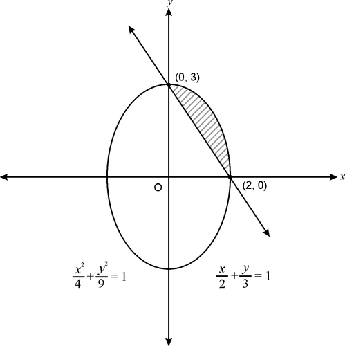

$$
\begin{align*}
\begin{array}{rcl}
\text{Area} &=& \int\limits_0^2 \left[\frac{3}{2} \sqrt{4-x^2} - \frac{3}{2} (2-x) \right] dx \\
&=& \frac{3}{2} \int\limits_0^2 \left[\sqrt{4-x^2} -2+x \right] dx \\
&=& \frac{3}{2} \left[\frac{x}{2} \sqrt{4-x^2}+\frac{4}{2} \sin^{-1} \frac{x}{2} - 2x +\frac{x^2}{2} \right]_0^2 \\
&=& \frac{3}{2} \left[0+2 \sin^{-1} 1-4 +2-0 \right] \\
&=& \frac{3}{2} \left[2 \times \frac{\pi}{2} -2 \right] \\
&=& \frac{3}{2} (\pi - 2) \ sq.units
\end{array}
\end{align*}
$$

#### Example 4

Using integration, find the area of the smaller region bounded by circle $x^2+y^2=4$ and line $x=1$.

**Solution:**

Required area is shaded and it is  symmetrical about $x$\-axis

Therefore,

$$
\begin{align*}
\begin{array}{rcl}
\text{Required Area} &=& 2 \int\limits_1^2 \sqrt{4-x^2} dx\\
&=& 2 \left[\frac{x}{2} \sqrt{4-x^2}+\frac{4}{2} \sin^{-1} \frac{x}{2} \right]_1^2\\
&=& 2 \left[0+2 \sin^{-1} 1 - \frac{\sqrt{3}}{2} - 2 \sin^{-1} \frac{1}{2} \right]\\
&=& 2 \left[2 \times \frac{\pi}{2} - \frac{\sqrt{3}}{2} - 2 \times \frac{\pi}{6} \right]\\
&=& 2 \left[\frac{2 \pi}{3} - \frac{\sqrt{3}}{2} \right]\\
&=& \frac{1}{3} [4 \pi - 3 \sqrt{3}] \ sq.units\\
\end{array}
\end{align*}
$$

#### Area Bounded Between Two Different Curves

#### Example 5

Using integration, find the area bounded by modulus function and parabola $x^2=4y$.

**Solution:**

Point of intersection of $y=x$ and $x^2=4y$ is can be calculated by solving both the equations as follows:

$$
\begin{align*}
\begin{array}{rcl}
x^2=4x & \Rightarrow & x^2-4x=0 \\
& \Rightarrow & x(x-4)=0 \\
& \Rightarrow & x=0, 4
\end{array}
\end{align*}
$$

$$
\begin{align*}
\begin{array}{rcl}
\text{Required Area} &=& 2 \int\limits_0^4 \left[x- \frac{x^2}{4} \right] dx \\
&=& 2 \left[\frac{x^2}{2} - \frac{x^3}{12} \right]_0^4 \\
&=& 2 \left[\frac{16}{2} - \frac{64}{12} \right] \\
&=& 2 \left[8- \frac{16}{3} \right] \\
&=& 2 \left[\frac{24-16}{3} \right] \\
&=& 2 \times \frac{8}{3} \\
&=& \frac{16}{3} \ sq.units \\
\end{array}
\end{align*}
$$

#### Example 6

Using integration, find area bounded by the following curves: $\left \{(x, y) : |x+1| \le y \le \sqrt{25-x^2} \right \}$

**Solution:**

Equations of the curve are: 

$y=|x+1|$  \[Modulus function having vertex at $(-1, 0)$\] and

$y=\sqrt{25-x^2}$ \[semi-circle having centre at $(0, 0)$ and $\text{radius} = 5 \ units$\]

Point of intersection of curves can be calculated as:

Using $y=x+1$ in $x^2+y^2=25$, we get

$$
\begin{align*}
\begin{array}{rcl}
x^2+(x+1)^2 &=& 25 \\
x^2+x^2+2x+1 &=& 25 \\
2x^2+2x-24 &=& 0 \\
x^2+x-12 &=& 0 \\
(x+4)(x-3) &=& 0 \\
x &=& 3, -4 \\
y &=& 4, 3
\end{array}
\end{align*}
$$

Hence, points of intersection are $(3, 4)$ and $(-4, 3)$.

$$
\begin{align*}
\begin{array}{rcl}
\text{Required Area} &=& \int\limits_{-4}^{3} \sqrt{25-x^2}dx -\int\limits_{-4}^{-1} -(x+1)dx - \int\limits_{-1}^{3} (x+1)dx \\
&=& \left[\frac{x}{2} \sqrt{25-x^2} + \frac{25}{2} \sin^{-1} \left(\frac{x}{5} \right) \right]_{-4}^{3} + \left[\frac{x^2}{2} + x \right]_{-4}^{-1} - \left[\frac{x^2}{2}+x \right]_{-1}^{3} \\
&=& \left[\left(6+ \frac{25}{2} \sin^{-1} \left(\frac{3}{5}\right)\right) - \left(\frac{4}{2} \times 3 + \frac{25}{2} \sin^{-1} \left(-\frac{4}{5} \right)\right)\right] + \left[\left(\frac{1}{2} -1 \right) - \left(\frac{16}{2}-4 \right)\right] - \left[\left(\frac{9}{2}+3 \right) -\left(\frac{1}{2}-1\right)\right] \\
&=& 12 + \frac{25}{2} \left(\sin^{-1} \frac{3}{5} + \sin^{-1} \frac{4}{5} \right) - \frac{9}{2} - 8 \\
&=& \frac{25}{2} \sin^{-1} \left[\frac{3}{5} \sqrt{1-\frac{16}{25}} + \frac{4}{5} \sqrt{1-\frac{9}{25}} \right] +12 - \frac{25}{2} \\
&=& \frac{25}{2} \sin^{-1} \left[\frac{3}{5} \cdot \frac{3}{5} + \frac{4}{5} \cdot \frac{4}{5} \right] - \frac{1}{2} \\
&=& \frac{25}{2} \sin^{-1} \left[\frac{9}{25} + \frac{16}{25} \right] - \frac{1}{2} \\
&=& \frac{25}{2} \sin^{-1} 1 - \frac{1}{2} \\
&=& \left(\frac{25}{2} \cdot \frac{\pi}{2} \right) - \frac{1}{2} \\
&=& \frac{1}{4} (25 \pi - 2) \ sq.units
\end{array}
\end{align*}
$$

#### Example 7

Using integration, find the area of the circle $x^2+y^2=8y$ which is exterior to the parabola $x^2=4y$

**Solution:**

Equation of circle is

$$
\begin{align*}
\begin{array}{rcl}
x^2+y^2 &=& 8y \\
\Rightarrow x^2+y^2-8y &=& 0 \\
\Rightarrow x^2+y^2-8y+16 &=& 16 \\
\Rightarrow (x-0)^2+(y-4)^2 &=& 4^2\\
\end{array}
\end{align*}
$$

Centre is $(0, 4)$ and $\text{radius}= 4$

Let's solve for $y$

$$
\begin{align*}
\begin{array}{rcl}
4y+y^2 &=& 8y \\
\Rightarrow y^2-4y &=& 0 \\
\Rightarrow y(y-4) &=& 0 \\
\Rightarrow y &=& 0, 4
\end{array}
\end{align*}
$$

$$
\begin{align*}
\begin{array}{rcl}
\text{Unshaded Area}&=& 2 \times \int\limits_0^4 2 \sqrt{y}dy + \int\limits_4^8 2 \sqrt{8y-y^2}dy \\
&=& 2 \times 2 \times \frac{2}{3} \left[y^{\frac{3}{2}} \right]_0^4 + 2 \int\limits_4^8 \sqrt{4^2-(y-4)^2} dy \\
&=& \frac{8}{3} \left[4^{\frac{3}{2}}-0 \right] + 2 \left[\frac{y-4}{2} \sqrt{4^2-(y-4)^2} + \frac{4^2}{2} \sin^{-1} \frac{y-4}{4} \right]_4^8 \\
&=& \frac{8}{3} \times 8 + 2 \left[2 \times 0 + 8 \sin^{-1} 1-0-8 \times 0 \right]\\
&=& \frac{64}{3} + 2 \left[8 \times \left[\frac{\pi}{2} \right]\right]\\
&=& \left[\frac{64}{3} + 8 \pi \right] \ sq.units
\end{array}
\end{align*}
$$

$$
\begin{align*}
\begin{array}{rcl}
\text{Shaded area} &=& \text{Area of circle} - \text{Unshaded area} \\
&=& \left[16 \pi - \frac{64}{3} - 8 \pi\right] \ sq.units \\
&=& \left[8 \pi - \frac{64}{3} \right] \ sq.units
\end{array}
\end{align*}
$$

#### Areas Bounded Under Two Same Type of Curves

#### Example 8

Find area bounded between two parabolas $x^2=4y$ and $y^2=4x$

**Solution:**

Point of intersection $x^2=4y$ and $y^2=4x$

$$
\begin{align*}
\begin{array}{rcl}
\Rightarrow x^4 &=& 16y^2 \\
\Rightarrow x^4 &=& 16(4x) \\
\Rightarrow x^4 &=& 64x \\
\Rightarrow x(x^3-64) &=& 0 \\
\Rightarrow x &=& 0, 4 \\
\Rightarrow y &=& 0, 4
\end{array}
\end{align*}
$$

$$
\begin{align*}
\begin{array}{rcl}
\text{Required Area} &=& \int\limits_0^4 \left[2 \sqrt{x} - \frac{x^2}{4} \right] dx\\
&=& 2 \times \frac{2}{3} \left[x^{\frac{3}{2}} \right]_0^4 - \frac{1}{12} \left[x^3 \right]_0^4 \\
&=& \frac{4}{3} \times 8 - \frac{1}{12} \times 64 \\
&=& \frac{32}{3} - \frac{16}{3} \\
&=& \frac{16}{3} \ sq.units
\end{array}
\end{align*}
$$

#### Example 9

Using integration, find area enclosed between two circles given by

$$
\{(x, y):x^2+y^2 \le 9, (x-3)^2 + y^2 \le 9 \}
$$

**Solution:**

The inequalities represent interior of both the circles. Equations of curves are

$$
\begin{align*}
\begin{array}{rcl}
x^2+y^2 &=& 9 \qquad \qquad (1) \\
(x-3)^2+y^2 &=& 9 \qquad \qquad (2) \\
\end{array}
\end{align*}
$$

Comparing (1) and (2)

$$
\begin{align*}
\begin{array}{rcl}
x^2 &=& (x-3)^2 \\
&=& x^2-6x+9 \\
6x-9 &=& 0\\
x &=& \frac{3}{2}
\end{array}
\end{align*}
$$

$$
\begin{align*}
\begin{array}{rcl}
\text{Required Area} &=& 2 \times \text{Area in I quadrant} \\
&=& 2 \left[\int\limits_0^{\frac{3}{2}} \sqrt{9-(x-3)^2} dx+ \int\limits_{\frac{3}{2}}^3 \sqrt{9-x^2} dx \right]\\
&=& 2 \left[\frac{x-3}{2} \sqrt{9-(x-3)^2} + \frac{9}{2} \sin^{-1} \left[\frac{x-3}{3} \right] \right]_0^{\frac{3}{2}} + 2 \left[\frac{x}{2} \sqrt{9-x^2} + \frac{9}{2} \sin^{-1} \frac{x}{3} \right]_{\frac{3}{2}}^3 \\
&=& 2 \left[- \frac{3}{4} \times \frac{3 \sqrt{3}}{4} + \frac{9}{2} \sin^{-1} \left[-\frac{1}{2} \right] - \frac{9}{2} \sin^{-1}(-1) \right] + 2 \left[0+\frac{9}{2} \sin^{-1} - \frac{3}{4} \times \frac{3 \sqrt{3}}{4} - \frac{9}{2} \sin^{-1} \left[\frac{1}{2} \right] \right] \\
&=& 2 \left[- \frac{9 \sqrt{3}}{4} + \frac{9}{2} \left[-\frac{\pi}{6} \right] - \frac{9}{2} \left[-\frac{\pi}{2} \right] + \frac{9}{2} \left[\frac{\pi}{2}  \right] - \frac{9 \sqrt{3}}{4} - \frac{9}{2} \left[\frac{\pi}{6}  \right]  \right] \\
&=& 2 \left[- \frac{18 \sqrt{3}}{4} + 9 \left[\frac{\pi}{2} \right] - \frac{9}{2} \left[\frac{\pi}{6} \right]\right] \\
&=& 2 \left[- \frac{9}{2} \sqrt{3} + \frac{9 \pi}{2} \left[1- \frac{1}{6} \right] \right] \\
&=& - 9 \sqrt{3} + 9 \pi \left[\frac{5}{6} \right]\\
&=& \left[\frac{15 \pi}{2} - 9 \sqrt{3} \right] \ sq. units \\
\end{array}
\end{align*}
$$

#### Example 10

Using integration, find area of the triangle having vertices (1, 2), (4, 4) and (2, 6).

**Solution:**

Equation of AB:

$$
\begin{align*}
\begin{array}{rcl}
y-2 &=& \frac{4-2}{4-1} (x-1 )\\
\Rightarrow y &=& \frac{2}{3} x + \frac{4}{3}
\end{array}
\end{align*}
$$

Equation of BC:

$$
\begin{align*}
\begin{array}{rcl}
y-4 &=& \frac{6-4}{2-4} (x-4) \\
\Rightarrow y &=& 8-x
\end{array}
\end{align*}
$$

Equation of AC:

$$
\begin{align*}
\begin{array}{rcl}
y-2 &=& \frac{6-2}{2-1} (x-1) \\
\Rightarrow y &=& 4x-2
\end{array}
\end{align*}
$$

$$
\begin{align*}
\begin{array}{rcl}
\text{Area} (\Delta ABC) &=& \int\limits_1^2 AC + \int\limits_2^4 BC - \int\limits_1^4 AB \\
&=& \int\limits_1^2 (4x-2) dx + \int\limits_2^4 (8-x) dx - \int\limits_1^4 \left[\frac{2}{3} x + \frac{4}{3} \right] dx \\
&=& \left[\frac{4x^2}{2} - 2x \right]_1^2 + \left[8x - \frac{x^2}{2} \right]_2^4 - \left[\frac{2}{3} \frac{x^2}{2} + \frac{4}{3} x \right]_1^4 \\
&=& \left[2 \times 4 - 4 \right] - \left[2-2 \right] + \left[32-8 \right] - \left[16-2 \right] - \left[\frac{16}{3} + \frac{16}{3} \right] +  \left[\frac{1}{3} + \frac{4}{3} \right] \\
&=& 4-0+24-14- \frac{32}{3} + \frac{5}{3} \\
&=& 14-\frac{27}{3} \\
&=& 14-9 \\
&=& 5 \ sq.units
\end{array}
\end{align*}
$$

#### Multimedia Links

For a video presentation of the area between two graphs **(14.0)(16.0)**, see https://www.youtube.com/watch?v=E_1aDcOoDtE (6:12).

!?[Watch the video at](https://www.youtube.com/watch?v=E_1aDcOoDtE)

For an additional video presentation of the area between two curves (14.0)(16.0), see https://www.youtube.com/watch?v=DRFyNHdVgUA (9:51).

!?[Watch the video at](https://www.youtube.com/watch?v=DRFyNHdVgUA)

</article>

### 9.4 Summary

<article>

#### Summary

!?[Watch the video at](https://www.youtube.com/watch?v=hxcUaUkzi-0)

!?[Watch the video at](https://www.youtube.com/watch?v=Q7beneBGM6M)

!?[Watch the video at](https://www.youtube.com/watch?v=de-0e0nYf5I)

!?[Watch the video at](https://www.youtube.com/watch?v=0RdI3-8G4Fs)

</article>

### 9.5 Self Assessments

<article>

#### Assessment 1

**Area Bounded Under Simple Curves**

Using integration, evaluate the following areas, bounded under curves:

1. $y=x^3$, $x=-2$, $x=5$

2. $y=\cos \ x$

3. $y=x^2+y^2=16$

4. $y^2=12x$, $x=y$

5. $\frac{x^2}{4}+\frac{y^2}{9}=1 \ \text{and} \ \frac{x}{2}+\frac{y}{3}=1$

**Find the area between the curve and the x-axis:**

6. Curve _$y = x$_ on the interval $x = 1$ to $x = 3$.

7. Curve $y = -x$ from $x = 1$ to $x = 3$.

**Find the Area Under the Curve**

8. $y = 3x + 1$ on \[1, 5\]

9. $y = \frac{1}{x}$ on \[3, 4\]

10. $y = 2x + 4$ on \[5, 6\]

#### Assessment 2

**Area Bounded Between Two Curves**

In problems #1 - 7, sketch the region enclosed by the curves and find the area.

1. $y = x^2 , y = \sqrt{x},$ on the interval $[0.25, 1]$

2. $y = 0,$ $y = \cos 2x,$ on the interval $\left [\frac{\pi} {4} , \frac{\pi} {2} \right]$

3. $y = |- 1 + x| + 2,$ $y = \frac{-1} {5} x + 7$

4. $y = \cos x,$ $y = \sin x,$ $x = 0,$ $x = 2\pi$

5. $x = y^2,$ $y = x - 2,$ integrate with respect to $y$

6. $y^2 - 4x = 4,$ $4x - y = 16$ integrate with respect to $y$

7. $y = 8 \cos x,$ $y = sec^2 x,$ $-\pi / 3 \le x \le \pi / 3$

8. Find the area enclosed by $x = y^3$ and $x = y.$

9. If the area enclosed by the two functions $y = k \cos x$ and $y = kx^2$ is $2,$ what is the value of $k$?

10. Find the horizontal line $y = k$ that divides the region between $y = x^2$ and $y = 9$ into two equal areas.

Using integration, evaluate the following areas, bounded under curves:

11. $\{(x, y) : x^2+y^2 \le 4 \le x+y \}$

12. $y^2=12x$ and $x^2=12y$

13. $x^2+y^2=4$ and $(x-1)^2+y^2=4$

14. Triangle having vertices (-3, 1), (2, 4) and (5, 3)

15. $\left \{(x, y) : |x-1| \le y \le \sqrt{4-x^2} \right \}$

16. Sketch _$y = x^2$_ and _$y = x$_ on the same coordinate system and then find the area of the region enclosed between them.

</article>

### 9.6 Home Assignments

<article>

#### Assignment 1

**Area Under Simple curves**

NCERT Exercise No. 8.1

Q.No. 2, 5, 7, 11, 12

#### Assignment 2

**Area Between Two Curves**

NCERT Exercise No. 8.2

Q. No. 5, 6, 7

#### Assignment 3

**Miscellaneous Examples**

NCERT Miscellaneous Exercise

Q. No. 1, 3, 7, 8, 13, 14, 16

</article>

### 9.7 References for Basic Understanding

<article>

#### Calculation of Definite Integrals

http://www.ck12.org/book/CK-12-Calculus/section/4.5/

</article>

## 10.0 Differential Equations

### 10.1 Introduction

<article>

Differential equations appear in almost every area of daily life including science, business, and many others. _Differential equation_ is a relation on a function $y$ of one independent variable $x$ and the derivatives of $y$ with respect to $x$, i.e. $y^{(n)} = F(x, y,  y' , \ldots .,y^{(n - 1)})$. For example, $y'' + (y' )^2 + y = x$.

#### Multimedia Link

!?[Watch the video at](https://www.youtube.com/watch?v=UUCN68SIDNI)

</article>

### 10.2 Order and Degree of a Differential Equation

<article>

Students can refer to the following link to study order and degree of a differential equation:

* http://www.solitaryroad.com/c650.html

</article>

### 10.3 General and Particular Solution of a Differential Equation

<article>

Differential equations are important parts of the study of economics, biology, engineering and physics. Because differential equations can describe exponential growth and decay, they are very useful in modeling the decay of radioactive isotopes, the population growth of species or the change in investment return over time. Did you know that many of the equations that describe major concepts in physics and engineering are differential equations? Can you explain how Newton's Second Law (“force equals mass times acceleration”) is a differential equation?

#### Watch This

!?[Watch the video at](https://www.youtube.com/watch?v=miUvp2TCCd8)

#### Guidance

Recall from the previous concept that the determination of an antiderivative was introduced as an integral equation

$$
\int f(x)dx=F(x)+C.
$$

Here we have a function $f(x)$ that we integrate to find the antiderivative function $F(x)$ such that $F^\prime(x)=f(x)$. The equation $F^\prime(x)=f(x)$ is called a **_differential equation._**

Problems in calculus are often presented as differential equations.

#### Example A

Solve the general differential equation: $f^\prime(x)=x^{\frac{2}{3}}+\sqrt{x}$.

**Solution:**

We solve the equation by integrating the right side of the equation and have

$$
f(x)=\int f^\prime (x) dx=\int x^{\frac{2}{3}} dx+\int \sqrt{x}dx.
$$

We can integrate both terms using the power rule, first noting that $\sqrt{x}=x^{\frac{1}{2}}$, and have

$$
f(x)=\int x^{\frac{2}{3}}dx+\int x^{\frac{1}{2}}dx=\frac{3}{5}x^{\frac{5}{3}}+\frac{2}{3}x^{\frac{3}{2}}+C.
$$

Notice the constant of integration $C$ is included in the above **_general solution_** because without further information there are an infinite number of solutions. More problem information is needed in order to pick a specific value for $C$.

#### Example B

Suppose we wish to solve the following equation: $f^\prime(x)=e^{3x}-6 \sqrt{x}.$

**Solution:**

We can solve the equation by integration and we have

$$
f(x)=\frac{1}{3}e^{3x}-4x^{\frac{3}{2}}+C.
$$

We note that there are an infinite number of solutions. In some applications, we would like to designate exactly one solution. In order to do so, we need to impose a condition on the function $f$. We can do this by specifying the value of $f$ for a particular value of $x$.

In this problem, suppose that we add the condition that $f(0)=1$. This will specify exactly one value of $C$ and thus one particular solution of the original equation:

Substituting $f(0)=1$ into our general solution $f(x)=\frac{1}{3}e^{3x}-4x^{\frac{3}{2}}+C$ gives

$$
\begin{align*}
f(0) &=1=\frac{1}{3}e^{3(0)}-4(0)^{\frac{3}{2}}+C \ or \\
C &=1-\frac{1}{3}=\frac{2}{3}.
\end{align*}
$$

Hence the solution $f(x)=\frac{1}{3}e^{3x}-4x^{\frac{3}{2}}+\frac{2}{3}$ is the **_particular solution_** of the original equation $f^\prime(x)=e^{3x}-6 \sqrt{x}$ satisfying the **_initial condition_** $f(0)=1$.

#### Concept Question Wrap-up

Recall the question at the start of the lesson: Can you explain how Newton's Second Law (“force equals mass times acceleration”) is a differential equation?

Newton’s Second Law is simply: $F=ma=m \frac{dv}{dt}=m \frac{d^2 x}{dt^2}$ where the acceleration $a$ can be expressed as the first derivative of velocity, or the second derivative of position.

#### Guided Practice

Solve the general differential equation $f^\prime(x)=x^2-4$ with the condition that $f(1)=-3$. 

**Solution:**

We solve the equation by integrating the right side of the equation and have

$$
f(x)=\int f^\prime (x)dx=\int x^2 dx- \int 4 dx.
$$

We can integrate both terms and have

$$
f(x)=\int x^2 dx-\int 4dx=\frac{x^3}{3}-4x+C
$$

Notice the constant of integration $C$ is included in the above **_general solution_**, but there is more information that we have not used: $f(1)=-3$. The solution is now shaped by the constraint or initial condition to be$f(1)=\frac{(1)^3}{3}-4(1)+C=-3$ which is satisfied if $C=\frac{2}{3}$.

The particular solution to the differential equation is $f(x)=\frac{x^3}{3}-4x+\frac{2}{3}$.

#### Practice

In problems #1-3, solve the differential equation for $f(x)$.

1. $f^\prime(x)=4x^3-3x^2+x-3$.

2. $f^\prime(x)=2e^{2x}-2 \sqrt{x}$.

3. $f^\prime(x)=\sin x-\frac{1}{e^x}$.

In problems #4-7, solve the differential equation for $f(x)$ given the initial condition.

4. $f^\prime(x)=6x^5-4x^2+\frac{7}{3}$ and $f(1)=4$.

5. $f^\prime(x)=3x^2+e^{2x}$ and $f(0)=3$.

6. $f^\prime(x)=\sqrt[3]{x^2}-\frac{1}{x^2}$ and $f(1)=3$.

7. $f^\prime(x)=-4x^3+12x^2-8x$ and $f(2)=7$.

</article>

### 10.4 Formation of Differential Equation

<article>

Students can refer to the following link:

* http://www.tutorvista.com/content/math/calculus/differential-equations/formation-differential-equation.php

</article>

### 10.5 Solution of Differential Equation with Variable Separable

<article>

Students can refer to the following videos:

!?[Watch the video at](https://www.youtube.com/watch?v=C5-lz0hcqsE)

!?[Watch the video at](https://www.youtube.com/watch?v=DL-ozRGDlkY)

</article>

### 10.6 Solution of Homogeneous Differential Equation

<article>

Students can refer to the following video:

!?[Watch the video at](https://www.youtube.com/watch?v=9Wfn-WWV1aY)

</article>

### 10.7 Solution of Linear Differential Equation

<article>

Students can refer to the following videos:

!?[Watch the video at](https://www.youtube.com/watch?v=jXjtHnaJdyQ)

!?[Watch the video at](https://www.youtube.com/watch?v=-Y-8tP0Pa_4)

</article>

### 10.8 Applications of Differential Equation

<article>

Students can refer to the following link:

* http://www.analyzemath.com/calculus/Differential_Equations/applications.html

</article>

### 10.9 Summary

<article>

Students can revise the entire chapter along with formulae, examples and some practice questions, by using the following link:

* http://www.textbooksonline.tn.nic.in/books/12/std12-bm-em-2.pdf

(Refer to page number: 1-28)

</article>

### 10.10 Self Assessments

<article>

#### Assessment 1

##### Solution of Differential Equation with Variable Separable

http://www.ck12.org/calculus/Differential-Equations-and-Integration/asmtpractice/Differential-Equations-and-Integration-Practice/?referrer=concept_details

</article>

### 10.11 Home Assignments

<article>

#### Assignment 1

##### Order and Degree of a Differential Equation

NCERT Exercise No. 9.1

Q. No. 2, 4, 6, 8, 10

#### Assignment 2

##### General and Particular Solution of a Differential Equation

NCERT Exercise No. 9.2

Q. No. 2, 3, 5, 8, 9

#### Assignment 3

##### Formation of Differential Equation

NCERT Exercise No. 9.3

Q. No. 2, 4, 7, 11

#### Assignment 4

##### Solution of Differential Equation with Variable Separable

NCERT Exercise No. 9.4

Q. No. 2, 4, 6, 8, 12

#### Assignment 5

##### Solution of Homogeneous Differential Equation

NCERT Exercise No. 9.5

Q. No. 2, 3, 5, 8, 12, 14

#### Assignment 6

##### Solution of Linear Differential Equation

NCERT Exercise No. 9.6

Q. No. 2, 3, 5, 7, 11, 14, 15

#### Assignment 7

##### Miscellaneous Examples

NCERT Miscellaneous Exercise

Q. No. 1, 2, 6, 8, 9, 13

</article>

## 11.0 Vector Algebra

### 11.1 Introduction

<article>

Have you ever seen a hang glider leap off of the top of a cliff or mountain? Did you know that there is a lot of math in hang gliding? What type of math is used? How is it calculated and why does it make a difference? Well, when you think about force and direction and speed, you have to think about vectors. Vector analysis is used to describe the strength of various forces. Think about that hang glider again. The wind lifts it up into the air. The flyer navigates the winds to keep himself aloft - then using the forces of nature finds a way for a smooth landing. Vectors - direction, magnitude and mathematics in flight**!**

</article>

### 11.2 Position Vector, Direction Cosines and Ratios

<article>

#### Two-Dimensional Vectors

Varun was telling Tanya about his trip across the river earlier that day. If he wanted to be accurate and describe how the current made it very difficult for him to actually drive straight across, how could he clearly show the different forces of the motor on his boat pushing one way and the current pushing another? Specifically, how could he show that the boat was crossing the stream at 35 km/hr, and the current was pushing him downstream at 25 km/hr?

#### Basic Properties of Vectors

An airplane being pushed off course by wind and a swimmer’s movement across a moving river are both examples of vectors in action. Points in the coordinate plane describe location. Vectors, on the other hand, have no location and indicate only direction and magnitude. Vectors can describe the strength of forces like gravity or speed and direction of a ship at sea. Vectors are extremely useful in modeling complex situations in the real world.

#### Vector Direction

Ambika loves physics, it fascinates her that there are calculations for all of the physical interactions and motions in the world around her. On Friday, Ambika went to the county fair with her friend Kamal, who decided it would be great if he could win her a giant stuffed animal in the can knockdown game. Unfortunately for Kamal, he still had not knocked anything over approximately 45 mins and Rs.100 later.

Ambika decides to give it a try herself, and realizes that the center of the cans is a single position in space. If Ambika knows her own throwing height, and the distance that the cans are stacked behind the throwing line, what else would she need to know to calculate the vectors involved with a straight-line path for the ball to take? How would she calculate them?

#### Three-Dimensional Positions

#### Guidance

The rectangular (or Cartesian) coordinate system is used to describe a plane divided into four **_quadrants_**, as shown below left. (Note, the colored squares are used to help you visualize the space, remember that the coordinate planes actually extend outward toward infinity.)

The Cartesian coordinate system use to describe three-dimensional space consists of an origin and six open axes, $+z$ and $-z$ are perpendicular to the $x-y$ plane. These axes define three planes which divide the space into eight parts knowns as **_octants_** as shown above right. Think of these planes as cutting space three ways: left to right, top to bottom, and front to back.

By convention, we number the four quadrants of the $x-y$ plane in this way: points in quadrant 1 have $+x$ and $+y$ coordinates, those in quadrant 2 have $-x$ and $+y$, those in quadrant 3 have $-x$ and $-y$, and those in quadrant 4 have $+x$ and $-y$. There is currently no standardized numbering system for the octants in three-dimensional space, although most people identify the region with $+x$, $+y$, and $+z$ as the first octant. The method used to identify the octants is to indicate verbally the portion of space they occupy. For example, the first octant could also be identified as (top, front, right).

Position vectors in 3D space are still represented by arrows that begin at the origin and end at the point in question. The diagram above shows a point, $P$, located in the front, lower, right octant. The three components of the position vector ($P_x, P_y$ and $P_z$) are shown in the diagram. According to the Pythagoras Theorem, the magnitude of the position vector is given by:

$$
|\overrightarrow{P}| = \sqrt{P_x^2 + P_y^2 + P_z^2}
$$

#### Example A

Zakir is enjoying an afternoon at the local skate-park. The diagram below shows his starting position and his ending position at the highest point on the new hill.

Choose two different coordinate systems which could describe this system. Find Zakir's initial and final position vectors in each of the two coordinate systems. Then identify the displacement vector from his starting position to his final position at the top of the hill.

**Solution:**

One possible origin of coordinates is located at Zakir's starting position. In this case, the initial position vector is given by $\overrightarrow{r_i} = \left \langle 0m, 0m, 0m \right \rangle$ and his final position is given by $\overrightarrow{r_f} = \left \langle 6.1m, 2.3m, 0m \right \rangle$. Zakir's displacement is the difference between these two vectors, $\overrightarrow{\triangle r} = \overrightarrow{r_f} - \overrightarrow{r_i} = \left \langle 6.1m, 2.3m, 0m \right \rangle - \left \langle 0m, 0m, 0m \right \rangle = \left \langle 6.1m, 2.3m, 0m \right \rangle$

Another possible origin of coordinates is at the point marked O in the diagram below. In this case his original position is given by $\overrightarrow{r_i} = \left \langle -6.1m, 0m, 0m \right \rangle$ and his final position is given by $\overrightarrow{r_f} = \left \langle 0m, 2.3m, 0m \right \rangle$. Zakir’s displacement is the difference between these two vectors, $\overrightarrow{\triangle r} = \overrightarrow{r_f} - \overrightarrow{r_i} = \left \langle 0m, 2.3m, 0m \right \rangle - \left \langle -6.1m, 0m, 0m \right \rangle = \left \langle 6.1m, 2.3m, 0m \right \rangle$

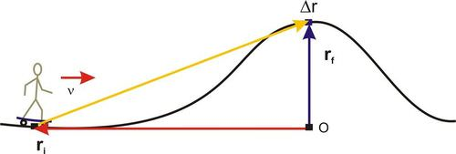

Note that the position vectors representing this motion depend on the choice of coordinate system, but the displacement vector is independent of the coordinate system.

</article>

### 11.3 Types of Vectors

<article>

Students can refer to the following links to study types of vectors: 

* https://gyaunnrraje.wordpress.com/tag/types-of-vectors/

!?[Watch the video at](https://www.youtube.com/watch?v=kKXVkTwoxsM)

### Section Formula:

Students can refer to the following links to section formula for vectors:

* http://aieee.examcrazy.com/Maths/Vectors-Algebra/Example_problems_on_vectors_and_section_formula.asp

!?[Watch the video at](https://www.youtube.com/watch?v=WU9UNEdpvf4)

### Midpoint Formula

#### Positions and Midpoints in Two Dimensions

A digital graphic artist is designing a new company logo. Currently she is sketching a sample on graph paper to show her client, and needs to find the center of the text she has drawn so she can line up the artwork properly.

If she knows that the first letter starts 10 boxes up and 5 boxes over from the bottom-left corner of the page, and the last letter ends 12 boxes up and 32 boxes over from the same corner, how could she find the center?

---

#### Watch This

!?[Watch the video at](https://www.youtube.com/watch?v=1Hf_bWSQsuc)

#### Guidance

**Using the Coordinate System Efficiently**

In the past, as you used the coordinate system for graphing in algebra and geometry, you probably became very familiar with the $x/y$ axes running left/right and up/down on the page, with _0_ in the center. In more advanced mathematics, and in physics or other motion studies, you will find that it is often much simpler to move the **graph** to line up with one vector than to align all of the vectors you are calculating with the standard orientation.

By aligning one of multiple vectors with either the $x$ or $y$ axis, and/or setting the origin of your graph at the start of a vector, you minimize the complexity of your calculations.

**Vectors Between Two Points**

A **_displacement vector_** represents motion beginning at one point and ending at another. In the diagram below, vector $C$ starts at point $A$ and ends at point $B$. This means that $\overrightarrow{A} + \overrightarrow{C} = \overrightarrow{B}$ and $\overrightarrow{C} = \overrightarrow{B} - \overrightarrow{A}$. In this case, $\overrightarrow{A} = \left \langle 1, 3 \right \rangle$ and $\overrightarrow{B} = \left \langle 3, 2 \right \rangle$, therefore $\overrightarrow{C} = \left \langle (3 - 1), (2 - 3) \right \rangle = \left \langle 2, - 1 \right \rangle$ matching what we can see in the diagram.

**Vector to a Point Between Two Points**

Computer graphics artists frequently need to know the location of a point which lies midway between two other points. Once we know the position vectors for two discrete points, we can determine the midpoint between them using their coordinates. Specifically, the midpoint between points $A$ and $B$ is the “average” of the two positions, therefore the coordinates of the midpoint are given by $x_{mp} = \frac{1}{2} (x_A + x_B), \ y_{mp} = \frac{1}{2} (y_A + y_B)$, and $z_{mp} = \frac{1}{2} (z_A + z_B)$ and the **position vector** for the midpoint can be written as $P_{mp} = \left \langle x_{mp}, y_{mp}, z_{mp} \right \rangle$. The vector from any other point to this midpoint can then be calculated using the method described in our discussion of displacement vectors.

---

#### Example A

The motion of an object along an inclined plane is a very common problem in introductory physics. The diagram below shows one such situation.

Sharad has taken his niece Priya to the park and waves to her as she plays on the slide. Choose two coordinate systems that could be used to describe Priya’s motion and identify the position vectors for points A and B in both coordinate systems.

**Solution:**

If we want to describe Priya’s motion as she moves from point $A$ to point $B$ along the slide, we could use a standard horizontal and vertical coordinate system with the origin at the base of the slide’s ladder, but then the vector describing her motion would have components in both the $x$ and $y$ directions. Our mathematical description of her motion can be greatly simplified if we choose point $A$ to be the origin and if we rotate the coordinate system such that the $x$\-axis is parallel to the slide and the $y$\-axis is perpendicular to the slide. Now Priya’s motion from point $A$ to point $B$ is only along the $x$\-axis. Note, other choices of origin are possible.

Once we have identified an origin and coordinate axes for of our reference frames, we can use vector notation to identify the location of points $A$ and $B$. The position vector for point $A$ is the vector starting at the origin and ending at point $A$, $\overrightarrow{OA}$. For the standard coordinate system shown on the left above, the position vectors $\overrightarrow{OA}$ and $\overrightarrow{OB}$ are shown on the left below. For the rotated coordinate system, shown on the right above, the position vector $\overrightarrow{OA} = 0$ and $\overrightarrow{OB} = \overrightarrow{AB}$.

---

#### Example B

Determine the coordinates and magnitude of the vector, $D$, beginning at the point $\overrightarrow{P_1} = \left \langle 12, 7 \right \rangle$ and ending at $\overrightarrow{P_2} = \left \langle 8, 10 \right \rangle$.

**Solution:**

The displacement vector $D$ is the difference between the two position vectors:

$$
D = \left \langle P_{2x} - P_{1x}, P_{2y} - P_{1y} \right \rangle = \left \langle 8 - 12, 10 - 7 \right \rangle = \left \langle -4, 3 \right \rangle
$$

The magnitude of the vector, $D$, can be found using the Pythagoras theorem:

$$
|\overrightarrow{D}| = \sqrt{(-4)^2 + (3)^2} = \sqrt{25} = 5
$$

#### Example C

Determine the position vector identifying the midpoint between points $\overrightarrow{P_1} = \left \langle 12, 7 \right \rangle$ and $\overrightarrow{P_2} = \left \langle 8, 10 \right \rangle$.

**Solution:**

Since these two points are located in the $x-y$ plane, the $x$\-coordinate of the midpoint is given by

$x_{mp} = \frac{1}{2} (x_A + x_B) = \frac{1}{2}(12 + 8) = 10$

and the $y$\-coordinate of the midpoint is given by

$y_{mp} = \frac{1}{2} (y_A + y_B) = \frac{1}{2}(7 + 10) = 8.5$.

Therefore the position vector for this midpoint can be written a

$$
P_{mp} = \left \langle 10,8.5 \right \rangle
$$

**_Concept question wrap-up:_**

“If she knows that the first letter starts 10 boxes up and 5 boxes over from the bottom-left corner of the page, and the last letter ends 12 boxes up and 32 boxes over from the same corner, how could she find the center?”

This is a midpoint question, so the _x_ coordinate calculation is: $x_{mp} = \frac{1}{2} (x_A + x_B) = \frac{1}{2}(5 + 32) = 18.5$

and the y-coordinate of the midpoint is given by: $y_{mp} = \frac{1}{2} (y_A + y_B) = \frac{1}{2}(10 + 12) = 11$

The coordinate of the center is: $18.5, 11$.

#### Guided Practice

1. Identify the position vectors for the three points shown on the grid below.

2. The diagram shows two positions of a bicycle as it moves along a long straight road. Two possible coordinate systems for the motion are shown below. Determine the position vectors in each of the two coordinate systems for the bicycle at points $A$ and $B$. Then determine the displacement vector from $A$ to $B$ in each case. (Not drawn to scale.)

3. Identify the position vectors for the three points shown in the diagram below.

#### Answers:

1. The position vectors begin at the origin, (0, 0) and end at each point: $\overrightarrow{OA} = \left \langle -3, 1 \right \rangle, \ \overrightarrow{OB} = \left \langle 1, 2 \right \rangle$ and :$\overrightarrow{OC} = \left \langle 2.5, 0 \right \rangle$

2. The diagram shows two positions of a bicycle as it moves along a long straight road. Two possible coordinate systems for the motion are shown below. Determine the position vectors in each of the two coordinate systems for the bicycle at points $A$ and $B$. Then determine the displacement vector from $A$ to $B$ in each case.

For the upper coordinate system, the position vector of the bicycle at point $A$ is given by $\overrightarrow{r_A} = \left \langle -300m, 0, 0 \right \rangle$ and that at point $B$ is given by $\overrightarrow{r_B} = \left \langle 100m, 0, 0 \right \rangle$. This gives a displacement of $\overrightarrow{\triangle r_{A-B}} = \left \langle (100m - (-300m)), (0 - 0), (0 - 0)\right \rangle = \left \langle 400m, 0, 0 \right \rangle .$

For the upper coordinate system, the position vector of the bicycle at point $A$ is given by $\overrightarrow{r_A} = \left \langle 100m, 0, 0 \right \rangle$ and that at point $B$ is given by $\overrightarrow{r_B} = \left \langle 500m, 0, 0 \right \rangle$. This gives a displacement of $\overrightarrow{\triangle r_{A-B}} = \left \langle (500m - 100m), (0 - 0), (0 - 0)\right \rangle = \left \langle 400m, 0, 0 \right \rangle .$

The position vectors for the bicycle at point $A$ are shown in red and the position vectors for point $B$ are shown in blue. The displacement vector between points $A$ and $B$ is shown in gold. As you can see, the position vectors representing this motion depend on the choice of coordinate system, but the displacement vector is independent of the coordinate system. No matter how we define the origin, the bike moves 400 m in the $+x$ direction and does not move in the $y$ or $z$ direction.

3. Identify the position vectors for the three points shown in the diagram below.

$\overrightarrow{r_A} = \left \langle -2.63, 2.63, 0 \right \rangle, \ \overrightarrow{r_B} = \left \langle 3, 1.75, 0 \right \rangle, \ \overrightarrow{r_C} = \left \langle 0.25,1,0 \right \rangle$

#### Explore More

Determine the coordinates and magnitude of the displacement vector, $D$, beginning at the point $\overrightarrow{P_1}$ and ending at $\overrightarrow{P_2}$.

1. $\overrightarrow{P_1} = \left \langle 25, 3 \right \rangle$ and ending at $\overrightarrow{P_2} = \left \langle 8, 11 \right \rangle$

2. $\overrightarrow{P_1} = \left \langle 5, 3 \right \rangle$ and ending at $\overrightarrow{P_2} = \left \langle 7, 9 \right \rangle$

3. $\overrightarrow{P_1} = \left \langle 21, 18 \right \rangle$ and ending at $\overrightarrow{P_2} = \left \langle 4, 15 \right \rangle$

4. $\overrightarrow{P_1} = \left \langle 8, 5 \right \rangle$ and ending at $\overrightarrow{P_2} = \left \langle 5, 8 \right \rangle$

5. $\overrightarrow{P_1} = \left \langle 16, 25 \right \rangle$ and ending at $\overrightarrow{P_2} = \left \langle 9, 11 \right \rangle$

6. $\overrightarrow{P_1} = \left \langle 14, 3 \right \rangle$ and ending at $\overrightarrow{P_2} = \left \langle 23, 20 \right \rangle$

7. $\overrightarrow{P_1} = \left \langle 11, 4 \right \rangle$ and ending at $\overrightarrow{P_2} = \left \langle 15, 11 \right \rangle$

8. $\overrightarrow{P_1} = \left \langle 23, 13 \right \rangle$ and ending at $\overrightarrow{P_2} = \left \langle 1, 17 \right \rangle$

Determine the position vector identifying the midpoint between points $\overrightarrow{P_1}$ and $\overrightarrow{P_2}$.

9. $\overrightarrow{P_1} = \left \langle 17, 6 \right \rangle$ and $\overrightarrow{P_2} = \left \langle 18, 12 \right \rangle$

10. $\overrightarrow{P_1} = \left \langle 2, 5 \right \rangle$ and $\overrightarrow{P_2} = \left \langle 1, 9 \right \rangle$

11. $\overrightarrow{P_1} = \left \langle 24, 7 \right \rangle$ and $\overrightarrow{P_2} = \left \langle 21, 10 \right \rangle$

12. $\overrightarrow{P_1} = \left \langle 12, 9 \right \rangle$ and $\overrightarrow{P_2} = \left \langle 2, 20 \right \rangle$

13. $\overrightarrow{P_1} = \left \langle 15, 17 \right \rangle$ and $\overrightarrow{P_2} = \left \langle 18, 1 \right \rangle$

14. $\overrightarrow{P_1} = \left \langle 22, 14 \right \rangle$ and $\overrightarrow{P_2} = \left \langle 23, 8 \right \rangle$

15. $\overrightarrow{P_1} = \left \langle 1, 7 \right \rangle$ and $\overrightarrow{P_2} = \left \langle 14, 21 \right \rangle$

16. $\overrightarrow{P_1} = \left \langle 3, 9 \right \rangle$ and $\overrightarrow{P_2} = \left \langle 8, 1 \right \rangle$

</article>

### 11.4 Addition of Vectors

<article>

You and a friend are pulling a box across a floor. However, each of you is pulling at a different angle. A diagram of your efforts looks like this:

Each of these forces is a vector. Can you determine the net force you and your friend are applying to the box? To find the net result of the effort, you need to add the vectors for each of the forces. By the end of this Concept, you'll be able to accomplish this.

#### Watch This

!?[Watch the video at](https://www.youtube.com/watch?v=NaMBAihHBwo)

#### Guidance

The sum of two or more vectors is called the **resultant** of the vectors. There are two methods we can use to find the resultant: the parallelogram method and the triangle method.

**_The Parallelogram Method:_** To use the parallelogram method, we draw the vectors so that their initial points meet. Then, we draw in lines to form a parallelogram. The resultant is the diagonal from the initial point to the opposite vertex of the parallelogram. _It is important to note that we cannot use the parallelogram method to find the sum of a vector and itself_.

To find the sum of the resultant vector, we would again use a ruler and a protractor to find the magnitude and direction.

If you look closely, you’ll notice that the parallelogram method is really a version of the triangle or tip-to-tail method. If you look at the top portion of the figure above, you can see that one side of our parallelogram is really vector $b$ translated.

**_The Triangle Method:_** To use the triangle method, we draw the vectors one after another and place the initial point of the second vector at the terminal point of the first vector. Then, we draw the resultant vector from the initial point of the first vector to the terminal point of the second vector. _This method is also referred to as the tip-to-tail method_.

To find the sum of the resultant vector we would use a ruler and a protractor to find the magnitude and direction.

The resultant vector can be much longer than either $\vec{a}$  or $\vec{b}$ , or it can be shorter. Below are some more examples of the triangle method.

#### Example A

#### Example B

#### Example C

#### Guided Practice

1. Vectors $\vec{m}$  and $\vec{n}$  are perpendicular. Make a diagram of each addition, find the magnitude and direction (with respect to $\vec{m}$  and $\vec{n}$ ) of their resultant if $|\vec{m}| = 29.8|\vec{n}| = 37.7$

2. Vectors $\vec{m}$  and $\vec{n}$  are perpendicular. Make a diagram of each addition, find the magnitude and direction (with respect to $\vec{m}$  and $\vec{n}$ ) of their resultant if $|\vec{m}| = 2.8|\vec{n}| = 5.4$

3. Vectors $\vec{m}$  and $\vec{n}$  are perpendicular. Make a diagram of each addition, find the magnitude and direction (with respect to $\vec{m}$  and $\vec{n}$ ) of their resultant if $|\vec{m}| = 11.9|\vec{n}| = 9.4$

**Solutions:**

1. For the problem, use the Pythagorean Theorem to find the magnitude and $\tan \theta = \frac{|\vec{n}|}{|\vec{m}|}$ magnitude $= 48.1$, direction $= 51.7^\circ$

2. For the problem, use the Pythagorean Theorem to find the magnitude and $\tan \theta = \frac{|\vec{n}|}{|\vec{m}|}$ magnitude $= 6.1$, direction $= 62.6^\circ$

3. For the problem, use the Pythagorean Theorem to find the magnitude and $\tan \theta = \frac{|\vec{n}|}{|\vec{m}|}$ magnitude $= 15.2$, direction $= 38.3^\circ$

#### Concept Problem Solution

A triangle method diagram of the vectors being added looks like this:

As you can see, the resultant force has a magnitude of 100 Newtons at an angle of $45^\circ$

#### Explore More

$\vec{a}$  is in standard position with terminal point (1, 5) and $\vec{b}$  is in standard position with terminal point (4, 2).

1. Find the coordinates of the terminal point of the resultant vector.

2. What is the magnitude of the resultant vector?

3. What is the direction of the resultant vector?

$\vec{c}$  is in standard position with terminal point (4, 3) and $\vec{d}$  is in standard position with terminal point (2, 2).

4. Find the coordinates of the terminal point of the resultant vector.

5. What is the magnitude of the resultant vector?

6. What is the direction of the resultant vector?

$\vec{e}$  is in standard position with terminal point (3, 2) and $\vec{f}$  is in standard position with terminal point (-1, 2).

7. Find the coordinates of the terminal point of the resultant vector.

8. What is the magnitude of the resultant vector?

9. What is the direction of the resultant vector?

$\vec{g}$  is in standard position with terminal point (5, 5) and $\vec{h}$  is in standard position with terminal point (4, 2).

10. Find the coordinates of the terminal point of the resultant vector.

11. What is the magnitude of the resultant vector?

12. What is the direction of the resultant vector?

$\vec{i}$  is in standard position with terminal point (1, 5) and $\vec{j}$  is in standard position with terminal point (-3, 1).

13. Find the coordinates of the terminal point of the resultant vector.

14. What is the magnitude of the resultant vector?

15. What is the direction of the resultant vector?

16. Vectors $\vec{k}$  and $\vec{l}$  are perpendicular. Make a diagram of each addition, find the magnitude and direction (with respect to $\vec{k}$  and $\vec{l}$ ) of their resultant if $|\vec{k}| = 42$ and $|\vec{l}| = 30$.

</article>

### 11.5 Multiplication of a Vector by a Scalar

<article>

While at summer camp, you are enjoying a tug of war with your friends. You are on one side of the rope, pulling with a force of 200 N. The vector for this force can be represented like this:

You decide to really go for the win and pull as hard as you possibly can. As it turns out, you are pulling with twice the force you were before. Do you know how you can represent the vector for this?

At the conclusion of this Concept you'll understand exactly how to understand and represent the results of multiplying a vector by a scalar.

#### Watch This

!?[Watch the video at](https://www.youtube.com/watch?v=NQevv67hOvQ)

#### Guidance

In working with vectors there are two kinds of quantities employed. The first is the vector, a quantity that has both magnitude and direction. The second quantity is a scalar. Scalars are just numbers. The magnitude of a vector is a scalar quantity. A vector can be multiplied by a real number. This real number is called a **scalar**. The product of a vector $\vec{a}$  and a scalar $k$ is a vector, written $\vec{ka}$. It has the same direction as $\vec{a}$  with a magnitude of $k|\vec{a}|$ if $k > 0$. If $k < 0$, the vector has the opposite direction of $\vec{a}$  and a magnitude of $k |\vec{a}|$.

#### Example A

The speed of the wind before a hurricane arrived was 20 km/h from the SSE ($N 22.5^\circ W$). It quadrupled when the hurricane arrived. What is the current vector for wind velocity?

**Solution:**

The wind is coming now at 80 km/h from the same direction.

#### Example B

A sailboat was traveling at 15 knots due north. After realizing he had overshot his destination, the captain turned the boat around and began traveling twice as fast due south. What is the current velocity vector of the ship?

**Solution:**

The ship is traveling at 30 knots in the opposite direction.

If the vector is expressed in coordinates with the starting end of the vector at the origin, this is called standard form. To perform a scalar multiplication, we multiply our scalar by both the coordinates of our vector. The word scalar comes from “scale.” Multiplying by a scalar just makes the vectors longer or shorter, but doesn't change their direction.

#### Example C

Consider the vector from the origin to (4, 6). What would the representation of a vector that had three times the magnitude be?

**Solution:**

Here $k = 3$ and $\vec{v}$  is the directed segment from (0,0) to (4, 6).

Multiply each of the components in the vector by 3.

$$
\begin{align*}
\vec{kv} & = (0,0)\ to\ (12,18)
\end{align*}
$$

The new coordinates of the directed segment are (0, 0), (12, 18).

#### Guided Practice

1. Find the resulting ordered pair that represents $\vec{a}$  in each equation if you are given $\vec{b} = (0,0)\ to \ (5,4)$ and $\vec{a} = 2 \vec{b}$ .

2. Find the resulting ordered pair that represents $\vec{a}$  in each equation if you are given $\vec{b} = (0,0)\ to \ (5,4)$ and $\vec{a} = - \frac{1}{2} \vec{b}$ .

3. Find the resulting ordered pair that represents $\vec{a}$  in each equation if you are given $\vec{b} = (0,0)\ to \ (5,4)$ and $\vec{a} = 0.6\vec{b}$ .

**Solutions:**

1. $2 \vec{b} = 2 \big \langle{5, 4}\big\rangle = \big \langle{10, 8}\big\rangle = 10 \hat{i} + 8 \hat{j}$

2. $- \frac{1}{2} \vec{c} = - \frac{1}{2} \big \langle{-3, 7}\big\rangle = \big \langle{1.5, -3.5}\big\rangle = 1.5 \hat{i} - 3.5 \hat{j}$

3. $0.6\vec{b} = 0.6 \big \langle{5, 4}\big\rangle = \big \langle{3,2.4}\big\rangle = 3 \hat{i} + 2.4 \hat{j}$

#### Concept Problem Solution

Since the original vector looked like this:

The new vector is equal to 2 times the old vector. As we found in this Concept, multiplication of a vector by a scalar doesn't change the direction of the vector, only its magnitude. Therefore, the new vector looks like this:

Its length is twice the length of the original vector, and its direction is unchanged.

#### Explore More

$\vec{a}$  is in standard position with terminal point (1, 5) and $\vec{b}$  is in standard position with terminal point (4, 2).

1. Find the coordinates of the terminal point of $2\vec{a}$ .

2. Find the coordinates of the terminal point of $\frac{1}{2}\vec{b}$ .

3. Find the coordinates of the terminal point of $6\vec{a}$ .

$\vec{c}$  is in standard position with terminal point (4, 3) and $\vec{d}$  is in standard position with terminal point (2, 2).

4. Find the coordinates of the terminal point of $3\vec{c} + 2\vec{d}$ .

5. Find the coordinates of the terminal point of $4\vec{c} - 0.3\vec{d}$ .

6. Find the coordinates of the terminal point of $\vec{c} - 3\vec{d}$ .

$\vec{e}$  is in standard position with terminal point (3, 2) and $\vec{f}$  is in standard position with terminal point (-1, 2).

7. Find the coordinates of the terminal point of $4\vec{e} + 5\vec{f}$ .

8. Find the coordinates of the terminal point of $3\vec{e} - 3\vec{f}$ .

9. Find the coordinates of the terminal point of $5\vec{e} + \frac{3}{4}\vec{f}$ .

$\vec{g}$  is in standard position with terminal point (5, 5) and $\vec{h}$  is in standard position with terminal point (4, 2).

10. Find the coordinates of the terminal point of $\vec{g} + 4\vec{h}$ .

11. Find the coordinates of the terminal point of $5\vec{g} - 2\vec{h}$ .

12. Find the coordinates of the terminal point of $2\vec{g} - 3\vec{h}$ .

$\vec{i}$  is in standard position with terminal point (1, 5) and $\vec{j}$  is in standard position with terminal point (-3, 1).

13. Find the coordinates of the terminal point of $3\vec{i} - \vec{j}$ .

14. Find the coordinates of the terminal point of $0.5\vec{i} - 0.6\vec{j}$ .

15. Find the coordinates of the terminal point of $6\vec{i} + 1.2\vec{j}$ .

</article>

### 11.6 Scalar or Dot Product of Two Vectors

<article>

### Dot Products

Kriti is learning about flying airplanes so she can apply to take her pilot's exam. Right now she is studying the effect of wind on a flying plane, and she is supposed to describe the added “push” effect a NNE wind of 50 km/h would have on a plane travelling at 30 km/h due NE relative the ground.

How can she describe the combination of forces in the NE direction?

#### Watch This

!?[Watch the video at](https://www.youtube.com/watch?v=KDHuWxy53uM)

#### Guidance

In common terms, the **_dot product_** of two vectors is a number that describes the amount of force that two different vectors both contribute in the direction. This value results from the multiplication of the appropriate parts of each vector, and is therefore sometimes referred to as the _scalar product_ of the two vectors.

A dot product is a scalar quantity which varies as the angle between the two vectors changes. The angle between the vectors affects the dot product because the portion of the total force of a vector dedicated to a particular direction goes up or down if the entire vector is pointed toward or away from that direction.

The maximum value for the dot product occurs when the two vectors are parallel to one another (all “force” from both vectors is in the same direction), but when the two vectors are perpendicular to one another, the value of the dot product is equal to 0 (one vector has zero force aligned in the direction of the other, and any value multiplied by zero is zero).

There are two ways to calculate the dot product. One way is to multiply the individual components. Each component of vector $\overrightarrow{A}$ is multiplied by the component of vector$\overrightarrow{B}$ which is in the same direction. Then we add the results.

$$
\overrightarrow{A} \cdot \overrightarrow{B} = {A_x}{B_x} + {A_y}{B_y} + {A_z}{B_z} + ...
$$

Another way to describe the process is to say that the dot product is the multiplication of one vector by the component of a second vector which is parallel to the first vector. In the diagram below are two vectors, **_A_** and **_B_**. A perpendicular line has been drawn radially outward from **_B_** towards **_A_** to create a right triangle with **_A_** as the hypotenuse.

 = | \overrightarrow{A} ||\overrightarrow{B}|\ \text{cos}\ \theta$")

Likewise, the component of $\overrightarrow{B}$ which is parallel to $\overrightarrow{A}$ is given by _B_ cos _θ_ , so the dot product $\overrightarrow{B} \cdot \overrightarrow{A} = |\overrightarrow{B}|(|\overrightarrow{A}|\ \text{cos}\ \theta) = |\overrightarrow{A}||\overrightarrow{B}|\ \text{cos}\ \theta$

No matter which of the two vectors we “project” onto the other, the value of the dot product is maximized when the two vectors are parallel and zero when the two vectors are perpendicular to one another. When a vector is dotted with itself, the result is the square of the vector's magnitude since, by definition, a vector has the same direction as an equal vector.

$$
\overrightarrow{A} \cdot \overrightarrow{A} = |\overrightarrow{A}|\ (|\overrightarrow{A}|\ \text{cos}\ \theta) = |\overrightarrow{A}||\overrightarrow{A}|\ \text{cos}\ 0 = |\overrightarrow{A}|^2
$$

Naturally the dot product of any vector with a zero vector is zero since the magnitude of the zero vector is 0.

#### Example A

a) Calculate the dot product of the two vectors shown below.

b) Determine the angle between the two vectors.$\overrightarrow{A} = \left \langle {1},{3} \right \rangle$ and $\overrightarrow{B} = \left \langle {3},{2} \right \rangle$.

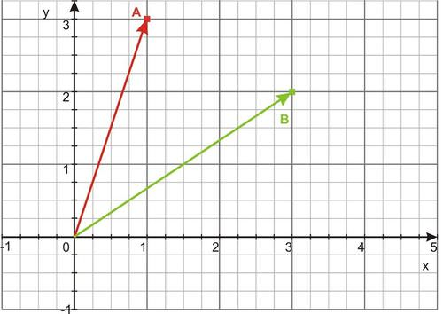

First we will use the components of the two vectors to determine the dot product.

$$
\overrightarrow{A} \cdot \overrightarrow{B} = {A_x}{B_x} + {A_y}{B_y} = (1 \cdot 3) + (3 \cdot 2) = 3 + 6 = 9
$$

Now that we know the dot product, the alternative definition of the dot product, $\overrightarrow{A} \cdot \overrightarrow{B} = |A||B|\ \text{cos}\ \theta$ to find θ, the angle between the vectors. First find the magnitudes of the two vectors:

$|A| = \sqrt{{A_x}^2 + {A_y}^2} = \sqrt{{1^2}+{3^2}}=\sqrt{{1}+{9}}=\sqrt{10}$

$|B| = \sqrt{{B_x}^2 + {B_y}^2} = \sqrt{{3^2}+{2^2}}=\sqrt{{9}+{4}}=\sqrt{13}$

Then use these magnitudes with the cosine version of the dot product to find θ.

$\overrightarrow{A} \cdot \overrightarrow{B} = |A||B|\ \text{cos}\ \theta$

$9 = \sqrt{10}\sqrt{13} \ \text{cos}\ \theta$

$\text{cos}\ \theta = \frac{9} {\sqrt{130}} = \frac{9}{11.4} = 0.78935$

$\theta = 37.9^\circ$

#### Example B

Calculate the dot product of the two vectors shown below. Then determine the angle between the two vectors.

Use the components of the two vectors to determine the dot product.

Here $\overrightarrow{A} = \left \langle {2,3} \right \rangle$ and $\overrightarrow{B} = \left \langle {3,-1} \right \rangle$.

$\overrightarrow{A} \cdot \overrightarrow{B} = {A_x}{B_x}+{A_y}{B_y}=(2 \cdot 3)+(3 \cdot -1)=6+(-3)=3$

Now to find the angle between the vectors, first find the magnitudes of the two vectors:

$|A|=\sqrt{{A_x}^2+{A_y}^2}=\sqrt{{2^2}+{3^2}}=\sqrt{{4}+{9}}=\sqrt{13}$

$|B|=\sqrt{{B_x}^2+{B_y}^2}=\sqrt{{3^2}+{(-1)^2}}=\sqrt{{9}+{1}}=\sqrt{10}$

Then use these magnitudes with the cosine version of the dot product to find θ.

$\overrightarrow{A} \cdot \overrightarrow{B}=|A||B|\ \text{cos}\ \theta$

$3=\sqrt{10}\sqrt{13}\ \text{cos}\ \theta$

$\text{cos}\ \theta = \frac{3} {\sqrt{130}} = \frac{3}{11.4}=0.26312$

$\theta = 74.7^\circ$

#### Example C

The diagram below shows both vectors **_AB_** and **_D_** together on the same grid. Determine the scalar projection of vector **_AB_** onto the direction of vector **_D_**.

**Solution:**

To find the scalar projection onto the direction of another vector we need to know the unit vector in the direction of vector **_D_**.

First, the components of $\overrightarrow{D}$ are $\overrightarrow{D}=\left \langle 3,-1.25 \right \rangle$

Now the magnitude of $\overrightarrow{D}$ is $|D|=\sqrt{(D_x)^2+(D_y)^2}=\sqrt{3^2+(-1.25)^2}=\sqrt{9+1.5625}=\sqrt{10.5625}$ $=3.25$.

Finally, the direction vector of $\overrightarrow{D}$ is $\overrightarrow{D}=\frac{\overrightarrow{D}}{|D|}=\frac{3\hat{x}+(-1.25)\hat{y}}{3.25}=\frac{3}{3.25}\ \hat{x}+\frac{-1.25}{3.25}\ \hat{y}$.

$$
\overrightarrow{D}=\left \langle 0.923,-0.385 \right \rangle
$$

Now we can use the dot-product to calculate the scalar projection of **_AB_** onto the direction of vector **_D_**

$\overrightarrow{AB}\ \cdot \overrightarrow{D}=(3 \cdot 0.923)+(4 \cdot -0.385)+(0 \cdot 0)=2.769+(-1.54)=1.23$

“Kriti is learning about flying airplanes so she can apply to take her pilot's exam. Right now she is studying the effect of wind on a flying plane, and she is supposed to describe the added “push” effect a NNE wind of 50 km/h would have on a plane travelling at 30 km/h due NE relative the ground. How can she describe the combination of forces in the NE direction?”

Kriti could calculate the **_dot product_** of the two vectors and use the result to describe the total “push” in the NE direction.

#### Guided Practice

1. Determine the dot product of the two vectors $\overrightarrow{f}=\left \langle 3,13,11 \right \rangle$ and $\overrightarrow{g}=\left \langle 9,6,15 \right \rangle$

2. Determine the dot product of the two vectors shown in the diagram below. $\overrightarrow{A}=7cm$ @ $0^\circ$ and $\overrightarrow{B}=4cm$ @ $-22^\circ$

4. Determine the dot product of the following two vectors.

#### Answers:

1. The component form of the dot product is given by $\overrightarrow{f} \cdot \overrightarrow{g}=f_x g_x+f_y g_y+f_z g_z$ . In this case, $\overrightarrow{f} \cdot \overrightarrow{g}=(3 \cdot 9)+(13 \cdot 6)+(11 \cdot 15)=27+78+165=270$

2. The angle form of the dot product is given by $\overrightarrow{A} \cdot \overrightarrow{B}=|\overrightarrow{A}||\overrightarrow{B}|\ \text{cos}\ \theta$. In this case, $\overrightarrow{A} \cdot \overrightarrow{B}=|\overrightarrow{A}||\overrightarrow{B}|\ \text{cos}\ \theta =(7)(4)\ \text{cos}\ 22 =28\ \text{cos}\ 22=25.96 \ cm^2$

3. The dot product of two vectors is defined in two ways: $\overrightarrow{A} \cdot \overrightarrow{B}=A_x B_x+A_y B_y+A_z B_z+...$ and $\overrightarrow{A} \cdot \overrightarrow{B}=|A||B|\ \text{cos}\ \theta$ . We will use the first to calculate the dot product and then we will use that result together with the second definition to determine the angle between the two vectors.

$\overrightarrow{E} \cdot \overrightarrow{G}=E_x G_x + E_y G_y + E_z G_z$

$\overrightarrow{E} \cdot \overrightarrow{G}=(14)(15)+(8.5)(12.4)+(21)(-3.7)=210+105.4-77.7=237.7$

To find the angle between the two vectors, we need to know not only the dot product of the two vectors, but also the length of each individual vector.

$|\overrightarrow{E}| = \sqrt{E^2_x + E^2_y + E^2_z} = \sqrt{(14)^2 + (8.5)^2 + (21)^2} = \sqrt{196 + 72.25 + 441}$ $= \sqrt{709.25} = 26.63$

$|\overrightarrow{G}| = \sqrt{G^2_x + G^2_y + G^2_z} = \sqrt{(15)^2 + (12.4)^2 + (-3.7)^2} = \sqrt{225 + 153.76 + 13.69}$ $= \sqrt{392.45} = 19.81$

Now use the second definition of the dot product to determine the angle

$\overrightarrow{E} \cdot \overrightarrow{G} = | E | | G |\ cos\ \theta$

$\text{cos}\ \theta = \frac{\overrightarrow{E} \times \overrightarrow{G}} {| E | | G |} = \frac{237.7} {(26.63)(19.81)} = \frac{237.7} {527.54} = 0.45058$

$\theta=\text{cos}^{-1} (0.45058)=63.2^\circ$

4. The angle form of the dot product is given by $\overrightarrow{A} \cdot \overrightarrow{B}=|\overrightarrow{A}| |\overrightarrow{B}| \ \text{cos}\ \theta$ . In this case,

$\overrightarrow{A} \cdot \overrightarrow{B}=|\overrightarrow{A}||\overrightarrow{B}|\ \text{cos}\ \theta=(61)(45)\ \text{cos}\ 58=2745\ \text{cos}\ 58=1455$

5. Determine the angle between the vectors $\overrightarrow{MN}$ and $\overrightarrow{KL}$.

$\overrightarrow{MN} \cdot \overrightarrow{KL}=(MN)_x\ (KL)_x\ + \ (MN)_y\ (KL)_y\ + \ (MN)_z\ (KL)_z$ $= (2.25)(1.5) + (2)(0) + (0)(0)$ $= 3.375$

---

We can then use the definition $\overrightarrow{MN} \times \overrightarrow{KL}=|\overrightarrow{MN}| |\overrightarrow{KL}| \ \text{cos}\ \theta$ to determine the angle between the two vectors. But first we need to determine the magnitudes of the two vectors.

$|\overrightarrow{MN}|=\sqrt{(MN)_x^2+(MN)_y^2+(MN)_z^2}=\sqrt{(-2.25)^2+(0)^2+(0)^2}$ $= 2.25$

$|\overrightarrow{KL}|=\sqrt{(KL)_x^2+(KL)_y^2+(KL)_z^2}=\sqrt{(1.5)^2+(2)^2+(0)^2}=\sqrt{2.25+4+0}$ $= \sqrt{6.25}=2.5$

$\text{cos}\ \theta=\frac{\overrightarrow{MN} \cdot \overrightarrow{KL}} {|\overrightarrow{MN}| |\overrightarrow{KL}|}=\frac{3.375}{(2.25)(2.5)}=\frac{3.375}{5.625}=0.6$

$\theta=\text{cos}^{-1}\ (-0.6)=53.1^\circ$

By looking at the diagram, we can see that the angle between these two vectors is larger than 90_o_. Many calculators only give the smaller of the two angles between two lines. As you can see below, both _θ_ and $\phi$ relate the blue line to the red line.

6. The component form of the dot product is given by $\overrightarrow{w} \cdot \overrightarrow{h}=w_x h_x+w_yh_y+w_zh_z$.

$\overrightarrow{w} \cdot \overrightarrow{h}=(85 \cdot 67)+(89 \cdot 70)+(91 \cdot 88)=5695+6320+8008=20023$

Now we can find the angle between the two vectors using the other form of the dot-product equation: $\overrightarrow{A} \cdot \overrightarrow{B}= | A | | B |\ \text{cos}\ \theta$ , but first we need to determine the magnitudes of the two vectors using the Pythagorean Theorem.

$|\overrightarrow{w}|=\sqrt{w_x^2+w_y^2+w_z^2}=\sqrt{85^2+89^2+91^2}=\sqrt{7225+7921+8281}=$ $\sqrt{23427}=153.1$

$|\overrightarrow{h}|=\sqrt{h_x^2+h_y^2+h_z^2}=\sqrt{67^2+70^2+88^2}=\sqrt{4489+4900+7744}=$ $\sqrt{17133}=130.9$

$\text{cos}\ \theta=\frac{\overrightarrow{A} \cdot \overrightarrow{B}}{|A||B|}=\frac{20023}{(153.1)(130.9)} = 0.99911$

$\theta=\text{cos}^{-1}\ 0.99911=2.42^\circ$

#### Explore More

1. What is the magnitude of $\left \langle -9, 3\right \rangle$?

2. What is the magnitude of $\left \langle -3, 16 \right \rangle$?

3. What is the magnitude of $\left \langle 6, 18\right \rangle$?

4. What is the magnitude of $\left \langle 9, 10\right \rangle$?

5. What is the direction of $\left \langle -10, 10 \right \rangle$?

6. What is the direction of $\left \langle 9, 17 \right \rangle$?

7. What is the direction of $\left \langle 2, 17 \right \rangle$?

8. What is the direction of $\left \langle -6, 12 \right \rangle$?

Find: a) The dot product of Vectors A and B, and b) The measure of the angle found between the vectors, rounded to the nearest degree.

9. Vector A = $-2i + 5j$ and Vector B = $-3i + 5j$

10. Vector A = $\left \langle 6, 13 \right \rangle$ and Vector B = $\left \langle 9, 10 \right \rangle$

11. Vector A = $\left \langle 4, 5 \right \rangle$ and Vector B = $\left \langle -4, 8 \right \rangle$

12. Vector A = $-7i + 4j$ and Vector B = $6i + 3j$

13. Vector A = $\left \langle -9, 15 \right \rangle$ and Vector B = $\left \langle -7, 11 \right \rangle$

14. Vector A = $\left \langle 1, 18 \right \rangle$ and Vector B = $\left \langle 1, 6 \right \rangle$

15. Vector A = $4i + 11j$ and Vector B = $3i + 14j$

16. Prove that $\overrightarrow{C} = 2\hat{i} + 5\hat{j} + 2\hat{k}$ and $\overrightarrow{D} = 3\hat{i} - 2\hat{j} + 2\hat{k}$ are perpendicular by showing their dot product is zero.

17. Explain why showing the dot product of two vectors is zero proves they are perpendicular.

### Dot Product and Angle Between Two Vectors

While two vectors cannot be strictly multiplied like numbers can, there are two different ways to find the product between two vectors.  The cross product between two vectors results in a new vector perpendicular to the other two vectors.  You can study more about the cross product between two vectors when you take Linear Algebra.  The second type of product is the dot product between two vectors which results in a regular number.  This number represents **_how much of one vector goes in the direction of the other_**.  In one sense, it indicates how much the two vectors agree with each other.  This concept will focus on the dot product between two vectors. 

What is the dot product between $< -1, 1 >$ and $<4, 4>$?  What does the result mean?

#### Watch This

Watch the portion of this video focusing on the dot product:

!?[Watch the video at](https://www.youtube.com/watch?v=EYIxFJXoUvA)

#### Guidance

The dot product is defined as:

$$
u \cdot v=< u_1, u_2 > \cdot < v_1, v_2 >=u_1 v_1+u_2 v_2
$$

---

This procedure states that you multiply the corresponding values and then sum the resulting products.  It can work with vectors that are more than two dimensions in the same way. 

Before trying this procedure with specific numbers, look at the following pairs of vectors and relative estimates of their dot product.

There are a many important properties related to the dot product that you will prove in the examples, guided practice and practice problems.  The two most important are

1. What happens when a vector has a dot product with itself and

2. What is the dot product of two vectors that are perpendicular to each other.

* $v \cdot v =|v|^2$
* $v$ and $u$ are perpendicular if and only if $v \cdot u=0$

The dot product can help you determine the angle between two vectors using the following formula.  Notice that in the numerator the dot product is required because each term is a vector.  In the denominator only regular multiplication is required because the magnitude of a vector is just a regular number indicating length.

$$
\cos \theta=\frac{u \cdot v}{|u||v|}
$$

**Example A**

Show the commutative property holds for the dot product between two vectors.  In other words, show that $u \cdot v=v \cdot u$.

**Solution:**

This proof is for two dimensional vectors although it holds for any dimensional vectors. 

Start with the vectors in component form.

$$
\begin{align*}
u &= < u_1, u_2>\\
v &= < v_1, v_2>
\end{align*}
$$

Then apply the definition of dot product and rearrange the terms.  The commutative property is already known for regular numbers so we can use that.

$$
\begin{align*}
\begin{array}{rcl}
u \cdot v &=& < u_1, u_2 > \cdot < v_1, v_2 >\\
&=& u_1 v_1+u_2 v_2.
&=& v_1 u_1+v_2 u_2.
&=& < v_1, v_2 > \cdot < u_1, u_2  > \\
&=& v \cdot u
\end{array}
\end{align*}
$$

**Example B**

Find the dot product between the following vectors: $<3, 1> \cdot <5, -4>$

**Solution:**

**$<3, 1> \cdot <5, -4>=3 \cdot 5+1 \cdot (-4)=15-4=11$**

**Example C**

Prove the angle between two vectors formula:

$$
\cos \theta=\frac{u \cdot v}{|u| |v|}
$$

**Solution:**

Start with the law of cosines.

\begin{align*}
|u-v|^2 &= |v|^2+|u|^2-2 |v||u| \cos \theta\\
(u-v) \cdot (u-v) &=\\
u \cdot u-2u \cdot v+v \cdot v &=\\
|u|^2-2u \cdot v+|v|^2 &=\\
-2u \cdot v &= -2 |v||u| \cos \theta\\
\frac{u \cdot v}{|u||v|} &= \cos \theta
\end{align*}
$$

#### Concept Problem Revisited

The dot product between the two vectors $<-1, 1>$ and $<4, 4>$ can be computed as:

$$
(-1) (4) + 1(4)=-4+4=0
$$

The result of zero makes sense because these two vectors are perpendicular to each other.

#### Guided Practice

1. Show the distributive property holds under the dot product**.**

**

$$
u \cdot (v+w)=uv+uw
$$

**

2. Find the dot product between the following vectors.

$$
(4i - 2j) \cdot (3i-8j)
$$

3. What is the angle between $v=<3, 5>$ and $u=<2, 8>$?

**Answers:**

1. This proof will work with two dimensional vectors although the property does hold in general.

$u=< u_1, u_2 >, v= < v_1, v_2 >, w=<  w_1, w_2  >$

$$
\begin{align*}
u \cdot (v+w) &= u \cdot (< v_1, v_2 > + < w_1, w_2 >  )\\
&=u \cdot < v_1+w_1, v_2+w_2 >  \\
&= < u_1, u_2 > \cdot < v_1+w_1,v_2+w_2 > \\
&= u_1 (v_1+w_1)+u_2(v_2+w_2)\\
&= u_1v_1+u_1w_1+u_2v_2+u_2w_2\\
&= u_1v_1+u_2v_2+u_1w_1+u_2w_2\\
&= u \cdot v+v \cdot w
\end{align*}
$$

2. The standard unit vectors can be written as component vectors.

$$
<4, -2> \cdot <3, -8>=12+(-2) (-8)=12+16=28
$$

3. Use the angle between two vectors formula.

$v=<3, 5>$ and $u=<2, 8>$

$$
\begin{align*}
\frac{u \cdot v}{|u||v|} &= \cos \theta\\
\frac{<3, 5> \cdot <2, 8>}{\sqrt{34} \cdot \sqrt{68}} &= \cos \theta\\
\frac{6+35}{\sqrt{34} \cdot \sqrt{68}} &= \cos \theta\\
\cos^{-1} \left(\frac{41}{\sqrt{34} \cdot \sqrt{68}}\right) &= \theta\\
31.49 & \approx \theta
\end{align*}
$$

#### Practice

Find the dot product for each of the following pairs of vectors.

1. $<2, 6> \cdot <-3, 5>$

2. $<5, -1> \cdot <4, 4>$

3. $< -3, -4> \cdot <2, 2>$

4. $<3, 1> \cdot <6, 3>$

5. $<-1, 4> \cdot <2, 9>$

Find the angle between each pair of vectors below.

6. $<2, 6> \cdot <-3, 5>$

7. $<5, -1> \cdot <4, 4>$

8. $<-3, -4> \cdot <2, 2>$

9. $<3, 1> \cdot <6, 3>$

10. $<-1, 4> \cdot <2, 9>$

11. What is $v \cdot v$?

12. How can you use the dot product to find the magnitude of a vector?

13. What is $0 \cdot v$?

14. Show that $(cu) \cdot v=u \cdot (cv)$ where $c$ is a constant. 

15. Show that $<2, 3>$ is perpendicular to $<1.5, -1>$.

### Scalar Projections

As an engineer, or a pilot, or racecar driver, or even a chef, it can often be useful to determine the result of different amounts and directions of force applied to a particular action to decide on the best use of added strength, altitude, speed, or heat in order to achieve the optimum result.

This lesson is about **_scalar projections_**, which allow you to do the things above and a whole host of others.

---

#### Watch This

!?[Watch the video at](https://www.youtube.com/watch?v=27vT-NWuw0M)

#### Guidance

A **_scalar projection_** allows you to investigate the result of different "lengths" of one vector on an overall study. The projection of a vector onto a particular direction is, in effect, the result of applying a specific value in that direction. Recall that the **_dot product_** of a vector is a scalar quantity describing only the magnitude of a particular vector. A **_scalar projection_** is given by the dot product of a vector with a unit vector for that direction.

For example, the component notations for the vectors shown below are $AB =\left \langle {4,3} \right \rangle$ and $D =\left \langle {3,-1.25} \right \rangle$.

+(3 \cdot 0)+(0 \cdot 0)=4$")

The scalar projection of vector **_AB_** onto $\hat{y}$ is given by $\overrightarrow{AB} \cdot \hat{y}=(4 \cdot 0)+(3 \cdot 1)+(0 \cdot 0)=3$

And the scalar projection of vector **_AB_** onto $\hat{z}$ is given by $\overrightarrow{AB} \cdot \hat{z}=(4 \cdot 0)+(3 \cdot 0)+(0 \cdot 1)=0$

The scalar projections of **_AB_** onto the x and y directions are non-zero numbers because the vector is located in the x-y plane. The scalar projection of **_AB_** onto the z direction is equal to zero, because the z direction is perpendicular to **_AB_**.

**Vector Projections**

The _vector projection_ of a vector onto a given direction has a magnitude equal to the scalar projection. The direction of the vector projection is the same as the unit vector of that given direction. Recall that when a vector $\overrightarrow{v}$ is multiplied by a scalar _s_, its components are given by

$\overrightarrow{sv}=\left \langle sv_x,sv_y,sv_z \right \rangle$

To calculate the vector projection of **_AB_** onto the direction of vector **_D_**, use the scalar projection calculated in the previous example and the unit vector $\overrightarrow{D}$.

$(\overrightarrow{AB}\ \cdot \overrightarrow{D}) \overrightarrow{D}=\left \langle (1.23 \cdot 0.923),(1.23 \cdot -0.385)\right \rangle=\left \langle 1.135,-0.474 \right \rangle$

This process is clearly explained in the video above.

---

#### Example A

The diagram below shows both vectors **_AB_** and **_D_** together on the same grid. Determine the scalar projection of vector **_AB_** onto the direction of vector **_D_**.

**Solution:**

To find the scalar projection onto the direction of another vector we need to know the unit vector in the direction of vector **_D_**.

First, the components of $\overrightarrow{D}$ are $\overrightarrow{D}=\left \langle 3,-1.25 \right \rangle$.

Now the magnitude of $\overrightarrow{D}$ is $|D|=\sqrt{(D_x)^2+(D_y)^2}=\sqrt{3^2+(-1.25)^2}=\sqrt{9+1.5625}=\sqrt{10.5625}$ $=3.25$.

Finally, the direction vector of $\overrightarrow{D}$ is $\overrightarrow{D}=\frac{\overrightarrow{D}}{|D|}=\frac{3\hat{x}+(-1.25)\hat{y}}{3.25}=\frac{3}{3.25}\ \hat{x}+\frac{-1.25}{3.25}\ \hat{y}$.

$$
\overrightarrow{D}=\left \langle 0.923,-0.385 \right \rangle
$$

Now we can use the dot-product to calculate the scalar projection of **_AB_** onto the direction of vector **_D_**.

$\overrightarrow{AB}\ \cdot \overrightarrow{D}=(3 \cdot 0.923)+(4 \cdot -0.385)+(0 \cdot 0)=2.769+(-1.54)=1.23$

Determine the scalar projection of the vector $\overrightarrow{R}=\left \langle 27,39,52 \right \rangle$ onto the direction of $\overrightarrow{T}=\left \langle 44,26,17 \right \rangle$ .

**Solution:**

The scalar projection of one vector onto the direction of the other is the dot product of the first vector with the unit vector representing the direction of the second vector. To calculate the scalar projection, we need to determine the unit vector in the direction of vector $\overrightarrow{T}=\left \langle 44,26,17\right \rangle$ . Remember that a unit vector is equal to the ratio of the vector and its magnitude, therefore we first need to calculate the length of vector $\overrightarrow{T}$

$$
|\overrightarrow{T}|=\sqrt{T_x^2+T_y^2+T_z^2}=\sqrt{(44)^2+(26)^2
 +(17)^2}=\sqrt{1936+676+289}
$$

 $=\sqrt{2901}=53.86$

$\overrightarrow{T}=\frac{\overrightarrow{T}}{|\overrightarrow{T}|}=\frac{\left \langle 44,26,17 \right \rangle}{53.86}=\left \langle \frac{44}{53.86},\frac{26}{53.86},\frac{17}{53.86} \right \rangle=\left \langle 0.8169,0.4827,0.3156 \right \rangle$

Now we can calculate the scalar projection of $\overrightarrow{R}$ onto $\overrightarrow{T}$ by calculating the dot product

$\overrightarrow{R} \cdot \overrightarrow{T}=(27 \cdot 0.8169)+(39 \cdot 0.4827)+(52 \cdot 0.3156)=22.0563+18.6253$ $+ 16.4112=57.0928$

#### Explore More

1. Calculate the result of a scalar multiple of 6 on the vector $\left \langle 1, 19\right \rangle$

2. Calculate the result of a scalar multiple of (-8) on the vector $\left \langle 7, 8 \right \rangle$

3. Calculate the result of a scalar multiple of 15 on the vector $\left \langle -7, 3\right \rangle$

4. Calculate the result of a scalar multiple of (-11) on the vector $\left \langle -9, 20\right \rangle$

5. Calculate the result of a scalar multiple of 16 on the vector $\left \langle 9, 10\right \rangle$

6. Given Vector A = $\left \langle -4, 6  \right \rangle$ and Vector B = $\left \langle  9, 15 \right \rangle$. What is the projection of A onto B?

7. What is the projection of $\left \langle 2, 10  \right \rangle$ onto $\left \langle 1, 3  \right \rangle$?

8. Given Vector C = $\left \langle 1, 2 \right \rangle$ and Vector D = $\left \langle 1, 11 \right \rangle$. What is the projection of C onto D?

9. Given Vector E = $\left \langle -5, 3 \right \rangle$ and Vector F = $\left \langle -1, 18 \right \rangle$. What is the projection of E onto F?

10. What is the projection of $\left \langle -2, 1 \right \rangle$ onto $\left \langle  -5, 6 \right \rangle$?

11. Given Vector H = $\left \langle 8i + 11j  \right \rangle$ and Vector I = $\left \langle -2i + 15j \right \rangle$ What is the projection of H onto I?

12. What is the projection of $\left \langle -1, 6 \right \rangle$ onto $\left \langle  8, 16 \right \rangle$?

13. What is the projection of $\left \langle -1, 8 \right \rangle$ onto $\left \langle  7, 8  \right \rangle$?

14. Given Vector J = $\left \langle -4i + 8j  \right \rangle$ and Vector K = $\left \langle -8i + 10j \right \rangle$. What is the projection of J onto K?

15. Given Vector L = $\left \langle -4,3 \right \rangle$ and Vector M = $\left \langle 7, 17 \right \rangle$. What is the projection of L onto M?

### Properties of Scalar product

Students can refer to the following link for studying the concept:

* http://chortle.ccsu.edu/VectorLessons/vch07/vch07_8.html

### Multimedia links

!?[Watch the video at](https://www.youtube.com/watch?v=9KkvY_LvkXI)

!?[Watch the video at](https://www.youtube.com/watch?v=0S4h2O2DdSA)

!?[Watch the video at](https://www.youtube.com/watch?v=rVQ3G9epCjw)

</article>

### 11.7 Vector or Cross Product of Two Vectors

<article>

### Cross Products

**Cross products** are related to **dot products** in a number of ways.

Dot products in a sense calculate the _joined_ force of two vectors in a given direction, and so are greatest when the vectors are parallel. Cross products, however, are greatest when the vectors are perpendicular... what then do they calculate?

#### Watch This

**“The video below is a well presented description of how to calculate cross-products. If you would like a deeper understanding of the difference between “Dot Products” and “Cross Products”, take a look at:** 

**Dot vs. Cross Product .”**

!?[Watch the video at](https://www.youtube.com/watch?v=enr7JqvehJs)

#### Guidance

Whereas a dot product of two vectors produces a scalar value; the **cross product** of the same two vectors produces a vector quantity having a direction perpendicular to the original two vectors.

The cross product of two vector quantities is another vector whose magnitude varies as the angle between the two original vectors changes. The cross product is sometimes referred to as the _vector product_ of two vectors. The magnitude of the cross product represents the area of the parallelogram whose sides are defined by the two vectors, as shown in the figure below. Therefore, the maximum value for the cross product occurs when the two vectors are perpendicular to one another, but when the two vectors are parallel to one another the magnitude of the cross product is equal to zero.

$$
\overrightarrow{A} \times \overrightarrow{B} = \left \langle (A_2 B_3 - A_3 B_2),(A_3 B_1 - A_1 B_3), (A_1 B_2 - A_2 B_1)\right \rangle
$$

Another way to describe the process is to say that the cross product is the multiplication of one vector by the component of the other vector which is perpendicular to the first vector. In the diagram below are two vectors, **_A_** and **_B_**. A perpendicular line has been drawn radially outward from **_B_** towards **_A_** to create a right triangle with **_A_** as the hypotenuse.

 = | \overrightarrow{A} | | \overrightarrow{B} | \ \text{sin}\ \theta$.")

The direction of the cross product is perpendicular to the plane defined by the two crossed vectors. For example, the cross product of two vectors in the x-y plane will be parallel to the z-axis. This still leaves two possible directions for the cross product, though: either $+ \hat{z}$ or $-\hat{z}$.

We use a **right-hand-rule** to indicate the direction of the cross product. Position the thumb and index finger of your right hand with the first vector along your thumb and the second vector along your index finger. Your middle finger, when extended perpendicular to your palm, will indicate the direction of the cross product of the two vectors.

 while $\overrightarrow{B} \times \overrightarrow{A}$ is along $-\hat{z}$ (going down into the page) and $\overrightarrow{A} \times \overrightarrow{B} = - \overrightarrow{B} \times \overrightarrow{A}$.")

---

**The Normal Vector**

We can use the cross product and the definition of the unit vector to determine the direction which is perpendicular to a plane.

In general, we can define a normal vector, $\hat{n}$, which has a unity magnitude (i.e. magnitude equal to one) and which is perpendicular to a plane occupied by a pair of vectors, **U** and **V**.

$$
\hat{n} = \frac{\overrightarrow{U} \times \overrightarrow{V}} {|\overrightarrow{U} \times \overrightarrow{V}|}
$$

#### Example A

Calculate the cross product of the two vectors shown below.

Use the components of the two vectors to determine the cross product.

$$
\overrightarrow{A} \times \overrightarrow{B} = \left \langle (A_y B_z - A_z B_y), (A_zB_x - A_x B_z), (A_x B_y - A_y B_x)\right \rangle
$$

Since these two vectors are both in the x-y plane, their own z-components are both equal to 0 and the vector product will be parallel to the z axis.

$\overrightarrow{A} \times \overrightarrow{B} = \left \langle [(3 \cdot 0) - (0 \cdot 2)], [(0 \cdot -4) - (2.5 \cdot 0)], [(2.5 \cdot 2) - (3 \cdot -4)]\right \rangle$

$\overrightarrow{A} \times \overrightarrow{B} = \left \langle [(0) - (0)], [(0) - (0)], [(5) - (-12)]\right \rangle = \left \langle 0,0,(5 + 12)\right \rangle = \left \langle 0,0,17\right \rangle$

We can check our answer using the sine version of the cross product, but first we need to know the angle between the two vectors. We can use the dot product to find θ, following the procedure in the first Example in the previous section. First use the components to find the dot product.

$\overrightarrow{A} \times \overrightarrow{B} = A_x B_x + A_y B_y + A_z B_z = (2.5 * -4) + (3 * 2) + (0 * 0) = -10 + 6 + 0 =$ $-4$

Then find the magnitudes of the two vectors:

$| \overrightarrow{A} | = \sqrt{A^2_x + A^2_y + A^2_z} = \sqrt{2.5^2 + 3^2 + 0^2} = \sqrt{6.25 + 9 + 0} = \sqrt{15.25}$

$| \overrightarrow{B} | = \sqrt{B^2_x + B^2_y + B^2_z} = \sqrt{(-4)^2 + 2^2 + 0^2} = \sqrt{16 + 4 + 0} = \sqrt{20}$

Then use these magnitudes with the cosine version of the dot product to find θ.

$\overrightarrow{A} \times \overrightarrow{B} = | A | | B |\ \text{cos}\ \theta$

$-4 = \sqrt{15.25} \sqrt{20}\ \text{cos}\ \theta$

$\text{cos}\ \theta = \frac{-4} {\sqrt{305}} \approx \frac{-4} {17.5} = -0.229$

$\theta = 103^\circ$

Now use the sine of this angle and the two magnitudes to determine the cross product:

$| \overrightarrow{A} \times \overrightarrow{B} | = | \overrightarrow{A} | | \overrightarrow{B} | \ \text{sin}\ \theta$

$| \overrightarrow{A} \times \overrightarrow{B} | = \sqrt{15.25} \sqrt{20}\ \text{sin}\ 103^\circ = \sqrt{305}\ \text{sin}\ 103^\circ = 17$

This is the same answer that we obtained from the component notation, which is good. We use the right-hand rule to determine the direction of the vector product. If you place your thumb along vector **A** and your forefinger along vector **B**, your middle finger will point along $+\hat{z}$ and $| \overrightarrow{A} \times \overrightarrow{B} | = \left \langle 0, 0, 17\right \rangle$

#### Example B

The diagram shows two vectors **A** and **B** which define a plane passing through the origin. Use these two vectors to determine the normal vector to this plane. $\overrightarrow{A} = \left \langle 3, 0, 4\right \rangle$ and $\overrightarrow{B} = \left \langle 5, 10, 0\right \rangle$

**Solution:**

The normal vector is defined by $\hat{n} = \frac{\overrightarrow{U} \times \overrightarrow{V}} {|\overrightarrow{U} \times \overrightarrow{V}|}$

In this case, we obtain $\hat{n} = \frac{\overrightarrow{A} \times \overrightarrow{B}} {|\overrightarrow{A} \times \overrightarrow{B}|}$

Use the component version of the cross-product equation to find the components of $\overrightarrow{A} \times \overrightarrow{B}$

$\overrightarrow{A} \times \overrightarrow{B} = \left \langle (A_y B_z - A_z B_y), (A_z B_x - A_x B_z), (A_x B_y - A_y B_x)\right \rangle$

$\overrightarrow{A} \times \overrightarrow{B} = \left \langle [(0 \cdot 0) - (4 \cdot 10)], [(4 \cdot 5) - (3 \cdot 0)], [(3 \cdot 10) - (0 \cdot 5)]\right \rangle$

$\overrightarrow{A} \times \overrightarrow{B} = \left \langle (0 - 40), (20 - 0), (30 - 0)\right \rangle = \left \langle -40, 20, 30\right \rangle$

Next, calculate the magnitude of the cross product, $| \overrightarrow{A} \times \overrightarrow{B}|$

$| \overrightarrow{A} \times \overrightarrow{B}| = \sqrt{(-40)^2 + 20^2 + 30^2} = \sqrt{1600 + 400 + 900} = \sqrt {2900} =$ $53.8516$

$\hat{n} = \frac{\overrightarrow{A} \times \overrightarrow{B}} {|\overrightarrow{A} \times \overrightarrow{B}|} = \frac{\left \langle -40, 20, 30\right \rangle} {53.9} = \left \langle \frac{-40} {53.9}, \frac{20} {53.9}, \frac{30} {53.9}\right \rangle = \left \langle -0.743, 0.371, 0.557\right \rangle$

#### Example C

Determine the cross product $\overrightarrow{F} \times \overrightarrow{r}$ for the two vectors $\overrightarrow{F} = \left \langle 2, 3, 4\right \rangle$ and $\overrightarrow{r} = \left \langle 7, 6, 5\right \rangle$. Then use the cross product to determine the angle between the two vectors.

**Solution:**

One of the two ways to determine the magnitude of the cross product of two vectors uses the components of the two vectors:

$\overrightarrow{F} \times \overrightarrow{r} = \left \langle (F_y r_z - F_z r_y), (F_z r_x - F_x r_z),(F_x r_y - F_y r_x)\right \rangle$

$\overrightarrow{F} \times \overrightarrow{r} = \left \langle(3 \cdot 5 - 4 \cdot 6), (4 \cdot 7 - 2 \cdot 5), (2 \cdot 6 - 3 \cdot 7)\right \rangle = \left \langle(15 - 24), (28 - 10), (12 - 21)\right \rangle$

$\overrightarrow{F} \times \overrightarrow{r} = \left \langle -9, 18, -9 \right \rangle$

Now we can use the cross product and the second definition of the cross product to determine the angle between the two vectors.

$$
| \overrightarrow{F} \times \overrightarrow{r} | = | F | | r | \ \text{sin}\ \theta
$$

We need to calculate the magnitudes of the vectors and of the cross product.

$| \overrightarrow{F} | = \sqrt{F^2_x + F^2_y + F^2_z} = \sqrt{2^2 + 3^2 + 4^2} = \sqrt{ 4 + 9 + 16} = \sqrt{29} = 5.385$

$| \overrightarrow{r}| = \sqrt{r^2_x + r^2_y + r^2_z} = \sqrt{7^2 + 6^2 + 5^2} = \sqrt{49 + 36 + 25} = \sqrt{110} =$ $10.488$

$| \overrightarrow{F} \times \overrightarrow{r}| = \sqrt{(-9)^2 + 18^2 + (-9)^2} = \sqrt{81 + 324 + 81} = \sqrt{486} = 22.0454$

$\text{sin}\ \theta = \frac{|\overrightarrow{F} \times \overrightarrow{r}|} {| F |  | r |} = \frac{22.0454} {(5.385)(10.488)} = 0.390$

$\theta = \text{sin}^{-1} (0.390) = 22.98^\circ$

We can use the dot product of the two vectors to check our solution.

$\overrightarrow{F} \times \overrightarrow{r} = |\overrightarrow{F}| |\overrightarrow{r}| \text{cos}\ \theta$

$\overrightarrow{F} \times \overrightarrow{r} = F_x r_x + F_y r_y + F_z r_z = 2*7 + 3*6 + 4*5 = 14 + 18 + 20 = 52$

$\text{cos}\ \theta = \frac{\overrightarrow{F} \times \overrightarrow{r}} {|\overrightarrow{F}| |\overrightarrow{r}|} = \frac{52} {(5.385)(10.488)} = 0.920714$

$\theta = \text{cos}^{-1} (0.920714) = 22.97$

This answer matches our value from the cross product to within rounding variations. -->

#### Guided Practice

1. Determine the magnitude of the cross product of the two vectors shown below.

3. Determine the area of a parallelogram whose sides are defined by the vectors $\overrightarrow{w} = \left \langle 85, 89, 91\right \rangle$ and $\overrightarrow{h} = \left \langle 67, 70, 88\right \rangle$, lengths measured in centimeters.

4. Determine the cross product of the two vectors $\overrightarrow{f} = \left \langle 3, 13, 11\right \rangle$ and $\overrightarrow{g} = \left \langle 9, 6, 15\right \rangle$

5. Determine the equation for the unit vector perpendicular to the plane defined by the two vectors $\overrightarrow{a} = \left \langle 2, 7, 4\right \rangle$ and $\overrightarrow{b} = \left \langle 0, 5, 1\right \rangle$

6. Determine the area of the parallelogram whose sides are defined by $\overrightarrow{R} = \left \langle 27, 39, 52\right \rangle$ and $\overrightarrow{T} = \left \langle 44, 26, 17\right \rangle$, lengths measured in millimeters.

7. Determine the magnitude of the cross-product of these two vectors.

1. First we need to identify the components of the two vectors by using the information given on the graph. In this case, $\overrightarrow{MN} = \left \langle -2.25, 0, 0\right \rangle$ and $\overrightarrow{KL} = \left \langle 1.5, 2, 0\right \rangle$

$\overrightarrow{MN} \times \overrightarrow{KL} = \left \langle(MN_y KL_z- MN_z KL_y), (MN_z KL_x - MN_x KL_z), (MN_x KL_y - MN_y KL_x)\right \rangle$

$\overrightarrow{MN} \times \overrightarrow{KL} = \left \langle(0 \cdot 0 - 0 \cdot 2), (0 \cdot 1.5 - (-2.25) \cdot 0), ((-2.25) \cdot 2 - 0 \cdot 1.5)\right \rangle$

$\overrightarrow{MN} \times \overrightarrow{KL} = \left \langle0 - 0, 0 - 0, -4.5 - 0\right \rangle = \left \langle0, 0, -4.5\right \rangle$

As we can see by the components, this vector has a magnitude of 4.5 units and lies in the –z direction. We can also use the right-hand-rule to see the direction of the cross product. As shown in the figure below, if we align the right thumb with vector MN and the right fore-finger with vector KL, the palm and extended middle-finger point in the –z direction.

$\overrightarrow{W} \times \overrightarrow{L} = \left \langle(W_y L_z - W_z L_y), (W_z L_x - W_x L_z), (W_x L_y - W_y L_x)\right \rangle$. In this case, we obtain

$\overrightarrow{W} \times \overrightarrow{L} = \left \langle(5 \cdot 9 - 2 \cdot 1),(2 \cdot 8 - 4 \cdot 9), (4 \cdot 1 - 5 \cdot 8)\right \rangle$

$\overrightarrow{W} \times \overrightarrow{L} = \left \langle(45 - 2),(16 - 36), (4 - 40)\right \rangle = \left \langle43, -20, -36\right \rangle$

We also need to know the magnitude of this cross product

$|\overrightarrow{W} \times \overrightarrow{L}| = \sqrt{x^2 + y^2 + z^2} = \sqrt{(43)^2 + (-20)^2 + (-36)^2} = \sqrt{1849 + 400 + 1296} =$ $\sqrt{3545} = 59.54$

Now we can determine the normal vector

$\hat{n} = \frac{\overrightarrow{W} \times \overrightarrow{L}} {| \overrightarrow{W} \times \overrightarrow{L}|} = \frac{\left \langle 43, -20, -36\right \rangle} {59.54} = \left \langle \frac{43} {59.54}, \frac{-20} {59.54}, \frac{-36} {59.54}\right \rangle = \left \langle 0.7222, -0.3359, -0.6046\right \rangle$

3. The area of the parallelogram whose sides are defined by a pair of vectors is equal to the magnitude of the cross product of the two vectors, $|\overrightarrow{w} \times \overrightarrow{h}|$. First we need to find the cross product of the two vectors:

$\overrightarrow{w} \times \overrightarrow{h} = \left \langle(w_y h_z - w_z h_y), (w_z h_x - w_x h_z), (w_x h_y - w_y h_x)\right \rangle$

$\overrightarrow{w} \times \overrightarrow{h} = \left \langle (89 \cdot 88 - 91 \cdot 70), (91 \cdot 67 - 85 \cdot 88), (85 \cdot 70 - 89 \cdot 67)\right \rangle$

$\overrightarrow{w} \times \overrightarrow{h} = \left \langle (7832 - 6370), (6097 - 7480), (5950 - 5963)\right \rangle = \left \langle 1462, -1383, -13\right \rangle$

$| \overrightarrow{w} \times \overrightarrow{h} | = \sqrt{x^2 + y^2 + z^2} = \sqrt{1462^2 + (-1383)^2 + (13)^2} = \sqrt{4050302} \approx$$2012.5$

Since the lengths of the two vectors were measured in centimeters, the area of the parallelogram is 2013 cm_2_ measured to the nearest square centimeter.

4. $\overrightarrow{f} \times \overrightarrow{g} = \left \langle(f_y g_z - f_z g_y), (f_z g_x - f_x g_z), (f_x g_y - f_y g_x)\right \rangle$

__$\overrightarrow{f} \times \overrightarrow{g} = \left \langle(13 \cdot 15 - 11 \cdot 6), (11 \cdot 9 - 3 \cdot 15), (3 \cdot 6 - 13 \cdot 9)\right \rangle$__

$\overrightarrow{f} \times \overrightarrow{g} = \left \langle(195 - 66), (99 - 45), (18 - 117)\right \rangle = \left \langle 129, 54, -99\right \rangle$

5. The cross product of two vectors is always perpendicular to the plane defined by the two vectors.

$\overrightarrow{a} \times \overrightarrow{b} = \left \langle(a_y b_z - a_z b_y), (a_z b_x - a_x b_z), (a_x b_y - a_y b_x)\right \rangle$

$\overrightarrow{a} \times \overrightarrow{b} = \left \langle((7 \cdot 1) - (4 \cdot 5)), ((4 \cdot 0) - (2 \cdot 1)), ((2 \cdot 5) - (7 \cdot 0))\right \rangle$

$\overrightarrow{a} \times \overrightarrow{b} = \left \langle(7 - 20), (0 - 2), (10 - 0)\right \rangle = \left \langle -13, -2, 10\right \rangle$

The magnitude of this vector is given by $| \overrightarrow{a} \times \overrightarrow{b}| = \sqrt{x^2 + y^2 + z^2} = \sqrt{(-13)^2 + (-2)^2 + (10)^2} = \sqrt{273} = 16.5$

Then divide the cross-product by its magnitude to obtain the unit vector.

$$
\hat{n} = \frac{\overrightarrow{a} \times \overrightarrow{b}} {|\overrightarrow{a} \times \overrightarrow{b}|} = \frac{\left \langle -13, -2, 10\right \rangle} {16.5} = \left \langle \frac{-13} {16.5}, \frac{-2} {16.5}, \frac{10} {16.5}\right \rangle
$$

6. The area of the parallelogram whose sides are defined by a pair of vectors is equal to the magnitude of the cross product of the two vectors, $|\overrightarrow{R} \times \overrightarrow{T}|$. First we need to find the cross product of the two vectors:

$\overrightarrow{R} \times \overrightarrow{T} = \left \langle(R_y T_z - R_z T_y), (R_z T_x - R_x T_z), (R_x T_y - R_y T_x)\right \rangle$

$\overrightarrow{R} \times \overrightarrow{T} = \left \langle((39 * 17) - (52 * 26)), ((52 * 44) - (27 * 17)), ((27 * 26) - (39 * 44))\right \rangle$

$\overrightarrow{R} \times \overrightarrow{T} = \left \langle((663) - (1352)), ((2288) - (459)), ((702) - (1716))\right \rangle$

$\overrightarrow{R} \times \overrightarrow{T} = \left \langle(663 - 1352), (2288 - 459), (702 - 1716) \right \rangle = \left \langle -689, 1829, -1014\right \rangle$

$|\overrightarrow{R} \times \overrightarrow{T}| = \sqrt{x^2 + y^2 + z^2} = \sqrt{(-689)^2 + (1829)^2 + (-1014)^2} \approx 2202$

Since the lengths of the two vectors were measured in centimeters, the area of the parallelogram is 2202 cm_2_ measured to the nearest square centimeter.

7. Since we know the magnitudes of the two vectors and the angle between them, we can use the angle-version of the cross-product equation to determine the magnitude of the cross-product: $|\overrightarrow{A} \times \overrightarrow{B}| = | \overrightarrow{A}| | \overrightarrow{B}| \ \text{sin}\ \theta = (61)(45) \text{sin}\ 58 = 2328$

Since these two vectors lie in the x-y plane, the direction of the cross-product will be parallel to the z-axis.

#### Explore More

Calculate the cross products:

1. Vectors c = $-6i + 2j + 3k$ and a = $-6i + 2j + 13k$

2. Vectors v = $\left \langle-1,4,7\right \rangle$ and u = $\left \langle -5,10,3\right \rangle$

3. Vectors f = $-6i + 8j -6k$ and s = $-3i + 15j + 19k$

4. Vectors j = $-3i + 15j -4k$ and t = $7i + 10j + 6k$

5. Vectors r = $\left \langle3,13,-1\right \rangle$ and v =$\left \langle7,6,1\right \rangle$

6. Vectors e = $\left \langle-1,8,-3\right \rangle$ and a = $\left \langle -2,1,19\right \rangle$

7. Vectors j = $-3i + 17j + 6k$ and h = $8i + 9j + 7k$

8. Vectors a = $9i + 10j + 9k$ and g = $-5i + 19j + 15k$

9. Vectors j = $4i + 18j -8k$ and m = $2i + j + 19k$

10. What is the cross product of $\left \langle-2,1,-2\right \rangle$ and $\left \langle5,6,9\right \rangle?$

11. Find a vector orthogonal to both $\left \langle1,20,2\right \rangle$ and $\left \langle4,2,3\right \rangle$

12. Vectors $y = 5i + 6j + 6k$ and $f = -4i + 9j + 3k.$ What is the area of the parallelogram formed by having y and f as adjacent sides?

13. What is the area of the parallelogram formed by having $\left \langle-2,1,7\right \rangle$ and $\left \langle5,7,16\right \rangle$ as scalar components of adjacent sides?

14. What is the cross product between $\left \langle 8,6,8 \right \rangle$ and $\left \langle 8,6,8 \right \rangle$?

15. Vectors $g = -6i + 9j -7k$ and $y = -24i + 36j -28k$ What is the cross product between g and y?

### Multimedia Link

#### Dot vs. Cross Product

!?[Watch the video at](https://www.youtube.com/watch?v=E34CftP455k)

### Properties of Vector Product

!?[Watch the video at](https://www.youtube.com/watch?v=5D5U9LjbBYw)

!?[Watch the video at](https://www.youtube.com/watch?v=QHaAoQQy07I)

### Area of a Triangle

!?[Watch the video at](https://www.youtube.com/watch?v=A85_qJ5P5ik)

!?[Watch the video at](https://www.youtube.com/watch?v=QHaAoQQy07I)

### Area of Parallelogram

!?[Watch the video at](https://www.youtube.com/watch?v=oET16XXfcCI)

</article>

### 11.8 Scalar Triple Product

<article>

Students can refer to the following videos:

!?[Watch the video at](https://www.youtube.com/watch?v=mbeELeZP9_Y)

!?[Watch the video at](https://www.youtube.com/watch?v=FENmqu40jUc)

!?[Watch the video at](https://www.youtube.com/watch?v=ehn07a9i4Qk)

</article>

### 11.9 Real World Applications of Vectors

<article>

* http://interactives.ck12.org/simulations/physics/portrait-gallery/app/index.html?hash=fded400ded3c934dab0707817e3310be&artifactID=1732575&backUrl=http://www.ck12.org/physics/Vectors

</article>

### 11.10 Summary

<article>

1. **Vectors** have magnitude and direction, whereas **scalars** have magnitude only.

2. $P$ and $Q$ are **initial** and **terminal** points of vector $P \vec{Q}$ . **Direction** of $P \vec{Q}$  is from $P$ to $Q$. **Magnitude** of $P \vec{Q}$  is length of line segment $PQ$, denoted by $|P \vec{Q}|$.

3. A vector of magnitude 0 is called **Zero vector**, i.e., its initial and terminal points coincide.

4. A vector of magnitude 1 is called **Unit vector**. $\hat{a}$ is unit vector along $\vec{a}$ , i.e., $|\hat{a}|=1$ and $\hat{a} = \frac{\vec{a}}{|\vec{a}|}$.

5. Two vectors are **equal** if they have same direction and equal magnitude.

6. Two or more vectors are **co-initial** if they have same initial point.

7. Two or more vectors are **collinear or parallel** if they have same or parallel lines of support. $\vec{a}$  is parallel to $\vec{b}$  if $\vec{a} = \lambda \vec{b}$  for any scalar $\lambda$.

8. Any number of vectors are **coplanar** if they lie in the same plane.

9. If we take a fixed point $O$ as the origin of reference and $P$ be any point in the plane then the vector $O \vec{P}$  is called **position vector** of $P$ relative to $O$.

10. A vector having same magnitude but opposite direction is called **negative vector**, i.e., $A \vec{B} = - B \vec{A}$ .

11. **Triangle law of vector addition:** If two vectors are represented along two sides of a triangle taken in order, then their resultant is represented by the third side taken in the opposite order. In $\triangle  ABC$, $A \vec{B} + B \vec{C} = A \vec{C}$ .

12. **Parallelogram law of vector addition:** If two vectors are represented along two adjacent sides of a parallelogram, then their resultant is represented along the diagonal of the parallelogram passing through the common vertex of the adjacent sides.

13. **Vector in 2 dimensions:** Let $\vec{r}$  be position vector of a point $P(x, y)$ then $\vec{r} = O \vec{P} = x \hat{i} + y \hat{j}$, where $x \hat{i}$ and $y \hat{j}$ are component vectors of $\vec{r}$  along $x$\-axis and $y$\-axis and $x$ and $y$ are rectangular components of $\vec{r}, |\vec{r}| = \sqrt{x^2 + y^2}$.

14. **Vector in 3 dimensions:** Let $\vec{r}$  be position vector of a point $P(x, y, z)$ then $\vec r=O \vec P=x \hat {i}+y  \hat {j}+z  \hat {k}, |\vec r|=\sqrt{x^2+y^2+z^2}$

15. If points $A$ and $B$ have position vectors $\vec{a}$  and $\vec{b}$  then $A \vec{B} = O \vec{B} - O \vec{A} = \vec{b} - \vec{a}$ .

16. If $A( x_1, y_1, z_1)$ and $B( x_2, y_2, z_2)$ then $A \vec{B} = (x_2 - x_1)\hat{i} + (y_2 - y_1)\hat{j} + (z_2 - z_1)\hat{k}$.

17. **Section formula:** position vector $\vec{r}$  of a point which divides the join of two given points with p.v. $\vec{a}$  and $\vec{b}$  in the ratio l:m internally is $\vec r=\frac{l \vec b+m \vec a}{l+m}$ and if in the ratio l:m externally then $\vec r=\frac{l \vec b+m \vec a}{l+m}$.

18. **Scalar or dot product:** $\vec{a} \cdot \vec{b} = |\vec{a}||\vec{b}| \cos \theta$, where $\theta$ is the angle between $\vec{a}$  and $\vec{b}$ , $0 \le \theta \le \pi$.

19. If either $\vec{a} = \vec{0}$  or $\vec{b} = \vec{0}$  then $\vec{a} \cdot \vec{b} = 0$.

20. $\vec{a} \cdot \vec{b}$  is a real number or scalar quantity.

21. $\vec{a} \cdot \vec{b} = 0 \Leftrightarrow \vec{a} \bot \vec{b}$ 

22. $|\vec{a}|^2 = \vec{a} \cdot \vec{a}$ 

23. $\cos \theta = \frac{\vec{a} \cdot \vec{b}}{|\vec{a}||\vec{b}|}$

24. **Scalar Projection** of vector $\vec{a}$  on vector 

$$
\vec{b} = \vec{a} \cdot \vec{b} = \vec{a} \left(\frac{\vec{b}}{|\vec{b}|}\right) = \frac{\vec{a} \cdot
\vec{b}}{|\vec{b}|}
$$

 

25. If $\theta = 0$ then projection of $A\vec{B}$  is $A\vec{B}$ . If $\theta = \pi$ then projection of $A\vec{B}$  is $-B \vec{A}$ .

26. If $\theta = \frac{\pi}{2}$ or $\frac{3 \pi}{2}$ then projection of $A\vec{B}$  is zero vector.

27. **Vector or cross product:** $\vec{a} \cdot \vec{b} = |\vec{a}||\vec{b}| \sin \theta \cdot \hat{n}$, where $\theta$ is the angle between $\vec{a}$  and $\vec{b}$ , $0 \le \theta \le \pi$ and $\hat{n}$ is a unit vector perpendicular to both $\vec{a}$  and $\vec{b}$ .

28. $\vec{a} \cdot \vec{b}$  is a vector quantity.

29. $\vec{a} \cdot \vec{b} = 0 \Leftrightarrow \vec{a} | | \vec{b}$ 

30. $\sin \theta = \frac{|\vec{a} \cdot \vec{b}|}{|\vec{a}||\vec{b}|}$

31. **Area of triangle** $= \frac{1}{2} |\vec{a} \cdot \vec{b}|$, where $\vec{a}$  and $\vec{b}$  are adjacent sides of a triangle.

32. **Area of parallelogram** $= |\vec{a} \cdot \vec{b}|$, where $\vec{a}$  and $\vec{b}$  are adjacent sides parallelogram

33. **Area of parallelogram** $= |\vec{d_1} \cdot \vec{d_2}|$, where $\vec{d_1}$ and $\vec{d_2}$ are adjacent sides parallelogram

34. $\hat{i} \cdot \hat{i} = \hat{j} \cdot \hat{j} = \hat{k} \cdot \hat{k} = 1, \ \hat{i} \cdot \hat{j} = \hat{j} \cdot \hat{k} = \hat{k} \cdot \hat{i} = 0$

35. 

$$
\hat{i} \cdot \hat{i} = \hat{j} \cdot \hat{j} = \hat{k} \cdot \hat{k} = 0, \hat{i} \cdot \hat{j} =\hat{k}, \hat{j} \cdot \hat{k} = \hat{i}, \hat{k} \cdot \hat{i} = \hat{j}; \\
\hat{j} \cdot \hat{i} = -\hat{k}, \hat{k} \cdot \hat{j} = -\hat{i}, \hat{i} \cdot \hat{k}= -\hat{j}
$$

36. **Scalar Triple Product** of three vectors $\vec{a}, \vec{b}$  and $\vec{c}$  is $\left[\vec{a}, \vec{b}, \vec{c} \right] = \vec{a} \cdot \left(\vec{b} \cdot \vec{c}\right)$

37. Its geometric meaning is the volume of the parallelepiped having three adjacent sides represented by vectors $\vec{a}, \vec{b}$  and $\vec{c}$ .

38. 

$$
\begin{align*}
\left[\vec{a}, \vec{b}, \vec{c}\right] =
\begin{vmatrix}
a_1 & a_2 & a_3 \\
b_1 & b_2 & b_3 \\
c_1 & c_2 & c_3
\end{vmatrix}
\end{align*}
$$

39. $\left[\vec{a}, \vec{b}, \vec{c}\right] = \left[\vec{b}, \vec{c}, \vec{a}\right] = \left[\vec{c}, \vec{a}, \vec{b}\right]$, i.e., cyclic permutation of order of vectors will give same value.

40. $\left[\vec{a}, \vec{b}, \vec{c}\right] = -\left[\vec{b}, \vec{a}, \vec{c}\right]$, i.e., change in order of vectors will give negative value.

41. $\left[\vec{a}, \vec{a}, \vec{c}\right] = 0$, i.e., value will be zero if any two vectors are equal.

42. Three vectors are coplanar if their scalar triple product is zero.

</article>

### 11.11 Self Assessments

<article>

#### Assessment 1

##### Direction Ratios and Cosines of a Vector

http://www.ck12.org/analysis/Vector-Direction/asmtpractice/Vector-Direction-Practice/?referrer=concept_details

http://www.ck12.org/calculus/Position-Vector/asmtpractice/Position-Vector-Practice/?referrer=concept_details

http://www.ck12.org/calculus/Unit-Vector/asmtpractice/Unit-Vector-Practice/?referrer=concept_details

#### Assessment 2

##### Addition of Vectors

http://www.ck12.org/trigonometry/Vector-Addition/asmtpractice/Vector-Addition-Practice/?referrer=concept_details

#### Assessment 3

##### Multiplication of Vectors

http://www.ck12.org/trigonometry/Vector-Multiplied-by-a-Scalar/asmtpractice/Vector-Multiplied-by-a-Scalar-Practice/?referrer=concept_details

#### Assessment 4

##### Scalar Product

http://www.ck12.org/analysis/Dot-Products/asmtpractice/Dot-Products-Practice/?referrer=concept_details

http://www.ck12.org/calculus/Dot-Product-Scalar-Product-Inner-Product-Tail-to-Tail/asmtpractice/Dot-Product-Scalar-Product-Inner-Product-Tail-to-Tail-Practice/?referrer=concept_details

http://www.ck12.org/analysis/Dot-Products/asmtpractice/Dot-Products-Practice/

http://www.ck12.org/calculus/Dot-Products-in-Calculus/asmtpractice/Dot-Products-in-Calculus-Practice/

http://www.ck12.org/calculus/Angle-Between-Vectors/asmtpractice/Angle-Between-Vectors-Practice/?referrer=concept_details

</article>

### 11.12 Home Assignments

<article>

#### Assignment 1

##### Basic Concepts of Vectors

NCERT Exercise No. 10.1

Q. No. 2, 3, 5

#### Assignment 2

##### Addition of vectors and Section Formula

NCERT Exercise No. 10.2

Q. No. 6, 7, 11, 13, 16, 18, 19

#### Assignment 3

##### Scalar Product of Vectors

NCERT Exercise No. 10.3

Q. No. 4, 5, 7, 9, 16, 17

#### Assignment 4

##### Vector Product of Vectors

NCERT Exercise No. 10.4

Q. No. 2, 5, 6, 8, 10, 12

#### Assignment 5

##### Scalar Triple Product

NCERT Exercise No. 10.5

Q. No. 2, 4, 5

#### Assignment 6

##### Miscellaneous Questions

NCERT Miscellaneous Exercise

Q. No. 2, 4, 5, 7, 8, 9, 10

</article>

### 11.13 References For Advanced Understanding

<article>

#### 1. Applications of Vectors

http://www.ck12.org/analysis/Vector-Analysis-Applications/lesson/Vector-Analysis-Applications/?referrer=concept_details

</article>

## 12.0 Three Dimensional Geometry

### 12.1 Introduction

<article>

### Three Dimensional Positions

Brijesh just entered the museum. Looking at the “You are here” map, he sees that his favorite exhibit, “Dinosaurs in Motion!” has been moved to the third floor and is in the fourth room on the right.

Brijesh knows the museum well, so he knows the entrance is the first room on the left on the first floor and is already familiar with the museum layout of 8 rooms on each side of the main hall on each floor, with the stairs at the front of the building.

How could the location of the dinosaur exhibit be described in 3-dimensional coordinates? What is the displacement of the dinosaur room from his position at the front entrance?

#### Watch This

!?[Watch the video at](https://www.youtube.com/watch?v=DI7ofaEgyTQ)

#### Guidance

The rectangular (or Cartesian) coordinate system is used to describe a plane divided into four **_quadrants_**, as shown below left. (Note, the colored squares are used to help you visualize the space, remember that the coordinate planes actually extend outward toward infinity.)

The Cartesian coordinate system use to describe three-dimensional space consists of an origin and six open axes, $+z$ and $-z$ are perpendicular to the $x-y$ plane. These axes define three planes which divide the space into eight parts knowns as **_octants_** as shown above right. Think of these planes as cutting space three ways: left to right, top to bottom and front to back.

By convention, we number the four quadrants of the $x-y$ plane in this way: points in quadrant 1 have $+x$ and $+y$ coordinates, those in quadrant 2 have $-x$ and $+y$, those in quadrant 3 have $-x$ and $-y$ and those in quadrant 4 have $+x$ and $-y$. There is currently no standardized numbering system for the octants in three-dimensional space, although most people identify the region with $+x$, $+y$ and $+z$ as the first octant. The method used to identify the octants is to indicate verbally the portion of space they occupy. For example, the first octant could also be identified as (top, front, right).

Position vectors in 3D space are still represented by arrows that begin at the origin and end at the point in question. The diagram above shows a point, $P$, located in the front, lower, right octant. The three components of the position vector ($P_x$, $P_y$ and $P_z$) are shown in the diagram. According to the Pythagoras Theorem, the magnitude of the position vector is given by:

$$
|\overrightarrow{P}| = \sqrt{P_x^2 + P_y^2 + P_z^2}
$$

#### Concept Question Wrap-up:

“Brijesh knows the museum well, so he knows the entrance is the first room on the left on the first floor and is already familiar with the museum layout of 8 rooms on each side of the main hall on each floor, with the stairs at the front of the building.

How could the location of the dinosaur exhibit be described in 3-dimensional coordinates? What is the displacement of the dinosaur room from his position at the front entrance?”

A coordinate system can be assumed to use any units you wish, in this case the location information is given in units of “rooms” and “floors”. Let the $x$ axis represent the horizontal left and right-hand sides of the main halls, $y$ can be the vertical axis and $z$ can be the front-back axis of rooms down each hall.

Let Brijesh's starting position at the entrance represent (0, 0, 0) in three dimensional rectangular coordinates. “Dinosaurs in Motion!” is on the third floor and is in the fourth room on the right.

(2, 3, 4) Would represent the dinosaur exhibit room.

In this chapter, we will study about more geometrical figures like line and plane in space. Before starting equations of line and plane in space, let's learn about direction ratios and direction cosines of a line in space.

</article>

### 12.2 Direction Ratios and Direction Cosines of a Line

<article>

Recall that the coordinates for a vector is given by

$$
\overrightarrow{P} = \left \langle P_x, P_y, P_z\right \rangle
$$

where $P_x$, $P_y$, and $P_z$ are the $x, y$ and $z$ coordinates of the vector obtained by projecting the vector onto the $x$, $y$, and $z$ axes as shown below to the left.

The image above to the right, shows the angles between the **position vector**, $\overrightarrow{P}$, and the three axes: $\alpha$ is the angle between $\overrightarrow{P}$ and the $x$\-axis, $\beta$ is the angle between $\overrightarrow{P}$ and the $y$\-axis, and $v$ is the angle between $\overrightarrow{P}$ and the $z$\-axis.

The position vector, $\overrightarrow{P}$, and the **unit vector**, $\hat{x}$, define a plane shown in lavender below.

The direction angle, $\alpha$, is the angle between $\overrightarrow{P}$ and $\hat{x}$ in the plane defined by the two vectors. The other plane shown in the diagram is the $X-Y$ plane, which was included in the diagram to help you visualize the orientation of the plane defined by the vectors.

In our discussion of the **dot product**, we saw that the dot product of two vectors can be given by $\overrightarrow{A} \cdot \overrightarrow{B} = | \overrightarrow{A} | | \overrightarrow{B} | \text{cos}\ \theta$

Therefore, we can calculate the angle between $\overrightarrow{P}$ and the unit vector $\hat{x}$.

$$
\alpha = \text{cos}^{-1} \frac{\overrightarrow{P} \times \hat{x}} { | \overrightarrow{P} |}
$$

Similarly, the direction angles $\beta$ and $\gamma$ can be calculated using the equations: 

$$
\beta = \text{cos}^{-1} \frac{\overrightarrow{P} \times \hat{y}} { | \overrightarrow{P} |} \ \text{and} \ \gamma = \text{cos}^{-1} \frac{\overrightarrow{P} \times \hat{z}} { | \overrightarrow{P} |}
$$

 

In some applications, such as astronomy and applied optics, the **direction cosines** are used at least as frequently as the directional angles themselves.

$$
\text{cos}\ \alpha = \frac{\overrightarrow{P} \times \hat{x}} { | \overrightarrow{P} |}, \text{cos}\ \beta \frac{\overrightarrow{P} \times \hat{y}} { | \overrightarrow{P} |}, \ \text{and} \ \text{cos}\ \gamma = \frac{\overrightarrow{P} \times \hat{z}} { | \overrightarrow{P} |}
$$

 

**Pythagoras Property of Direction Cosines**

An interesting property of direction cosines can be seen if we write the equations for the direction cosines in terms of the components of the position vector, $P_x$, $P_y$, and $P_z$ and using the definition of the vector magnitude $| \overrightarrow{A} | = \sqrt{A^2_x + A^2_y + A^2_z}$

For example,

$$
\text{cos}\ \alpha = \frac{P_x} {\sqrt{P^2_x + P^2_y + P^2_z}}
$$

The other two directional cosines can be rewritten similarly:

$$
\text{cos}\ \beta = \frac{P_y} {\sqrt{P^2_x + P^2_y + P^2_z}} \ \text{and} \ \text{cos}\ \gamma = \frac{P_z} {\sqrt{P^2_x + P^2_y + P^2_z}}
$$

If we square both sides of all three equations and then sum them, we obtain

$$
\text{cos}^2 \alpha + \text{cos}^2 \beta + \text{cos}^2 \gamma = \frac{P^2_x} {P^2_x + P^2_y + P^2_z} + \frac{P^2_y} {P^2_x + P^2_y + P^2_z} + \frac{P^2_z} {P^2_x + P^2_y + P^2_z}
$$

which simplifies to

$$
\text{cos}^2 \alpha + \text{cos}^2 \beta + \text{cos}^2 \gamma = \frac{P^2_x + P^2_y + P^2_z} {P^2_x + P^2_y + P^2_z} = 1
$$

This is an important result because the definition of the unit vector stated that $| \hat{u} | = 1$

which also means that

$$
ux^2 + uy^2 + uz^2 = cos2 \alpha + cos2 \beta + cos2 \gamma
$$

and that the components of the unit vectors correspond to the direction cosines.

We can denote direction cosines by $l$, $m$, $n$ while direction ratios by $a$, $b$, $c$.

</article>

### 12.3 Equation of a Line in Space

<article>

Air traffic control is tracking two planes in the vicinity of their airport. At a given moment, one plane is at a location 45 km east and 120 km north of the airport at an altitude of 7.5 km. The second plane is located 63 km east and 96 km south of the airport at an altitude of 6.0 km. The first plane is flying directly toward the airport while the second plane is continuing at a constant altitude with a heading defined by the vector $\overrightarrow{h_2} = \left \langle 3, 4, 0\right \rangle$ to land eventually at another airport to the northwest of our air traffic controllers. Do the paths of these two aircraft cross?

#### Watch This

!?[Watch the video at](https://www.youtube.com/watch?v=H7wre3njI0Y)

#### Guidance

You are probably very familiar with using $y = mx + c$, the slope-intercept form, as the equation of a line. While this equation works well in two-dimensional space, it is insufficient to completely define the equation of a line in higher order spaces. To help you see this clearly, several people have developed java-applets which allow one to rotate a vector and its coordinate system. Two of the best such applets can be accessed at: http://www.univie.ac.at/future.media/moe/galerie/geom1/geom1.html#gb and http://www.walter-fendt.de/m14e/line3d.htm. It would be a very good idea to spend some time with one or both of these applets before reading the rest of this section.

**Lines in Space**

In a two-dimensional plane, a line can be represented by the equation $y = mx + c$, where $m$ is the slope of the line and $c$ is the $y$\-intercept. In three-dimensional space, this equation can represent a line or a plane or the projection of a 3D line onto the $x-y$ plane. For example, in the diagram below, the line on the left passes through points $P$ and $Q$. The equation in 2D space for this line is $y = \frac{-P} {Q} x + P$

The three orange lines in the diagram at right below can also be described by this equation. All three have slope $M = \frac{-P} {Q}$ and y-intercept $B = P$. If we want to specify one of these lines in particular, we need to identify the line as the intersection of two planes. For example, the line where $y = \frac{-P} {Q} x + P$ and $z = 0$ for all points is the intersection of the orange and green planes in the diagram below right. (Remember that the orange and green planes are drawn with edges for convenience, but that they represent planes that extend outward toward infinity.)

Therefore we can specify a particular line by requiring that the equations for both planes be simultaneously true. In a previous section we developed one equation for a plane given by $d = -n_x x_o -n_y y_o - n_z z_o$. In this case $Qy + Px - QP = 0$ and $z = 0$ must both be satisfied for all points on the line passing through points $P$ and $Q$.

**Finding the Vector Equation of a Line**

Another way to identify points on a line can be found using the vector addition method we discussed earlier in this chapter. To find the position vector, $\overrightarrow{r}$, for any point along a line, we can add the position vector of a point on the line which we already know and add to that a vector, $\overrightarrow{v}$, that lies on the line as shown in the diagram below.

The position vector $\overrightarrow{R}$ for a point between $P$ and $Q$ is given by $\overrightarrow{R} = \overrightarrow{p} + \overrightarrow{v}$

All other points on this line can be reached by traveling along the line from point $P$, therefore the position vector for any point on the line is given by $\overrightarrow{r} = \overrightarrow{p} + k\overrightarrow{v}$.

If we know the locations of two points on a line, we can determine the equation of the line. All points on a line fulfill the equation $\overrightarrow{r} = \overrightarrow{p} + k\overrightarrow{v}$, where $k$ is a scalar that varies from $-\infty$ to $\infty$. If we already know the position vectors for two points on the line, $\overrightarrow{p}$ and $\overrightarrow{q}$, we can use the method of vector subtraction to determine the equation of the vector, $\overrightarrow{v} = \overrightarrow{p} - \overrightarrow{q}$. Therefore, $\overrightarrow{r} = \overrightarrow{p} + k (\overrightarrow{p} - \overrightarrow{q})$, where $k$ varies from $-\infty$ to $\infty$.

**General Vector Equations**

In general, a vector equation is any function that takes any one or more variables and returns a vector. The vector equation of a line is an equation that identifies the position vector of every point along the line. This works for straight lines and for curves. For example, the vector equation $\overrightarrow{p} = \left \langle 3\ \text{cos}\ \theta, 3\ \text{sin}\ \theta, 2\right \rangle$ defines a circle having a radius of 3 units which sits parallel to the $x-y$ plane at a distance of 2 units along the $z$\-axis as shown below. The orange line is the set of points that satisfy the vector equation $\overrightarrow{p} = \left \langle 3\ \text{cos}\ \theta, 3\ \text{sin}\ \theta, 2\right \rangle$ while the grey lines are various individual position vectors which satisfy the vector equation.

#### Example A

Write the vector equation of the line defined by the points (2, 3, 4) and (-5, 2, -1).

**Solution:**

These two points have position vectors $\left \langle 2, 3, 4\right \rangle$ and $\left \langle -5, 2, -1\right \rangle$. The vector of the line connecting the two points is given by

$\overrightarrow{v} = \overrightarrow{p} - \overrightarrow{q} = \left \langle (2 - (-5)), (3 - 2), (4 - (-1))\right \rangle$

$\hat{v} = \overrightarrow{p} - \overrightarrow{q} = \left \langle 7, 1, 5\right \rangle$

The equation of the line then becomes

$$
\vec{r} = {2 \hat{i} + 3 \hat{j} + 4 \hat{k}} + \vec{m}({7 \hat{i} +  \hat{j} + 5 \hat{k}})
$$

#### Explore More

Write the vector and cartesian equation of the line defined by the the following points:

1. $(2, -2, 5)$ and $(1, 5, 4)$

2. $(2, -9, 5)$ and $(8, 4, -6)$

3. $(15, 3, -3)$ and $(4, -3, 9)$

4. $(-1, -1, 7)$ and $(3, 11, 8)$

5. $(1, -3, 2)$ and $(-5, 3, -1)$

6. $(25, 17, 42)$ and $(-16, 12, 23)$

</article>

### 12.4 Angle between two Lines

Students can refer to the following video:

!?[Watch the video at](https://www.youtube.com/watch?v=FBQP4Olsjnw)

### 12.5 Shortest Distance between two Lines

Students can refer the following videos:

!?[Watch the video at](https://www.youtube.com/watch?v=HC5YikQxwZA)

!?[Watch the video at](https://www.youtube.com/watch?v=GmYJivQ2jrE)

### 12.6 Equation of a Plane in Space

<article>

Umesh is building a coffee table for his mother. He has the round surface cut and sanded and is ready to attach the legs. As he tries a few different heights, he notices that unless the spot on the floor is really flat, and he is extremely careful to make the legs _exactly_ the same length, the table is unsteady and wobbles annoyingly.

How can Umesh ensure that the table remains stable, even if the floor is not entirely flat where his mom decides to put it?

#### Watch This

!?[Watch the video at](https://www.youtube.com/watch?v=M5JQvPGueMI)

#### Guidance

Vectors can be used to identify directions in space and also the orientation of a plane by identifying the direction perpendicular to that plane. In this section we will look at that calculation in reverse. Rather than determining the normal vector to a plane using two vectors which lie in that plane, we will be using the normal vector to determine the equation for the plane itself. We will also use the normal vectors to determine the intersection angle between any pair of planes.

**Intercept Form**

The diagram below shows a plane that crosses all three coordinate axes. Points A, B, and C are the locations where the plane crosses each of the coordinate axes, called _intercepts_. Their locations are given by A = (a, 0, 0), B = (0, b, 0), and C = (0, 0, c). The line segments **AB**, **BC**, and **CA** all lie in the plane. Furthermore, segment **AB** is a portion of the line of intersection between this plane and the x-y axis; segment **BC** is a portion of the line of intersection between this plane and the y-z axis; and segment **CA** is a portion of the line of intersection between this plane and the z-x axis.

The **intercept form** of the equation for a plane is given by

$$
1 = \frac{x}{a} + \frac{y}{b} + \frac{z}{c}
$$

**Using a Normal Vector**

Another way to specify a plane is to know two vectors within the plane. Recall that if two vectors lie in the same plane, the normal to that plane can be found using the cross product of the two vectors. Sometimes we are given the equations of the vectors themselves. Sometimes, however, we are only given a set of points that lie on the plane. If we know three points that lie on the plane, we can use the method developed when looking at cross products to find equations for the vectors between those points and then use those vectors to identify the plane. We only need three points to accomplish this task.

Since the normal to the plane is, by definition, perpendicular to all possible vectors within a plane and since the dot product of two vectors is equal to zero for any two perpendicular vectors, we can define a plane in terms of the dot product of the normal vector with any vector, $\overrightarrow{v}$, within the plane:

$$
\overrightarrow{n} \times \overrightarrow{v} = 0
$$

Which we can also write as

$$
\left \langle n_x, n_y, n_z \right \rangle \times \left \langle (x - x_0), (y - y_0), (z - z_0) \right \rangle = 0
$$

If we compute the dot product, we obtain another equation which specifies the plane in terms of the normal vector and two points on the plane $(x, y, z)$ and $(x_0, y_0, z_0).$

$$
n_x (x - x_0) + n_y (y - y_0) + n_z (z - z_0) = 0
$$

This equation is frequently written as

$$
n_x x + n_y y + n_z z + d = 0
$$

Where $d = -n_x x_o - n_y y_o - n_z z_o$ and the intercepts of the plane with the $x, y$ and $z$ axes are given by:

$$
a = -\frac{d}{n_x}, \ b = -\frac{d}{n_y} \ \text{and} \ c = -\frac{d}{n_z}
$$

If you only have the normal vector and one point on the plane, first determine the vector projection of the position vector of that point onto the normal vector using the dot product. Then you will have the locations of two points on the plane and can use the normal and two points method described above.

#### Example A

Find the intercepts of the plane given by the equation $3x + 5y - 2z - 4 = 0$.

**Solution:**

Rewrite the equation of the plane in the format of the intercept form of the plane equation.

$3x + 5y - 2z = 4$

$1 = \frac{3}{4} x + \frac{5}{4} y + \frac{-2}{4}z$

$a = \frac{4}{3}, \ b = \frac{4}{5}$, and $c = \frac{4}{-2} = -2$. Thus the intercepts of this plane are

$\left (\frac{4}{3}, 0, 0 \right ), \ \left (0, \frac {4}{5}, 0 \right )$, and $(0, 0, -2)$.

#### Example B

A plane has intersections at (12, 0, 0), (0, 6, 0), and (0, 0, 4). Write the equation of the plane.

**Solution:**

$1 = \frac{x}{a} + \frac{y}{b} + \frac{z}{c} = \frac{x}{12} + \frac{y}{6} + \frac{z}{4}$ or $12 = x + 2y + 3z$

#### Example C

Use the equation $3x + 5y - 2z - 4 = 0$ to determine the normal unit-vector to that plane.

**Solution:**

Comparing this equation to $n_x x + n_y y + n_z z + d = 0$, we can see that $\overrightarrow{n} = \left \langle  3, 5, -2\right \rangle$. To find the unit normal vector, find the magnitude of this normal vector and divide each component by the magnitude.

$|\overrightarrow{n}| = \sqrt{n_x^2 + n_y^2 + n_z^2} = \sqrt{3^2 + 5^2 + (-2)^2} = \sqrt{38}$

$\hat{n} = \left \langle \frac{3}{\sqrt{38}}, \frac{5}{\sqrt{38}}, \frac{-2}{\sqrt{38}} \right \rangle$

#### Example D

The three points P = (3, 7, 2), Q = (1, 4, 3), and R = (2, 3, 4) define a plane. Determine the equation of the plane.

---

**Solution:**

First find the vectors between two pairs of the points.

$\overrightarrow{PQ} = \left \langle (Q_x - P_x), (Q_y - P_y), (Q_z - P_z) \right \rangle = \left \langle (1 - 3), (4 - 7), (3 - 2) \right \rangle =$ $\left \langle -2, -3, 1 \right \rangle$

$\overrightarrow{PR} = \left \langle (R_x - P_x), (R_y - P_y), (R_z - P_z) \right \rangle = \left \langle (2 - 3), (3 - 7), (4 - 2) \right \rangle =$ $\left \langle -1, -4, 2 \right \rangle$

The cross product of these two vectors is normal to the plane.

$\overrightarrow{PQ} \times \overrightarrow{PR} = \left \langle (PQ_yPR_z - PQ_zPR_y), (PQ_zPR_x - PQ_xPR_z), (PQ_xPR_y - PQ_yPR_x)\right \rangle$

$\overrightarrow{PQ} \times \overrightarrow{PR} = \left \langle [(-3 \cdot 2) - (1 \cdot -4)], [(1 \cdot -1) - (-2 \cdot 2)], [(-2 \cdot -4) - (-1 \cdot -3)] \right \rangle$

$\overrightarrow{n} = \overrightarrow{PQ} \times \overrightarrow{PR} = \left \langle [(-6) - (-4)], [(-1) - (-4)], [(8) - (3)] \right \rangle = \left \langle -2, 3, 5 \right \rangle$

This normal vector and one of the points will give an equation for the plane.

$$
\begin{align*}
\begin{array}{rcl}
&& n_x (x - P_x) + n_y (y - P_y) + n_z (z - P_z) = 0 \\
&& -2(x - 3) + 3(y - 7) + 5(z - 2) = 0 \\
&& -2x + 3y + 5z + (6 - 21 - 10) = 0 \\
&& -2x + 3y + 5z - 25 = 0
\end{array}
\end{align*}
$$

**_Concept question wrap-up:_**

How can Umesh ensure that the table he is making for his mother remains stable, even if the floor is not entirely flat where his mom decides to put it?

Recall from the lesson that any plane can be defined by three points. If Umesh makes the table with only three legs, then the endpoints of each leg will define a stable plane for the table to sit on. Even if the plane defined by the leg endpoints is not exactly parallel to the average plane of the floor across the entire room, the table itself will remain stable.

#### Guided Practice

1. Rewrite the equation of the plane $7x + 3y + z + 12 = 0$ in intercept form.

2. Determine the equation for the unit vector which is perpendicular to the plane, $7x + 3y + z + 12 = 0$.

3. Find the intercepts of the plane described by the equation $2.4x + 3.6y - 4.8z - 5.9 = 0$.

4. A plane is defined by three points having position _vectors_ $\overrightarrow{r_1} =  \left \langle 1, 0, -1 \right \rangle, \ \overrightarrow{r_2} =  \left \langle 2, 4, 6 \right \rangle$, and $\overrightarrow{r_3} =  \left \langle -3, 7, 5 \right \rangle$. Determine the components of the unit vector which is perpendicular to the plane passing through those points.

5. Determine the components of the unit vector which is perpendicular to the plane 12_x_ + 23_y_ + 14_z_ - 5 = 0.

**Answers**

1. The equation $1 = \frac{x}{a} + \frac{y}{b} + \frac{z}{c}$ must be true for all points on a plane. Therefore, we should first rearrange $7x + 3y + z + 12 = 0$ into the form $1 = \frac{x}{a} + \frac{y}{b} + \frac{z}{c}$.

$$
\begin{align*}
\begin{array}{rcl}
7x + 3y + z &=& -12 \\
\frac{7}{-12}x + \frac{3}{-12}y + \frac{1}{-12}z &=& 1
\end{array}
\end{align*}
$$

Therefore, $a = \frac{-12}{7}, \ b = \frac{-12}{3} = -4$, and $c = \frac{-12}{1} = -12$ and the position vectors of the three intercepts are $\overrightarrow{A} = \left \langle -1.714, 0, 0 \right \rangle, \ \overrightarrow{B} = \left \langle 0, -4, 0 \right \rangle$, and $\overrightarrow{C} = \left \langle 0, 0, -12 \right \rangle$

---

2. Comparing this equation to $n_xx + n_yy + n_zz + d = 0$, we can see that $\overrightarrow{n} = \left \langle 7, 3, 1 \right \rangle$

$\hat{n} = \frac{\overrightarrow{n}}{|\overrightarrow{n}|} = \frac{\left \langle n_x, n_y, n_z \right \rangle}{\sqrt{n_x^2 + n_y^2 + n_z^2}} = \frac{\left \langle 7, 3, 1 \right \rangle}{\sqrt{(7)^2 + (3)^2 + (1)^2}} = \frac{\left \langle 7, 3, 1 \right \rangle}{\sqrt{49 + 9 + 1}} = \frac{\left \langle 7, 3, 1 \right \rangle}{\sqrt{59}} = \left \langle \frac{7}{\sqrt{59}}, \frac{3}{\sqrt{59}}, \frac{1}{\sqrt{59}} \right \rangle$

3. First write the equation of the plane in intercept form, $1 = \frac{x}{a} + \frac{y}{b} + \frac{z}{c}$.

$$
\begin{align*}
\begin{array}{rcl}
2.4x + 3.6y - 4.8z &=& 5.9 \\
\frac{2.4}{5.9}x + \frac{3.6}{5.9}y - \frac{4.8}{5.9}z &=& 1
\end{array}
\end{align*}
$$

Therefore the $x$\-intercept is $\left \langle \frac{5.9}{2.4}, 0, 0 \right \rangle$, the $y$\-intercept is $\left \langle 0, \frac{5.9}{3.6}, 0 \right \rangle$, and the $z$\-intercept is $\left \langle 0, 0, \frac{5.9}{4.8} \right \rangle$.

4. The cross-product determines the direction perpendicular to a pair of vectors. Therefore we can use these three points to define two vectors in the same plane. The vector from point 1 to point 2 is given by subtracting vector 2 from vector 1:

$\overrightarrow{r_{1-2}} = \overrightarrow{r_1} - \overrightarrow{r_2} =  \left \langle  1, 0, -1\right \rangle - \left \langle 2, 4, 6 \right \rangle = \left \langle 1 - 2, 0 - 4, -1 - 6 \right \rangle = \left \langle -1, -4, -7 \right \rangle$

Likewise, the vector from point 1 to point 3 is given by subtracting vector 3 from vector 1:

$\overrightarrow{r_{1-3}} = \overrightarrow{r_1} - \overrightarrow{r_3} =  \left \langle  1, 0, -1\right \rangle - \left \langle -3, 7, 5 \right \rangle = \left \langle 1 - (-3), 0 - 7, -1 - 5 \right \rangle =$ $\left \langle 4, -7, -6 \right \rangle$

Now we can use the cross-product of the two vectors in the plane to determine a vector which is perpendicular to that plane,

$\overrightarrow{n} = \overrightarrow{r_{1-2}} \times \overrightarrow{r_{1-3}} =  \left \langle (r_{1-2y}r_{1-3z} - r_{1-2z}r_{1-3y}), (r_{1-2z}r_{1-3x} - r_{1-2x}r_{1-3z}), (r_{1-2x}r_{1-3y} - r_{1-2y}r_{1-3x}) \right \rangle$

$\overrightarrow{n} = \overrightarrow{r_{1-2}} \times \overrightarrow{r_{1-3}} = \left \langle ((-4)(-6) - (-7)(-7)), ((-7)(4) - (-1)(-6)), ((-1)(-7) - (-4)(4)) \right \rangle$

$\overrightarrow{n} = \overrightarrow{r_{1-2}} \times \overrightarrow{r_{1-3}} = \left \langle ((24) - (49), ((-28) - (6)), ((7) - (-16)) \right \rangle = \left \langle -25, -34, 23 \right \rangle$

Now use the definition of the unit vector to complete the problem.

$\hat{n} = \frac{\overrightarrow{n}}{|\overrightarrow{n}|} = \frac{\left \langle n_x, n_y, n_z \right \rangle}{\sqrt{n_x^2 + n_y^2 + n_z^2}} = \frac{\left \langle -25, -34, 23 \right \rangle}{\sqrt{(-25)^2 + (-34)^2 + (23)^2}} = \frac{\left \langle -25, -34, 23 \right \rangle}{\sqrt{625 + 1156 + 529}} = \frac{\left \langle -25, -34, 23 \right \rangle}{\sqrt{2310}}$

$\hat{n} = \frac{\overrightarrow{n}}{|\overrightarrow{n}|} = \frac{\left \langle {-25, -34, 23}\right \rangle}{48.06} = \left \langle -0.5202, -0.7074, 0.4785 \right \rangle$

5. Comparing this equation to $n_xx + n_yy + n_zz + d = 0$, we can see that $\overrightarrow{n} = \left \langle 12, 23, 14 \right \rangle$.

Now we can use the definition of the unit vector to complete the problem.

$\hat{n} = \frac{\overrightarrow{n}}{|\overrightarrow{n}|} = \frac{\left \langle n_x, n_y, n_z \right \rangle}{\sqrt{n_x^2 + n_y^2 + n_z^2}} = \frac{\left \langle 12, 23, 14 \right \rangle}{\sqrt{12^2 + 23^2 + 14^2}} = \frac{\left \langle 12, 23, 14 \right \rangle}{\sqrt{869}} = \frac{\left \langle 12, 23, 14 \right \rangle}{29.5} = \left \langle \frac{12}{29.5}, \frac{23}{29.5}, \frac{14}{29.5} \right \rangle$

#### Explore More

Given the following intersections, write the equation of the plane.

1. $(7, 0, 0), (0, 3, 0)$ and $(0, 0, 19)$

2. $(2, 0, 0), (0, 8, 0)$ and $(0, 0, 5)$

3. $(13, 0, 0), (0, 21, 0)$ and $(0, 0, 17)$

4. $(5, 0, 0), (0, 1, 0)$ and $(0, 0, 2)$

5. $(27, 0, 0), (0, 12, 0)$ and $(0, 0, 18)$

Find the intercepts of the plane given the following equations.

6. $3x + 2y + z - 6 = 0$

7. $1x - 7y - z + 10 = 0$

8. $-2x + 9y + 4z - 1 = 0$

9. $6x - 11y + 2z + 3 = 0$

10. $-2x + 5y + 5z + 6 = 0$

Use the given equations to determine the normal unit-vector to that plane.

11. $7x + 5y - 1z - 10 = 0$

12. $4x - 13y + 5z - 3 = 0$

13. $-8x + 7y + 2z + 5 = 0$

14. $10x + 3y - z - 2 = 0$

15. $-1x - 2y + 7z + 16 = 0$

Determine the equation of the planes below using the three points given.

16. $P = (3, 6, 9), Q = (9, 6, 3)$ and $R = (6, -9, 9)$

17. $P = (1, -7, 2), Q = (4, 2, 9)$ and $R = (3, -5, 1)$

18. $P = (3, 8, 10), Q = (-2, 5, 8)$ and $R = (7, 4, 8)$

19. $P = (9, -1, 4), Q = (6, 2, -8)$ and $R = (12 , 9, 10)$

20. $P = (5, 8,-9), Q = ( -5, 3, 9)$ and $R = (10, 4, -6)$

Students may refer to the following links for different types of equations of plane:

### Equation of the Plane passing through three points

!?[Watch the video at](https://www.youtube.com/watch?v=0qYJfKG-3l8)

### Equation of the Plane in Normal form

!?[Watch the video at](https://www.youtube.com/watch?v=gw-4wltP5tY)

!?[Watch the video at](https://www.youtube.com/watch?v=AEZq5uLhbIU)

### Equation of the Plane passing through the intersection of the two planes

!?[Watch the video at](https://www.youtube.com/watch?v=m9P7ovTbBDA)

!?[Watch the video at](https://www.youtube.com/watch?v=fNpct0GwEiQ)

### Extra question for practice

!?[Watch the video at](https://www.youtube.com/watch?v=ng8uqyxjliM)

</article>

### 12.7 Coplanarity of two Lines

Students may refer the following video:

!?[Watch the video at](https://www.youtube.com/watch?v=9hMdJK37nr8)

### 12.8 Angle Between two Planes

Students may refer the following videos:

!?[Watch the video at](https://www.youtube.com/watch?v=C6ElQdRbHaE)

!?[Watch the video at](https://www.youtube.com/watch?v=zDVBI3Rw02Y)

!?[Watch the video at](https://www.youtube.com/watch?v=7CILyquffGo)

### 12.9 Distance of a Point from a Plane

<article>

The distance between a specific point and a plane is important to a number of different activities.

For instance, a bungee jumping tower would not be very safe if the distance to the ground were not measured at the point directly under the tower, since any angle away from straight down would make the distance measure further and lead to a cord too long!

A computer game programmer needs to know how to calculate the distance between the location of a character on the screen and the walls around it to tell the game how to identify when a projectile hits a target, or when the character hits a wall.

#### Watch This

!?[Watch the video at](https://www.youtube.com/watch?v=3JXpqOwvHFY)

#### Guidance

**Identifying the Point Closest to the Origin**

No matter what the orientation of a plane, there will always be one point located closer to the origin than any other point on the plane. This means that the position vector for this point is shorter than any other point in the plane. The diagram below shows a two-dimensional projection of a plane, in grey, near a point not on the plane, in black. The position vectors to a variety of points are shown in the diagram. The position vector marked in blue is shorter than the position vectors for the other points. This shortest vector is perpendicular to the plane. You can also see that the blue line is the vector projection of any orange vector onto the perpendicular direction.

This **orthogonality** (i.e. being perpendicular) is useful for us because it means that the position vector for this special point is parallel to the normal vector. Therefore, if we know the equation for a normal vector and the position vector for any point on the plane, we can determine the location of the point on the plane closest to the origin by finding the projection of the given point’s position vector onto the normal direction.

**The Dihedral Angle**

The angle between two planes is called the _dihedral angle_. The angle between two planes is the same as the angle between their normal vectors. If we want to determine the dihedral angle between two planes, we identify normal vectors to the two planes, then we can use the dot-product of the two normal vectors to determine the angle between the two normals which is also the two planes. Recall $\overrightarrow{A} \cdot \overrightarrow{B} =|\overrightarrow{A}||\overrightarrow{B}| \ \text{cos} \ \theta$.

#### Example A

The three points $P = (3, 7, 2)$, $Q = (1, 4, 3)$, and $R = (2, 3, 4)$ define a plane. Determine the point on the plane which is closest to the origin.

**Solution:**

First find the vectors between two pairs of the points.

$\overrightarrow{PQ} = \left \langle (Q_x - P_x), (Q_y - P_y), (Q_z - P_z) \right \rangle = \left \langle (1 - 3), (4 - 7), (3 - 2) \right \rangle =$ $\left \langle -2, -3, 1 \right \rangle$

$\overrightarrow{PR} = \left \langle (R_x - P_x), (R_y - P_y), (R_z - P_z) \right \rangle = \left \langle (2 - 3), (3 - 7), (4 - 2) \right \rangle =$ $\left \langle -1, -4, 2 \right \rangle$

The cross product of these two vectors is normal to the plane.

$\overrightarrow{PQ} \times \overrightarrow{PR} = \left \langle (PQ_yPR_z - PQ_zPR_y), (PQ_zPR_x - PQ_xPR_z), (PQ_xPR_y - PQ_yPR_x)\right \rangle$

$\overrightarrow{PQ} \times \overrightarrow{PR} = \left \langle [(-3 \cdot 2) - (1 \cdot -4)], [(1 \cdot -1) - (-2 \cdot 2)], [(-2 \cdot -4) - (-1 \cdot -3)] \right \rangle$

$\overrightarrow{n} = \overrightarrow{PQ} \times \overrightarrow{PR} = \left \langle [(-6) - (-4)], [(-1) - (-4)], [(8) - (3)] \right \rangle = \left \langle -2, 3, 5 \right \rangle$

The point on the plane which is nearest to the origin can be found by determining the projection of the position vector of either of these three points onto the normal vector. Remember that the vector projection of one vector onto the direction of another, is given by the dot-product of the first vector onto the unit vector defining the direction of the second vector: $\left (\overrightarrow{A} \times \overrightarrow{B} \right ) \overrightarrow{B}$.

Since we know three points on the plane, we can use one of them to solve the problem. Let’s start with point $P$. The vector projection of $\overrightarrow{P}$ onto $\hat{n}$ is given by $\left (\overrightarrow{P} \times \hat{n} \right ) \hat{n}$, so first we need to determine the unit vector $\hat{n}$ which is given by $\hat{n} = \frac{\hat{n}}{|\overrightarrow{n}|} = \frac{\left \langle n_x, n_y, n_z \right \rangle}{\sqrt{n_x^2 + n_y^2 + n_z^2}} = \frac{\left \langle -2, 3, 5 \right \rangle}{\sqrt{(-2)^2 + 3^2 + (5)^2}} = \frac{\left \langle -2, 3, 5 \right \rangle}{\sqrt{38}} = \left \langle -0.32, 0.49, 0.81 \right \rangle$

$\overrightarrow{P} \times \hat{n} = P_x\hat{n_x} + P_y\hat{n_y} + P_z\hat{n_z} = (3)(-0.32) + (7)(0.49) + (2)(0.81) =$ $-0.96 + 3.43 + 1.62 = 4.09$

$\left (\overrightarrow{P} \times \hat{n} \right )\hat{n} = (4.09) \left \langle -0.32, 0.49, 0.81 \right \rangle =  \left \langle -1.3088, 2.0041, 3.3129 \right \rangle$

Therefore, the point on the plane closest to the origin is (-1.3088, 2.0041, 3.3129).

#### Example B

The three points $P = (3, 7, 2)$, $Q = (1, 4, 3)$, and $R = (2, 3, 4)$ define a plane. Determine the dihedral angle between this plane and the $x-y$ plane.

**Solution:**

As we saw in the example above, these three points define a plane which has a normal vector

$\overrightarrow{n} = \left \langle -2, 3, 5 \right \rangle$

The normal to the $x-y$ plane is the unit vector $\hat{z} = \left \langle 0, 0, 1 \right \rangle$. To find the angle between these two vectors we use the fact that $\overrightarrow{A} \times \overrightarrow{B} =|\overrightarrow{A}||\overrightarrow{B}| \ \text{cos} \ \theta$ and that $\overrightarrow{A} \times \overrightarrow{B} = A_xB_x + A_yB_y + A_zB_z$

First find a numerical value for the dot product:

$\overrightarrow{n} \times \hat{z} = n_xz_x + n_yz_y + n_zz_z = (-2 \cdot 0) + (3 \cdot 0) + (5 \cdot 1) = 5$

$|\overrightarrow{n}| = \sqrt{n_x^2 + n_y^2 + n_z^2} = \sqrt{(-2)^2 + (3)^2 + (5)^2} = \sqrt{4 + 9 + 25} = \sqrt{38}$

$|\hat{z}| = \sqrt{z_x^2 + z_y^2 + z_z^2} = \sqrt{0^2 + 0^2 + 1^2} = 1$

Then find the cosine version of the dot product:

$\overrightarrow{n} \cdot \hat{z} = \sqrt{38} \ \text{cos} \ \theta$

Now equate the two and solve for the angle, $\theta$

$\overrightarrow{n} \cdot \hat{z} = 5 = \sqrt{38} \ \text{cos} \ \theta$

$\theta = \text{cos}^{-1} \left (\frac{5}{\sqrt{38}} \right ) = 62.5^\circ$

#### Example C

Determine the dihedral angle between the two planes $12x + 23y + 14z - 5 = 0$ and $7x + 3y + z + 12 = 0$.

**Solution:**

The dihedral angle is defined as the angle between two planes. This angle is also equal to the angle between the normals to the two planes. In two of the previous problems we determined the unit vectors which are perpendicular to these two planes $\overrightarrow{n_1} = \left \langle \frac{12}{29.5}, \frac{23}{29.5}, \frac{14}{29.5} \right \rangle$ and $\overrightarrow{n_2} = \left \langle \frac{7}{\sqrt{59}}, \frac{3}{\sqrt{59}}, \frac{1}{\sqrt{59}}, \right \rangle$. We can then use the dot-product of these two normal vectors to determine the angle between the two. The dot-product is defined as $\overrightarrow{A} \cdot \overrightarrow{B} = A_xB_x + A_yB_y + A_zB_z + ...$ and as $\overrightarrow{A} \cdot \overrightarrow{B} = |A||B| \ \text{cos} \ \theta$. First, we need to find the component version of the dot product and the magnitudes of the two normal vectors.

$\overrightarrow{n_1} \cdot \overrightarrow{n_2} = \overrightarrow{n_{1x}}\overrightarrow{n_{2x}} + \overrightarrow{n_{1y}}\overrightarrow{n_{2y}} + \overrightarrow{n_{1z}}\overrightarrow{n_{2z}} = \frac{12\cdot7}{29.5\sqrt{59}} + \frac{23\cdot3}{29\cdot5\sqrt{59}} + \frac{14\cdot1}{29.5\sqrt{59}}$

$\overrightarrow{n_1} \cdot \overrightarrow{n_2} = \frac{12\cdot7}{29.5\sqrt{59}} + \frac{23\cdot3}{29.5\sqrt{59}} + \frac{14\cdot1}{29.5\sqrt{59}} = \frac{119}{226.6} + \frac{69}{226.6} +  \frac{14}{226.6} = \frac{202}{226.6} = 0.891$

Since these two vectors are unit-vectors, their magnitudes are both equal to 1.

$\text{cos} \ \theta = \frac{\overrightarrow{n_1} \cdot \overrightarrow{n_2}}{|\overrightarrow{n_1}||\overrightarrow{n_2}|} = \frac{0.891}{(1)(1)} = 0.891$

$\theta = cos^{-1} 0.891 = 27.0^\circ$ -->

#### Guided Practice

1. Determine the angle between the plane $2x - 5y + 8 - 10 = 0$ and the $y-z$ plane.

2. The three points $\overrightarrow{P} =  \left \langle -2, 3, 4 \right \rangle, \ \overrightarrow{Q} =  \left \langle 5, -6, 7 \right \rangle,$ and $\overrightarrow{R} =  \left \langle 8, 9, -1 \right \rangle$ identify a plane. Determine the point on the plane which is closest to the origin.

3. Determine the point on the plane $7x + 3y + z + 12 = 0$ which is closest to the origin.

**Answers:**

1. The dihedral angle is defined as the angle between the two planes and is also equal to the angle between the two normal unit vectors. In this case, we already know the normal unit vector for the $y-z$ plane, $\hat{x} = \left \langle 1, 0, 0 \right \rangle$. We still need to determine, however, the unit vector for the plane $2x - 5y + 8z - 10 = 0$.

Comparing this equation to $n_xx + n_yy + n_zz + d = 0$, we can see that $\overrightarrow{n} = \left \langle 2, -5, 8 \right \rangle$.

Now we can use the definition of the unit vector

$\hat{n} = \frac{\overrightarrow{n}}{|\overrightarrow{n}|} = \frac{\left \langle n_x, n_y, n_z \right \rangle}{\sqrt{n_x^2 + n_y^2 + n_z^2}} = \frac{\left \langle 2, -5, 8 \right \rangle}{\sqrt{2^2 + (-5)^2 + 8^2}} = \frac{\left \langle 2, -5, 8 \right \rangle}{\sqrt{4 + 25 + 64}} = \frac{\left \langle 2, -5, 8 \right \rangle}{9.64} = \left \langle \frac{2}{9.64}, \frac{-5}{9.64}, \frac{8}{9.64} \right \rangle$

The angle between the two planes is equal to the angle between the two normal vectors.

We can then use the dot-product of these two normal vectors to determine the angle between the two. The dot-product is defined as $\overrightarrow{A} \cdot \overrightarrow{B} = A_xB_x + A_yB_y + A_zB_z + ...$ and as $\overrightarrow{A} \cdot \overrightarrow{B} = |A||B| \ \text{cos} \ \theta$. First, we need to find the component version of the dot product and the magnitudes of the two normal vectors.

$\overrightarrow{n_1} \cdot \overrightarrow{n_2} = \overrightarrow{n_{1x}}\overrightarrow{n_{2x}} + \overrightarrow{n_{1y}}\overrightarrow{n_{2y}} + \overrightarrow{n_{1z}}\overrightarrow{n_{2z}} = \frac{2 \cdot 1}{9.64} + \frac{-5\cdot0}{9.64} + \frac{8\cdot0}{9.64} = \frac{2}{9.64} = 0.2074$

Since these two vectors are unit-vectors, their magnitudes are both equal to 1.

$\text{cos} \ \theta = \frac{\overrightarrow{n_1} \cdot  \overrightarrow{n_2}}{|\overrightarrow{n_1}||\overrightarrow{n_2}|} = \frac{0.2074}{(1)(1)} = 0.2074$

$\theta = cos^{-1} 0.2074 = 16.18^\circ$

2. The point on the plane nearest to the origin can be found by determining the projection of the position vector of one of these three points onto the normal vector. Remember that the vector projection of one vector onto the direction of another is given by the dot-product of the first vector onto the unit vector defining the direction of the second vector: $\left ( \overrightarrow{P} \cdot \hat{n} \right )\hat{n}$.

We can use the position vectors for the three points to determine two vectors within the plane. Once we have those two vectors, their cross-product will define the direction normal to the plane. First find the two equations in the plane:

$\overrightarrow{A} = \overrightarrow{Q} - \overrightarrow{P} =  \left \langle 5, -6, 7 \right \rangle -  \left \langle -2, 3, 4 \right \rangle =  \left \langle 7, -9, 3 \right \rangle$

$\overrightarrow{B} = \overrightarrow{R} - \overrightarrow{P} = \left \langle 8, 9, -1 \right \rangle - \left \langle -2, 3, 4 \right \rangle = \left \langle 10, 6, -5 \right \rangle$

Now determine the cross product of the two vectors

$\overrightarrow{n} = \overrightarrow{A} \times \overrightarrow{B} =  \left \langle (A_yB_z - A_zB_y), (A_zB_x - A_xB_z), (A_xB_y - A_yB_x) \right \rangle$

$\overrightarrow{n} = \overrightarrow{A} \times \overrightarrow{B} = \left \langle (45 - 18), (30 - (-35)), (42 + 90) \right \rangle$

$\overrightarrow{n} = \overrightarrow{A} \times \overrightarrow{B} = \left \langle 27, 65, 132 \right \rangle$

Now we need to determine the unit vector associated with this normal vector

$\hat{n} = \frac{\overrightarrow{n}}{|\overrightarrow{n}|} = \frac{\left \langle n_x, n_y, n_z \right \rangle}{\sqrt{n_x^2 + n_y^2 + n_z^2}} = \frac{\left \langle 27, 65, 132 \right \rangle}{\sqrt{27^2 + (65)^2 + (132)^2}} = \frac{\left \langle 27, 65, 132 \right \rangle}{\sqrt{22378}}$

$\hat{n} = \frac{\overrightarrow{n}}{|\overrightarrow{n}|} = \left \langle  0.181, 0.435, 0.882 \right \rangle$

Now we determine the vector progression of one of the three initial position vectors onto the direction of this normal unit-vector: $\left (\overrightarrow{P} \times \hat{n} \right )\hat{n}$. Remember that the dot product is given by $\overrightarrow{A} \times \overrightarrow{B} = A_xB_x + A_yB_y + A_zB_z + ...$.

$\left (\overrightarrow{P} \times \hat{n} \right )\hat{n} = (-2(0.181) + 3(0.435) + 4(0.882))\left \langle 0.181, 0.435, 0.882 \right \rangle$

$\left (\overrightarrow{P} \times \hat{n} \right )\hat{n} = (4.471)\left \langle 0.181, 0.435, 0.882 \right \rangle$

$\left (\overrightarrow{P} \times \hat{n} \right )\hat{n} = (4.471)\left \langle 0.181, 0.435, 0.882 \right \rangle = \left \langle 0.809, 1.945, 3.943 \right \rangle$

3. The point on the plane nearest to the origin can be found by determining the projection of the position vector of any point on the plane onto the normal vector. The vector projection of one vector onto the direction of another is given by the dot-product of the first vector onto the unit vector defining the direction of the second vector: $\left (\overrightarrow{P} \times \hat{n} \right )\hat{n}$.

In this case, we can determine a normal vector using the equation of the plane. Comparing 7_x_ + 3_y_ + _z_ + 12 = 0 to the generic equation $n_xx + n_yy + n_zz + d = 0$, we can see that $\overrightarrow{n} =  \left \langle 7, 3, 1 \right \rangle$ and

$\hat{n} = \frac{\overrightarrow{n}}{|\overrightarrow{n}|} = \frac{\left \langle n_x, n_y, n_z \right \rangle}{\sqrt{n_x^2 + n_y^2 + n_z^2}} = \frac{\left \langle 7, 3, 1 \right \rangle}{\sqrt{(7)^2 + (3)^2 + (1)^2}} = \frac{\left \langle 7, 3, 1 \right \rangle}{\sqrt{49 + 9 + 1}} = \frac{\left \langle 7, 3, 1 \right \rangle}{\sqrt{59}} = \left \langle \frac{7}{\sqrt{59}}, \frac{3}{\sqrt{59}}, \frac{1}{\sqrt{59}} \right \rangle$

---

We also need to know the location of a point on the plane. If we write the equation of the plane in intercept form, we can determine the position vector for the x-, y-, and z-intercepts of the plane.

The equation $1 = \frac{x}{a} + \frac{y}{b} + \frac{z}{c}$ must be true for all points on a plane. Therefore, we should first rearrange 7_x_ +3_y_ + _z_ + 12 = 0 into the form $1 = \frac{x}{a} + \frac{y}{b} + \frac{z}{c}$.

7_x_ + 3_y_ + _z_ = -12 becomes $\frac{7}{-12}x + \frac{3}{-12}y + \frac{1}{-12}z = 1$

Therefore, $a = \frac{-12}{7}, \ b = \frac{-12}{3} = -4$, and $c = \frac{-12}{1} = -12$ and the position vectors of the three intercepts are $\overrightarrow{A} =  \left \langle -1.714, 0, 0 \right \rangle, \ \overrightarrow{B} =  \left \langle 0, -4, 0 \right \rangle$, and $\overrightarrow{C} =  \left \langle 0, 0, -12 \right \rangle$.

To complete the problem, compute the dot product.

$\left (\overrightarrow{B} \times \hat{n} \right )\hat{n} = \left (B_x \hat{n}_x + B_y \hat{n}_y + B_z \hat{n}_z \right )\hat{n} = \left ( 0 \left (\frac{7}{\sqrt{59}} \right ) - 4 \left (\frac{3}{\sqrt{59}} \right ) + 0 \left (\frac{1}{\sqrt{59}} \right ) \right ) \left \langle \frac{7}{\sqrt{59}}, \frac{3}{\sqrt{59}}, \frac{1}{\sqrt{59}} \right \rangle .$

$\left (\overrightarrow{B} \times \hat{n} \right )\hat{n} = \frac{-12}{\sqrt{59}}\left \langle \frac{7}{\sqrt{59}}, \frac{3}{\sqrt{59}}, \frac{1}{\sqrt{59}} \right \rangle = \left \langle \frac{-84}{59}, \frac{-36}{59}, \frac{-12}{59} \right \rangle = \left \langle -1.424, -0.610, -0.203 \right \rangle$

#### Explore More

The three points define a plane. Determine the point on the plane which is closest to the origin.

1. $P = (3, 6, 9), Q = (9, 6, 3)$ and $R = (6, -9, 9)$

2. $P = (1, -7, 2), Q = (4, 2, 9)$ and $R = (3, -5, 1)$

3. $P = (3, 8, 10), Q = (-2, 5, 8)$ and $R = (7, 4, 8)$

4. $P = (9, -1, 4), Q = (6, 2, -8)$ and $R = (12 , 9, 10)$

5. $P = (5, 8,-9), Q = ( -5, 3, 9)$ and $R = (10, 4, -6)$

Determine the dihedral angle between each of the planes in questions 1-5 and the x-y plane. Use the $|\overrightarrow{n}|$ you calculated for each plane and recall that the normal to the x-y plane is the unit vector $\hat{z} = \left \langle 0, 0, 1 \right \rangle$.

6. $P = (3, 6, 9), Q = (9, 6, 3)$ and $R = (6, -9, 9)$

7. $P = (1, -7, 2), Q = (4, 2, 9)$ and $R = (3, -5, 1)$

8. $P = (3, 8, 10), Q = (-2, 5, 8)$ and $R = (7, 4, 8)$

9. $P = (9, -1, 4), Q = (6, 2, -8)$ and $R = (12 , 9, 10)$

10. $P = (5, 8,-9), Q = ( -5, 3, 9)$ and $R = (10, 4, -6)$

Determine the dihedral angle between the two planes.

11. $9x + 17y - 4z - 7 = 0$ and $-17x + 24y + 14z + 2 = 0$

12. $2x - 4y + 10z - 11 = 0$ and $2x - 9y + 4z + 12 = 0$

13. $-7x + 20y + 6z + 4 = 0$ and $-19x - 3y + z + 5 = 0$

14. $5x - 8y + 20z - 5 = 0$ and $6x + y + 19z - 7 = 0$

15. $14x + 11y - 5z - 16 = 0$ and $11x - 13y + 8z + 4 = 0$

16. $-10x + 9y + 2z + 8 = 0$ and $21x + 7y - 4z + 15 = 0$

</article>

### 12.10 Angle between a Line and a Plane

Students may refer to the following videos:

!?[Watch the video at](https://www.youtube.com/watch?v=OlGNSuKXD6c)

!?[Watch the video at](https://www.youtube.com/watch?v=9kgutHOLE

### 12.11 Summary

<article>

1. The direction of the line $OP$ is determined by the angles $\alpha, \beta, \gamma$ which it makes with $OX, OY$ and $OZ$ respectively. These angles are called **direction angles** and their cosines are called **direction cosines**.

2. Direction cosines of a line are denoted by $l, m, n$ i.e., $l = \cos \alpha, m = \cos \beta, n = \cos \gamma$

3. If we take the opposite direction of $OP$, then angles with axes are $\pi - \alpha, \pi - \beta, \pi - \gamma$ and $l = -\cos \alpha, m = -\cos \beta, n = -\cos \gamma$

4. $l^2 + m^2+ n^2 = 1$, i.e., $\cos^2 \alpha + \cos^2 \beta + \cos^2 \gamma = 1$

5. Numbers proportional to the direction cosines of a line are called **direction ratios** of the line. If $a, b, c$ are direction ratios of the line then $\frac{l}{a} = \frac{m}{n} = \frac{n}{c}$

6. Direction ratios of a line $AB$ passing through the points $A(x_1, y_1, z_1)$ and $B(x_2, y_2, z_2)$ are $x_2 - x_1, y_2 - y_1$, $z_2 - z_1$

7. Direction cosines of a line joining two points $A(x_1, y_1, z_1)$ and $B(x_2, y_2, z_2)$ are $\frac{x_2 - x_1}{AB}, \frac{y_2 - y_1}{AB}, \frac{z_2 - z_1}{AB}$ where $AB = \sqrt{(x_2 - x_1)^2 + (y_2 - y_1)^2 + (z_2 - z_1)^2}$

8. If $a, b, c$ are direction ratios of a line then its direction cosines are

$\pm \frac{a}{\sqrt{a^2 + b^2 + c^2}}, \pm \frac{b}{\sqrt{a^2 + b^2 + c^2}}, \pm \frac{c}{\sqrt{a^2 + b^2 + c^2}}$

9. **Angle $\theta$ between two lines** is given by

a) $\cos \theta = l_1 l_2 + m_1 m_2 + n_1 n_2$

b) $\sin \theta = \pm \sqrt{(m_1n_2 - m_2n_1)^2 + (n_1l_2 - n_2l_1)^2 + (l_1m_2 - l_2m_1)^2}$

c) $\cos \theta = \frac{a_1a_2 + b_1b_2 + c_1c_2}{\sqrt{a_1^2 + b_1^2 + c_1^2} \sqrt{a_2^2 + b_2^2 + c_2^2}}$

10. Two lines are **perpendicular** if $l_1 l_2 + m_1 m_2 + n_1 n_2 = 0$ or $a_1 a_2 + b_1 b_2 + c_1 c_2= 0$

11. Two lines are **parallel** if $\frac{l_1}{l_2}=\frac{m_1}{m_2}=\frac{n_1}{n_2}$ or $\frac{a_1}{a_2}=\frac{b_1}{b_2}=\frac{c_1}{c_2}$

12. **Vector equation of a line** passing through the given point having position vector $\vec{a}$  and parallel to a vector $\vec{b}$  is $\vec{r} = \vec{a} + \lambda \vec{b}$ , where $\lambda$ is a scalar.

13. **Cartesian equation of a line** passing through a point $(x_1, y_1, z_1)$ and having direction cosines $l, m, n$ is $\frac{x-x_1}{l} = \frac{y-y_1}{m} = \frac{z-z_1}{n}$

14. **Vector equation of a line** passing through two points having position vectors $\vec{a}$  and $\vec{b}$  is $\vec{r} = \vec{a} + \lambda(\vec{b} - \vec{a})$, where $\lambda$ is a scalar.

15. **Cartesian equation of a line** passing through two points $(x_1, y_1, z_1)$ and $(x_2, y_2, z_2)$ is $\frac{x-x_1}{x_2 - x_1} = \frac{y-y_1}{y_2 - y_1} = \frac{z-z_1}{z_2 - z_1}$

16. If $\theta$ is the angle between two lines $\vec{r} = \vec{a_1} + \lambda \vec{b_1} \ \text{and} \ \vec{r} = \vec{a_2} + \mu \vec{b_2}$ then $\cos \theta = \left|\frac{\vec{b_1} \cdot \vec{b_2}}{|\vec{b_1}||\vec{b_2}|}\right|$

17. **Skew lines** are lines in space which are neither parallel nor intersecting. They lie in different planes.

18. **Shortest distance** between two skew lines is the line segment perpendicular to both the lines.

19. Shortest distance between $\vec{r} = \vec{a_1} + \lambda \vec{b_1}$ and $\vec{r} = \vec{a_2} + \lambda \vec{b_2}$ is $d=\left|\frac{(\vec{b_1} \times \vec{b_2}) \cdot (\vec{a_2} - \vec{a_1})}{\Big| \vec{b_1} \times \vec{b_2}\Big|} \right|$

20. Shortest distance between $\frac{x-x_1}{a_1} = \frac{y-y_1}{b_1} = \frac{z-z_1}{c_1}$ and $\frac{x-x_2}{a_2} = \frac{y-y_2}{b_2} = \frac{z-z_2}{c_2}$ is 

$$
\begin{align*}
d = \frac{\begin{vmatrix}
x_2 - x_1 & y_2 - y_1 & z_2 - z_1 \\
a_1 & b_1 & c_1 \\
a_2 & b_2 & c_2 \\
\end{vmatrix}}{\sqrt{(b_1c_2 - b_2c_1)^2 + (c_1a_2 - c_2a_1)^2 + (a_1b_2 - a_2b_1)^2 }}
\end{align*}
$$

21. **Distance between parallel lines** $\vec{r} = \vec{a_1} + \lambda \vec{b}$   and $\vec{r} = \vec{a_2} + \mu \vec{b}$  is $\left| \frac{\vec{b} \times (\vec{a_2} - \vec{a_1})}{|\vec{b}|}\right|$

22. Vector equation of the plane which is at a distance $d$ from the origin and $\hat{n}$ is the unit normal vector to the plane through the origin is $\vec{r} \cdot \hat{n} = d$.

23. Cartesian equation of plane which is at a distance $d$ from the origin and the direction cosines of the normal to the plane are $l, m, n$ is $lx + my + nz = d$.

24. Vector equation of the plane through a point with position vector $\vec{a}$  and perpendicular to the vector $\vec{N}$  is $(\vec{r} - \vec{a}) \cdot \vec{N} = 0$

25. Cartesian equation of a plane perpendicular to a given line with direction ratios $A, B, C$ and passing through a given point $(x_1, y_1, z_1)$ is $A(x-x_1) + B(y-y_1) + C(z-z_1) = 0$.

26. Cartesian equation of a plane passing through three non-collinear points $(x_1, y_1, z_1), (x_2, y_2, z_2)$ and $(x_3, y_3, z_3)$ 

is 

$$
\begin{align*}
\begin{vmatrix}
x - x_1 & y - y_1 & z - z_1 \\
x_2 - x_1 & y_2 - y_1 & z_2 - z_1 \\
x_3 - x_1 & y_3 - y_1 & z_3 - z_1 \\
\end{vmatrix} = 0
\end{align*}
$$

.

27. Vector equation of a plane that contains three non-collinear points having position vectors $\vec{a}, \vec{b}$  and $\vec{c}$  is $(\vec{r} - \vec{a}) \cdot [(\vec{b} - \vec{a}) \times (\vec{c} - \vec{a})] = 0$.

28. Cartesian equation of a plane cutting coordinate axes at $(a, 0, 0), (0, b, 0)$ and $(0, 0, c)$ is $\frac{x}{a} + \frac{y}{b} + \frac{z}{c} = 1$.

29. Vector equation of a plane that passes through the intersection of planes $\vec{r} \cdot \hat{n_1} = d_1$ and $\vec{r} \cdot \hat{n_2} = d_2$ is $\vec{r} \cdot (\hat{n_1} + \lambda \hat {n_2}) = d_1 + \lambda d_2$, where $\lambda$ is any non-zero scalar.

30. Cartesian equation of a plane passing through the intersection of two given planes $A_1x + B_1y + C_1z + D_1 = 0$ and $A_2x + B_2y + C_2z + D_2 = 0$ is 

$(A_1x + B_1y + C_1z + D_1) + \lambda(A_2x + B_2y + C_2z + D_2) = 0$

31. Two lines $\vec{r} = \vec{a_1} + \lambda \vec{b_1}$ and $\vec{r} = \vec{a_2} + \mu \vec{b_2}$ are coplanar if $(\vec{a_2} - \vec{a_1}) \cdot (\vec{b_1} \times \vec{b_2}) = 0$

32. Angle $\theta$ between two planes $\vec{r} \cdot \hat{n_1} = d_1$ and $\vec{r} \cdot \hat{n_2}$ is $\cos \theta = \left| \frac{\vec{n_1} \cdot \vec{n_2}}{|\vec{n_1}| |\vec{n_2}|}\right|$

33. Angle $\theta$ between two planes $A_1x + B_1y + C_1z + D_1 = 0$ and

$A_2x + B_2y + C_2z + D_2= 0$ is $\cos \theta = \left| \frac{A_1A_2 + B_1B_2 + C_1C_2}{\sqrt{A_1^2 + B_1^2 + C_1^2}\sqrt{A_2^2 + B_2^2 + C_2^2}}\right|$

34. Angle $\phi$ between line $\vec{r} = \vec{a} + \lambda \vec{b}$  and the plane $\vec{r} \cdot \hat{n} = d$ is $\sin \phi = \left|\frac{\vec{b} \cdot \hat{n}}{|\vec{b}||\hat{n}|}\right|$

35. The distance of a point with position vector $\vec{a}$  from the plane $\vec{r} \cdot \hat{n} = d$ is $|d - \vec{a} \cdot \hat{n}|$

36. The distance of a point $(x_1, y_1, z_1)$ from the plane $Ax + By +Cz + D = 0$ is $\left|\frac{Ax_1 + By_1 + Cz_1 + D}{\sqrt{A^2 + B^2 + C^2}}\right|$

37. Two lines $\frac{x-x_1}{a_1} = \frac{y-y_1}{b_1} = \frac{z-z_2}{c_1}$ and $\frac{x-x_2}{a_2} = \frac{y-y_2}{b_2} = \frac{z-z_2}{c_2}$ are coplanar if

$$
\begin{align*}
\begin{vmatrix}
x_2 - x_1 & y_2 - y_1 & z_2 - z_1 \\
a_1 & b_1 & c_1 \\
a_2 & b_2 & c_2 \\
\end{vmatrix} = 0
\end{align*}
$$

 and equation of the plane will be 

$$
\begin{align*}
\begin{vmatrix}
x - x_1 & y - y_1 & z - z_1 \\
a_1 & b_1 & c_1 \\
a_2 & b_2 & c_2 \\
\end{vmatrix} = 0
\end{align*}
$$

</article>

### 12.12 Self Assessments

### 12.13 Home Assignments

<article>

#### Assignment 1

##### Direction Ratios and Direction Cosines

NCERT Exercise No. 11.1

Q. No. 2, 4

#### Assignment 2

##### Line in Space

NCERT Exercise No. 11.2

Q. No. 3, 5, 7, 11, 13, 15, 17

#### Assignment 3

##### Plane in Space

NCERT Exercise No. 11.3

Q. No. 2, 3, 6, 8, 10, 11, 13

#### Assignment 4

##### Miscellaneous Questions

NCERT Miscellaneous Exercise

Q. No. 1, 3, 4, 5, 8, 9, 11, 13, 16, 22, 23

</article>

### 12.14 References for Advanced Understanding

<article>

#### 1. Line in Space

[http://www.ck12.org/analysis/Vector-Equation-of-a-Line/web/Analytic-Geometry-1/?referrer=concept\_details](http://www.ck12.org/analysis/Vector-Equation-of-a-Line/web/Analytic-Geometry-1/?referrer=concept_details%20http://www.ck12.org/analysis/Vector-Equation-of-a-Line/web/Make-Your-Own-Vector-Equation-of-a-Line-in-3-D-Space/?referrer=concept_details)
[http://www.ck12.org/analysis/Vector-Equation-of-a-Line/web/Make-Your-Own-Vector-Equation-of-a-Line-in-3-D-Space/?referrer=concept\_details](http://www.ck12.org/analysis/Vector-Equation-of-a-Line/web/Analytic-Geometry-1/?referrer=concept_details%20http://www.ck12.org/analysis/Vector-Equation-of-a-Line/web/Make-Your-Own-Vector-Equation-of-a-Line-in-3-D-Space/?referrer=concept_details)

</article>

## 13.0 Linear Programming

### 13.1 Introduction

<article>

Suppose a craftsman can make bracelets and necklaces. A bracelet requires 10 beads and takes 10 minutes to make, while a necklace requires 20 beads and takes 40 minutes to make. The craftsman has 1000 beads to work with, and he has 1600 minutes to work. If a bracelet costs Rs. 5 and a necklace costs Rs. 7.50, what is the maximum revenue that the craftsman can take in? How do you know? In this Concept, you'll use systems of linear inequalities and linear programming to solve problems such as this one.

#### Linear Programming – Real-World Systems of Linear Inequalities

Entire careers are devoted to use systems of inequalities to ensure a company is making the most profit by producing the right combination of items or is spending the least amount of money to make certain items. **Linear programming** is the mathematical process of analyzing a system of inequalities to make the best decisions given the constraints of the situation.

**Constraints** are the particular restrictions of a situation due to time, money, or materials.

The goal is to locate the feasible region of the system and use it to answer a profitability, or **optimization**, question.

**Theorem:** The maximum or minimum values of an optimization equation occur at the vertices of the feasible region – at the points where the boundary lines intersect.

This theorem provides an important piece of information. While the individual colors of the inequalities will overlap, providing an infinite number of possible combinations, only the vertices will provide the maximum (or minimum) solutions to the optimization equation.

Students can refer to the section “References for Basic Understanding” for revising graphical solution of system of Linear Inequalities.

</article>

### 13.2 Linear Programming Problem and its Mathematical Formulation

<article>

### Linear Programming

What if you had an equation like $z=x+y$ in which a set of constraints like $x-y \le 4$, $x+y \le 2$, and $2x+3y \ge -3$ were placed on it. How could you find the minimum and maximum values of $z$? After completing this concept, you'll be able to analyze a system of inequalities to make the best decisions given the constraints of the situation.

#### Watch This

!?[Watch the video at](https://www.youtube.com/watch?v=bqWsJS2eKcc)

#### Guidance

A lot of interesting real-world problems can be solved with systems of linear inequalities.

For example, you go to your favorite restaurant and you want to be served by your best friend who happens to work there during summer vacation. However, your friend only waits tables in a certain region of the restaurant. The restaurant is also known for its great views, so you want to sit in a certain area of the restaurant that offers a good view. Solving a system of linear inequalities will allow you to find the area in the restaurant where you can sit to get the best view and be served by your friend.

Often, systems of linear inequalities deal with problems where you are trying to find the best possible situation given a set of constraints. Most of these application problems fall in a category called **linear programming** problems.

**Linear programming** is the process of taking various linear inequalities relating to some situation, and finding the _best_ possible value under those conditions. A typical example would be taking the limitations of materials and labor at a factory, then determining the best production levels for maximum profits under those conditions. These kinds of problems are used every day in the organization and allocation of resources. These real-life systems can have dozens or hundreds of variables, or more. In this section, we’ll only work with the simple two-variable linear cases.

The general process is to:

* Graph the inequalities (called **constraints**) to form a bounded or unbounded area on the coordinate plane (called **the feasibility region**).
* Figure out the coordinates of the corners (or vertices) of this feasibility region by solving the system of equations that applies to each of the intersection points.
* Test these corner points in the formula (called the **optimization equation**) for which you're trying to find the **maximum** or **minimum** value.

#### Example A

_If_ $z = 2x + 5y$, _find the maximum and minimum values of_ $z$ _given these constraints:_

$$
\begin{align*}
2x - y & \le 12\\
4x + 3y & \ge 0\\
x - y & \ge 6
\end{align*}
$$

**Solution:**

First, we need to find the solution to this system of linear inequalities by graphing and shading appropriately.

These three linear inequalities are called the **constraints**, and here is their graph:

Fortunately, we don’t have to test every point in the region to find that out. It just so happens that the minimum or maximum value of the optimization equation in a linear system like this will always be found at one of the vertices (the corners) of the feasibility region; we just have to figure out _which_ vertices. So for each vertex—each point where two of the lines on the graph cross—we need to solve the system of just those two equations, and then find the value of $z$ at that point.

**The first system** consists of the equations $y = 2x - 12$ and $y = - \frac{4}{3}x$. We can solve this system by substitution:

$$
\begin{align*}
- \frac{4}{3}x &= 2x - 12 \Rightarrow -4x = 6x - 36 \Rightarrow -10x = -36 \Rightarrow x = 3.6\\
y &= 2x - 12 \Rightarrow y = 2(3.6) - 12 \Rightarrow y = - 4.8
\end{align*}
$$

The lines intersect at the point (3.6, -4.8).

**The second system** consists of the equations $y = 2x - 12$ and $y = x  - 6$. Solving this system by substitution:

$$
\begin{align*}
x - 6 &= 2x - 12 \Rightarrow 6 = x \Rightarrow x = 6\\
y &= x - 6 \Rightarrow y = 6 - 6 \Rightarrow y = 0
\end{align*}
$$

The lines intersect at the point (6, 0).

**The third system** consists of the equations $y = - \frac{4}{3}x$ and $y = x - 6$. Solving this system by substitution:

$$
\begin{align*}
x - 6 &= - \frac{4}{3}x \Rightarrow 3x - 18 = -4x \Rightarrow 7x = 18 \Rightarrow x = 2.57\\
y &= x - 6 \Rightarrow y = 2.57 - 6 \Rightarrow y = -3.43
\end{align*}
$$

The lines intersect at the point (2.57, -3.43).

So now we have three different points that might give us the maximum and minimum values for $z$. To find out which ones actually do give the maximum and minimum values, we can plug the points into the optimization equation $z = 2x + 5y$.

When we plug in (3.6, -4.8), we get $z = 2(3.6) +5(-4.8) = -16.8$.

When we plug in (6, 0), we get $z = 2(6) + 5(0) = 12$.

When we plug in (2.57, -3.43), we get $z = 2(2.57) + 5(-3.43) = -12.01$.

So we can see that **the point (6, 0) gives us the maximum possible value for $z$ and the point (3.6, –4.8) gives us the minimum value.**

In the previous example, we learned how to apply the method of linear programming in the abstract. In the next example, we’ll look at a real-life application.

#### Example B

_You have Rs.10,000 to invest, and three different funds to choose from. The government bond fund has a 5% return, the local bank's FDs have a 7% return, and a high-risk account has an expected 10% return. To minimize risk, you decide not to invest any more than Rs.1,000 in the high-risk account. For tax reasons, you need to invest at least three times as much in the government bonds as in the bank FDs. What’s the best way to distribute your money given these constraints? Formulate this problem as Linear Programming Problem (LPP) and solve it graphically._

**Solution:**

Let’s define our variables:

$x$ is the amount of money invested in the government bond at 5% return

$y$ is the amount of money invested in the bank’s FD at 7% return

$10000 - x - y$ is the amount of money invested in the high-risk account at 10% return

$z$ is the total interest returned from all the investments, so $z = .05x + .07y + .1(10000 - x - y)$ or $z = 1000 - 0.05x - 0.03y$. This is the amount that we are trying to maximize. Our goal is to find the values of $x$ and $y$ that maximizes the value of $z$.

Now, let’s write inequalities for the _constraints_:

You decide not to invest more than Rs.1000 in the high-risk account—that means:

$$
10000 - x - y \le 1000
$$

You need to invest at least three times as much in the government bonds as in the bank FDs—that means:

$$
3y \le x
$$

Also, you can’t invest less than zero Rupees in each account, so:

$$
\begin{align*}
x & \ge 0\\
y & \ge 0\\
10000 - x - y & \ge 0
\end{align*}
$$

To summarize, we must maximize the expression $z = 1000 - .05x - .03y$ using the constraints:

$$
\begin{align*}
& 10000 - x - y \le 1000 && && y \ge 9000 - x\\
& 3y \le x && && y \le \frac{x}{3}\\
& x \ge 0 && \text{Or in slope-intercept form:} && x \ge 0\\
& y \ge 0 && && y \ge 0\\
& 10000 - x - y \ge 0 && && y \le 10000 - x
\end{align*}
$$

**Step 1:** Find the solution region to the set of inequalities by graphing each line and shading appropriately. The following figure shows the overlapping region:

**Step 2:** Next we need to find the corner points of the feasibility region. Notice that there are four corners. To find their coordinates, we must pair up the relevant equations and solve each resulting system.

_System 1:_

$$
y = \frac{x}{3}\!\\
y = 10000 - x
$$

Substitute the first equation into the second equation:

$$
\begin{align*}
\frac{x}{3} &= 10000 - x \Rightarrow x = 30000 - 3x \Rightarrow 4x = 30000 \Rightarrow x = 7500\\
y &= \frac{x}{3} \Rightarrow y = \frac{7500}{3} \Rightarrow y = 2500
\end{align*}
$$

The intersection point is (7500, 2500).

_System 2:_

$$
y = \frac{x}{3}\!\\
y = 9000 - x
$$

Substitute the first equation into the second equation:

$$
\begin{align*}
\frac{x}{3} &= 9000 - x \Rightarrow x = 27000 - 3x \Rightarrow 4x = 27000 \Rightarrow x = 6750\\
y &= \frac{x}{3} \Rightarrow y = \frac{6750}{3} \Rightarrow y = 2250
\end{align*}
$$

The intersection point is (6750, 2250).

_System 3:_

$$
y = 0\!\\
y = 10000 - x
$$

The intersection point is (10000, 0).

_System 4:_

$$
y = 0\!\\
y = 9000 - x
$$

The intersection point is (9000, 0).

**Step 3:** In order to find the maximum value for $z$, we need to plug all the intersection points into the equation for $z$ and find which one yields the largest number.

(7500, 2500): $z = 1000 - 0.05(7500) - 0.03(2500) = 550$

(6750, 2250): $z = 1000 - 0.05(6750) - 0.03(2250) = 595$

(10000, 0): $z = 1000 - 0.05(10000) - 0.03(0) = 500$

(9000, 0): $z = 1000 - 0.05(9000) - 0.03(0) = 550$

The maximum return on the investment of Rs.595 occurs at the point (6750, 2250). This means that:

**Rs.6,750 is invested in the government bonds.**

**Rs.2,250 is invested in the bank FDs.**

**Rs.1,000 is invested in the high-risk account.**

#### Example C

Jay is trying to expand his pastry business to include cupcakes and personal cakes. He has 40 hours available to decorate the new items and can use no more than 22 grams of cake mix. Each personal cake requires 2 grams of cake mix and 2 hours to decorate. Each cupcake order requires one gram of cake mix and 4 hours to decorate. If he can sell each personal cake for Rs.20 and each cupcake order for Rs.25, how many personal cakes and cupcake orders should Jay make to make the most revenue?

**Solution:**

There are four inequalities in this situation. First, state the variables. Let $p=$ _the number of personal cakes_ and $c=$ _the number of cupcake orders_.

Translate this into a system of inequalities.

$2p+1c \le 22$ – This is the amount of available cake mix.

$2p+4c \le 40$ – This is the available time to decorate.

$p \ge 0$ – You cannot make negative personal cakes.

$c \ge 0$ – You cannot make negative cupcake orders.

Now graph each inequality and determine the feasible region.

,(0, 10),(11, 0),(8, 6)}. According to our theorem, the optimization answer will **only occur** at one of these vertices.")

Write the optimization equation. How much of each type of order should Jay make to bring in the most revenue?

$$
\text{Maximize } z = 20 p + 25 c
$$

Substitute each ordered pair to determine which makes the most money.

$$
\begin{align*}
\begin{array}{rcl}
(0, 0) & \rightarrow & \text{ Rs}.0.00 \\
(0, 10) & \rightarrow & 20 \times 0 + 25 \times 10 = \text{ Rs}. 250 \\
(11, 0) & \rightarrow & 20 \times 11 + 25 \times 0 = \text{ Rs}. 220 \\
(8, 6) & \rightarrow & 20 \times 8 + 25 \times 6 = 160 + 150 = \text{ Rs}. 310
\end{array}
\end{align*}
$$

To make the most revenue, Jay should make 8 personal cakes and 6 cupcake orders.

Watch this video for help with the Examples above.

!?[Watch the video at](https://www.youtube.com/watch?v=vj-dhdMmVyU)

#### Example D

A local smelting company is able to provide its customers with iron, lead and copper by melting down either of two ores, A or B. The ores arrive at the company in railroad cars. Each railroad car of ore A contains 3 tons of iron, 3 tons of lead and 1 ton of copper. Each railroad car of ore B contains 1 ton of iron, 4 tons of lead and 3 tons of copper. The smelting receives an order for 7 tons of iron, 19 tons of lead and 8 tons of copper. The cost to purchase and process a carload of ore A is Rs.7000 while the cost for ore B is Rs.6000. If the company wants to fill the order at a minimum cost, how many carloads of each ore must be bought?

**Solution:**

Let “$x$” represent the number of carloads of ore A to purchase. Let “$y$” represent the number of carloads of ore B to purchase.

**Step 1:** Transfer the information presented in the problem to a table.

|     | **One Carload of ore A** | **One Carload of ore B** | **Number of tons to fill the order** |
| --- | --- | --- | --- |
| Tons of Iron | 3   | 1   | 7   |
| Tons of Lead | 3   | 4   | 19  |
| Tons of Copper | 1   | 3   | 8   |

**Step 2:** From the information, list the constraints.

* The number of carloads of ore A that must be bought is either zero or greater than zero. Therefore, the constraint is

    $$
    \boxed{x \ge 0}
    $$

* The number of carloads of ore B that must be bought is either zero or greater than zero. Therefore, the constraint is

    $$
    \boxed{y \ge 0}
    $$

* The total number of tons of iron from ore A and ore B must be greater than or equal to the 7 tons needed to fill the order. Therefore, the constraint is

    $$
    \boxed{3x+y \ge 7}
    $$

* The total number of tons of lead from ore A and ore B must be greater than or equal to the 20 tons needed to fill the order. Therefore, the constraint is

    $$
    \boxed{3x +4y \ge 19}
    $$

* The total number of tons of copper from ore A and ore B must be greater than or equal to the 8 tons needed to fill the order. Therefore, the constraint is

    $$
    \boxed{x+3y \ge 8}
    $$

**Step 3:** Write an equation to represent the cost in rupees of $x$ carloads of ore A and y carloads of ore B.

$$
\boxed{c=7000x+6000y}
$$

**Step 4:** Graph the listed constraints to identify the feasible region.

&nbsp;

$$
\begin{align*}
& \ 3x+y=7 \quad \rightarrow && -1(3x+y=7) \quad \rightarrow \quad -\cancel{3x}-y=-7 && 3x+4y=19\\
& 3x+4y=19 && \quad \ \ 3x+4y=19 \quad \rightarrow  \quad \ \underline{\cancel{3x}+4y=19} && 3x+4({\color{red}4})=19\\
& && \qquad \qquad \qquad \qquad \qquad \qquad \quad \ 3y=12 \quad \rightarrow && 3x+{\color{red}16}=19\\
& && \qquad \qquad \qquad \qquad \qquad \qquad \quad \ \frac{\cancel{3}y}{\cancel{3}}=\frac{\overset{{\color{red}4}}{\cancel{12}}}{\cancel{3}} && 3x+{\color{red}16-16}=19{\color{red}-16}\\
& && \qquad \qquad \qquad \qquad \qquad \qquad \qquad y=4 && 3x=3\\
& && && \frac{\cancel{3}x}{\cancel{3}}=\frac{\overset{{\color{red}1}}{\cancel{3}}}{\cancel{3}}\\
& && && x=1
\end{align*}
$$

$$
\boxed{l_1 \cap l_2 @ (1,4)}
$$

$$
\begin{align*}
&3x+4y=19 \quad \rightarrow && \quad \ 3x+4y=19 \quad \rightarrow \quad \cancel{3x}+4y=19 && 3x+4y=19\\
& \ x+3y=8 && -3(x+3y=8) \quad \rightarrow  \ \ \underline{\cancel{-3x}-9y=-24} && 3x+4({\color{red}1})=19\\
& && \qquad \qquad \qquad \qquad \qquad \quad \ -5y=-5 \quad \rightarrow && 3x+{\color{red}4}=19\\
& && \qquad \qquad \qquad \qquad \qquad \quad \ \ \frac{\cancel{-5}y}{\cancel{-5}}=\frac{\overset{{\color{red}1}}{\cancel{-5}}}{\cancel{-5}} && 3x+{\color{red}4-4}=19{\color{red}-4}\\
& && \qquad \qquad \qquad \qquad \qquad \qquad \quad y=1 && 3x=15\\
& && && \frac{\cancel{3}x}{\cancel{3}}=\frac{\overset{{\color{red}5}}{\cancel{15}}}{\cancel{3}}\\
& && && x=5
\end{align*}
$$

$$
\boxed{l_2 \cap l_3 @ (5,1)}
$$

The $x$\-intercept for the inequality $x+3y \ge 8$ must be calculated. Write the inequality as a linear equation. Set “$y$” equal to zero and solve the equation for “$x$”.

$$
\begin{align*}
x+3y &=8\\
x+3({\color{red}0})&=8\\
x &=8
\end{align*}
$$

The $x$\-intercept of the feasible region is (8, 0).

The $y$\-intercept is (0, 7). This point was plotted when the inequalities were put into slope-intercept form for graphing.

The following graph shows the vertices of the region borders the feasible region.

$$
\begin{align*}
& (0, 7) && c=7000x+6000y \rightarrow c=7000(0)+6000(7) \rightarrow c=0+42,000 \rightarrow P=42,000\\
& && \text{Therefore} \ 7000x+6000y=\text{Rs}.42,000\\
\\
& (1, 4) && c=7000x+6000y \rightarrow c=7000(1)+6000(4) \rightarrow c=7000+24,000 \rightarrow P=31,000\\
& && \text{Therefore} \ 7000x+6000y=\text{Rs}.31,000\\
\\
& (5, 1) && c=7000x+6000y \rightarrow c=7000(5)+6000(1) \rightarrow c=35,000+6000 \rightarrow P=41,000\\
& && \text{Therefore} \ 7000x+6000y=\text{Rs}.41,000\\
\\
& (8, 0) && c=7000x+6000y \rightarrow c=7000(8)+6000(0) \rightarrow c=56,000+0 \rightarrow P=56,000\\
& && \text{Therefore} \ 7000x+6000y=\text{Rs}.56,000
\end{align*}
$$

The minimum cost is located at the vertex (1, 4). Therefore the company should buy one carload of ore A and four carloads of ore B.

#### Example E

A company that produces flags makes two flags for Ganga House the traditional blue flag and the green flag for Earth House of ABC Public School. To produce each flag, two types of material, nylon and cotton, are used. The company has 450 units of nylon in stock and 300 units of cotton. The traditional blue flag requires 6 units of nylon and 3 units of cotton. The Earth House flag requires 5 units of nylon and 5 units of cotton. Each blue flag that is made realizes a profit of Rs.120 for the company, whereas each green flag realizes a profit of Rs.150. For the nylon and cotton that the company currently has in stock, how many of each flag should the company make to maximize their profit?

**Solution:** Let “$x$” represent the number of blue flags. Let “$y$” represent the number of green flags.

**Step 1:** Transfer the information presented in the problem to a table.

|     | **Units Required per Blue Flag** | **Units Required Per Green Flag** | **Units Available** |
| --- | --- | --- | --- |
| **Nylon** | **6** | **5** | **450** |
| **Cotton** | **3** | **5** | **300** |
| **Profit(per flag)** | **Rs.120** | **Rs.150** |     |

The information presented in the problem identifies the restrictions or conditions on the production of the flags. These restrictions are known as **_constraints_** and are written as inequalities to represent the information presented in the problem.

**Step 2:** From the information (now in the table), list the constraints.

* The number of blue flags that are produced must be either zero or greater than zero. Therefore, the constraint is

    $$
    \boxed{x \ge 0}
    $$

* The number of green flags that are produced must be either zero or greater than zero. Therefore, the constraint is

    $$
    \boxed{y \ge 0}
    $$

* The total number of units of nylon required to make both types of flags cannot exceed 450. Therefore, the constraint is

    $$
    \boxed{6x+5y \le 450}
    $$

* The total number of units of cotton required to make both types of flags cannot exceed 300. Therefore, the constraint is

    $$
    \boxed{3x+5y \le 300}
    $$

**Step 3:** Write an equation to identify the profit. 

$$
\boxed{\text{ Maximize } P= 120 x + 150 y}
$$

 

**Step 4:** Graph the listed constraints to identify the feasible region.

---

The feasible region is the area shaded in blue.

**Step 5:** Algebraically, determine the exact point of intersection between the constraints. Also, the $x$\-intercept of the feasible region must be calculated. Write the constraints as linear equations and solve the system by elimination.

$$
\begin{align*}
& 6x+5y=450 \quad \rightarrow && \qquad  6x+5y=450 \quad \rightarrow \qquad 6x+\cancel{5y}=450 && 6x+5y=450\\
& 3x+5y=300 && -1(3x+5y=300) \ \rightarrow  \quad \underline{-3x-\cancel{5y}=-300} && 6({\color{red}50})+5y=450\\
& && \qquad \qquad \qquad \qquad \qquad \qquad \qquad \ \  3x=150 \quad \rightarrow && {\color{red}300}+5y=450\\
& && \qquad \qquad \qquad \qquad \qquad \qquad \qquad \ \frac{\cancel{3}x}{\cancel{3}}=\frac{\overset{{\color{red}50}}{\cancel{150}}}{\cancel{3}} && 300{\color{red}-300}+5y=450{\color{red}-300}\\
& && \qquad \qquad \qquad \qquad \qquad \qquad \qquad \quad x=50 && 5y=150\\
& && && \frac{\cancel{5}y}{\cancel{5}}=\frac{\overset{{\color{red}30}}{\cancel{150}}}{\cancel{5}}\\
& && && y=30
\end{align*}
$$

$$
\boxed{l_1 \cap l_2 @ (50, 30)}
$$

The $x$\-intercept for the inequality $6x+5y \le 450$ must be calculated. Write the inequality as a linear equation. Set ‘$y$’ equal to zero and solve the equation for ‘$x$’.

$$
\begin{align*}
6x+5y&=450\\
6x+5({\color{red}0})&=450\\
6x&=450\\
\frac{\cancel{6}x}{\cancel{6}}&=\frac{\overset{{\color{red}75}}{\cancel{450}}}{\cancel{6}}\\
x&=75
\end{align*}
$$

The $x$\-intercept of the feasible region is (75, 0).

The $y$\-intercept is (0, 60). This point was plotted when the inequalities were put into slope-intercept form for graphing.

The following graph shows the vertices of the polygon that encloses the feasible region.

**Step 6:** Calculate the profit, using the profit equation, for each vertex of the feasible region:

$$
\begin{align*}
& (0, 0) && P = 120 (0) + 150 (0) = Rs. 0\\
\\
& (0, 60) && P = 120 (0) + 150 (60) = Rs. 9000\\
\\
& (50, 30) && P = 120 (50 ) + 150 (30) = 10500\\
\\
& (75, 0) && P=120 (75) + 150 (0) = 9000\\
\end{align*}
$$

The maximum profit occurred at the vertex (50, 30). This means, with the supplies in stock, the company should make 50 blue flags and 30 green flags to maximize their profit.

#### Guided Practice

1. _Graph the solution to the following system:_

$$
x-y< -6\\
2y\ge 3x+17
$$

2. For the following graphed region and the expression $z=5x+7y-1$, find a point where “$z$” has a maximum value and a point where “$z$” has a minimum value.

|     | **Super 1** | **Super 2** | **Time Available** |
| --- | --- | --- | --- |
| **Machine A** | 1 minute | 3 minutes | 24 minutes |
| **Machine B** | 3 minutes | 2 minutes | 36 minutes |
| **Machine C** | 3 minutes | 4 minutes | 44 minutes |

4. A local paint company has created two new paint colors. The company has 28 units of yellow tint and 22 units of red tint and intends to mix as many quarts as possible of color X and color Y. Each quart of color X requires 4 units of yellow tint and 1 unit of red tint. Each quart of color Y requires 1 unit of yellow tint and 4 units of red tint. How many quarts of each color can be mixed with the units of tint that the company has available? List the constraints, complete the graph and determine the solution using linear programming.

#### Answers

1. First we will rewrite the equations in slope-intercept form in order to graph them:

**Inequality 1**

$$
\begin{align*}
x-y &< -6 \quad \text{Solve for y.}\\
-y& < -x -6 \quad \text{Subtract x from each side.}\\
y & > x+6 \quad \text{Multiply each side by -1, flipping the inequality.}
\end{align*}
$$

**Inequality 2**

$$
\begin{align*}
2y &\ge3x+17< \quad \text{Solve for y.}\\
y&\ge\frac{3}{2}x+8.5<\quad \text{Divide each side by 2.}
\end{align*}
$$

Graph each equation and shade accordingly:

; (2, 5); (6, 1); and (0, –4).")

__$$
\begin{align*}
& (-7, -1) && z=5x+7y-1 \rightarrow z=5(-7)+7(-1)-1 \rightarrow z=-35-7-1 \rightarrow z=-43\\
& && \text{Therefore} \ 5x+7y-1=-43\\
\\
& (2, 5) && z=5x+7y-1 \rightarrow z=5(2)+7(5)-1 \rightarrow z=10+35-1 \rightarrow z=44\\
& && \text{Therefore} \ 5x+7y-1=44\\
\\
& (6, 1) && z=5x+7y-1 \rightarrow z=5(6)+7(1)-1 \rightarrow z=30+7-1 \rightarrow z=36\\
& && \text{Therefore} \ 5x+7y-1=36\\
\\
& (0, -4) && z=5x+7y-1 \rightarrow z=5(0)+7(-4)-1 \rightarrow z=0-28-1 \rightarrow z=-29\\
& && \text{Therefore} \ 5x+7y-1=-29
\end{align*}
$$__

$$
\begin{align*}
& (-7, -1) && z=5x+7y-1 \rightarrow z=5(-7)+7(-1)-1 \rightarrow z=-35-7-1 \rightarrow z=-43\\
& && \text{Therefore} \ 5x+7y-1=-43\\
\\
& (2, 5) && z=5x+7y-1 \rightarrow z=5(2)+7(5)-1 \rightarrow z=10+35-1 \rightarrow z=44\\
& && \text{Therefore} \ 5x+7y-1=44\\
\\
& (6, 1) && z=5x+7y-1 \rightarrow z=5(6)+7(1)-1 \rightarrow z=30+7-1 \rightarrow z=36\\
& && \text{Therefore} \ 5x+7y-1=36\\
\\
& (0, -4) && z=5x+7y-1 \rightarrow z=5(0)+7(-4)-1 \rightarrow z=0-28-1 \rightarrow z=-29\\
& && \text{Therefore} \ 5x+7y-1=-29
\end{align*}
$$

The maximum value of “$z$” occurred at the vertex (2, 5). The minimum value of “$z$” occurred at the vertex (–7, –1).

3. Let “$x$” represent the number of Super 1 coffee percolators. Let “$y$” represent the number of Super 2 coffee percolators.

* The number of Super 1 coffee percolators that are made must be either zero or greater than zero. Therefore, the constraint is

    $$
    \boxed{x \ge 0}
    $$

* The number of Super 2 coffee percolators that are made must be either zero or greater than zero. Therefore, the constraint is

    $$
    \boxed{y \ge 0}
    $$

* The total amount of time that both a Super 1 and a Super 2 model can be processed on Machine A is less than or equal to 24 minutes. Therefore, the constraint is

    $$
    \boxed{x+3y \le 24}
    $$

* The total amount of time that both a Super 1 and a Super 2 model can be processed on Machine B is less than or equal to 36 minutes. Therefore, the constraint is

    $$
    \boxed{3x+2y \le 36}
    $$

* The total amount of time that both a Super1 and a Super 2 model can be processed on Machine C is less than or equal to 44 minutes. Therefore, the constraint is

    $$
    \boxed{3x+4y \le 44}
    $$

* The profit equation is 

    $$
    \boxed{P=300 x + 350 y}
    $$

     

4. **Table:**

|     | **Color X** | **Color Y** | **Units Available** |
| --- | --- | --- | --- |
| **Yellow Tint** | **4 units** | **1 unit** | **28** |
| **Red Tint** | **1 unit** | **4 units** | **22** |

**Constraints:** Let “$x$” represent the number of quarts of Color X paint to be made. Let “$y$” represent the number of quarts of Color Y paint to be made.

* The number of quarts of Color X paint that are mixed must be either zero or greater than zero. Therefore, the constraint is

    $$
    \boxed{x \ge 0}
    $$

* The number of quarts of Color Y paint that are mixed must be either zero or greater than zero. Therefore, the constraint is

    $$
    \boxed{y \ge 0}
    $$

* The total amount of yellow tint that is used to mix Color X and Color Y must be less than or equal to 28. Therefore, the constraint is

    $$
    \boxed{4x+y \le 28}
    $$

* The total amount of red tint that is used to mix Color X and Color Y must be less than or equal to 22. Therefore, the constraint is

    $$
    \boxed{x+4y \le 22}
    $$

**Equation:** The company wants to mix as many quarts as possible. They want to maximize the value of $Q$ given by $Q=x+y$.

**Graph:**

__$$
\begin{align*}
& 4x+y =28 \quad \rightarrow && \qquad 4x+y=28 \quad \rightarrow \qquad \ \ \cancel{4x}+y=28 && 4x+y=28\\
& x+4y=22 && -4(x+4y=22) \ \rightarrow \quad -\underline{\cancel{4x}-16y=-88} && 4x+({\color{red}4})=28\\
& && \qquad \qquad \qquad \qquad \qquad \qquad \ \ -15y=-60 \quad \rightarrow && 4x=24\\
& && \qquad \qquad \qquad \qquad \qquad \qquad \quad \frac{\cancel{-15}y}{\cancel{-15}} = \frac{\overset{{\color{red}4}}{\cancel{-60}}}{\cancel{-15}} && \frac{\cancel{4}x}{\cancel{4}} = \frac{\overset{{\color{red}6}}{\cancel{24}}}{\cancel{4}}\\
& && \qquad \qquad \qquad \qquad \qquad \qquad \qquad \quad y=4 && x=6
\end{align*}
$$__

$$
\boxed{l_1 \cap l_2 @ (6,4)}
$$

The three points in the feasible region are $(6, 4), (7,0), (0, 5.5)$. The company wants to maximize $Q=x+y$. The point that produces the maximum value is $(6, 4)$.

The company should mix **6** quarts of Color X paint and **4** quarts of Color Y paint.

#### Explore More

Solve the following linear programming problems.

1. Given the following constraints, find the maximum and minimum values of $z = -x + 5y$:

$$
x + 3y \le 0\!\\
x - y \ge 0\!\\
3x - 7y \le 16
$$

2. Satish is assigning labourers to work an eight-hour shift making toy trucks. Apprentice labourers draw a wage of Rs.50 per hour worked, but can only make four trucks an hour. Senior labourers can make six trucks an hour and are paid Rs.100 per hour. There’s only room for nine labourers in the truck shop, and due to a strike, Satish can only pay out Rs.2000 for the whole 8-hour shift.

i) How many senior labourers and how many apprentice labourers should work this shift to maximize the number of trucks that get made?

ii) How many trucks will be made?

iii) Just before the shift begins, the apprentice labourers demand a wage increase; they insist on being paid Rs.70 an hour. Now how many apprentice labourers and how many senior labourers should Satish assign to this shift?

3. In Aditi’s Furniture Shop, Aditi assembles both bookcases and TV cabinets. Each type of furniture takes her about the same time to assemble. She figures she has time to make at most 18 pieces of furniture by this Saturday. The materials for each bookcase cost her Rs.10,000 and the materials for each TV stand costs her Rs.25,000. She has Rs.2 lacs to spend on materials. Aditi makes a profit of Rs.5000 on each bookcase and a profit of Rs.10,000 on each TV stand. Formulate this as a Linear Programming problem and solve it graphically.

4. Here’s a “linear programming” problem on a line instead of a plane: Given the constraints $x \le 5$ and $x \ge -2$, maximize the value of $y$ where $y = x + 3$.

5. For each graphed region and corresponding equation, find a point at which “$z$” has a maximum value and a point at which “$z$” has a minimum value.

i) 

$$
\boxed{z=7x-2y}
$$

 ")

$$
\boxed{z=3y-4x}
$$

  ")

$$
\boxed{z=4x-2y}
$$

  ")

$$
\boxed{z=10x+20y}
$$

 ")

$$
\boxed{z=20x-15y+4}
$$

7. Aunt Babita is knitting mittens and gloves. Each pair must be processed on three machines. Each pair of mittens requires 2 hours on Machine A, 2 hours on Machine B and 4 hours on Machine C. Each pair of gloves requires 4 hours on Machine A, 2 hours on Machine B and 1 hour on Machine C. Machine A, B, and C are available 32, 18 and 24 minutes each day respectively. The profit on a pair of mittens is Rs.20 and on a pair of gloves is Rs.50. How many pairs of each should be made each day to maximize the profit? Formulate this as Linear Programming Problem and solve it graphically.

8. A patient is prescribed a pill that contains vitamins A, B and C. These vitamins are available in two different brands of pills. The first type is called Brand X and the second type is called Brand Y. The following table shows the amount of each vitamin that a Brand X and a Brand Y pill contain. The table also shows the minimum daily requirement needed by the patient. Each Brand X pill costs Rs.5 and each Brand Y pill costs Rs.7. How many pills of each brand should the patient take each day to minimize the cost? Formulate this as Linear Programming Problem and solve it graphically.

|               | **Brand X** | **Brand Y** | **Minimum Daily Requirement** |
| ------------- | -----------:| -----------:| -----------------------------:|
| **Vitamin A** |        2 mg |        1 mg |                          5 mg |
| **Vitamin B** |        3 mg |        3 mg |                         12 mg |
| **Vitamin C** |       25 mg |       50 mg |                        125 mg |

</article>
